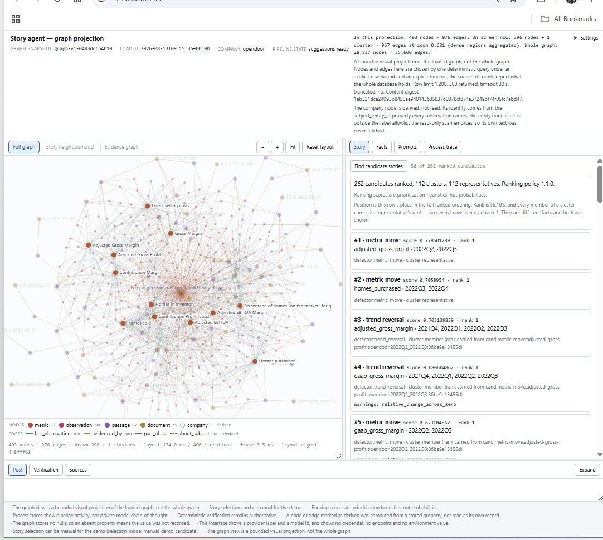
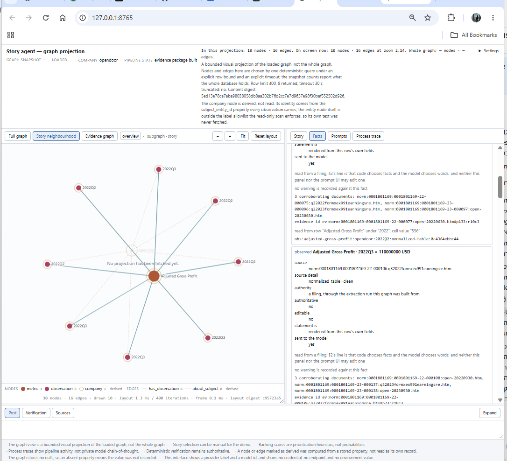
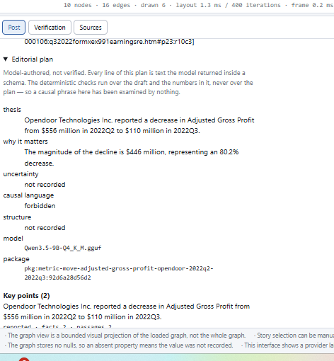

# Financial Event Knowledge Graph

An evidence-first pipeline that turns SEC filings into a deterministic knowledge graph and
drafts short investor posts from it, where every figure traces back to a filing passage or
table cell.

> **Code chooses the facts. The model chooses the words.**

This started as an R&D prototype for [Shares](https://apps.apple.com/il/app/shares-social/id6785920729),
a social investing app. The goal was to see whether company filings could be turned
automatically into evidence-backed stock posts and company updates for a social feed. It was
built and evaluated as a research prototype and was never deployed or used to publish posts.

The system does not trust the language model with financial facts or arithmetic. Code
acquires and parses the filings, extracts the metrics, builds the graph, selects the facts and
computes every derived value. The model sees one bounded evidence package and writes the
prose. A deterministic verifier then checks the draft and **rejects it** if anything is
unsupported, instead of letting the model guess.


<sub>The local demo UI. On the left is a bounded projection of the Opendoor knowledge graph
(metrics, observations, passages, filings). On the right is story discovery: 262 detector
candidates ranked and grouped into 112 clusters.</sub>

### Opendoor case study at a glance

| 109 | 12.4K | 2.7K | 28.8K | 35.6K | 6,000+ |
| :---: | :---: | :---: | :---: | :---: | :---: |
| SEC filings | citable passages | metric observations | graph nodes | graph edges | offline tests |

📦 **Data:** the Opendoor case-study data is published on Hugging Face at
[thelets/opendoor-knowledge-graph](https://huggingface.co/datasets/thelets/opendoor-knowledge-graph).

---

## Why this exists

Language models are good at summarizing financial documents, but they are unreliable at the
parts that matter most in finance: they can hallucinate numbers, confuse reporting periods,
do arithmetic wrong, and cite sources that don't support the claim. A stock post with one
wrong figure is worse than no post at all.

So this project asks a narrower question: **what does an LLM-assisted writing pipeline look
like when every fact has to be provable?** The answer here is to move every factual decision
into deterministic code and to give the model only the job it is good at, which is wording.

## System architecture

```text
 SEC EDGAR filings
   │
   ▼  acquisition      reproducible, rate-limited download of 10-K, 10-Q, 8-K, DEF 14A
   ▼  normalization    raw HTML/SGML → addressable narrative and table passages
   ▼  extraction       passages → ontology-validated claims, each pointing to its evidence
   ▼  graph            pure-function projection → nodes and edges → Neo4j
   │
   ▼  detection        metric moves, trend reversals, acceleration, cross-metric divergence
   ▼  ranking          scoring + de-duplication into clusters of candidate stories
   ▼  packaging        one bounded evidence package per candidate
   ▼  derivation       code computes every change, ratio and growth rate
   ▼  planner (LLM)    editorial plan over the package and the pre-computed figures
   ▼  writer (LLM)     title and prose only
   ▼  composition      code writes every figure, period, metric name and citation
   ▼  verifier         12 deterministic checks, closed table of 102 rejection codes
   │
   ▼
 evidence-backed post ── or ── recorded rejection with reason codes
```

A versioned **ontology** (`real_estate_marketplace_v1`, declared entirely in YAML) defines the
26 metrics the system understands and validates every claim before it can enter the graph.

## Core engineering principles

| Principle | In practice |
| --- | --- |
| **Code chooses the facts, the model chooses the words** | The model gets one bounded evidence package. It has no database access, no retriever and no tools. |
| **Evidence or it didn't happen** | Every claim, graph node and post figure links to a specific passage or table cell (for example `…#p23:r10c3`, row 10 column 3 of a table passage) in a specific filing. |
| **Deterministic derivations** | Every change, ratio and percentage is computed in `story/stages/derivation/` from two package facts and bound by ID *before* the model is asked anything. The direction of a move is a measurement the planner is shown, not something it infers. |
| **Refuse rather than guess** | A draft that fails verification becomes a recorded rejection with codes from a closed 102-entry gate table. It is never patched into a post. |
| **Record the silence** | A candidate that produced no claim stays in the graph as an `:Issue` or `:NotAttempted` node, about 59% of all nodes. What wasn't found is part of the result. |
| **Deterministic by default** | Content-hashed run IDs, a pure-function graph projection, pinned temperature and a seeded graph layout. Independent normalization runs, and independent graph projections, are byte-identical. |
| **Replaceable components** | Each pipeline stage sits behind a project-owned contract and is wired in one composition root (`context.py`). The data, ontology and contracts are meant to outlast any particular parser, model or database. |
| **Config, not code** | Companies, forms, dates, the ontology and model settings live in YAML under `config/` and `ontology/`. |

## How the story agent works

1. **Detect.** Four detectors scan the graph's metric time series: metric move, trend reversal,
   acceleration and cross-metric divergence.
2. **Rank.** Candidates are scored and de-duplicated into clusters, so near-identical stories
   share one representative. Scores are prioritization heuristics, not probabilities.
3. **Package.** The chosen candidate is reduced to one **bounded evidence package**: the
   observations, their source passages and table cells, corroborating documents and any
   warnings. This is everything the model will ever see.
4. **Derive.** Code computes every derived quantity (difference, percentage change) and binds
   it by ID.
5. **Plan and write.** The planner (LLM) drafts an editorial plan. The writer (LLM) returns
   just a `title` and `text`.
6. **Compose.** `story/stages/composition/` writes every figure, period, metric name and
   citation into the post. It recovers a figure from the model's prose only when the string
   exactly matches a value the package already offers.
7. **Verify.** Twelve pure-function checks run over the draft: identity, numbers, units,
   percentages, periods, metric identity, subject identity, citations, reported vs. calculated
   values, language, title and disclosures. Any failure means rejection.

Two model providers can be selected per run: a **local llama.cpp server** (tested with
Qwen 3.5 9B) and the **OpenAI Responses API**. The provider and model that answered are part of
the run's identity. Recorded responses are committed, so the story path can replay offline
without a model.

### From candidate to evidence


<sub>The story neighbourhood for the top-ranked candidate, an Adjusted Gross Profit move from
2022Q2 to 2022Q3. The graph shows the metric and the observations around it. The Facts panel
shows exactly what the model is sent for each fact: the source filing, the table row and cell
it was read from, corroborating documents and any warnings.</sub>

### Generated output


<sub>The post panel for that candidate. It shows the model-authored editorial plan (labelled
unverified), the key points with the facts and passages they rest on, and the evidence package
the draft was written from. The deterministic verifier judges the draft and its numbers, never
the plan.</sub>

## Opendoor case study

The corpus is **Opendoor Technologies Inc.** (Nasdaq: OPEN, CIK `0001801169`), a real-estate
iBuyer with a metric-heavy filing history. Of 665 filings from 2020 onward, 109 fall within
the configured forms. The data is available as a dataset on
[Hugging Face](https://huggingface.co/datasets/thelets/opendoor-knowledge-graph).

| Layer | Current run |
| --- | --- |
| Acquisition | 109 filings, 2,019 artifacts, 739.6 MiB |
| Normalization | 294 documents → 12,442 passages (10,507 narrative, 1,935 table) |
| Ontology | `real_estate_marketplace_v1`, 26 metrics (20 sourceable from narrative/table lanes, 6 reserved for an XBRL lane) |
| Extraction | 2,704 observations, 2,714 claims, 6 events from 11,848 candidates; 2,690 observations from the deterministic table lane |
| Graph | 28,836 nodes, 35,600 edges in Neo4j, validated by 27 graph verification checks |
| Story agent | 4 detectors, ranking, packaging, derivation, planner, writer, composition, 12-check verifier, demo UI |

Engineering defects are written up in the plans rather than hidden. For example,
[V1_DOCUMENT_NORMALIZATION.md §16b](plans/normalization/V1_DOCUMENT_NORMALIZATION.md) covers an
encoding defect in the first normalization run, why the existing checks missed it, and the
corrected counts.

## Tech stack

- **Python 3.10+** with a deliberately small dependency set: `httpx`, `pydantic`, `PyYAML`,
  `neo4j`, and `lxml` + `sec-parser` for parsing filings
- **Neo4j 5.26 LTS** (Community, via Docker Compose, bound to loopback)
- **LLM providers:** a local [llama.cpp](https://github.com/ggml-org/llama.cpp) server
  (OpenAI-compatible) or the OpenAI Responses API
- **Demo UI:** standard-library `http.server` + vanilla JavaScript, with a hand-written
  deterministic canvas graph renderer (no npm, no CDN)
- **pytest:** 6,000+ offline tests, with separate `live` and `neo4j` markers

## Quick start

```bash
git clone https://github.com/thelet/financial-event-knowledge-graph.git
cd financial-event-knowledge-graph
python -m venv .venv && source .venv/bin/activate
pip install -e ".[dev]"

cp .env.example .env          # set NEO4J_PASSWORD (8+ letters/digits) and SEC_USER_AGENT;
                              # OPENAI_API_KEY is optional
docker compose up -d          # Neo4j: Browser on localhost:7474, Bolt on :7687
```

> SEC EDGAR requires a User-Agent with a contact address. Set `SEC_USER_AGENT` in `.env`
> (for example `SEC_USER_AGENT=My-App you@example.com`). It overrides the placeholder in
> [`config/fetch.yaml`](config/fetch.yaml). Secrets and personal details belong only in the
> gitignored `.env`; the story config explicitly refuses credential keys.

Build the corpus and the graph:

```bash
python -m acquisition acquire                 # discover → resolve → download → catalog → verify → report
python -m normalization run                   # raw filings → normalized passages
python -m extraction run                      # passages → claims, observations, events
python -m graph project <extraction_run_id>
python -m graph load <graph_run_id>
python -m graph verify <graph_run_id>         # 27 checks
```

Explore and generate stories:

```bash
python -m story ui                                        # demo UI on http://127.0.0.1:8765
python -m story demo --candidate-id <ID>                  # replay recorded model responses
python -m story demo --candidate-id <ID> --live           # call the local llama.cpp server
python -m story demo --candidate-id <ID> --live --provider openai --model <model>
```

Run the tests:

```bash
pytest -m "not live and not neo4j"    # offline, no services required
pytest -m neo4j                       # needs the local Neo4j container
pytest -m live                        # SEC EDGAR or a running local model
```

<details>
<summary>Running a local model with llama.cpp</summary>

The local provider expects an OpenAI-compatible server on `127.0.0.1:8080`. This is
configurable in [`config/story.yaml`](config/story.yaml) or with `STORY_LLM_*` environment
variables. For example:

```bash
llama-server -m <path/to/model>.gguf -ngl 99 -c 8192 --host 127.0.0.1 --port 8080 \
  --jinja -fa on --cache-type-k q8_0 --cache-type-v q8_0
```

</details>

## Repository structure

```text
acquisition/     SEC discovery, download, catalog, verification
normalization/   raw filings → normalized documents and passages
ontology/        versioned YAML vocabulary + loader and claim validator
extraction/      candidate selection, table and narrative lanes, claim validation
graph/           deterministic projection, Neo4j load and verification
story/           detection, ranking, packaging, derivation, generation, composition,
                 verification, providers, demo UI
config/          all scope and runtime settings (YAML)
manifests/       immutable acquisition manifests (tracked, so the corpus can be rebuilt)
benchmarks/      recorded extraction answer sets
docs/            architecture, component research, design reviews
plans/           per-layer design plans and implementation reports
tests/           offline, live and neo4j test suites
```

Every pipeline package has the same shape: `core/` (models and shared infrastructure),
`stages/` (one package per stage), `contracts.py` (stage interfaces), `context.py` (the
composition root, the one place a concrete implementation is chosen) and `pipeline.py`
(ordering). Generated data under `data/` is gitignored and can be rebuilt from `config/` and
`manifests/`.

## Documentation

| Topic | Document |
| --- | --- |
| Architecture and design principles | [docs/01_PRODUCT_DIRECTION_AND_ARCHITECTURE.md](docs/01_PRODUCT_DIRECTION_AND_ARCHITECTURE.md) |
| Component options and trade-offs | [docs/02_COMPONENT_OPTIONS.md](docs/02_COMPONENT_OPTIONS.md), [docs/03_TARGET_COMBINATIONS.md](docs/03_TARGET_COMBINATIONS.md) |
| Data acquisition (Opendoor) | [docs/04_DATA_ACQUISITION.md](docs/04_DATA_ACQUISITION.md), [plans/data-fetching/V0_OPENDOOR_FETCH.md](plans/data-fetching/V0_OPENDOOR_FETCH.md) |
| Normalization | [plans/normalization/V1_DOCUMENT_NORMALIZATION.md](plans/normalization/V1_DOCUMENT_NORMALIZATION.md) |
| Ontology | [plans/ontology/ONTOLOGY_V1_IMPLEMENTATION.md](plans/ontology/ONTOLOGY_V1_IMPLEMENTATION.md), [concept and metric research](plans/ontology/OPENDOOR_CONCEPT_AND_METRIC_RESEARCH.md) |
| Claim extraction | [plans/extraction/V1_CLAIM_EXTRACTION.md](plans/extraction/V1_CLAIM_EXTRACTION.md) |
| Graph projection and Neo4j | [plans/graph/V1_GRAPH_PROTOTYPE.md](plans/graph/V1_GRAPH_PROTOTYPE.md), [docs/05_LOCAL_NEO4J_ENVIRONMENT.md](docs/05_LOCAL_NEO4J_ENVIRONMENT.md) |
| Story agent | [plans/llm-agent/V1_STORY_AGENT.md](plans/llm-agent/V1_STORY_AGENT.md), [deterministic fact tools](plans/llm-agent/DETERMINISTIC_FACT_TOOLS.md), [multi-provider](plans/llm-agent/MULTI_PROVIDER_OPENAI.md) |
| Draft composition | [docs/2026-08-23-deterministic-draft-compiler/](docs/2026-08-23-deterministic-draft-compiler/01-TARGET-ARCHITECTURE.md) |
| Demo UI | [plans/llm-agent/INTERACTIVE_DEMO_UI.md](plans/llm-agent/INTERACTIVE_DEMO_UI.md) |

> Docs 01 and 03 predate the choice of Opendoor and use a semiconductor example ontology.
> [Doc 04 §7](docs/04_DATA_ACQUISITION.md) records the revision that led to `real_estate_marketplace_v1`.

## Prototype scope and limitations

The six layers (acquisition, normalization, ontology, extraction, graph and story agent) are
implemented and tested end to end on one company. Some things were intentionally left outside
the prototype's scope:

- **The extraction narrative/event lane replays cached answers.** The run that built the
  current graph made no provider calls, and `extraction/context.py` has no live model path.
  Nearly all observations come from the deterministic table lane. A live path is designed
  ([audit](docs/2026-08-18-extraction-model-path-audit/EXTRACTION-MODEL-PATH-AUDIT.md),
  [plan](docs/2026-08-18-live-extraction-implementation-plan/IMPLEMENTATION-PLAN.md)) but not
  implemented. The story layer, by contrast, does call live models.
- **One company.** The corpus and ontology cover Opendoor only. The pipeline is
  config-driven, but other companies were never ingested.
- **No XBRL lane.** Six of the 26 metrics name XBRL as their source and are not extracted.
- **No natural-language graph querying.** Exploration happens through the demo UI and Cypher.
- **Single local user.** The demo UI is loopback-only (it also rejects non-loopback `Host`
  headers) and has no user accounts.

This is a research prototype. Nothing it generates is investment advice, and no generated
post was published to users.

## License

Released under the [MIT License](LICENSE).
