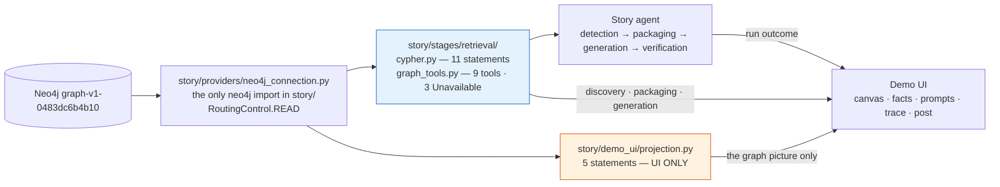
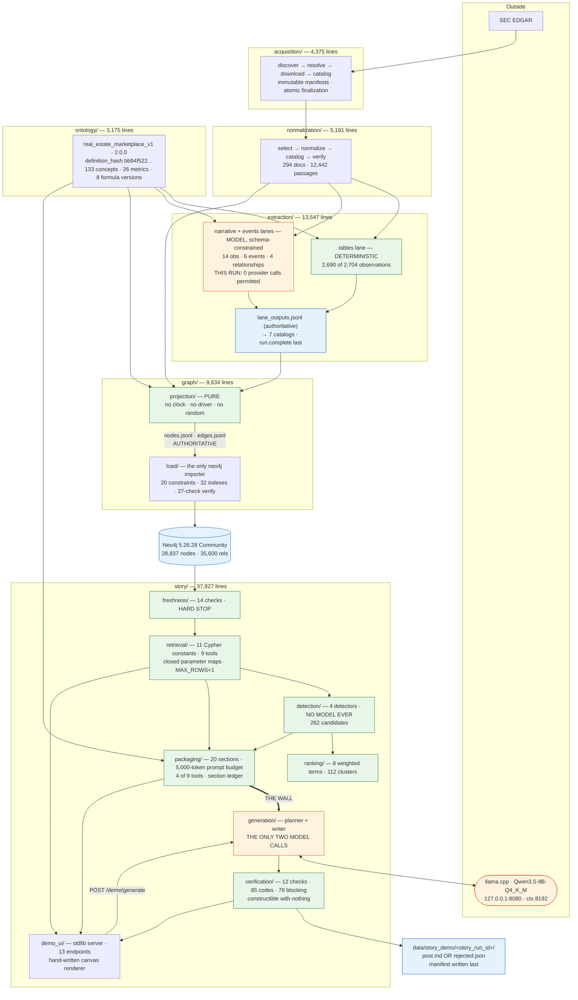

# 00 — Overview: the Agent Posts + Knowledge Graph system as it stands

**Audit date:** 2026-08-13. **Code baseline:** commit `33b0d7f` (*Resolve a table cell from its
coordinates, and keep the span it occupies*). **Graph snapshot:** `graph-v1-0483dc6b4b10`, loaded
2026-08-13T09:15:36Z.

This folder is a **current-system baseline**, not a proposal. Every number was measured on the date
stated, by running the command or the query shown. Where a repository document disagrees with the
code, the code is documented and the disagreement is named.

| Document | Subject |
| --- | --- |
| `00-OVERVIEW.md` | this file — the whole system in one pass |
| `01-GRAPH-CONSTRUCTION-AND-SCHEMA.md` | corpus → normalization → extraction → projection → Neo4j; the full schema; provenance |
| `02-STORY-AGENT-AND-MODEL-PIPELINE.md` | detectors, ranking, retrieval, evidence package, planner, writer, context budget, the model boundary |
| `03-GATES-VERIFICATION-AND-TESTS.md` | every gate in five phases, the 85-code table, the test suite, the benchmark |
| `04-CODE-ARCHITECTURE.md` | package design, contracts, dependency rules, entrypoints |
| `05-GRAPH-UI-AND-INTERACTION.md` | the demo UI: 13 endpoints, the canvas, interaction traces |
| `06-END-TO-END-DATA-FLOWS.md` | three concrete walkthroughs with real ids |
| `07-CURRENT-LIMITATIONS-AND-OPEN-QUESTIONS.md` | what the implementation demonstrably cannot do |

> ### Two things to know before reading anything else
>
> **1. The graph's model-derived content is 24 rows.** The extraction run that built the loaded
> graph made **zero provider calls** — replay-only, 15 cached answers, 14 requests issued. 2,690 of
> 2,704 observations came from the deterministic table lane. 14 observations, 6 events and 4
> relationship claims came from the model-assisted lanes. This single fact explains most of the
> graph's shape, including why 59% of its nodes are recorded silence.
>
> **2. The working tree moved during this audit.** `git status` was clean at session start; by
> 14:00 a concurrent session was landing the table-cell-citation work, which it committed at 14:36
> as **`d317a3d`** (*Give every fact a handle to its own cell, and find the span form names six*).
> Everything here is pinned to its parent, **`33b0d7f`**, read from a `git archive` extraction; the
> delta is exactly `git diff 33b0d7f d317a3d`. Working-tree test numbers are labelled as such.

---

## 1. The pipeline, corrected against the implementation

The shape proposed in the audit brief is close. Six corrections:

| Brief said | Implementation |
| --- | --- |
| `normalization / extraction` as one stage | **Two separate packages** with independent CLIs and independent authoritative artifacts, plus an **executable ontology** between them that both read |
| `deterministic graph projection` | Correct — and the projection is a *pure function returning a value*, so byte-identity is checkable rather than asserted |
| `story discovery / deterministic detectors` | Correct — four detectors, no model, ever. But **ranking is not on the CLI path**: `python -m story demo` takes a manually chosen `--candidate-id` |
| `bounded evidence retrieval → evidence package` | These are one stage. Retrieval is nine code-owned tools; **packaging may call only four of them** |
| `LLM editorial planner → LLM writer` | Correct, and it is exactly **two model calls per run**, no tools, no retries |
| `deterministic verification → accepted/rejected` | Correct, but there are **four dispositions**, not two: a plan or a draft can be refused before the verifier ever runs |

The actual flow:

```text
SEC EDGAR
  ↓  acquisition           109 filings · 2,019 artifacts · 739.6 MiB · bytes preserved
  ↓  normalization         294 documents · 12,442 passages (1,935 table)
  ↓  extraction            3 lanes, ontology-validated → 7 catalogs, sealed by run.complete
     ↑ ontology            real_estate_marketplace_v1 · 133 concepts · 26 metrics
  ↓  graph projection      PURE · 28,836 nodes · 35,600 edges
  ↓  graph load            Neo4j 5.26 · +1 :GraphLoad marker · 27-check verification
  ↓  freshness gate        14 checks · HARD STOP
  ↓  canonicalization      2,704 observations → 537 fact-slots
  ↓  detection             4 detectors → 262 candidates          NO MODEL EVER
  ↓  ranking + dedup       → 112 clusters                        NO MODEL · UI path only
  ↓  bounded packaging     4 retrieval tools · 5,000-token prompt budget
  ═══ THE WALL — every graph read is closed before the first token ═══
  ↓  planner               MODEL CALL 1 · schema-constrained
  ↓  writer                MODEL CALL 2 · schema-constrained
  ↓  deterministic verify  12 checks · 85 codes · 79 blocking     NO MODEL
  ↓  accepted → post.md    |    rejected → rejected.json
```

---

## 2. What each stage owns, and what it deliberately does not

| Stage | Owns | Deliberately does **not** own |
| --- | --- | --- |
| **acquisition** | fetching, rate limiting, byte preservation, immutable manifests, atomic finalization | any interpretation of a document; the catalog never decides what to download |
| **normalization** | parsing, encoding, sections, passages, table rows | claim extraction; a passage is never split across a section, and a table is never split |
| **ontology** | what a metric/entity/event/relationship *is*, formulas with validity windows, aliases, distinctness | any pipeline; it has no CLI, no database, no model |
| **extraction** | reading claims out of passages, normalizing values/periods/units, ontology validation, recording every refusal | the graph; the model never states a period, a unit, a scale or a quotation |
| **graph projection** | node and edge construction, key minting, warning re-derivation, export checks | the database; it holds no clock, no driver, no random value |
| **graph load** | constraints, batched writes with row-count reconciliation, the completion marker | deciding what is true; it is the only stage in `graph/` allowed a connection |
| **freshness** | proving the loaded graph still matches the artifacts it was built from | fixing anything; it reports and refuses |
| **retrieval** | nine bounded tools, closed parameter maps, a trace of what ran | Cypher construction (that is 11 string constants) and the driver (that is one provider module) |
| **detection** | finding that something is worth writing about, from numbers alone | prose; a `StoryCandidate` carries none, and `extra="forbid"` makes that structural |
| **ranking** | a deterministic total order and a dedup rule | truncation; that lives in the caller |
| **packaging** | deciding what the model may see, and disclosing what it dropped | interpretation; the package carries facts, definitions and warnings, never a reading |
| **planner** | the thesis, the angle, the outline, the caveats, the required evidence | any number, any id it was not given, and `causal_language` — which code computes and pins |
| **writer** | every word of prose in the post | which passages it may cite (derived from fact bindings), which surfaces name a metric, which period surface is legal |
| **verification** | the verdict | being talked out of it — it is constructible with no database and no provider |
| **demo UI** | showing the pipeline and letting a human drive it | any authority; its advisory prompt scan says in its own required payload field that *"it blocks nothing"* |

---

## 3. Where deterministic code ends and the model begins

**There is exactly one boundary, and it is crossed exactly twice per run.**

Everything before the wall is deterministic: the freshness gate, canonicalization, all four
detectors, ranking, retrieval and packaging. Everything after the verdict is deterministic: the
verifier, the ledgers, the rendering of `post.md` from the structured draft.

The model's two calls receive a rendered text prompt and a JSON-Schema-constrained response format.
`story/providers/openai_compatible.py::request_body` posts `messages`, `temperature`, `max_tokens`,
`stream: False`, `chat_template_kwargs` and `response_format` — **and no `tools` key**. There is no
agent loop, no function calling, no ReAct anywhere in `story/`.

The boundary is enforced by signatures, not by convention:

* `plan_story(package, *, provider, max_tokens)` — no retriever.
* `write_story(package, plan, *, provider, style, length_target, max_tokens)` — no retriever, and
  the passage slice comes from `writer_passages(package)`, which **takes no plan argument**, so the
  planner cannot filter the writer's universe.

### Can the model query the graph?

**No, and it never sees the graph.** Verified live in this audit: a deliberate `CREATE` probe
through the story executor was refused by the server
(`Neo.ClientError.Statement.AccessMode`), and the recorded retrieval trace for the accepted run
shows **15 calls, all before the first token, zero after**.

### Where factual information is allowed to originate

| Kind of content | Origin |
| --- | --- |
| Any number in the post | a `PackagedFact.value` copied from an `:Observation`, or a `Calculation` the verifier **recomputes** |
| Any period | a surface in a closed grammar, computed by code per fact |
| Any metric name | a surface computed by code to name that metric *and only that metric* in this package |
| Any citation | a passage in the writer's own slice, quoted verbatim, span located by code |
| Any character offset | located by `writer._sentence_from` — never declared by the model |
| `causal_language` | computed by `causal_language_for(package)`; the model's value is **not read at all** |
| Every word of prose | **the model**, and nothing else in the system writes English for a reader |
| The editorial framing | the model — thesis, why-it-matters, ordering, claim wording, uncertainty |
| The verdict | the deterministic verifier, exclusively |

---

## 4. Storage systems

| System | Role | Authoritative? |
| --- | --- | --- |
| the filesystem under `data/` | raw bytes, normalized documents, run catalogs, graph exports, story runs | **yes** — this is where truth lives |
| `manifests/` | immutable acquisition manifests | **yes** |
| `ontology/versions/**/definitions/*.yaml` | the vocabulary, hashed into every downstream artifact | **yes** |
| **Neo4j 5.26.28 Community** (Docker, loopback) | a queryable **projection** of one graph run | **no** — wipe it and `python -m graph load` restores it |
| llama.cpp / OpenAI-compatible server (`127.0.0.1:8080`) | two generation calls per story run | n/a |
| in-process memory (demo UI) | the run registry and candidate index | **no** — process-local, lost on restart |

**There is no Postgres in this repository.** The only database is Neo4j, and it is a projection.

---

## 5. Where the UI fits

`python -m story ui` serves a single-page interface on a loopback address, on the Python standard
library, with **no framework and no visualization library** — the graph is a hand-written
Fruchterman-Reingold layout on a Canvas 2D renderer, 1,562 lines, seeded by FNV-1a so it has no
`Math.random` anywhere.

It is a **second consumer of the graph, and a first-class driver of the pipeline**: it can run
discovery, build an evidence package, and trigger real generation (replay by default; a live model
call requires two deliberate clicks after a 409).

The critical architectural fact is that it has **two graph-access paths and only one of them is its
own**:



Blue is shared with the agent. Orange is the UI's own, and it exists for a stated reason: the nine
retrieval tools return flat rows of named scalars only, and a committed test forbids returning a
whole node — so **no retrieval tool can return an edge**, and a graph view cannot be assembled
through that surface.

---

## 6. The system, measured

### Corpus and graph, 2026-08-13

| | |
| --- | ---: |
| filings / artifacts / bytes | 109 / 2,019 / 739.6 MiB |
| normalized documents / passages | 294 / 12,442 (1,935 table) |
| ontology concepts / metrics | 133 / 26 |
| extraction: claims / observations / events / relationships | 2,714 / 2,704 / 6 / 4 |
| extraction: issues / rejections | 17,130 / 49 |
| graph export: nodes / edges | 28,836 / 35,600 |
| live Neo4j: nodes / relationships | **28,837** / 35,600 (+1 `:GraphLoad`) |
| populated metrics | **17 of 26** |
| cited passages / documents | 8,776 / 185 |
| `:Issue` / of which `:NotAttempted` | 17,130 / **10,852** |
| `python -m graph verify` | **27 of 27 checks PASS**, exit 0 |

### Discovery and generation

| | |
| --- | ---: |
| readable metric series | 17 |
| canonical fact-slots | 537 |
| candidates (metric_move / trend_reversal / acceleration / divergence) | **262** (227 / 11 / 9 / 15) |
| dedup clusters | 112 |
| recorded story runs | 4 — 2 accepted, 1 verifier-rejected, 1 writer-refused |
| verification checks / gate codes / blocking | 12 / **85** / 79 |
| model calls per run | **2** |
| retries anywhere | **0** |

### Test suite

| Selector | Result |
| --- | ---: |
| total collected | 5,840 |
| **offline suite at commit `33b0d7f`** | **5,750 passed, 3 failed, 22 skipped, 65 deselected** — all 3 failures are artifacts of running from an out-of-tree extraction with a symlinked `data/`; the suite is green |
| working tree during the audit | a moving target: 18 → 6 → 3 failures over half an hour |
| architecture tests (executable dependency rules) | **836** |

---

## 7. Complete system architecture



Green = deterministic and provably so (no clock, no socket, no driver — enforced by test).
Orange = a model is involved. Blue = an artifact or a store.

---

## 8. The thirty questions, answered

1. **Where does the graph's truth originate?** In SEC filings, byte-preserved under their original
   filenames in `data/raw/`, reachable from every graph fact by `source_url`, `passage_id`,
   `quoted_text` and `claim_id`. → `01` §11
2. **How do raw filings become nodes and edges?** acquisition → normalization → three extraction
   lanes → seven catalogs → a pure projection → JSONL → a batched load. → `01` §2, `06` Flow A
3. **What information exists in Neo4j?** 8 node classes and 12 edge types: observations, events,
   metrics, entities, passages, documents, issues, and an empty evidence-source contract. → `01` §10
4. **Is Neo4j authoritative or a projection?** **A projection.** `data/graph_runs/…/{nodes,edges}.jsonl`
   is authoritative. → `01` §8.1
5. **How is provenance represented?** As properties, not a subgraph: eight provenance keys on every
   node and edge, plus the `EVIDENCED_BY` edge carrying `quoted_text`, `table_id`, `block_ids` and
   `source_url`. Relationship claims are the exception — their citation is a property on the claim
   edge. → `01` §11
6. **How does the system discover something is worth posting about?** Four deterministic detectors
   over canonical series. No model. → `02` §2
7. **Which part is deterministic?** Everything except two model calls. → §3 above
8. **Which part uses an LLM?** The planner and the writer, and the (unused this run)
   narrative/event extraction lanes. → `02` §6-7
9. **Can the LLM query the graph directly?** **No.** No tools key, no retriever parameter, and every
   graph read is closed before the first token. → `02` §4
10. **Exactly what evidence does the planner see?** A rendered slice: subject, identity facts,
    facts, metrics, semantics, comparability, events, warnings, conflicts, and 400-character passage
    excerpts. **Not** relationships, documents, compatibility decisions, evidence sources, formula
    windows or the retrieval trace. → `02` §6.2
11. **Exactly what evidence does the writer see?** A different slice: the accepted plan, the fact
    list, semantics, comparability, formula windows, permitted metric and period surfaces, and the
    **whole text** of every passage a packaged fact was read from — derived from fact bindings, not
    from the plan. → `02` §7.1
12. **What does the planner produce?** `thesis`, `why_it_matters`, `structure`, `key_points`,
    `counterpoints`, `unusable_evidence`, `required_warnings`, `prohibited_claims`, `uncertainty` —
    and `causal_language`, which code computes and the model cannot choose. → `02` §6.3
13. **What does the writer produce?** A `title` and a list of `DraftSentence`s, each carrying its
    own `fact_bindings`, `citations` and at most one `calculation`. → `02` §7.2
14. **How can an unsupported fact enter, or be prevented from entering?** It cannot enter through
    the model: `plan_violations` (11 codes), `draft_violations` (11 codes) and the verifier's 85
    codes are pure functions over a closed package. The one measured influence surface is
    `search_passages` top-k displacement, and its terms are code-derived. → `02` §10, `03` §4-6
15. **What checks happen before generation?** The 14-check freshness gate (hard stop), candidate
    re-derivation, and the packaging refusals. → `03` §3
16. **What checks happen after?** Twelve checks, 85 codes, 79 blocking, plus a fact ledger and a
    calculation ledger. → `03` §6
17. **What authority does the model verifier have?** **None — it does not exist.** The advisory
    verifier was dropped entirely. → `03` §7
18. **How are numbers, periods and citations checked?** Numbers by a half-ulp window on magnitudes
    with sign as a separate signal, and calculations **recomputed**; periods by a closed grammar
    requiring equality on both endpoints *and* kind; citations by three rules, one of which
    reconstructs the table cell. → `03` §9
19. **How are causal claims treated?** Permitted only in an `explanatory` sentence with a passage
    citation, an attribution frame in the sentence, the marker inside the cited span, a matching
    document type, no negation in the clause, and no second marker. No WARN tier. → `03` §8
20. **What tests protect these behaviours?** 5,840 collected, of which **836 are executable
    architecture rules** and 118 are adversarial verifier drafts. → `03` §10
21. **What benchmark or gold cases exist?** One: `benchmarks/extraction/v1`, 26 cases, 8 scoring
    dimensions. **There is no story-agent or verifier benchmark.** → `03` §11
22. **What are the model/context limitations?** An 8,192-token context, no runtime prompt-versus-
    context guard, an estimator ~9% low, and headroom that depends on how many passages a package
    carries. → `02` §8, `07` C1-C2
23. **How is the code divided?** Seven packages, each with the same shape, and the boundaries are
    enforced by tests rather than convention. → `04`
24. **What are the cross-module contracts?** Six story protocols, two graph protocols, seven
    extraction protocols, and a chain of frozen types from `StoryCandidate` to `VerifiedDraft`.
    → `04` §5
25. **How do developers run each part?** → `04` §6
26. **What does the graph UI display?** Three graph projections plus two candidate-scoped views, a
    four-tab side panel and a three-tab output region. → `05` §4
27. **Which Neo4j queries power it?** Five UI-owned statements for the picture; the shared
    eleven-statement retrieval layer for everything else. → `05` §5
28. **How does clicking something reach the graph?** For a node, it does not — the detail card
    reads the payload already in memory. For a fact row, ids are *resolved* against the drawn
    projection and reported when they are not present. → `05` §6, `06` Flow C
29. **Does the UI share graph-access code with the story agent?** **Partly** — yes for retrieval,
    no for visualization, and the reason is that no retrieval tool can return an edge. → `05` §8
30. **What are the demonstrated limitations?** → `07`

---

## 9. The one-sentence summary

A deterministic, byte-reproducible pipeline turns SEC filings into a small, heavily-provenanced
graph, and a very large amount of deterministic machinery — roughly four times as much code as
builds the graph — surrounds two schema-constrained model calls so that the model chooses the
words and never the facts.
