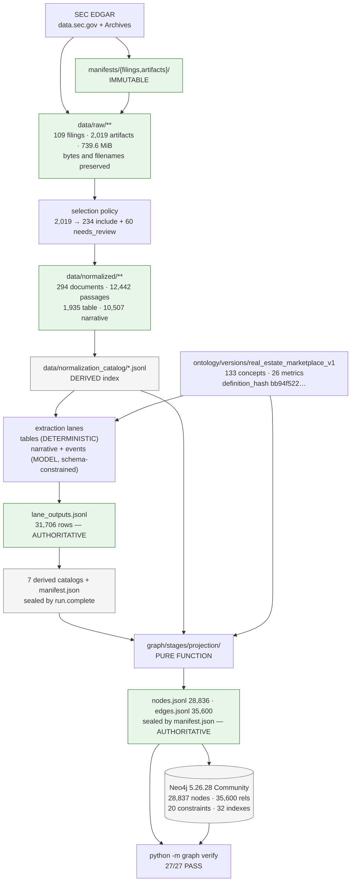
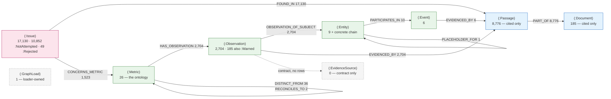
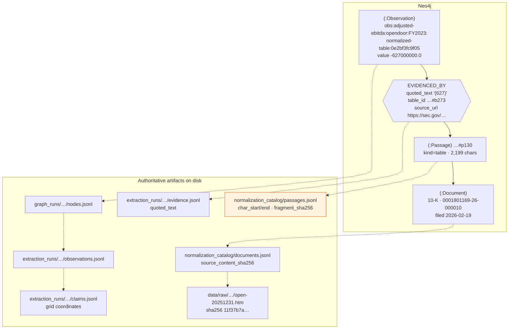

# 01 — Graph Construction and Schema

**Audit date:** 2026-08-13. **Code baseline:** commit `33b0d7f`. **Graph snapshot:**
`graph-v1-0483dc6b4b10`, loaded into Neo4j 2026-08-13T09:15:36Z.

All counts below were measured on the date stated, by running the command or the Cypher shown.
Nothing is carried over from a document.

---

## 1. The answer first

| # | Finding |
| --: | --- |
| 1 | **Neo4j is a projection, not the primary store.** The authoritative artifact is `data/graph_runs/graph-v1-0483dc6b4b10/{nodes,edges}.jsonl`, itself derived from an extraction run's catalogs. The database can be wiped and rebuilt from files with no loss. |
| 2 | **The graph's model content is 24 rows.** The extraction run that built it made **zero provider calls** (`provider_calls_permitted: 0`, replay-only, 15 recorded answers, **14 requests actually issued**). 2,690 of 2,704 observations come from the deterministic table lane; 14 observations, 6 events and 4 relationship claims come from the model-assisted lanes. |
| 3 | **59% of the graph is `:Issue` nodes, and most of them say nothing about the filings.** 17,130 `:Issue` of 28,836 nodes; 10,852 carry `:NotAttempted` (`code = NO_STORED_ANSWER`) — questions the run never put to a model, because of finding #2. |
| 4 | **The live graph and the on-disk export agree exactly.** `python -m graph verify graph-v1-0483dc6b4b10` → **27 of 27 checks PASS**, exit 0. |
| 5 | **Projection determinism holds only at a fixed git commit.** Re-projecting the same run today produces the *same* `graph_run_id` but byte-different artifacts — every row differs on `graph_code_commit`, which is stamped on rows but is **not** an input to the run id. |
| 6 | **8,776 passages, not 12,442**: the projection carries only *cited* passages. Likewise 185 `:Document` of the corpus's 294. |
| 7 | **17 of 26 metrics are populated.** `revenue` — the most obvious metric anyone would query — has **zero** observations and is out of V1 scope. |
| 8 | **Relationship claims carry no `EVIDENCED_BY` edge.** Neo4j has no edge-on-edge, so their evidence rides as `quoted_text` on the relationship edge itself. A consumer must handle two provenance shapes. |

---

## 2. The pipeline, end to end

```text
SEC EDGAR
   ↓  python -m acquisition {discover,resolve,download,build-catalog}
data/raw/**  (bytes + original filenames)  ·  manifests/{filings,artifacts}/  (immutable)
   ↓  python -m normalization {select,run,build-catalog}
data/normalized/**  ·  data/normalization_catalog/{documents,passages,selection,issues}.jsonl
                                                     294 docs · 12,442 passages · 1,935 table
   ↓  python -m extraction run          (three lanes; ontology-validated)
data/extraction_runs/extract-v1-lexical-833f7bcfbce9/
   lane_outputs.jsonl (authoritative, 31,706 rows)
   → 7 derived catalogs + manifest.json + run.complete + report.md
   ↓  python -m graph project           (PURE — no clock, no driver)
data/graph_runs/graph-v1-0483dc6b4b10/{nodes,edges}.jsonl + manifest.json
                                                     28,836 nodes · 35,600 edges
   ↓  python -m graph load --replace
Neo4j `neo4j` database on bolt://localhost:7687   (+ 1 :GraphLoad marker = 28,837 live)
   ↓  python -m graph verify
27 checks reconciling the database against the export
```



Green = authoritative. Grey = derived index, rebuildable, never appended to.

---

## 3. Corpus and acquisition

### 3.1 What is supported today

**One company.** `config/companies.yaml` declares CIK 1801169, Opendoor Technologies Inc., tickers
`OPEN, OPENL, OPENW, OPENZ`, with the alias "Social Capital Hedosophia Holdings Corp. II".

`config/fetch.yaml`: forms `10-K, 10-Q, 8-K, DEF 14A`; `date_from 2020-01-01`, `date_to null`;
5 requests/second; concurrency 4; 60 s timeout; 5 retries with 1→60 s backoff;
`include.render_artifacts: false`. Amendments (`X/A`) are admitted by a matcher rather than by
config — `acquisition/stages/discover/sec_discovery.py::_form_matcher`.

**The real corpus, measured:** 109 filings · 2,019 artifacts · 775,560,061 bytes (739.6 MiB) ·
2020-04-30 → 2026-06-12.

| Form | Filings | | Artifact kind | Count |
| --- | ---: | --- | --- | ---: |
| 8-K | 75 | | asset | 1,060 |
| 10-Q | 19 | | xbrl | 364 |
| DEF 14A | 7 | | exhibit | 268 |
| 10-K | 6 | | primary | 109 |
| 8-K/A | 2 | | index_header | 109 |
| **109** | | | full_submission | 109 |

### 3.2 Discovery, resolution, download

| Purpose | Endpoint | Module |
| --- | --- | --- |
| filing list | `https://data.sec.gov/submissions/CIK0001801169.json` (+ continuation `files[]`) | `acquisition/stages/discover/sec_discovery.py` |
| document types — **authoritative** | `…/Archives/edgar/data/1801169/{acc_nodash}/{acc}-index-headers.html` | `acquisition/stages/resolve/sgml_resolution.py` |
| expected sizes **only** | `…/{acc_nodash}/index.json` | same |
| each artifact | `…/{acc_nodash}/{filename}` | `acquisition/core/sec_client.py` |

`sgml_resolution.py`'s docstring records the correction that matters: *"Types come from
`<accession>-index-headers.html`, which is authoritative. `index.json` contributes expected sizes
only — its `type` field is an icon reference."* This is one of the repository's own examples of a
verified-and-corrected assumption.

`amends_accession` is **always null by design**: the submissions API does not link an amendment to
its parent. **0 resolution anomalies** in the real corpus.

Rate limiting is a 0.2 s minimum interval on a shared `httpx.Client`, lock-guarded and
monotonic-clock scheduled. `HttpConfig._require_contact` **rejects a user agent without `@`**.
`RETRYABLE_STATUSES = {429, 500, 502, 503, 504}`; anything else raises `PermanentHttpError` at
once. Backoff honours `Retry-After` (int or HTTP-date) with jitter; both clock and jitter are
injectable for deterministic tests. `download_to` streams 64 KiB chunks while hashing and
`unlink`s a partial write on transport error.

### 3.3 Identifiers

`acquisition/core/identity.py`:

```python
cik10(cik)                 # digits, strip leading zeros, zfill(10)
normalize_accession(a)     # ^(\d{10})-?(\d{2})-?(\d{6})$ → dashed
filing_id(cik, accession)  -> f"sec:{cik10}:{accession}"
artifact_id(...)           -> f"{filing_id}:{original_filename}"
```

| Identifier | Real example |
| --- | --- |
| `filing_id` | `sec:0001801169:0001801169-25-000017` |
| `artifact_id` | `sec:0001801169:0001801169-25-000017:open-20241231.htm` |
| filing directory | `sec/0001801169/10-K/2025-02-27_0001801169-25-000017` |
| exhibit role | `ex4-06` (from `EX-4.6`; minor zero-padded so lexical order equals numeric) |

`artifact_id` is keyed on the **original filename, not the SGML SEQUENCE**, because the full
submission and index-header files are not in the SGML DOCUMENT list and have no sequence number.

Accession prefixes vary (`0001104659`, `0001140361`, `0001801169`) because the prefix is the
**filing agent**, not the issuer; `normalize_accession` refuses to derive a CIK from it.

### 3.4 Atomic finalization

| Concern | Mechanism (`acquisition/core/storage.py`) |
| --- | --- |
| Staging | `data/tmp/{run_id}/{accession}/source/`; pre-existing staging is `rmtree`'d |
| Completion marker | `_filing.json`, written **last** |
| Rename | `os.replace(staging_dir, final)` — refuses if `_filing.json` is missing |
| Replacement safety | an existing target is first moved to `quarantine-{name}`, removed only after success, restored on `OSError` |
| Path-escape guard | a SEC filename resolving outside the filing directory raises `FilingIntegrityError` |
| Debris policy | the run staging root is removed **only if empty** — surviving debris is the signal of an interrupted run |

Per-artifact provenance is complete. Example row from the FY2024 10-K's `_filing.json`:
`sha256 05b7103ea3a9…`, `size_bytes 2761301`, `source_url`, `http_status 200`,
`last_modified "Thu, 27 Feb 2025 21:20:01 GMT"`, `download_attempts 1`,
`downloaded_at 2026-07-31T13:55:22+00:00`, `verification_status verified`.

---

## 4. Normalization — documents, passages, tables

### 4.1 Selection: 2,019 artifacts → 294 documents

`config/selection_policy.yaml` v1, first-match-wins, matching on **acquisition-catalog metadata
only; filenames are never used**.

| | Count |
| --- | ---: |
| total artifacts | 2,019 |
| exclude | 1,725 (`NON_NARRATIVE_MEDIA` 1,642, `BOILERPLATE_CERTIFICATION` 83) |
| **include** | **234** (`PRIMARY_NARRATIVE` 109, `EARNINGS_MATERIAL` 93, `GOVERNANCE_DOCUMENT` 14, `MATERIAL_AGREEMENT` 11, `STRUCTURED_EXHIBIT` 7) |
| **needs_review** | **60** — these *are* normalized |
| → normalized | **294** |

A selection record is written for **every one of the 2,019 artifacts** — nothing is silently
dropped.

**This is why the graph holds 185 documents and not 294 or 109**: 109 filings → 294 normalized
documents → 185 *cited* by the extraction run.

### 4.2 Identifiers

`normalization/core/identity.py`:

```text
document_id  norm:{cik10}:{accession}:{original_filename}
section_id   {document_id}#s{sequence}
block_id     {document_id}#b{sequence}
passage_id   {document_id}#p{sequence}
```

*"`document_id` has no content component, so it is stable when source bytes change. That is
deliberate: it is the same logical document, revised. The change surfaces through
`source_content_sha256`."*

`document_id_from_artifact_id` is a bare prefix substitution `sec:` → `norm:` — which is exactly
why `graph/core/keys.py::document_key_of_passage` can derive a document id from a passage id by
stripping `#p{n}`, with no catalog lookup.

`derivation_id` is a canonical hash of `(selection_policy_version, parser_name, parser_version,
normalizer_version, passage_strategy_name, passage_strategy_version, config_hash,
source_content_sha256)` — **no timestamp, no run id**.

### 4.3 Parsing and the encoding corrections

Parser `sec_html` v`0.58.1` (pinned `sec-parser`); `lxml` fallback. **All 294 documents were
produced by `sec_html`; 0 fallbacks.**

`normalization/stages/parse/html_text.py` records four hard-won corrections, each with the
measurement behind it:

* **Parse bytes, never `str`** — 91 of 377 artifacts begin with an XML declaration, and
  `lxml.html.fromstring` raises on a `str` carrying one.
* **Explicit encoding on re-encoded bytes** — otherwise lxml falls back to latin-1 and *"silently
  corrupted every non-ASCII character in the corpus: NBSP, em dashes, curly quotes and accented
  letters alike."*
* **A space at block-tag boundaries and never between inline elements** — inline XBRL
  `<span>`/`<ix:*>` splits words mid-token; without it, 238 run-together tokens (`ASSETSFor`,
  `ActivitiesNet`) in the FY2025 10-K alone. A `has_run_together_tokens` detector is kept as a
  standing verification check.
* **Hidden content stripped before any text is read** — inline XBRL brings up to 7,245
  `display:none` elements holding 27,772 characters into a single 10-K, and
  `<xbrli:unit>iso4217:USD</xbrli:unit>` had leaked into text as `USDxbrli`.

**This corpus was re-normalized after the encoding fix: 14,203 → 12,442 passages.** That number
matters downstream (§11).

### 4.4 What a passage is

`normalization/stages/passages/section_passages.py::SectionAwarePassageStrategy`
(`section_aware` v1.0.0). Sizing: `target_chars 1500`, `max_chars 4000`, `min_chars 200`.

Rules: never cross a section boundary · **a table is always its own passage** · flush before
exceeding `max_chars` · flush at `target_chars` · **a table is never split** (it gets the flag
`oversize_table_passage`) · over-long narrative splits on sentence boundaries, never mid-word.

Rejected alternatives are recorded: fixed-size overlapping chunks (*"overlap duplicates evidence,
so the same sentence appears in two passages under two ids — corrosive for an evidence-linked
graph"*) and embedding grouping (*"would make normalization depend on a provider"*).

`passage_id` is **purely positional within a document, 0-based, dense, in document order**.

**Offsets are within the block's own normalized text, not the source file** —
*"Byte offsets into the source file are deliberately absent: sec-parser cannot supply them
reliably."* **This is why `EVIDENCED_BY` in the graph carries `table_id` and `block_ids` but no
character range**: `graph/core/inputs.py:31-36` records that the extraction catalog writer drops
`char_start`/`char_end`. The offsets exist in `passages.jsonl` and stop there.

### 4.5 Tables, and where cell coordinates actually live

`normalization/stages/parse/tables.py`'s contract: *"Structured rows are authoritative. Markdown
and plain text are pure deterministic functions of the rows, so verification can recompute and
compare them — three representations that cannot drift apart."* And: *"Classification never
removes a table and never changes how it is stored. EX-21.1 holds 511 characters of text and 68
table rows, so any rule that discards a class of table empties the document."*

**Normalization stores no per-cell coordinates.** Cell citation is a downstream capability, built
across three layers:

| Layer | Module | Role |
| --- | --- | --- |
| extraction | `extraction/stages/tables/table_grid.py` | re-parses the passage markdown into an addressable grid |
| extraction | `extraction/stages/tables/public.py::TableCellRef` | `(row_index, column_index, text)` |
| graph | `:Observation` properties | `row_index`, `value_column_index`, `period_header_row_index`, `period_header_column_index`, `metric_label_row_index` |
| story | `story/core/table_cells.py` (**new at commit `33b0d7f`**) | `resolve_cell(passage_text, row, col) → ResolvedCell(text, char_start, char_end)` |

The load-bearing rule: **row indices count *every* line of the passage, the `| --- |` separator
included** — they are positions in `passage_text.split("\n")`.

`story/core/table_cells.py`'s docstring reports a measurement over the live graph: over all 2,690
table-backed evidence edges, `cells(lines[row_index])[value_column_index] == quoted_text` holds
2,690/2,690 and `cells(lines[row_index])[0] == row_label` holds 2,690/2,690, while
`cells(lines[period_header_row_index])[value_column_index] == column_label` holds only **565/2,690**
— which is precisely why `graph/core/derivation.py:39-44` names `period_header_column_index` and
not `value_column_index` as the id-bearing coordinate.

### 4.6 Corpus counts, measured

| Quantity | Value |
| --- | ---: |
| normalized document JSON files | 294 |
| passage objects (and distinct passage ids — zero duplicates) | 12,442 |
| narrative passages | 10,507 |
| **table passages** | **1,935** |
| flag `short_passage` | 2,516 |
| flag `oversize_table_passage` | 97 |
| `data/normalized` on disk | 105 MB |
| issues | 90 (`NEEDS_REVIEW` 60 + `HIERARCHY_UNCERTAIN` 30; **zero errors, zero parser fallbacks**) |

Documents by form: 8-K 203 · 10-Q 44 · 10-K 34 · DEF 14A 7 · 8-K/A 6 = 294.
By `document_type`: `narrative_primary` 109 · `material_agreement` 64 · `earnings_release` 45 ·
`shareholder_letter` 26 · `supplemental` 22 · `governance` 14 · `structured_exhibit` 7 · `other` 7.

These agree exactly with the corpus block stamped on the graph run manifest:
`{"corpus_id": "294d-12442p-9992c4eb1888", "documents": 294, "passages": 12442,
"table_passages": 1935}`.

---

## 5. The ontology

`ontology_id: real_estate_marketplace_v1`, `semantic_version: 2.0.0`, `schema_version: 1`,
`definition_hash: bb94f522ba1224702289d8e0646f5fdd8fc6d31cd341f604a7f879ee87e1af34`.

Recomputed today by `load_ontology(DEFAULT_ONTOLOGY_ID)`; it **matches** the extraction run
manifest, the graph run manifest, and all 28,836 nodes and 35,600 relationships in Neo4j. The
loaded graph is provably projected under the vocabulary currently on disk.

There is **no ontology CLI** — no `__main__.py`, no `cli.py`, no `[project.scripts]`. This is
intentional (`ontology/__init__.py`): *"A library, not a pipeline… It has no LLM, graph,
embedding, vector-store or database dependency."* Read it with:

```bash
python -c "from ontology import load_ontology; o=load_ontology(); \
           print(o.metadata.ontology_id, o.metadata.semantic_version, o.definition_hash)"
```

### 5.1 Contents, counted today

`concepts: 133 · metrics: 26 · instances: 4 · alias entries: 17 · surface forms: 271 ·
external mappings: 35`

| Category | Count | | Category | Count |
| --- | ---: | --- | --- | ---: |
| relationship_type | 30 | | evidence_type | 7 |
| **metric_definition** | **26** | | financial_instrument_type | 5 |
| event_type | 19 | | status_type | 4 |
| entity_type | 13 | | claim_type | 3 |
| agreement_type | 10 | | **total** | **133** |
| role_type | 8 | | | |
| metric_formula | 8 | | | |

Every one reconciles with the live graph: 26 `:Metric` nodes, 4 entities with
`ontology_instance: true`, 30 relationship predicates read by `EdgeVocabulary`.

### 5.2 The source-lane mechanism encodes a measured finding

Quoted from `metrics.yaml`: *"across 336 custom `open:` XBRL elements in every 10-K and 10-Q
FY2020-Q1 2026, there is NO tag for any operating KPI or non-GAAP measure."* Hence
`forbidden_source_lanes: [xbrl]` on every operating KPI and non-GAAP measure — and hence the 6
`in_scope_v1: false` metrics whose first source-lane preference *is* `xbrl`.

### 5.3 The definition hash, and why 2.0.0

`ontology/serialization.py::definition_hash` = `canonical_hash(snapshot(definitions))` over the
**resolved** ontology (`mode="json", exclude_none=True`, each category sorted by id, `notes`
excluded) — deliberately not over YAML bytes, because *"a comment edit or a key reorder in YAML
must not change the identity of the ontology, and a silently dropped field must."*

The `2.0.0` bump carries an unusually candid reason in `ontology.yaml`: *"`definition_hash` had
already moved twice while this string stayed at 1.0.0, which meant two incompatible vocabularies
were both calling themselves 1.0.0 in every exported manifest — the declared version no longer
distinguished them. Found by review."*

A fifth, per-metric axis: `formulas.yaml` carries `MetricFormulaVersion` records with
`valid_from`/`valid_to`, and `registry.formula_for(metric_id, as_of)` resolves by **the date of the
value, not of the filing** — *"A 2024 filing restating FY2021 must use the FY2021 formula for the
FY2021 column."*

---

## 6. Extraction

### 6.1 The three lanes

| Lane | Module | Routing key (`lane`) | `source_lane` | Class |
| --- | --- | --- | --- | --- |
| Tables | `extraction/stages/tables/deterministic_lane.py::DeterministicTableClaimLane` | `tables` | `normalized_table` | **DETERMINISTIC — no provider, no network** |
| Narrative | `extraction/stages/narrative/narrative_lane.py::OntologyGuidedNarrativeClaimLane` | `narrative` | `normalized_narrative` | **MODEL-ASSISTED + SCHEMA-CONSTRAINED** |
| Events | `extraction/stages/narrative/event_lane.py::OntologyGuidedEventLane` | `events` | `normalized_narrative_events` | **MODEL-ASSISTED + SCHEMA-CONSTRAINED** |

The lane-name vs routing-key split is written down once, at
`extraction/stages/extract/public.py:56-60`: `source_lane` is the ontology's vocabulary (what
`forbidden_source_lanes` reads), `lane` is the routing key. Both survive into the graph as
separate `:Observation` properties.

Pipeline order (`extraction/pipeline.py::run`): `select → extract → **persist
lane_outputs.jsonl and read it back** → catalog → verify → report → finalize`. The round trip
through disk at step 3 is what makes the byte-identity claim real rather than asserted.

`scoping` is **not** a pipeline step — it is a service injected into the narrative lane. Strategy
`lexical`; `hybrid` raises `ScopeUnavailableError` offline because no corpus-scale vector cache is
committed.

### 6.2 Per-object-type: input → extraction → normalization → validation → artifact

| Object | Mechanism | Class | Normalization | Validation | Artifact |
| --- | --- | --- | --- | --- | --- |
| Table claim | grid parse → header analysis → row-label resolve → cell read | **DET** | `numbers.parse_magnitude` (accounting parens, nil dashes), `apply_scale` (money only), `periods.resolve`, `units.unit_for_metric` | 10 in-lane codes, then `assembly` policies, then `core/validation.validate` | `lane_outputs.jsonl` → `claims` + `observations` |
| Narrative claim | prompt + `provider.generate(schema=…)` → `response_mapping.map_answer` | **MODEL + SCHEMA** | `text_spans.locate` replaces the model's transcription with the **passage's own bytes**; scale only from a printed word; period from a schema-enum phrase | 16 rejection codes, each recording `raw_finding` | same |
| Observation | `assembly.to_observation` | derived | id via `identifiers.observation_id` | `validate_source_lanes`, `validate_no_conflicting_duplicates` | `observations.jsonl` (24 keys) |
| Event | `event_mapping.map_answer` | **MODEL + SCHEMA** | dates via `periods.parse_printed_date` (validates the day, so "February 31" → `None`); entity ids via `identifiers.entity_id`; properties must be printed in the passage | 10 event codes | `events.jsonl` |
| Relationship claim | `event_mapping._map_relationship`, gated on `_licensed_predicates` | **MODEL + SCHEMA** | endpoints carry id **and** type; `relationship_id` is UPPERCASE | `RELATIONSHIP_NOT_LICENSED_BY_AN_EVENT`, `RELATIONSHIP_ENDPOINT_TYPE_INVALID` | `relationships.jsonl` |
| Entity | `identifiers.entity_id(name)` | **DET over a model-supplied name** | `_slug`, `-`→`_` | **nothing validates an entity id** — only `entity_type`. Entity *resolution* is not attempted | embedded in events/relationships |
| Period | `extraction/core/periods.py` — a regex family | **DET** | `PeriodRef.key` → `2023Q4` / `FY2023` / `2023-12-31` / `start_end` | refuses rather than guesses: no stated length → `None` | fields on `observations.jsonl` |
| Value | `numbers.parse_magnitude` / `printed_magnitude` | **DET** | accounting parens → negative; scale applied only when monetary and not excluded | narrative: `VALUE_CONTRADICTS_QUOTED_TEXT` if the model's value differs beyond `1e-9` | `observations.jsonl.value`, **absolute, already scaled** |
| Unit | `units.unit_for_metric(metric)` | **DET, from the vocabulary** | `percent` / `USD` (+`currency`) / declared string | `UNIT_CONTRADICTS_ONTOLOGY`, `MISSING_UNIT` | `observations.jsonl.unit`/`.currency` |

Measured distributions on disk: `unit/currency` — percent 1,170 · (USD,USD) 997 · homes 361 ·
markets 176. `scale` — units 1,613 · millions 871 · thousands 126 · null 94. `scale_location` —
table_header 2,107 · preceding_context 499 · null 94 · inline_prose 4. Period shapes — `YYYYQn`
1,512 · `start_end` 400 · instant date 400 · `FYnnnn` 392 (400 instant / 2,304 duration).

> **The model cannot state a period, a unit, a scale or a quotation.** It selects schema-enum
> members and the deterministic readers decide. This is what makes the graph's `quoted_text`
> trustworthy: it is the passage's own bytes, located by `text_spans.locate`, not a transcription.

### 6.3 The bound that shapes the whole graph: zero provider calls

`data/extraction_runs/extract-v1-lexical-833f7bcfbce9/manifest.json` records
`provider.mode: "replay_only"`, `bounds.provider_calls_permitted: 0`,
`recorded_answers_available: 15`. With `inner=None`, `ReplayingGenerationProvider` **raises
`MissingAnswerError`** on a miss rather than falling through to a server.

| | |
| --- | ---: |
| Candidates evaluated | 11,848 |
| Requests actually issued | **14** |
| `NO_STORED_ANSWER` issues | **10,852** (91.6% of candidates) |
| Observations from the deterministic table lane | **2,690 of 2,704 (99.5%)** |
| Observations from the model-assisted narrative lane | **14** |
| Events + relationships from the model-assisted event lane | **6 + 4** |

**The 17,130 `:Issue` nodes and 10,852 `:NotAttempted` labels in the graph are the direct
projection of this bound.** Any statement about the narrative or event lanes' corpus-scale
behaviour rests on 15 recorded answers.

The configured provider is a **local llama.cpp server**, not a hosted API:
`config/extraction.yaml` → `kind: local_openai_compatible`, `base_url http://127.0.0.1:8080`,
`model Qwen3.5-9B-Q4_K_M.gguf`, `context_tokens 8192`, `max_output_tokens 1024`,
`temperature 0.0`, `enable_thinking: false`. No Anthropic, OpenAI or Google SDK is imported
anywhere in `extraction/`.

Schema constraint is real, not advisory: `response_format: {type: json_schema, json_schema:
{name, strict: true, schema}}`, which llama.cpp compiles to a GBNF grammar.
`enable_thinking: true` is **rejected at config load** — measured, a four-field schema request
spent all 900 tokens reasoning and returned empty content.

### 6.4 Extraction identifiers

`extraction/core/identifiers.py`: `DIGEST_CHARS = 12`; `digest(*parts)` joins with `\x1f` and takes
`sha256[:12]`, and **raises `EmptyIdentityError` on all-blank input** — the fix for `e3b0c44298fc`,
the constant every empty input used to share.

| Id | Grammar | Digest inputs | Real example |
| --- | --- | --- | --- |
| observation | `obs:{metric}:{subject}:{period_key}:{lane}:{d12}` | `(passage_id, *structural_position)` | `obs:adjusted-ebitda:opendoor:FY2023:normalized-table:0e2bf3fc9f05` |
| claim | `claim:{kind}:{d12}` | `digest(payload_id)` | `claim:metric-observation:a648c21bb962` |
| event | `evt:{type}:{date\|undated}:{d12}` | `(passage_id, *(slug(role), slug(entity_id)))` | `evt:credit-facility-established:2022-10-19:4b384d2ba0fa` |
| relationship | `rel:{predicate}:{source}:{target}:{d12}` | `digest(passage_id)` | `rel:borrows-under:opendoor-unnamed-subsidiary:asset-backed-…:a129a14c7956` |
| entity | `_slug(name)`, `-`→`_` | none | `opendoor_unnamed_subsidiary` |
| issue / rejection | `issue:{d12}` / `rej:{d12}` | `(code, lane, passage_id, row_label, detail, occurrence#)` | `issue:000675cf3876` |
| run | `extract-v{major}-{strategy}-{d12}` | `(layout_version, config_hash, corpus_id, ontology_definition_hash)` | `extract-v1-lexical-833f7bcfbce9` |
| corpus | `{docs}d-{passages}p-{d12}` | every `(passage_id, content_sha256)` | `294d-12442p-9992c4eb1888` |

`structural_position` is `("row=N", "column=M")` for a table reading and `()` for narrative — and
an empty tuple reproduces the previous digest byte for byte, which is why the addition was
backward-compatible. **This is exactly what `graph/core/derivation.py::recompute_observation_id`
replays** to re-check all 2,704 ids.

### 6.5 Extraction self-verification

Five checks, all passing (`python -m extraction inspect`, exit 0):

| Check | Examined | Failures | Warnings |
| --- | ---: | ---: | ---: |
| `evidence_resolution` | 2,714 | 0 | 0 |
| `ontology_validation` | 2,714 | 0 | **185** |
| `forbidden_lanes` | 2,704 | 0 | 0 |
| `duplicate_identities` | 25,321 | 0 | 0 |
| `conflicting_duplicates` | 2,704 | 0 | 0 |

All 185 warnings are `unpreferred_source_lane` — the exact set the graph re-derives and labels
`:Warned` (§9.3).

`observation_identity` for the duplicate check is pointedly **not** the `observation_id`
(`extraction/core/validation.py:275-304`) — keying on the id would have taken the check from 4
failures to 0, because the structural discriminator separates the very rows the check exists to
compare.

---

## 7. Authoritative artifacts

| Layer | Authoritative | Derived from it | What must never bypass it |
| --- | --- | --- | --- |
| Acquisition | `data/raw/**` + `manifests/` | `data/catalog/` | the downloader never consults the catalog to decide what to fetch |
| Normalization | `data/normalized/**` (per-doc JSON + `.passages.jsonl`) | `data/normalization_catalog/*.jsonl` | verification recomputes `derivation_id` and re-renders every table |
| Extraction (internal) | **`lane_outputs.jsonl`** — the per-item record | the seven catalogs, rebuilt whole, never appended to | `python -m extraction rebuild` re-derives and compares bytes |
| Extraction (interface) | the seven `*.jsonl` catalogs + `manifest.json`, sealed by `run.complete` | `report.md` | the graph reads only these seven plus the manifest |
| Graph projection | `data/graph_runs/<id>/{nodes,edges}.jsonl`, sealed by `manifest.json` | — | the loader reads **only** these two files |
| Graph load | **Neo4j is derived.** `:GraphLoad` is the only loader-owned node | — | nothing may write to Neo4j except `graph load` |

### 7.1 "Stage 13 catalogs" — the current role of the concept

"Stage 13" is the **extraction integrated-run stage**
(`plans/extraction/STAGE_13_INTEGRATED_RUN.md`), and "Stage 13's catalogs" means the seven JSONL
files above. **The concept still exists and is still the contract**, but the name survives only in
comments and plans, not in code paths — `grep -rn "Stage 13" --include=*.py` returns 5 hits, all
comments in `benchmarks/` and `tests/`. The graph reads them under the neutral name
`CATALOG_FILES` (`graph/core/inputs.py:785`).

`plans/graph/STAGE13_GRAPH_INPUT_HANDOFF.md` is the closed handoff document for it, and **it is
stale** — see §11.

### 7.2 The seven catalogs, and what the graph reads

Order matters: it is the order `input_content_digest` hashes them in.

| File | Row model | Rows in the current run |
| --- | --- | ---: |
| `claims.jsonl` | `ClaimRow` | 2,714 |
| `observations.jsonl` | `ObservationRow` (24 keys) | 2,704 |
| `events.jsonl` | `EventRow` | 6 |
| `relationships.jsonl` | `RelationshipRow` | 4 |
| `evidence.jsonl` | 6 discriminated shapes | 2,714 |
| `issues.jsonl` | `IssueRow` | 17,130 |
| `rejected_claims.jsonl` | `RejectedClaimRow` | 49 |

Plus `manifest.json`, and `lane_outputs.jsonl` (31,706 rows) which the graph **does not read**.

All seven readers are `frozen`, `extra="forbid"`, and **every declared field is required** — a
nullable field is `X | None` with no `= None`, so `null` must actually be written. The recorded
rationale: a `participants` key that disappeared upstream would silently have projected zero
participants and 10 missing edges.

`evidence.jsonl` is the one file with **more than one row shape**, discriminated on
`evidence_kind` (`graph/core/inputs.py::EVIDENCE_ROW_MODELS`):

| `evidence_kind` | Names a passage? |
| --- | --- |
| `normalized_passage`, `normalized_table` | yes |
| `xbrl_fact` | no — accession + concept |
| `filing_metadata` | no — accession |
| `external_page` | no — url + fetch time |
| `market_data` | no |
| `calculated` | no — the derivation *is* the evidence |

**All 2,714 evidence rows in the current run are `normalized_table` or `normalized_passage`.** The
other five shapes are a *contract* built ahead of data.

The two normalization catalogs (`passages.jsonl` 12,442 rows, `documents.jsonl` 294 rows) are the
**only** readers that are `extra="ignore"` rather than `extra="forbid"` — because the extraction
catalogs are written *for* the graph so a shape change should stop the run, while the normalization
catalogs are written for many consumers and legitimately grow diagnostic columns.

Four cross-catalog joins run before any projection begins
(`graph/core/inputs.py::check_cross_catalog_consistency`): claims agree with observations on 7
shared fields; claims agree with event and relationship payloads on 5; `{claims.payload_id}` equals
the union of the three payload id columns; every claim is evidenced and every evidence row belongs
to a claim.

---

## 8. Projection

### 8.1 Is Neo4j authoritative? No.

`graph/contracts.py::GraphProjection.project` is declared as *a pure function of (extraction run
catalogs, ontology definitions, normalization catalogs, projection version)* — "no timestamp, no
random value, no clock". Two projections of one run must produce byte-identical exports, which is
only checkable because `project` returns a value rather than writing a file.

Enforcement: `tests/graph/test_export_determinism.py`, plus a scan in `tests/graph/test_edges.py:768`
for `import datetime` / `import neo4j` / `datetime.now` / `time.time` in the projection modules.

`GRAPH_PROJECTION_VERSION = "1.2.0"` (`graph/core/models.py:38`). Version history in the constant's
own docstring: 1.1.0 dropped 53,951 null-valued properties and 3 date twins; 1.2.0 added the
`:EvidenceSource` base label and ontology instance properties.

### 8.2 ID generation

**Node keys are the extraction ids, unchanged** (`graph/core/keys.py`). Readable ids are a
requirement, not a preference — they surface in Neo4j Browser captions and in evidence panels.

| Node | Key | Function |
| --- | --- | --- |
| `:Observation` | `obs:{metric}:{subject}:{period}:{lane}:{hex12}` | `observation_node_key` |
| `:Event` | `evt:{type}:{date\|undated}:{hex12}` | `event_node_key` |
| `:Metric` | the concept id, e.g. `adjusted_ebitda` | `metric_node_key` |
| `:Passage` | `norm:{cik}:{accession}:{file}#p{n}` | `passage_node_key` |
| `:Document` | `norm:{cik}:{accession}:{file}` | `document_node_key` |
| `:Issue` | `issue:{hex12}`, or `rej:{hex12}` for an unmirrored rejection | `issue_row_key` |
| `:Entity` (named) | the extraction entity id, e.g. `opendoor` | `entity_node_key` |
| `:Entity` (unresolved) | `{extraction_id}#{event_id}` | `unresolved_node_key` |
| `:EvidenceSource` | `evsrc:{kind}:{identity…}` — **the one key this layer mints** | `evidence_source_node_key` |

**The one deviation from "use the extraction id" is the unresolved-entity rule**, and it is the
most consequential decision in the projection. Extraction mints one placeholder id per
subject+type (`opendoor_unnamed_subsidiary`). At corpus scale that one string would assert that
every unnamed subsidiary in the corpus is one company and accumulate everyone's debt on one node.
`unresolved_node_key` therefore appends the owning event:

```text
opendoor_unnamed_subsidiary#evt:credit-facility-established:2022-10-19:4b384d2ba0fa
```

The original id survives as the `extraction_entity_id` property. Stated rationale
(`graph/core/keys.py:57-69`): *"Over-splitting is visible and countable; over-merging is silent."*

**Edge keys**: a relationship claim uses the run's own `relationship_instance_id` (never the
endpoint pair — two filings asserting one predicate between one pair are two evidenced
assertions); an at-most-once derived edge uses `{TYPE}:{source}:{target}`; a repeatable derived
edge (`PARTICIPATES_IN`) uses the triple plus a 12-char digest of **structural** discriminators
only — a role, an ordinal, a claim id. Never a value, never anything a model produced.

**Graph run id** — `graph/core/manifest.py::make_graph_run_id`:

```text
graph-v{major} - digest12(projection_version, extraction_run_id,
                          ontology_definition_hash, input_content_digest)
```

`input_content_digest` hashes `run.complete`'s digest, the sha256 of each of the seven catalog
files, and the row counts of all nine loaded collections. It was added 2026-08-03 after a real
data-loss incident: the test fixture and the full run shared a manifest and therefore minted the
same id, so projecting the fixture removed the real export. **This defence is incomplete — see
§10.3.**

### 8.3 What the projection refuses to do

`graph/stages/projection/nodes.py` enforces, as hard rules:

* **No null property is ever emitted.** `SET n += {k: null}` in Cypher *removes* the key, so an
  exported null would describe a graph the loader would not produce.
* **No nested map, no heterogeneous list.** `EventInstance.properties` is flattened to `prop_<name>`
  **strings**; a non-scalar is a `MALFORMED_EVENT_PROPERTY` refusal, never a silent `str()` of a
  dict.
* **Event property values are coerced to `str` and never to a number.** `"$525 million"` and
  `"approximately 550 employees"` are the filing's words; parsing either would assert a measurement
  the extractor deliberately did not make.
* **Nothing is invented.** `population_role`, `population_confidence`, an event participant's
  `entity_text` exist in no catalog and are not defaulted.
* **A provenance key colliding with a filed fact key is a hard refusal** (`ProvenanceCollisionError`).
  Until 2026-08-03 `merged.update(shared)` let provenance win, which would have overwritten a filed
  `source_lane`/`assertion_type`/`claim_id` on every node.
* **A real type disagreement is surfaced, never resolved.** One value keeps its own name; two
  produce `{name}_variants` (sorted) plus `{name}_conflict: true`.

Two things are **re-derived and checked**, not trusted (`graph/core/derivation.py`):

1. `observation_id` is recomputed end to end from metric, subject, period key, source lane, passage
   and grid coordinates, then compared. The coordinates come from
   `extractor_metadata.metric_label_row_index` / `period_header_column_index` — **not**
   `value_column_index`, which is a different column and reproduces only a fifth of the ids.
2. Per-claim validation warnings, which exist on disk only as a manifest aggregate. The graph
   reconstructs each `MetricObservation` and calls the ontology's own `validate_observation()` —
   the same validator the run used — then reconciles against the manifest. Current run:
   **derived 185, manifest 185, agreed.**

### 8.4 Export checks before a byte is written

| Check | Refusal |
| --- | --- |
| `check_node_keys` | empty or duplicated node key → `EmptyNodeKeyError` / `DuplicateKeyError` |
| `check_edge_keys` | duplicated `edge_key` → `DuplicateKeyError` |
| `check_endpoints` | edge endpoint that no projected node carries → `DanglingEndpointError` |
| `reconcile_warnings` | derived ≠ manifest → `WarningReconciliationError` |

`check_endpoints` exists because Cypher's `MATCH` on a missing endpoint **filters rather than
raising**, so an export shipped with a dangling edge would load quietly and one fact would go
missing. This is the cheap half of the guarantee and needs no database.

Encoding is one convention across the repository:
`json.dumps(row, sort_keys=True, ensure_ascii=False, separators=(",",":")) + "\n"`, written with
`encoding="utf-8", newline="\n"`.

### 8.5 Idempotency, rebuild, duplicates

* **Projection**: same inputs + same code → same `graph_run_id` → `finalize()` replaces the
  destination with a byte-identical rebuild. A **refused** projection lands in
  `<graph_run_id>.rejected/` — never on top of a complete one, and with no `manifest.json` so
  nothing downstream can mistake it for a finished projection.
* **Load**: `MERGE` on `(base_label, key_property)` for nodes and on `(type, edge_key)` between
  matched endpoints for edges, so re-loading the same export is a no-op (`action="reload"`).
* **Nothing is incrementally updated.** V1 loads one whole run;
  `graph/contracts.py::GraphStore` records why: *"an incremental load needs a retirement policy that
  cannot be designed before a single run has been looked at."*
* **Duplicate avoidance sits at five independent layers**: the builder's `_Collector` (refuses a key
  minted twice with different content), the export checks, the strict reader, the whole-load
  identity check plus per-batch `count(DISTINCT …)`, and finally 20 database uniqueness
  constraints.

---

## 9. Loading and the Neo4j schema

### 9.1 Load order

`graph/stages/load/lifecycle.py::load_graph_run`:

```text
1. resolve the target       both URI and database, before anything can touch a database
2. check the export         every row carries the graph_run_id this load claims
3. inspect and decide       the replacement policy
4. wipe                     ONLY on the --replace branch, batched, auto-commit
5. apply schema             always, IF NOT EXISTS; after the wipe
6. begin_load               after the wipe, or MATCH (n) would delete its own marker
7. nodes, then edges        one transaction per batch
8. verify_load              counts in the database vs counts submitted
9. complete_load            the single write that makes the run readable as finished
```

Steps 4–6 sit **inside** the `try` — a 2026-08-03 correction. Before it, a failure in
`apply_schema`, `await_indexes` or `begin_load` left an empty database with no marker at all,
indistinguishable from a fresh install.

**Nothing here is atomic and nothing pretends to be.** The only guarantee is the ordering:
*complete implies finished*. Data present with a missing or `loading` marker is the "unambiguously
incomplete" state.

### 9.2 `--replace` is the only wipe authority

| State | Action |
| --- | --- |
| `replace=True` (the CLI flag) | `replace` — wipes. The only thing that does. |
| any rows carrying no `graph_run_id` | **refuse** (`GraphRunConflictError`) |
| database empty | `load` |
| database holds exactly this run | `reload` — `MERGE` makes it a no-op |
| database holds a different run | **refuse** |

`config/graph.yaml`'s `load.replace_policy` **cannot cause a wipe**. It used to: the first branch
was `if replace or replace_policy == "replace":`, so editing one word in a tracked file made every
load destructive and jumped ahead of the unidentified-rows guard. It is still read, and it is named
in the refusal so an operator can see it was ignored (`lifecycle.py:462-475`).

### 9.3 Constraints and indexes — live

**20 constraints** (`SHOW CONSTRAINTS`): 8 node uniqueness (one per base label, on
`snake_case(label) + "_id"`) and 12 relationship uniqueness on `edge_key`.

| Node constraint | Label.property | | Relationship constraints (on `edge_key`) |
| --- | --- | --- | --- |
| `document_key` | Document.document_id | | `BORROWS_UNDER`, `CONCERNS_METRIC`, `DISTINCT_FROM`, |
| `entity_key` | Entity.entity_id | | `EVIDENCED_BY`, `FOUND_IN`, `HAS_OBSERVATION`, |
| `event_key` | Event.event_id | | `HOLDS_POSITION_AT`, `OBSERVATION_OF_SUBJECT`, |
| `evidencesource_key` | EvidenceSource.evidence_source_id | | `PARTICIPATES_IN`, `PART_OF`, `PLACEHOLDER_FOR`, |
| `issue_key` | Issue.issue_id | | `RECONCILES_TO` |
| `metric_key` | Metric.metric_id | | |
| `observation_key` | Observation.observation_id | | |
| `passage_key` | Passage.passage_id | | |

`_key_property` uses a snake-case regex, not `label.lower()`: `evidencesource_id` would have put
the constraint and the loader's `MERGE` on a property no node has, merging every source node onto
one null key. The relationship form is written **undirected** (`FOR ()-[r:T]-()`) — a directed
pattern is a syntax error, and `edge_key` identifies the relationship, not its direction.

Community Edition capability, probed in-repo 2026-08-03: `REQUIRE … IS UNIQUE` is accepted for
nodes **and relationships**; `IS NODE KEY` and `IS NOT NULL` are both refused as Enterprise-only,
and `IF NOT EXISTS` does **not** soften those refusals.

**9 managed indexes** (8 range + 1 fulltext), all ONLINE:

| Index | Target |
| --- | --- |
| `obs_metric`, `obs_period`, `obs_subject`, `obs_lane` | Observation.{metric_id, period_key, subject_entity_id, source_lane} |
| `evt_type`, `evt_occurred` | Event.{event_type_id, occurred_on} |
| `psg_document` | Passage.document_id |
| `iss_code` | Issue.code |
| `passage_text` | **FULLTEXT** Passage.text |

Live total is 32 indexes = 9 managed + 20 constraint-backing + 2 default token-lookup.
`await_indexes` calls `db.awaitIndexes` — a server built-in; **no APOC anywhere in the layer**.

### 9.4 The write, and the comparison that makes it trustworthy

`MATCH` filters, it does not raise, so the guarantee is the comparison rather than the Cypher.

```cypher
UNWIND $rows AS row
MERGE (n:Issue {issue_id: row.key})
SET n:Rejected
SET n += row.properties
RETURN count(n) AS written, count(DISTINCT n) AS distinct_written
```

`MERGE` is on the **base** label alone so the constraint index is used; concrete labels are `SET`
statically — which is why rows are grouped by exact label set (15 sets in the real export) and why
no APOC is needed for dynamic labels. Nothing from the export is ever concatenated into Cypher:
`LABEL_PATTERN`/`TYPE_PATTERN` are the injection barrier and `ALLOWED_LABELS` /
`ALLOWED_RELATIONSHIP_TYPES` the allowlist.

`check_*_identities` is per **load**, not per batch, because `count(DISTINCT n)` is evaluated
inside one statement — two rows sharing a MERGE identity in different batches each reported full
success while one node existed. Corrected 2026-08-03.

### 9.5 The `:GraphLoad` marker

The only node no projection emits. Excluded from every count via `NOT n:GraphLoad`. Written
**after** any wipe. Statuses `loading` → `complete` (only after nodes, edges and `verify_load` all
succeeded) or `failed`.

Live marker, read today:

```json
{"graph_run_id": "graph-v1-0483dc6b4b10", "status": "complete",
 "started_at": "2026-08-13T09:15:31+00:00", "completed_at": "2026-08-13T09:15:36+00:00",
 "node_count": 28836, "edge_count": 35600, "schema_version": "1.1.0", "wiped": false}
```

So the current database contents were loaded **today, in 5 seconds, without a wipe** — a `reload`
of a run already present. Graph identity is read from the rows, not from the marker, because a
badge can survive a wipe it did not observe.

---

## 10. Schema inventory

### 10.1 Node labels

Live counts, `2026-08-13`. **Base labels are a closed set of eight**
(`graph/core/models.py:49 BASE_LABELS`) — closed because the uniqueness constraints are per base
label, so a ninth would create a node class no constraint protects.

| Label | Meaning | Important properties | Source artifact | Live count |
| --- | --- | --- | --- | ---: |
| `Observation` | one numeric/typed reading of a metric for a subject over a period | `observation_id`, `claim_id`, `metric_id`, `subject_entity_id`, `subject_type`, `value`, `unit`, `currency`, `period_start/end`, `instant_date`, `period_key`, `source_lane`, `lane`, `assertion_type`, `passage_id`, `document_id`, `validation_state`, `warning_codes[]`, plus promoted grid coordinates and `extractor_metadata_json` | `observations.jsonl` ⋈ `claims.jsonl` | 2,704 |
| `Observation:Warned` | the same, where re-validation produced a warning | + `validation_state = "warned"` | + derived from the ontology validator | 185 |
| `Event` | one dated corporate event | `event_id`, `event_type_id`, `occurred_on`, `announced_on`, `dates_equal`, `review_flag`, `evidence_quoted_text`, `participant_roles[]`, `property_names[]`, `prop_*` | `events.jsonl` ⋈ `claims.jsonl` | 6 |
| `Metric` | an ontology metric definition | `metric_id`, `label`, `description`, `metric_category`, `value_type`, `unit`, `allowed_units[]`, `period_type`, `gaap_status`, `subject_types[]`, `source_lane_preferences[]`, `forbidden_source_lanes[]`, `aliases[]`, `in_scope_v1` | the ontology YAML | 26 |
| `Entity` (+ concrete chain) | a company, person, exchange, facility or channel | `entity_id`, `resolved`, `ontology_instance`, plus instance properties (`cik`, `tickers`, `exchange`, `mic`, `channel_type`, …) | ontology instances + observation subjects + participants + relationship endpoints | 9 |
| `Passage` | one **cited** passage of a normalized document | `passage_id`, `document_id`, `passage_kind`, `text`, `section_id`, `heading_path[]`, `table_id`, `char_count`, `source_url` | `data/normalization_catalog/passages.jsonl` | 8,776 |
| `Document` | one normalized SEC document that is cited | `document_id`, `form`, `filing_date`, `report_date`, `accession`, `source_url`, `document_type`, `title`, `company_name`, `cik10` | `documents.jsonl` | 185 |
| `Issue` | an abstention, refusal, rejection or diagnostic | `issue_id`, `code`, `severity`, `lane`, `passage_id`, `document_id`, `concept_ids[]`, `row_label`, `quoted_span`, `request_sha256`, `rejected_claim`, `detail` | `issues.jsonl` (+ unmirrored `rejected_claims.jsonl`) | 17,130 |
| `Issue:NotAttempted` | a question never put to a provider | `code = NO_STORED_ANSWER` | `issues.jsonl` | 10,852 |
| `Issue:Rejected` | a produced claim that validation refused | + `rejection_id`, `refused_by`, `raw_finding_json` | `issues.jsonl` ⋈ `rejected_claims.jsonl` by shared hex | 49 |
| `EvidenceSource` | a citable thing that is not a filed passage | `evidence_source_id` | non-passage rows of `evidence.jsonl` | **0** |
| `GraphLoad` | **loader-owned** completion metadata | `graph_run_id`, `status`, `started_at`, `completed_at`, `node_count`, `edge_count`, `schema_version`, `wiped` | none — written by the loader | 1 |

Concrete (secondary) labels, live: `Person` 3 · `Company` 2 · `DisclosureChannel` 2 ·
`PublicCompany` 1 · `Subsidiary` 1 · `Unresolved` 1 · `CreditFacility` 1 ·
`AssetBackedDebtFacility` 1 · `CreditAgreement` 1 · `Agreement` 1 · `StockExchange` 1.
`:Entity` concrete labels are the concept id **and its `is_a` ancestors**, PascalCased,
most-specific-first — not alphabetical, because the chain carries the specialization order. A type
the registry does not know is `UNDECLARED_ENDPOINT_TYPE`, never a guessed label.

**Every projected node also carries eight provenance properties**
(`graph/stages/projection/nodes.py:118 PROVENANCE_KEYS`): `extraction_run_id`, `graph_run_id`,
`graph_projection_version`, `ontology_id`, `ontology_version`, `ontology_definition_hash`,
`extraction_code_commit`, `graph_code_commit`. Verified live: **0 nodes and 0 relationships missing
`graph_run_id`**, exactly one distinct value each for `graph_run_id`, `extraction_run_id`,
`graph_code_commit` and `graph_projection_version`.

**No date or datetime types anywhere** — dates are ISO strings. The three "date twin" properties
were removed at projection 1.1.0 as byte-identical copies carrying no information.

### 10.2 Relationship types

Every relationship carries `edge_key` (top-level, set by the `MERGE` pattern, **not** a member of
the exported `properties` map), the eight provenance keys, and `ontology_declared` (Boolean).

| Relationship | From | To | Meaning | Distinguishing properties | Source | Live |
| --- | --- | --- | --- | --- | --- | ---: |
| `FOUND_IN` | Issue | Passage | where the refusal happened | `code`, `severity`, `lane`, `document_id`, `rejected_claim` | `issues.jsonl` | 17,130 |
| `PART_OF` | Passage | Document | structural | *none beyond provenance* | derived from the passage-id grammar | 8,776 |
| `EVIDENCED_BY` | Observation / Event | Passage | **the citation** | `evidence_kind`, `quoted_text`, `table_id`, `block_ids[]`, `source_url`, `passage_id`, `claim_id` | `evidence.jsonl` | 2,710 |
| `HAS_OBSERVATION` | Metric | Observation | this definition has this reading | `source_lane`, `claim_id`, `passage_id`, `document_id`, `assertion_type` | `observations.jsonl` | 2,704 |
| `OBSERVATION_OF_SUBJECT` | Observation | Entity | this reading is about this subject | `claim_id`, `passage_id`, `document_id`, `assertion_type` | `observations.jsonl` | 2,704 |
| `CONCERNS_METRIC` | Issue | Metric | which metric the silence was about | `code`, `severity`, `passage_id`, `document_id` | `issues.jsonl.concept_ids` filtered to declared metrics | 1,523 |
| `DISTINCT_FROM` | Metric | Metric | these two must never be merged | `assertion: "ontology_definition"` | the ontology, not a claim | 36 |
| `PARTICIPATES_IN` | Entity | Event | a role in an event | `role`, `event_type_id`, `claim_id` | `events.jsonl` participants | 10 |
| `HOLDS_POSITION_AT` | Entity | Entity | a filed relationship claim | `relationship_instance_id`, `lane`, `source_type`, `target_type`, `valid_from`, `valid_to`, `quoted_text`, `claim_id` | `relationships.jsonl` | 3 |
| `RECONCILES_TO` | Metric | Metric | non-GAAP reconciles to this GAAP metric | `assertion: "ontology_definition"` | the ontology | 2 |
| `BORROWS_UNDER` | Entity | Entity | a filed relationship claim | as `HOLDS_POSITION_AT` | `relationships.jsonl` | 1 |
| `PLACEHOLDER_FOR` | Entity | Entity | what an unnamed participant was described relative to | `extraction_entity_id`, `event_id`, `role`, `resolved: false` | derived from the placeholder id grammar | 1 |

Two families, kept visibly apart by `ontology_declared`. **Ontology-declared** predicates, their
direction and their endpoint types are read from `relationships.yaml` **through the registry**,
never from a list in the file; a reversed edge fails with `ENDPOINT_TYPE_NOT_ALLOWED`.
**Projection-local** edges are exactly four — `PART_OF`, `FOUND_IN`, `CONCERNS_METRIC`,
`PLACEHOLDER_FOR` — each marked `ontology_declared: false` so a reader can never mistake plumbing
for a filed fact.

`DISTINCT_FROM` is emitted **exactly as each metric declares it**; the reverse is not synthesised
even though the predicate is declared symmetric — a synthesised edge would claim the vocabulary
said something it did not.

`FOUND_IN` deliberately carries **no** `passage_id` property: it is `target_key`, and a property
that only restates an endpoint is the same failure as a comment restating its line.
`CONCERNS_METRIC` *does* carry it, because neither endpoint is the passage.

**Not emitted**, each for a stated reason: `REPORTED_IN` (every V1 fact came through `sec_edgar`,
so the edge would be constant and discriminate nothing), `SUPERSEDES`, `COMPUTED_FROM`,
`USES_FORMULA_VERSION`. Of the ontology's 30 relationship predicates the graph projects 12.

### 10.3 Schema diagram



Green = asserted facts. Blue = the provenance spine. Pink = recorded silence. Dashed = a contract
with no rows.

### 10.4 What `Issue` / `NotAttempted` / `Warned` / `Rejected` / `Unresolved` actually are

This is the most surprising part of the schema, and it is deliberate design.

**`:Issue` (17,130 — 59% of the graph).** One node per row of `issues.jsonl`, plus one per
rejection no issue row mirrors. An `:Issue` records **a place the extractor did not produce a
claim, and why**. It has two edges and only two: `FOUND_IN` → the `:Passage` the refusal is about,
and `CONCERNS_METRIC` → each `concept_id` resolving to a declared metric. An `:Issue` is
deliberately **unreachable by following evidence from an observation** — an abstention is not
evidence for anything, and an issue never suppresses a fact.

Live issue codes:

| code | severity | count | | code | severity | count |
| --- | --- | ---: | --- | --- | --- | ---: |
| `NO_STORED_ANSWER` | not_attempted | 10,852 | | `DERIVED_COMPARISON` | refusal | 12 |
| `UNRESOLVED_METRIC` | refusal | 5,005 | | `DEFINITIONAL_NOT_OBSERVATIONAL` | refusal | 11 |
| `AMBIGUOUS_ALIAS` | refusal | 463 | | `QUOTED_SPAN_NOT_IN_PASSAGE` | rejection | 10 |
| `DEFERRED_REQUIRED_SOURCE_LANE` | refusal | 341 | | `PERIOD_NOT_GROUNDED_IN_PASSAGE` | rejection | 9 |
| `MISSING_PERIOD` | refusal | 214 | | `AMBIGUOUS_COLUMN_ALIGNMENT` | refusal | 5 |
| `DERIVED_CHANGE_COLUMN` | refusal | 174 | | `PROPERTY_VALUE_NOT_IN_PASSAGE` | rejection | 4 |
| `DEFERRED_REQUIRED_SOURCE_LANE` | rejection | 17 | | others (6 codes) | mixed | 12 |

**`:NotAttempted` (10,852) is the important one.** `code == "NO_STORED_ANSWER"`. These are
**questions the run never put to a model** — see §6.3. The label exists precisely so a view can
exclude a bound of *this run* from a finding about the corpus. **63% of all `:Issue` nodes, and 38%
of all nodes in the graph, say nothing about Opendoor's filings at all.** Any coverage analysis
counting `:Issue` without filtering `:NotAttempted` is measuring the run's provider budget.

**`:Warned` (185 `:Observation`)** is not an issue at all — a concrete label set when the graph's
re-derivation of ontology validation produced a warning. On this run all 185 are
`unpreferred_source_lane`. This is the one graph property whose value **exists in no artifact** and
is reconstructed by replaying the ontology's own validator.

**`:Rejected` (49 `:Issue`)** are claims a lane actually produced and validation then refused. They
carry `rejection_id`, `refused_by`, and where present `raw_finding_json` — the **pre-validation
model output**, travelling as one opaque JSON string so no query can reach a field of it by
accident and mistake a refused reading for a filed one. All 49 are `refused_by = "lane"`; zero
`refused_by = "assemble"`, so that code path exists and has never fired.

**`:Unresolved` (exactly 1 `:Entity`)** —
`opendoor_unnamed_subsidiary#evt:credit-facility-established:2022-10-19:4b384d2ba0fa`. The filing
says *"a subsidiary of the Company entered into a new asset-backed senior revolving credit
facility"*. It named a role, not a company. The graph refuses to guess which subsidiary, and
refuses equally to merge it with any other unnamed subsidiary. Its only edges are the three the
verifier allows: `PLACEHOLDER_FOR`, `PARTICIPATES_IN`, and its `BORROWS_UNDER` claim. Identity-
asserting predicates (`ACQUIRED`, `HAS_SUBSIDIARY`, `SUBSIDIARY_OF`) may **never** touch it —
checked live and undirected.

**`:EvidenceSource` (0 nodes), and that is the point.** The base label and its constraint exist; no
node carries it. It is the landing target for evidence naming no filed passage — an XBRL fact, a
market row, a derivation. Built now so the `:EvidenceSource` endpoint the edge builder already
emits has a node to land on the day the first `xbrl_fact` row is written; without it that edge
dangles, and a dangling endpoint is what verification refuses. A fabricated `:Passage` for a price
quote is the specific lie the discriminated evidence contract exists to prevent.

---

## 11. Provenance — three worked examples from the live graph

### 11.1 A numeric observation

```cypher
MATCH (m:Metric)-[:HAS_OBSERVATION]->(o:Observation)-[eb:EVIDENCED_BY]->(p:Passage)-[:PART_OF]->(doc:Document)
MATCH (o)-[:OBSERVATION_OF_SUBJECT]->(e:Entity)
WHERE o.metric_id = 'adjusted_ebitda' AND o.period_key = 'FY2023'
RETURN o, eb, p, doc, e ORDER BY o.observation_id LIMIT 1
```

Actual returned values:

| Field | Value |
| --- | --- |
| `observation_id` | `obs:adjusted-ebitda:opendoor:FY2023:normalized-table:0e2bf3fc9f05` |
| `claim_id` | `claim:metric-observation:a648c21bb962` |
| `value` / `unit` / `currency` | `-627000000.0` / `USD` / `USD` |
| `period_key` / start / end | `FY2023` / `2023-01-01` / `2023-12-31` |
| `source_lane` / `lane` | `normalized_table` / `tables` |
| `scale` / `scale_source` | `millions` / `table_header` |
| `row_label` / `column_label` | `Adjusted EBITDA` / `2023` |
| grid coordinates | `metric_label_row_index=17`, `period_header_column_index=6`, `value_column_index=11` |
| `validation_state` / `warning_codes` | `clean` / `[]` |
| subject | `opendoor` (`public_company`) |
| `EVIDENCED_BY.quoted_text` | `"(627)"` |
| `EVIDENCED_BY.table_id` | `norm:0001801169:0001801169-26-000010:open-20251231.htm#b273` |
| `passage_id` / kind / chars | `…open-20251231.htm#p130` / `table` / 2,199 |
| `document_id` / form / accession | `norm:0001801169:0001801169-26-000010:open-20251231.htm` / `10-K` / `0001801169-26-000010` |
| `filing_date` / `report_date` | `2026-02-19` / `2025-12-31` |
| `source_url` | `https://www.sec.gov/Archives/edgar/data/1801169/000180116926000010/open-20251231.htm` |

**The full chain back to bytes**, each hop verified by reading the file:

1. **Neo4j** `:Observation obs:adjusted-ebitda:opendoor:FY2023:normalized-table:0e2bf3fc9f05`
2. `data/graph_runs/graph-v1-0483dc6b4b10/nodes.jsonl` — one line keyed on that id
3. `data/extraction_runs/extract-v1-lexical-833f7bcfbce9/observations.jsonl` — the same id,
   `value: -627000000.0`, `scale: "millions"`, `row_label: "Adjusted EBITDA"`, `column_label: "2023"`
4. `…/claims.jsonl` — the same `claim_id`, `claim_kind: "metric_observation"`, `payload_id` equal
   to the observation id, and `extractor_metadata` carrying the grid coordinates the observation id
   itself digests
5. `…/evidence.jsonl` — `evidence_index: 0`, `evidence_kind: "normalized_table"`,
   `quoted_text: "(627)"`, `table_id`/`block_ids`, `source_url`
6. `data/normalization_catalog/passages.jsonl` — the passage row (31 fields) with
   `content_sha256: 37bb131cf0c948aa…`, `locators: [{artifact_id, block_sequence: 273,
   char_start: 0, char_end: 1934, fragment_sha256: 421719d8…}]`, `parser_name: "sec_html"`,
   `parser_version: "0.58.1"`, and the markdown-rendered table text
7. `data/normalization_catalog/documents.jsonl` — `source_content_sha256: 11f37b7a4b05…`,
   `original_filename: "open-20251231.htm"`, `char_count: 539974`, `passage_count: 454`,
   `table_count: 67`, `flags: ["wide_table"]`
8. `data/raw/sec/0001801169/10-K/2026-02-19_0001801169-26-000010/source/open-20251231.htm` —
   the filed bytes, under the original SEC filename

Note the char offsets and `fragment_sha256` **survive at step 6 but are dropped by the extraction
catalog writer**, so the graph's `EVIDENCED_BY` locates a passage and a table block but **not a
character range**.

### 11.2 An event

```json
{ "event_id": "evt:credit-facility-established:2022-10-19:4b384d2ba0fa",
  "event_type_id": "credit_facility_established",
  "claim_id": "claim:event:a5823d3b7c19",
  "occurred_on": "2022-10-19", "announced_on": null, "dates_equal": false,
  "property_names": ["committed_capacity", "maturity_date"],
  "participants": [
    {"role": "facility", "entity": "asset_backed_senior_revolving_credit_facility",
     "labels": ["Entity","CreditFacility","AssetBackedDebtFacility","CreditAgreement","Agreement"]},
    {"role": "borrower",
     "entity": "opendoor_unnamed_subsidiary#evt:credit-facility-established:2022-10-19:4b384d2ba0fa",
     "labels": ["Entity","Company","Subsidiary","Unresolved"]}],
  "evidence_quoted_text": "On October 19, 2022, a subsidiary of the Company entered into a new
     asset-backed senior revolving credit facility with $525 million in borrowing capacity and a
     final maturity date of October 31, 2023.",
  "passage_id": "norm:0001801169:0001801169-22-000108:open-20220930.htm#p117",
  "form": "10-Q", "accession": "0001801169-22-000108", "filing_date": "2022-11-03" }
```

Its node carries `prop_committed_capacity` and `prop_maturity_date` as **strings** — the filing's
own words, never parsed into a number or a date.

**All six events:**

| event_id | type | occurred_on | announced_on | participants | review_flag |
| --- | --- | --- | --- | --- | --- |
| `evt:credit-facility-established:2022-10-19:4b384d2ba0fa` | credit_facility_established | 2022-10-19 | — | facility, borrower (unresolved) | — |
| `evt:executive-change:undated:4c7324fecc42` | executive_change | — | 2025-09-10 | employer=opendoor, officer=eric_wu | — |
| `evt:executive-change:undated:5f0724b23967` | executive_change | — | 2025-09-10 | employer=opendoor, officer=kaz_nejatian | — |
| `evt:executive-change:undated:70ee824c0430` | executive_change | — | 2025-09-10 | employer=opendoor, officer=keith_rabois | — |
| `evt:workforce-reduction:2020-04-15:0aeb1b251a3a` | workforce_reduction | 2020-04-15 | — | operator=opendoor | — |
| `evt:workforce-reduction:2022-11-02:3a2153734d24` | workforce_reduction | 2022-11-02 | 2022-11-02 | operator=opendoor | **`ANNOUNCEMENT_EQUALS_OCCURRENCE`** |

The `occurred_on` / `announced_on` split is load-bearing and verified independently: 3 of 6 events
have no `occurred_on`, and Neo4j stores no null, so those nodes simply carry no such property.
Neither date is ever filled from the other or from the document's `filing_date`.

### 11.3 All four relationship claims

| predicate | source → target | claim_id | passage |
| --- | --- | --- | --- |
| `BORROWS_UNDER` | `opendoor_unnamed_subsidiary#evt:…` (`subsidiary`) → `asset_backed_senior_revolving_credit_facility` (`asset_backed_debt_facility`) | `claim:relationship:8634c2a7a667` | `…open-20220930.htm#p117` |
| `HOLDS_POSITION_AT` | `eric_wu` (`person`) → `opendoor` (`public_company`) | `claim:relationship:934ee4a1dd65` | `…ef20055426_ex99-1.htm#p2` |
| `HOLDS_POSITION_AT` | `kaz_nejatian` → `opendoor` | `claim:relationship:fffae0af3ef1` | same |
| `HOLDS_POSITION_AT` | `keith_rabois` → `opendoor` | `claim:relationship:e73541f9ed0e` | same |

All four: `lane = "events"`, `assertion_type = "reported"`, `edge_key == relationship_instance_id`.

**Two structural points this example proves:**

1. The `BORROWS_UNDER` source and the `credit_facility_established` event's `borrower` participant
   are **the same node**. `relationship_endpoint_key` narrows candidate events to the
   relationship's own passage first, then requires exactly one, raising
   `PlaceholderAttributionError` otherwise. Keying them apart would split one fact into two
   disconnected halves.
2. **A relationship claim has no `EVIDENCED_BY` edge** (verified live — 0 of the 4). Neo4j has no
   edge-on-edge, so its citation rides as `quoted_text` on the edge itself, taken from the first
   evidence row carrying text. **A consumer building an evidence panel must read `r.quoted_text` +
   `r.passage_id` for relationship claims and follow `EVIDENCED_BY` for observations and events.**

### 11.4 Provenance as a diagram



Orange marks the one place information stops: character offsets exist in `passages.jsonl` and are
dropped by the extraction catalog writer, so the graph can locate a passage and a table block but
not a character range.

---

## 12. Current graph statistics, measured 2026-08-13

### 12.1 Totals

| | Live Neo4j | `data/graph_runs/graph-v1-0483dc6b4b10/` |
| --- | ---: | ---: |
| Nodes | **28,837** | 28,836 (`wc -l nodes.jsonl`) |
| Relationships | **35,600** | 35,600 (`wc -l edges.jsonl`) |

The +1 is the `:GraphLoad` marker.

### 12.2 On-disk artifact counts

| File | Rows |
| --- | ---: |
| `data/normalization_catalog/documents.jsonl` | 294 |
| `data/normalization_catalog/passages.jsonl` | 12,442 |
| `data/normalization_catalog/selection.jsonl` | 2,019 |
| `data/normalization_catalog/issues.jsonl` | 90 |
| `data/extraction_runs/…/claims.jsonl` | 2,714 |
| `…/observations.jsonl` | 2,704 |
| `…/events.jsonl` | 6 |
| `…/relationships.jsonl` | 4 |
| `…/evidence.jsonl` | 2,714 |
| `…/issues.jsonl` | 17,130 |
| `…/rejected_claims.jsonl` | 49 |
| `…/lane_outputs.jsonl` | 31,706 (not read by the graph) |
| `data/graph_runs/…/nodes.jsonl` | 28,836 |
| `data/graph_runs/…/edges.jsonl` | 35,600 |

### 12.3 Metric coverage — 17 of 26 populated

| metric_id | in_scope_v1 | observations | unit |
| --- | --- | ---: | --- |
| contribution_margin | true | 304 | percent |
| gaap_gross_margin | true | 304 | percent |
| adjusted_ebitda | true | 296 | USD_millions |
| adjusted_ebitda_margin | true | 294 | percent |
| contribution_profit | true | 268 | USD_millions |
| direct_selling_costs | true | 197 | USD_millions |
| adjusted_gross_margin | true | 180 | percent |
| market_count | true | 176 | markets |
| adjusted_gross_profit | true | 172 | USD_millions |
| housing_inventory_homes | true | 126 | homes |
| homes_sold | true | 124 | homes |
| homes_purchased | true | 102 | homes |
| pct_homes_on_market_gt_120_days | true | 88 | percent |
| contribution_profit_after_interest | true | 45 | USD_millions |
| holding_costs | true | 18 | USD_millions |
| homes_under_contract | true | 9 | homes |
| borrowing_capacity | true | 1 | USD_millions |
| acquisition_contracts | true | **0** | contracts |
| home_price_appreciation | true | **0** | percent |
| mortgage_rate | true | **0** | percent |
| cost_of_revenue | **false** | 0 | USD_millions |
| gaap_gross_profit | **false** | 0 | USD_millions |
| homes_under_resale_contract | **false** | 0 | USD_millions |
| inventory_balance | **false** | 0 | USD_millions |
| inventory_valuation_adjustment | **false** | 0 | USD_millions |
| **revenue** | **false** | **0** | USD_millions |

Empty metrics are projected on purpose — a coverage gap that is not in the graph cannot be seen.
`in_scope_v1` is computed by `extraction.core.assembly.deferred_metric_ids(ontology)`, the same
function the extractor used, so a vocabulary edit cannot make the two layers disagree. The six
`false` metrics are those whose first source lane is `xbrl`. The observation column sums to 2,704.

### 12.4 Other distributions

| Dimension | Value | Count |
| --- | --- | ---: |
| `source_lane` | `normalized_table` | 2,690 |
| | `normalized_narrative` | 14 |
| cited document `form` | 8-K | 1,510 |
| | 10-Q | 884 |
| | 10-K | 310 |

Cited documents by form: 8-K 147 · 10-Q 19 · 10-K 10 · DEF 14A 7 · 8-K/A 2 = 185.

### 12.5 The nine entities, complete

| entity_id | Labels | resolved | ontology_instance |
| --- | --- | --- | --- |
| `opendoor` | Entity, PublicCompany, Company | true | **true** |
| `nasdaq` | Entity, StockExchange | true | **true** |
| `sec_edgar` | Entity, DisclosureChannel | true | **true** |
| `opendoor_accountable` | Entity, DisclosureChannel | true | **true** |
| `eric_wu` | Entity, Person | true | false |
| `kaz_nejatian` | Entity, Person | true | false |
| `keith_rabois` | Entity, Person | true | false |
| `asset_backed_senior_revolving_credit_facility` | Entity, CreditFacility, AssetBackedDebtFacility, CreditAgreement, Agreement | true | false |
| `opendoor_unnamed_subsidiary#evt:credit-facility-established:2022-10-19:4b384d2ba0fa` | Entity, Company, Subsidiary, **Unresolved** | **false** | false |

`tickers` is stored as a **comma-joined string**, not a list — `_checked_instance_property` refuses
a non-scalar.

### 12.6 Do the historical numbers still hold? No.

| Quantity | Historical (plans and code docstrings) | **Current, measured** |
| --- | ---: | ---: |
| Extraction run | `extract-v1-lexical-2422c4252c07` | **`extract-v1-lexical-833f7bcfbce9`** |
| Graph run | `graph-v1-886059d862ce` | **`graph-v1-0483dc6b4b10`** |
| Observations | 2,707 | **2,704** |
| Claims | 2,717 | **2,714** |
| Warnings / warned observations | 186 | **185** |
| Issues | 17,127 | **17,130** |
| Rejections | 46 | **49** |
| Nodes | 28,836 | 28,836 (coincidentally equal) |
| Edges | 35,603 | **35,600** |
| `EVIDENCED_BY` | 2,713 | **2,710** |
| `HAS_OBSERVATION` / `OBSERVATION_OF_SUBJECT` | 2,707 | **2,704** |
| `FOUND_IN` | 17,127 | **17,130** |
| `CONCERNS_METRIC` | 1,520 | **1,523** |
| Passages / Documents / Metrics / Entities / Events / Relationships | 8,776 / 185 / 26 / 9 / 6 / 4 | **unchanged** |

The figures quoted in the task brief — ~2,707 observations, ~8,776 passages, ~28k nodes — are two
right and one stale: passages and node total still hold, observations are **2,704**.

**A correction worth recording.** The 2,707/186/17,127/46 figures were assumed to belong to
`data/superseded_runs/extract-v1-lexical-2422c4252c07/`. They do not: `sha256sum` over all eight
files of both runs shows the catalogs are **byte-identical**, and both record 2,704 observations
and 185 warnings. Their manifests differ on exactly four fields (`run_id`,
`ontology_definition_hash`, `code_commit`, `created_at`).

Two conclusions follow. First, **extraction is genuinely byte-deterministic** — an ontology hash
change that altered no semantics produced identical catalogs under a new run id. Second, **the run
named `extract-v1-lexical-2422c4252c07` was minted twice with different content**:
`plans/graph/STAGE13_GRAPH_INPUT_HANDOFF.md` describes that exact id with 2,707 observations while
the directory of that name holds 2,704. The extraction run id digests
`(layout_version, config_hash, corpus_id, ontology_definition_hash)` and **not the code commit**,
so repairs changed the rows without changing the id.

---

## 13. Graph integrity

### 13.1 The 27-check post-load sweep

```bash
python -m graph verify graph-v1-0483dc6b4b10
```

**Executed 2026-08-13. Result: `PASSED graph-v1-0483dc6b4b10 28836/28836 nodes 35600/35600
relationships (0 of 27 checks failed)`. Exit code 0.**

| Group | Checks |
| --- | --- |
| Counts | `total_node_count` · `total_relationship_count` · `node_counts_by_base_label` · `node_counts_by_secondary_label` · `relationship_counts_by_type` |
| Structure | `no_dangling_relationships` · `observations_and_events_are_evidenced` · `observation_keys_present_exactly_once` · `event_keys_present_exactly_once` · `relationship_claim_edges_present_exactly_once` · `issues_present` |
| Citation | `cited_passages_present` · `cited_documents_present` |
| Derivation | `warned_nodes_match_export` · `event_dates_preserved_independently` |
| Unresolved-entity discipline | `unresolved_entities_are_scoped_per_event` · `unresolved_entities_assert_no_identity` |
| Provenance | `graph_run_id_is_consistent` · `extraction_run_id_is_consistent` · `ontology_definition_hash_matches_export` · `graph_projection_version_matches_export` |
| Value parity | `node_property_keys_match_export` (124 keys) · `relationship_property_keys_match_export` (33) · `node_property_values_match_export` (28,836 digests) · `relationship_property_values_match_export` (35,600 digests) |
| Conflict guard | `refused_readings_are_not_resurrected` · `observations_on_refused_passages_are_present` |

Design properties worth recording:

* **Every expectation is derived from the export, never from a literal.** A verifier carrying its
  own copy of the answer would pass a load of a *different* export.
* **`read_database` does all the I/O; `build_report` is a pure function** of (expectation, facts),
  so every failure mode can be produced with no server.
* **Value-level parity (the last four) is the check the plan never asked for.** Every other check
  reads counts, keys or property *names*, so `SET n += {value: 999}` where the export said `1234.5`
  passed all 22 earlier checks. Added 2026-08-03.
* **The conflict-guard pair is matched.** A refused reading must not be resurrected, *and* an issue
  must not suppress a fact on the same passage.
* **Five of the plan's twelve criteria are honestly declared not answerable here** — two rebuilds,
  merge hazards, a query pack that does not exist, and a statement about what the repository does
  not contain. That table replaced a docstring that had left a reader to assume twelve-for-twelve.

### 13.2 Additional read-only integrity queries run in this audit

| Query | Result |
| --- | ---: |
| nodes (excluding `:GraphLoad`) with no `graph_run_id` | **0** |
| relationships with no `graph_run_id` | **0** |
| `:Observation` with no `OBSERVATION_OF_SUBJECT` | **0** |
| `:Observation` with no incoming `HAS_OBSERVATION` | **0** |
| `:Observation` with no `EVIDENCED_BY` | **0** |
| `:Passage` with no `PART_OF` | **0** |
| `:Issue` with no `FOUND_IN` | **0** |
| orphan nodes (no edge at all, excluding `:GraphLoad`) | **5** |
| distinct `graph_code_commit` on nodes | one value |

The 5 orphans are expected, not defects: `sec_edgar` and `opendoor_accountable` have no edge
because `REPORTED_IN` is deliberately not emitted; `nasdaq` because no claim references it; and the
two metrics `home_price_appreciation` and `mortgage_rate` have no observation, no
`DISTINCT_FROM`/`RECONCILES_TO` declaration and no issue naming them.

### 13.3 The determinism gap — verified by running it

Re-projecting the same extraction run today into a scratch directory produced identical counts,
identical warning reconciliation, the **identical `graph_run_id` `graph-v1-0483dc6b4b10`**, and
**byte-different artifacts**:

| | Re-projected today (HEAD `33b0d7f`) | Committed export (HEAD `f8ebd3a`) |
| --- | --- | --- |
| `nodes.jsonl` sha256 | `c07d293c7480e171…` | `3a6b8ccb4f3cf9b3…` |
| `edges.jsonl` sha256 | `a982e47f70b16a3e…` | `69ef9f6bfd3a61e7…` |

Every one of the 28,836 nodes and 35,600 edges differs by exactly one property:
`graph_code_commit`. Running `python -m graph verify` against the re-projected export:

```text
FAILED  graph-v1-0483dc6b4b10  28836/28836 nodes  35600/35600 relationships  (2 of 27 checks failed)
  FAIL  node_property_values_match_export          missing 28836, unexpected 28836
  FAIL  relationship_property_values_match_export  missing 35600, unexpected 35600
```

**Why it matters.** `make_graph_run_id` digests `(projection_version, extraction_run_id,
ontology_definition_hash, input_content_digest)`; `graph_code_commit` is **not an input** but *is*
written onto every row. `GraphRunWriter.finalize` removes and replaces its destination, with the
recorded justification *"same id means same inputs and the same code, so the two are byte-identical
by §4.4"* — and that justification does not hold. Running `python -m graph project
extract-v1-lexical-833f7bcfbce9` today would silently overwrite the loaded run's matching export
with byte-different artifacts. The damage is *detected* by `graph verify`, but only after the fact.

The identical defect exists one layer up in `extraction/core/run_directory.py::make_run_id`, and
**it has already fired once** — see §12.6.

### 13.4 Stale-graph detection lives downstream

Not in `graph/`. `graph verify` compares a database against an export you name; it has no opinion
about whether that export is the newest one. Stale-graph detection is `story/stages/freshness/`
(959 lines), which pins `graph_run_id: graph-v1-0483dc6b4b10` in `config/story.yaml` and compares
live counts against it. That package **re-states** `LOAD_MARKER_LABEL = "GraphLoad"` rather than
importing it, deliberately, because `graph.stages` is not a surface it may reach. See
`03-GATES-VERIFICATION-AND-TESTS.md`.

### 13.5 Missing-provenance detection

Three layers: `check_export_run_identity` before a statement is sent; `verify_load` after the last
batch (counts for this run vs submitted, **plus foreign rows by subtraction** so a row carrying no
id at all is *included* rather than filtered out); and the four provenance checks in the sweep,
each scanning for both "single-valued" and "equal to the export's".

### 13.6 Schema assumptions the layer makes

| Assumption | How held |
| --- | --- |
| One base label per node | `ENDPOINT_SHAPE_STATEMENT` fails if any endpoint has ≠1 base label |
| `:GraphLoad` is isolated | `MARKER_RELATIONSHIPS_STATEMENT` counts edges incident to it |
| `edge_key` is top-level, not a member of `properties` | `LOADER_OWNED_RELATIONSHIP_PROPERTIES` names it so the key check does not report it as invented |
| Community accepts relationship uniqueness | probed on `:PLACEHOLDER_FOR` 2026-08-03 and dropped again |
| `n[$property]` dynamic access works on 5.26.28 | verified in-repo 2026-08-03; keeps the four provenance scans one statement |
| A Neo4j INTEGER is 64-bit signed | `reader.NEO4J_INT_MIN/MAX`; the largest value in the export is 9,793 |

### 13.7 Exact commands

```bash
python -m graph runs                                   # list finished projections
python -m graph inspect [GRAPH_RUN_ID]                 # one projection's manifest
python -m graph verify graph-v1-0483dc6b4b10           # 27 checks, read-only, exit 0
python -m extraction runs                              # list extraction runs
python -m extraction inspect                           # manifest + 5 self-checks + file digests
python -m extraction rebuild                           # re-derive catalogs, compare bytes
python -m extraction report                            # regenerate report.md, compare bytes
python -m extraction claim <claim_id>                  # one claim, payload and evidence
python -m normalization verify
python -m acquisition verify
pytest tests/graph -q -m "not neo4j"                   # 654 offline graph tests
```

---

## 14. Discrepancies between documents and code/artifacts

Recorded rather than reconciled, per the project's own rule.

| # | Where | Document says | Code / artifacts say | Severity |
| --: | --- | --- | --- | --- |
| 1 | `plans/graph/STAGE13_GRAPH_INPUT_HANDOFF.md`, `plans/graph/V1_GRAPH_PROTOTYPE.md`, and dozens of docstrings | run `extract-v1-lexical-2422c4252c07`; 2,707 observations, 2,717 claims, 186 warnings, 17,127 issues, 46 rejections, 35,603 edges | run **`extract-v1-lexical-833f7bcfbce9`**; **2,704 / 2,714 / 185 / 17,130 / 49 / 35,600** | **High** — every measured number in the plans is off by a few |
| 2 | `graph/core/manifest.py:14-23` | `input_content_digest` closes the "two different inputs, one directory" data-loss bug | **The bug survives via `graph_code_commit`** (§13.3). The identical defect exists in `extraction/core/run_directory.py::make_run_id` and has already fired | **High — the only substantive design gap found, and it is systemic across two layers** |
| 3 | `README.md:17` | "Claim extraction is **planned only**"; "three layers implemented" | `extraction/`, `graph/`, `story/` and a UI are all built, with finished runs on disk and a loaded graph | High — the README describes a much earlier state |
| 4 | `README.md:16`, `ontology/versions/…/README.md`, two plan files | ontology `definition_hash e8d4af709be2…` | **`bb94f522ba12…`**. `e8d4af70…` is the *superseded* run's hash, still on disk at `data/superseded_runs/…` — so the stale docs describe a real historical state, not a fiction | Medium |
| 5 | `ontology.yaml:14` and `ontology/versions/…/README.md:4` | "294 documents, **14,203 passages**" | **12,442**. 14,203 is the pre-encoding-fix count. **This string sits inside `OntologyMetadata.description`, which *is* part of the hashed snapshot — correcting it will move `definition_hash` and invalidate every stamped artifact** | Medium, and awkward to fix |
| 6 | `ontology/versions/…/README.md:7` | "131 concepts", "267 surface forms" | **133** concepts, **271** surface forms | Low |
| 7 | `graph/context.py:8-15` | "why there is no `config/graph.yaml`" | the file exists (4,875 B) and is read by `graph/stages/load/connection.py` | Low — stale docstring |
| 8 | `config/graph.yaml:34-37`, `graph/stages/load/schema.py:36` | "19 constraints … seven node keys and twelve `edge_key`" | `SHOW CONSTRAINTS` returns **20**: 8 node + 12 relationship. `CONSTRAINTS` is derived from `BASE_LABELS`, so the code is right and the comment was not updated | Low |
| 9 | `graph/stages/load/connection.py:5-8` | "the only module **in the repository** that calls `neo4j.GraphDatabase.driver`" | `story/providers/neo4j_connection.py:352` also calls it | Low — true within `graph/`, overstated for the repository |
| 10 | `graph/core/verification_report.py:11` | "twenty-two named checks" | 27 run live; `verification.py`'s own docstring says twenty-seven — the two docstrings disagree with each other | Low |
| 11 | `plans/extraction/STAGE_13_INTEGRATED_RUN.md:576-594` | verification `2,725 / 2,725 / 2,715 / 25,344`, **`conflicting_duplicates FAIL — 4`**, "the run still exits non-zero, and it should"; 8 catalog digests | On disk `2,714 / 2,714 / 2,704 / 25,321`, **all five pass, exit 0**; 6 of 8 digests differ | Medium |
| 12 | `plans/factual-spine/V1_OPENDOOR_FACTUAL_SPINE.md:881` | "Stage-13-style catalogs remain **the authoritative input**" | True *to the graph layer*; false *within extraction*, where `lane_outputs.jsonl` is the per-item authority | Low |
| 13 | `extraction/cli.py:7` | documents `filter --case-passage` | the flag is `--passage` | Low |
| 14 | `README.md` plans table | "24 fixtures behaving as declared" | 16 valid + 17 invalid = **33** fixture files on disk | Low, unresolved |
| 15 | `plans/graph/V1_GRAPH_PROTOTYPE.md` §3.2/§10 | five endpoint names are `ConceptCategory`; 11 event participants | four are (`metric_observation` is a `ClaimKind`); **10** participants | **Already corrected in code with the reason recorded** — the repository's own convention working |

Items 1, 4, 5, 6, 11 are the same convention *not* applied after the extraction run was re-made:
the numbers moved and the prose did not. Item 15, and the several *"(corrected 2026-08-03 after
review)"* notes throughout `graph/`, are the convention operating as intended.

Dead code found: `extraction/stages/tables/deterministic_lane.py:535::_next_column_start` has zero
callers anywhere in the repository.

---

## 15. Direct answers

**Where does the graph's truth originate?** In SEC filings, byte-preserved under their original
filenames in `data/raw/`. Every graph fact carries a `source_url`, a `passage_id`, a
`quoted_text` and a `claim_id` back to them.

**Is Neo4j authoritative or a projection?** A projection.
`data/graph_runs/graph-v1-0483dc6b4b10/{nodes,edges}.jsonl` is authoritative and is itself derived
from the extraction catalogs. Wiping the database loses nothing; `python -m graph load
graph-v1-0483dc6b4b10` restores it. The only thing that exists solely in the database is the
`:GraphLoad` marker, which carries no facts.

**What is projected, from which artifacts?** Eight node classes and twelve edge types, from the
seven extraction JSONL catalogs, the extraction manifest, the two normalization catalogs, and the
ontology definitions.

**Is projection deterministic?** Yes as a function of (catalogs, ontology, projection version) — no
clock, no uuid, no random, every collection sorted before it becomes a property. **But the emitted
rows carry `graph_code_commit`, so byte-identity holds only at a fixed git HEAD** (§13.3).

**How are IDs generated?** Node keys are the extraction ids verbatim, with one deviation (per-event
keys for unresolved entities) and one minted family (`evsrc:*`). Edge keys are the run's own
`relationship_instance_id` for claims and `{TYPE}:{source}:{target}` (plus a structural digest where
repeatable) for derived edges. The graph run id is `graph-v1-{digest12}` over four inputs. **No
random UUIDs anywhere.**

**Idempotency?** Yes at every layer: `MERGE` on constrained keys, `IF NOT EXISTS` schema, a
`reload` decision for a same-run load, `finalize()` replacing a byte-identical directory.

**What is deleted or rebuilt vs incrementally updated?** Nothing is incrementally updated. A load
is whole-run. A wipe happens **only** on `--replace`. A load finding a different `graph_run_id`, or
any row carrying none, refuses.

**How is provenance represented?** As properties, not as a separate subgraph. Eight provenance keys
on every node and edge; the citation itself is the `EVIDENCED_BY` edge, carrying `quoted_text`,
`table_id`, `block_ids` and `source_url`. Relationship claims are the exception: their citation is
a property on the claim edge itself.
