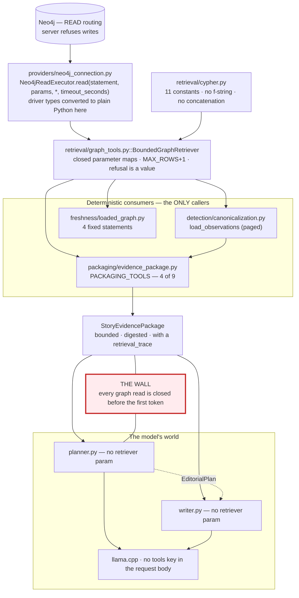
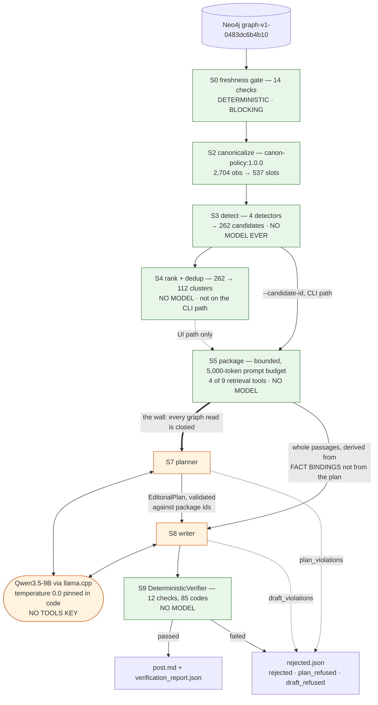

# 02 — Story Agent and Model Pipeline

**Audit date:** 2026-08-13. **Code baseline:** commit `33b0d7f`. Prompt sizes and package figures
were measured by rebuilding the real prompts from the recorded runs under `data/story_demo/`.

---

## 1. The answer first

**The model cannot explore the graph. It never sees the graph at all.**

The story pipeline is two halves separated by a hard structural boundary (`story/pipeline.py`):

```text
resolve_demo_inputs(...)   GRAPH HALF:  freshness gate → detection → bounded packaging.
                           Needs Neo4j. Fully deterministic. NO model call anywhere.
run_demo(inputs, ...)      MODEL HALF:  planner → writer → verifier → artifacts.
                           NO database, NO retrieval, NO tools. One directory written.
```

The LLM is called exactly **twice per run**, each time with a rendered text prompt and a
JSON-Schema-constrained response format. Neither call site passes a retriever, a tool list, a
Cypher string, or anything the model could use to ask for more evidence — and this is enforced by
the signatures:

* `story/stages/generation/planner.py::plan_story(package, *, provider, max_tokens)` — no
  `retriever`, no `terms`.
* `story/stages/generation/writer.py::write_story(package, plan, *, provider, style,
  length_target, max_tokens)` — no `retriever`, no passage argument; the writer's passage slice is
  computed by `writer.writer_passages(package)`, which **takes no plan argument**, so the planner
  cannot filter the writer's universe.

There is **no agent loop, no tool-calling, no function-calling, no ReAct** anywhere in `story/`.
`story/providers/openai_compatible.py::StoryOpenAICompatibleProvider.request_body` posts
`messages`, `temperature`, `max_tokens`, `stream: False`, `chat_template_kwargs` and
`response_format`, **and nothing else — there is no `tools` key.**

---

## 2. Story discovery — the four implemented detectors

`story/contracts.py::StoryDetector` states the rule in three words: *"**No model, ever**"*.

| # | Detector | `DETECTOR_ID` | Version | `STORY_TYPE` | File | Live candidates |
| --- | --- | --- | --- | --- | --- | ---: |
| D1 | metric move | `detector:metric_move` | 1.0.0 | `metric_move` | `story/stages/detection/metric_move.py:103-105` | **227** |
| D2 | trend reversal | `detector:trend_reversal` | 1.0.0 | `trend_reversal` | `trend_reversal.py:85-87` | **11** |
| D3 | acceleration | `detector:acceleration` | 1.0.0 | `acceleration` | `acceleration.py:78-80` | **9** |
| D4 | cross-metric divergence | `detector:cross_metric_divergence` | 1.0.0 | `cross_metric_divergence` | `cross_metric_divergence.py:162-164` | **15** |

**Only these four exist.** Deceleration is explicitly *not* implemented — D3's monotone-increasing
condition makes it unreachable, and `acceleration.py:9-14` says so: *"Deceleration is not
implemented, and the plan's own example for it is wrong."* A `leadership_change` detector does not
exist either; all 262 live candidates carry empty `event_ids`.

`POLICY_VERSION = "canon-policy:1.0.0"`; `RANKING_POLICY_VERSION = "1.1.0"`.

### 2.1 Thresholds are NOT in `config/story.yaml`

`config/story.yaml` has four top-level keys: `version`, `provider`, `generation`, `demo`. There is
no `detectors:`, no `thresholds:`, no `weights:`. Neither `story/stages/detection/` nor
`story/stages/ranking/` imports `yaml`, `json`, `open(`, `Path` or `os`. Every threshold is a
module-level literal in `story/stages/detection/detector_config.py`, and every scoring weight is a
literal in `story/stages/ranking/scoring.py`.

`detector_config.py:14-19` gives the reason: *"§6.6 puts it in `config/story.yaml`; **it is here
instead**, because a detector that could not run without a config file on disk could not be
unit-tested from a clean checkout."*

The config file *is* a `story_run_id` input via a hash of the whole document, so editing it re-keys
the run — but it changes no detection or ranking number.

### 2.2 The common input — the canonical series

Every detector consumes `CanonicalPoint`s built by
`story/stages/detection/canonicalization.py::canonicalize` and grouped by
`story/core/series.py::build_series`. D1/D2/D3 take `Sequence[CanonicalPoint]`; **D4 alone takes
`Mapping[str, CanonicalSeries]`**.

`CanonicalPoint` fields: `metric_id`, `period`, `subject_entity_id`,
`status ∈ {ok, resolved_by_majority, conflict}`, `value`, `unit`, `scale`, `currency`,
`representative_observation_id`, `supporting_observation_ids`, `minority_observation_ids`,
`quarantined_observation_ids`, `n_docs`, `first_filed`, `last_filed`, `warnings`, `clusters`,
`distinct_values`.

Comparability is gated by `story/core/series.py::comparable(left, right, claim, …)` returning
`Ok(warnings)` or `Refuse(rule, reason, detail)` — **never an exception**. Rule order: R1 subject,
R2 metric, R3 shape, R4 unit, R5 currency, R6 formula version, R7 canonical, R8 tolerance,
R10 adjacency. **R9 is not a gate** — it produces warnings. `ClaimKind` ∈ {`level`, `movement`,
`acceleration`, `divergence`}.

Numeric constants: `PERCENT_TOLERANCE = 0.1`, `COUNT_TOLERANCE = 1.0`,
`SCALE_TOLERANCE = {"millions": 1e6, "thousands": 1e3}`, `DELTA_PRECISION = 9`. `within_tolerance`
is `round(abs(l−r), 9) <= tolerance` — `<=`, so ties pass.

### 2.3 The canonicalization policy, step by step

`canon-policy:1.0.0` is a digest input to every `candidate_id`.

1. Group `ObservationRecord`s by `slot_key = (metric_id, period.key)`.
2. **Quarantine** — a record is quarantined iff it is narrative **and** has a `quoted_text`
   **and** `is_flattened_table_read(quoted_text)` fires (date literals masked to `DATE`; the
   longest run of consecutive numerals whose separators contain no letters;
   `MIN_FLATTENED_NUMERALS = 3`).
3. Slot-level warnings: `slot_unit_disagreement`, `slot_currency_disagreement`,
   `filing_date_unknown`.
4. **Cluster** — sort by `(value, observation_id)`, then **single-linkage** against the previous
   member at `tolerance = max(previous.tolerance, record.tolerance)`. Chaining is a known,
   documented cost.
5. **Resolve** — one cluster → `OK`. More than one → rank by distinct document count; the winner
   needs `top_docs >= 2` **and** `top_docs >= 2 × runner_docs` → `resolved_by_majority`; otherwise
   `conflict` with **no** supporting records. Majority is over **distinct documents, never rows**.
6. **Representative** — `min(records, key=(scale_precision, filing_date or "9999-12-31",
   observation_id))`.
7. **Provenance** — supporting / minority / quarantined ids, `n_docs`, `first_filed`, `last_filed`,
   `clusters`, `distinct_values`.

`load_observations` is the **only graph-touching function in detection**, and it pages
`get_metric_history` on a keyset over `coalesce(period_end, instant_date)`, **refusing** with
"paging stalled at …" when a truncated page adds nothing new.

### 2.4 Shared thresholds

`COMPARABLE_SHAPES = (QUARTER, INSTANT, FISCAL_YEAR, YTD_6M, YTD_9M)` — `PeriodShape.OTHER` is
excluded. `FLOOR_FRACTION = 0.10`, `MIN_DELTA_POPULATION = 8`.

`FAMILY_THRESHOLDS` — `pct_min` doubles as a percent-of-base bound for a non-percent metric and a
**percentage-point** bound for a percent metric:

| `MetricFamily` | `pct_min` | `abs_min` |
| --- | ---: | ---: |
| `usd_measure` | 65.0 | 50,000,000.0 |
| `margin` | 3.0 | — |
| `aging_percent` | 19.0 | — |
| `home_count` | 40.0 | 1,000.0 |
| `market_count` | 6.0 | 3.0 |
| `macro_percent` | **absent — `thresholds_for` returns `None`** | — |

`METRIC_FAMILY` covers all 26 metrics. `METRIC_POLARITY` ∈ {revenue, cost, ratio, count};
`VALUE_SIGN` ∈ {positive, negative, unverified}. `value_floor(values) = 0.10 × median(|value|)`.

### 2.5 D1 — metric move

**Input** `Sequence[CanonicalPoint]` + `graph_run_id` + `unreadable`. Algorithm
(`detect_metric_moves` → `_scan` → `measure_move`):

1. Metrics in `unreadable` → one `MetricMoveRefusal(SERIES_INCOMPLETE)` each, skipped.
2. `thresholds_for(metric_id)` is `None` → `THRESHOLD_UNMEASURED`, skipped. This is what excludes
   `mortgage_rate` and `home_price_appreciation`.
3. `floor = value_floor(all valued points of the metric, all shapes)`.
4. For each shape, consecutive valued pairs, each gated by `comparable(later, earlier,
   claim=MOVEMENT)` — a non-`Ok` is skipped silently.
5. `delta = round(later.value − earlier.value, 9)`; `base = |earlier.value|`;
   `relative = round(delta / base × 100, 9)` iff `base > 0 and floor is not None and base >= floor`.
   **Firing arms, in order**: if `unit == "percent"` → `"pp"` when `|delta| >= pct_min`; **elif**
   `relative is not None and |relative| >= pct_min` → `"pct"`; then unconditionally `"abs"` when
   `abs_min is not None and |delta| >= abs_min`.

The `elif` means **the pct arm can never fire for a percent metric** — a documented deviation from
the plan's literal text (227 candidates instead of 310), recorded at `metric_move.py:23-37`. All
comparisons are `>=`; 8 steps land exactly on their bar.

`candidate_from_move` (shared with D2) builds the `StoryCandidate`: `observation_ids` are
**supporting only, never minority**; signals always include `delta`, `crosses_zero`, `fired_on`,
`period_shape`, `threshold_pct_min`; warnings are sorted and add `relative_change_across_zero` and
`metric_sign_convention_unverified` where applicable.

### 2.6 D2 — trend reversal

Constants `MIN_RUN = 2`, `SIGMA_MULTIPLE = 1.0`, `MIN_DELTA_POPULATION = 8`.

1. `_runs(series, shape)` — maximal stretches where **every adjacent pair** passes
   `comparable(..., MOVEMENT)`. A refused pair **splits** the run.
2. Delta population over all runs; `< 8` → `POPULATION_TOO_SMALL`.
3. `sigma = pstdev(population)`; `sigma < max(presentation_tolerance)` →
   `LOW_VARIANCE_PRESENTATION_NOISE` (documented to fire on nothing in this run).
4. Sliding window of `min_run + 1 = 3` deltas; `reverses(window)` requires the last delta non-zero
   and **every** prior delta non-zero and of opposite sign.
5. `|last delta| >= 1.0 × sigma` **and** `measure_move(...).fires`.

D2's magnitude gate is therefore the **conjunction** of D1's threshold and 1σ, which the module
states is its reading of the plan's `max(D1 threshold, σ)` — a `max()` over a disjunction being
meaningless. Anchors are `min_run + 2 = 4` points.

### 2.7 D3 — acceleration

Constants `RUN_LENGTH = 3`, `WINDOW_POINTS = 4`, `MAGNITUDE_RATIO = 1.5`.

`accelerates(deltas)` requires exactly: `len(deltas) == 3`; same sign and **no zeros**;
magnitudes **strictly** increasing; and `round(|d3| − 1.5 × |d1|, 9) >= 0` — a **rounded
difference, not a quotient**, to avoid dividing by an arbitrarily small `|d1|`.

**Flag:** D3 **never calls `thresholds_for`** and emits no `THRESHOLD_UNMEASURED`. It therefore
scans `mortgage_rate` and `home_price_appreciation`, which D1 and D2 refuse by name. Defensible
(the rule is scale-free) but an undocumented asymmetry — `AccelerationResult.refusals` can only
ever hold `SERIES_INCOMPLETE`.

### 2.8 D4 — cross-metric divergence, the demo's detector

Constants `Z_MIN = 1.5`, `VARIANCE_FLOOR_MULTIPLE = 2.0`, `MIN_POPULATION = 8`,
`DIVERGENCE_SHAPES = (QUARTER, FISCAL_YEAR, YTD_6M, YTD_9M, INSTANT)`.

```text
gap[t] = v_left[t] − v_right[t]
z[t]   = (gap[t] − fmean(gap over population)) / pstdev(gap over population)
fire iff |z| >= 1.5
```

**`DIVERGENCE_PAIRS` — five declared pairs**, and orientation is part of the declaration:
`(adjusted_gross_margin, gaap_gross_margin)`, `(contribution_margin, adjusted_gross_margin)`,
`(contribution_profit, adjusted_gross_profit)`,
`(contribution_profit_after_interest, contribution_profit)`, `(homes_purchased, homes_sold)`.
`housing_inventory_homes ↔ homes_sold` is deliberately absent (zero shape overlap).

Gate sequence: sign-convention guard first (`SIGN_CONVENTION_MISMATCH`) → series presence →
per-shape gap series gated by `comparable(..., DIVERGENCE)` → population membership requires
`comparable(point, anchor, claim=LEVEL)` per metric (this is what makes R6 bite on a *history*: the
contribution-profit ↔ adjusted-gross-profit formula split turns 25 quarters into populations of 8
and 17) → `< 8` → `POPULATION_TOO_SMALL` → variance floor `2.0 × max(point.tolerance)` applied
**twice**, with and without the anchor → `|z| >= 1.5` → `definitional_relation` must be non-`None`,
else `RELATION_UNDECLARED`.

`RelationKind` is tested strongest-first: `component` → `shared_components` → `co_component` →
`distinct_group` → `None`. Formulas are resolved at the anchor's own date.

D4 publishes the widest signal set of any detector — 19 keys — and is the only detector that passes
`audience=Audience.EXTERNAL` explicitly.

### 2.9 What discovery produced, measured live

A full discovery run over `graph-v1-0483dc6b4b10` (2026-08-13):

| Stage | Result |
| --- | ---: |
| bounded reads | 2,736 |
| observations loaded | 2,704 |
| readable metric series | **17** (of 26) |
| canonical fact-slots | **537** |
| comparability pairs evaluated | 478 (permitted 424, refused 54, warned 0) |
| **candidates** | **262** |
| dedup clusters / representatives | **112** / 112 |
| returned to the caller | 50 (`max_suggestions`) |

---

## 3. Candidate ranking

`RANKING_POLICY_VERSION = "1.1.0"`. The bump rule is declared: the version moves whenever two runs
over one graph could rank differently — any term added or removed, any weight, any
saturation/horizon/precision constant, the ordering key, or the dedup rule.

> **The ranking stage is not on the CLI demo path.** `story/pipeline.py::resolve_demo_inputs` runs
> D4 only and selects by id; `SELECTION_MODE = "manual_demo_candidate"`. Ranking *is* exercised by
> the demo UI's discovery endpoint. `RANKING_POLICY_VERSION` is still a `story_run_id` input,
> because a scoring change otherwise had nothing in the id to show for it.

### 3.1 The score

```text
total = 0.40·clip(|z| / 4.0)                                magnitude_z
      + 0.20·clip(|Δ| / p90(|Δ|))                           magnitude_units
      + 0.15·clip(n_docs / 5.0)                             corroboration
      + 0.10·clip(1/(1+prior) + 0.5·is_first_occurrence)    novelty
      + 0.10·clip(1 − (months_to_2026-03-31 / 3) / 32.0)    recency
      − 0.15·min(len(warnings), 4.0)                        warning_count
      − 0.20·(1.0 if n_docs == 1 else 0.0)                  single_source
      − 0.25·clip(max cosine overlap with accepted posts)   repetition
```

`SCORE_PRECISION = 9`; each component is `round(v, 9)`, each contribution
`round(component × weight, 9)`, the total `round(sum, 9)`. `WEIGHTS`' insertion order is the
breakdown's read order.

**Suppression, not zeroing.** `ScoreBreakdown.suppressed` maps a component name to a prose reason
and the key is **left out of `components`** entirely. Five suppression paths: no z computable; no
units percentile; `n_docs is None` (suppresses **both** `corroboration` and `single_source`); no
anchor date for recency.

`MAGNITUDE_SIGNAL = {"metric_move": "delta", "trend_reversal": "delta", "acceleration": "delta_3"}`.
`cross_metric_divergence` is deliberately absent and handled as a branch: it reads the detector's
own published `z` and hard-suppresses `magnitude_units` with *"the pair's gap distribution
publishes a z, a mean and a σ, but no p90"*.

`anchor_n_docs` is the **minimum** `n_docs` across every anchor slot, deliberately not the sum.
`prior_candidate_counts` groups by `(detector_id, metric_ids)` and orders by
`(anchor_date, period_key, candidate_id)` — *prior* means earlier **in the series**, not in the
list.

`DeltaDistribution.z_for(delta) = (delta − mean) / sigma`, **mean-centred, not `Δ/σ`**, and `None`
unless `population >= 8 and sigma > 0.0`.

### 3.2 Deduplication

**The rule:** two candidates collapse when they share a **primary anchor period** (the *latest*
anchor) **AND** any of their metrics are related through `formulas.yaml`'s `component_metrics`.
Not "any shared period" — that would chain the whole corpus through adjacent quarters.

`LineageRelation`, tested strongest-first: `same_metric` → `component` → `shared_components` →
`co_component`. It is D4's `RelationKind` minus `distinct_group` — restated, not imported, with a
test asserting the shared members agree. `constraints.yaml`'s `mutually_distinct_groups` is
deliberately **not** a lineage relation.

`_cluster` is **union-find with path halving** over all pairs. A `GroupingReason` is recorded only
for pairs that actually merged two components — 12 joins for a 13-member cluster, not 78 — and
renders through a **template**, never free text.

**Not implemented:** the event half of the dedup rule (`(passage_id, date)` collapse), because no
event detector exists and all 262 live candidates carry empty `event_ids`.

### 3.3 Ordering, filters and limits

```python
ordering_key = (AUDIENCE_ORDER[audience], -round(score.total, SCORE_PRECISION), candidate_id)
```

`candidate_id` is last and unique, so the key is a **total order** and a shuffled input produces an
identical output. Audience is the *first* key — stronger than required — so no consumer can
reintroduce internal-outranks-external by reading `ranked` directly.

Types: `RankedCandidate(candidate, score, cluster, suppressed)`; `RankingResult(ranked, clusters)`
with properties `representatives` and **`for_post_selection`** (representatives filtered to
`Audience.EXTERNAL` — the accessor a caller must use); `CandidateScore(candidate_id, total,
components, rank, dedup_group)`.

**There is no top-N limit, no score threshold and no truncation anywhere in the ranking stage.**
The only filters are the audience partition, the representative filter, and component suppression.
Truncation lives outside the stage, in the UI's `max_suggestions`, which *"truncates an order
rather than choosing one"*.

---

## 4. Graph retrieval — the boundary

### 4.1 Who may execute Cypher

| Layer | May issue Cypher? | Evidence |
| --- | --- | --- |
| **The LLM** | **No — it has no channel to** | `request_body` sends no `tools`; `plan_story`/`write_story` take no retriever |
| Planner stage | No | `planner.py` docstring: *"No graph, no retrieval, no tools."* Asserted by `tests/story/test_story_planner.py::test_the_planner_module_reaches_no_graph_no_retrieval_and_no_driver`, which reads the file's imports |
| Writer stage | No | `writer.py` docstring + `tests/story/test_story_writer.py::test_the_writer_module_reaches_no_graph_no_retrieval_and_no_verifier` |
| Packaging stage | Yes, via **4 named tools only** | `evidence_package.py::BoundedEvidencePackageBuilder._call` raises `PackagingError` for any tool outside `PACKAGING_TOOLS` |
| Detection stage | Yes, via `load_observations` (paged `get_metric_history`) | `canonicalization.py` |
| Freshness gate | Yes, 4 fixed statements | `story/stages/freshness/loaded_graph.py::FRESHNESS_STATEMENTS` |
| `BoundedGraphRetriever` | Yes — **the only door** | `story/stages/retrieval/graph_tools.py` |
| `Neo4jReadExecutor` | the only module importing `neo4j` | `story/providers/neo4j_connection.py` |

### 4.2 Eleven Cypher statements, and nothing else

`story/stages/retrieval/cypher.py` holds **eleven string constants and no code**. Its docstring
states the rules that bind them:

```text
hard LIMIT            every statement that reads a node ends in `LIMIT $row_limit`
named return fields   no `RETURN n`, no `n {.*}`
two hops              the longest pattern is three nodes; nothing is variable-length
no dynamic labels     every label and relationship type is a literal in this file
no APOC               `db.index.fulltext.queryNodes` ships with the server
no write clause       there is no CREATE, MERGE, SET, DELETE, REMOVE or DROP
allowlisted labels    Metric, Observation, Event, Passage, Document, Issue
```

> **"Nothing here is built.** No f-string, no `%`, no `+`, no `.format()`, no `join`. Every caller
> value arrives as a bound `$parameter`, including every `LIMIT`."

`tests/story/test_story_retrieval_cypher.py` walks the AST of every module under `story/` and
refuses anything but an `ast.Constant` there — a rule about the *shape of the code*, not about
runtime behaviour.

| Constant | Tool | Row bound | Hops |
| --- | --- | ---: | --- |
| `LIST_METRICS` | `list_metrics` | 26 | 0 |
| `METRIC_NODE` | `get_metric_definition` | 1 | 0 |
| `METRIC_HISTORY` | `get_metric_history` | 200 | 0 (index only) |
| `COMPARE_METRIC_PERIODS` | `compare_metric_periods` | 2 (aggregated) | 0 |
| `FACT_EVIDENCE_FOR_OBSERVATION` | `get_fact_evidence` | 10 | 2 |
| `FACT_EVIDENCE_FOR_EVENT` | `get_fact_evidence` | 10 | 2 |
| `PASSAGE_CONTEXT` | `get_passage_context` | 7 | 1 + id lookup |
| `SEARCH_PASSAGES` | `search_passages` | 25 | 1 (after fulltext) |
| `EVENTS_IN_WINDOW` | `get_events_in_window` | 50 | 1 |
| `COUNTER_EVIDENCE` | `find_counter_evidence` | 25 | 2 |
| `COUNTER_EVIDENCE_SCOPE` | `find_counter_evidence` (empty-result disambiguation) | 1 | 2 |

Deliberate absences, each with the measured reason recorded: `OBSERVATION_OF_SUBJECT` and
`:Entity` (opendoor carries 2,704 such edges — one hop outward is the whole graph);
`:EvidenceSource` (zero nodes exist); `:NotAttempted` issues (10,852 of 17,130 issues record a
question never asked).

### 4.3 Twelve tools — nine answer, three do not

`TOOL_PARAMETERS` is the closed `(required, optional)` contract per tool:

| Tool | Required | Optional | Status |
| --- | --- | --- | --- |
| `list_metrics` | — | — | implemented |
| `get_metric_definition` | `metric_id` | — | implemented |
| `get_metric_history` | `metric_id` | `shape`, `since`, `until` | implemented |
| `compare_metric_periods` | `metric_id`, `period_key_a`, `period_key_b` | — | implemented |
| `get_fact_evidence` | — | `observation_id`, `event_id` | implemented (exactly one required at runtime) |
| `get_passage_context` | `passage_id` | `before`, `after` | implemented |
| `search_passages` | `terms` | `document_types`, `since`, `until` | implemented |
| `get_events_in_window` | `since`, `until` | — | implemented |
| `find_counter_evidence` | `metric_id`, `period_key` | — | implemented |
| `get_guidance_history` | — | `metric_id` | **`Unavailable`** — no lane emits guidance |
| `compare_guidance_to_actual` | — | `metric_id`, `period_key` | **`Unavailable`** — same |
| `get_price_reaction` | — | `date`, `window` | **`Unavailable`** — no `:EvidenceSource:MarketData` node exists; all 2,710 evidence rows are `normalized_passage` or `normalized_table` |

Enforcement in `BoundedGraphRetriever`:

* `_dispatch` — unavailable tools answered first; an unknown tool name → `Refused("unknown_tool")`.
  `getattr(self, f"_{tool}")` is reached **only after** `tool in MAX_ROWS` has refused every string
  this module did not write.
* `_check_parameters` — **every parameter map is closed.** An unknown key is `Refused`, not
  ignored; a missing required key is `Refused`. *"A model that can add `limit=1000` and have it
  silently dropped has learned nothing, while one that gets a refusal has learned the shape of the
  tool."*
* `_read` — every statement runs at `MAX_ROWS[tool] + 1` and the extra row is dropped;
  `truncated=True` is the only honest signal, because `len(rows) == cap` cannot distinguish a full
  page from a bound that bit.
* **A caller value never chooses a limit, a label or an index.** `$row_limit` comes from `MAX_ROWS`
  by tool name; `$excerpt_chars`, `$handle_limit`, `$inner_limit` are constructor-owned; the
  fulltext index name is a literal inside the statement. *"There is no path from `parameters` to
  any of them, which is what makes 'a model cannot widen a query' checkable rather than asserted."*
* `_check_window` validates `YYYY-MM-DD` on both ends and `since <= until`, because the graph
  stores **every date as a string** — a malformed date compares lexicographically against real ones
  and returns a quietly wrong window.
* `_resolve` runs a metric surface through the **ontology**, and an ambiguous surface is
  `Ambiguous`, never silently disambiguated. Eight surfaces in this ontology denote more than one
  metric.
* **A refusal is a value, never an exception**: five outcomes `OK / NOT_FOUND / AMBIGUOUS /
  UNAVAILABLE / REFUSED`. Even a database that went away is `Unavailable("graph_read_failed")` —
  `_read`'s `except Exception` is scoped to the single executor call, because `story/` may not
  import `neo4j` and so cannot name `Neo4jError`.

Constructor bounds: `DEFAULT_TIMEOUT_SECONDS = 30.0` (refuses `<= 0`: the server reads 0 as *no
timeout*), `DEFAULT_EXCERPT_CHARS = 400`, `DEFAULT_HANDLE_LIMIT = 10`,
`MAX_CONTEXT_NEIGHBOURS = 3`, `DEFAULT_INNER_SEARCH_LIMIT = 500`.

### 4.4 What packaging may call

```python
PACKAGING_TOOLS = frozenset({
    "get_fact_evidence", "get_passage_context", "search_passages", "find_counter_evidence"})
```

`get_metric_history` is **forbidden here**, because it is bounded at 200 rows, five metrics exceed
it, and only canonical-series construction pages it and proves completeness. The docstring records
the measurement: *"one un-paged call yields 93 candidates and zero refusals."*

### 4.5 The write barrier, verified live

Through `story/providers/neo4j_connection.py::open_read_executor`, a deliberate write probe:

```text
CREATE (x:AuditProbe) RETURN x
  → REFUSED by the server: Neo.ClientError.Statement.AccessMode
    "Writing in read access mode not allowed"
```

The barrier is `routing_=RoutingControl.READ` in `Neo4jReadExecutor.read`, and the server enforces
it. The module docstring is careful about this: routing is a **write barrier, not access control**
— nothing stops that line being changed to `WRITE`.

### 4.6 The one place the model *can* influence evidence — and it is off here

`planner.py`'s docstring records the correction rather than hiding it:

> "§11's first draft rested on the stronger claim that the model cannot influence the evidence set
> at all, and **that claim is false for one section**: `search_passages` takes a `terms[]` and
> returns `ORDER BY score DESC LIMIT 25`, so adding terms re-ranks and evicts — **adding three
> innocuous terms to a two-term query dropped 18 of the 25 passages the original query returned**
> *(measured 2026-08-03)*."

The mitigation is structural, not a prompt rule: query terms are derived by
`story/stages/packaging/query_terms.py::derive_terms(registry, metric_ids=…, period_keys=…)` from
the **candidate and the ontology**, checked by `refuse_undeclared_terms` — which raises
`ModelSuppliedTerm` and is asserted **against the argument actually passed**, so the guarantee is
"no other string ever reaches the tool", not merely "this module derives terms". The model has no
field anywhere through which to supply one.

*"No term is ever taken from prose. Not from the candidate's signals — §6.4 forbids prose there and
a live test asserts none of the 19 signal keys carries any — not from a warning string, and not
from a passage."*

Constants: `MIN_TERM_CHARS = 4`, `MAX_TERMS = 6`,
`_LUCENE_KEYWORDS = {"AND","OR","NOT","TO"}`. Measured: escaped `margin "NOT" gross` → 3,318 hits,
unescaped → 372; `"the"` matches 6,873 of 8,776 passages while a metric alias matches 432.

**Residual steering surface, named honestly:** whoever composes the `EvidenceRequest` chooses which
metric ids are in scope, and metric ids select which aliases become terms. The strings are
ontology-owned; the *scope* is the detector's.

In the demo candidate `want_explanatory_search=False`, so `search_passages` is **not called at
all** — verified in the recorded retrieval trace (§5.4).

### 4.7 The retrieval boundary as a diagram



---

## 5. The evidence package

### 5.1 Schema

`story/core/models.py::StoryEvidencePackage`. `PACKAGE_VERSION = "1.2.0"` at commit `33b0d7f`.

**Identity block (14 fields, also exposed whole as `PackageIdentity`)**: `package_id`,
`package_version`, `candidate_id`, `detector_id`, `detector_version`, `policy_version`,
`graph_run_id`, `graph_projection_version`, `extraction_run_id`, `run_complete_sha256`,
`ontology_id`, `ontology_definition_hash`, `ontology_semantic_version`, `package_content_digest`.

**Twenty bounded sections:**

| Section | Type | Default cap | Ceiling |
| --- | --- | ---: | ---: |
| `subject` | `PackagedSubject` | — | — |
| `facts` | `PackagedFact[]` | 12 | 24 |
| `semantic_facts` / `identity_facts` / `comparability_facts` | ontology facts | — (**protected**) | — |
| `metrics` | `PackagedMetric[]` | 8 | 8 |
| `formula_windows` | `PackagedFormulaWindow[]` | 8 | 8 |
| `events` | `PackagedEvent[]` | 5 | 8 |
| `relationships` | `PackagedRelationship[]` | 4 | 8 |
| `evidence_sources` | `PackagedEvidenceSource[]` | — | — |
| `primary_passages` | `PackagedPassage[]` | 4 | 6 |
| `context_passages` | `PackagedPassage[]` | 1 | 2 |
| `explanatory_passages` | `PackagedPassage[]` | 3 | 5 |
| `counter_evidence` | `PackagedPassage[]` | 3 | 6 |
| `diagnostic_passages` | `PackagedPassage[]` | — | — |
| `warnings` | `PackagedWarning[]` | 20 | 20 |
| `conflicts` | `Conflict[]` | 8 | 8 |
| `compatibility` | `CompatibilityDecision[]` | 12 | 12 |
| `documents` | `PackagedDocument[]` | 20 | 20 |
| `retrieval_trace` | `RetrievalTraceEntry[]` | 40 | 40 |
| `budget` | `PackageBudget` | — | — |

**`PackagedFact`** — `observation_id`, `metric_id`, `metric_label`, `period_key`,
`period_start?`, `period_end?`, `instant_date?`, `shape`, `value: float`, `unit`, `currency?`,
`scale?`, `scale_location?`, `printed_form?`, `row_label?`, `column_label?`, `source_lane`,
`validation_state`, `warning_codes[]`, `ambiguity_codes[]`, `passage_id?`, `document_id?`,
`source_url?`, `quoted_text?`, `evidence_source_id?`, `fact_kind`,
`corroborating_observation_ids[]`, `corroborating_passage_ids[]`, `corroborating_document_ids[]`.

**`PackagedPassage`** — `passage_id`, `document_id`, `text`, `char_count`, `heading_path[]`,
`section_id?`, `passage_kind?`, `source_url?`, `char_start=0`, `char_end?`, `excerpted=False`,
`query_terms[]`, `score?`, **`role: EvidenceRole`** (required, no default), `match_basis`,
`quality_status`, `unusable_reason?`, `diagnostic_codes[]`.

**Evidence roles**: `primary_support`, `corroborating_support`, `context`, `counter_evidence`,
`warning_only`, `unusable`. One evidence item carries **one** role on every surface.

**Allowed interpretations** — the package carries no interpretation. The only "permission" field is
`causal_language`, and it is *computed from the package by code* (§6.3) and pinned into the
planner's schema as a single-member enum.

### 5.2 How it is built

`BoundedEvidencePackageBuilder.build` — the order is load-bearing and stated:

1. `_select_facts(candidate, request)` — facts first, because every other section derives from
   them. `PackagingError` if the request names no observation the builder holds.
2. `required_slots` from `candidate.anchor_observation_ids | request.observation_ids`.
3. `_add_facts` — `PackagingError` if every selected observation fails to resolve a citation chain
   (*"a package of uncitable facts is not a package"*).
4. `_add_primary_passages` — through `get_passage_context` with a **zero window**, the only tool
   returning whole `:Passage.text`. Only the first `cap` are fetched, so the trace does not carry
   reads for passages the package will discard. `drop_orphaned_facts` afterwards: dropping a
   primary drops the facts bound to it.
5. `_add_context_passages` — ±`max_context_neighbours` around each primary.
6. `_add_explanatory_passages` — **only if `request.want_explanatory_search`**.
7. `_add_counter_evidence` — only if `request.want_counter_evidence`.
8. `_add_events`, `_add_metrics`, `_add_formula_windows`, `_add_conflicts`, `_add_compatibility`,
   `_add_run_level_warnings`.
9. `retrieval_trace` captured.
10. `_subject`, then `_add_ontology_facts` — pure over the ontology, **adds no tool call**.
11. Handed to `package_assembly.py::PackageAssembler.finalize`, which reads no graph and selects
    nothing — the split is what makes "the digest reproduces" testable with no database.

### 5.3 The evidence budget

`section_bounds.py`:

* `CHARS_PER_TOKEN = 4`; `estimate_tokens(payload) = ceil(len(canonical_json(payload)) / 4)`. Named
  an estimate: no tokeniser ships with the repository, and `tiktoken` is on the forbidden-import
  list.
* **Two estimates, and only one is a bound.** `artifact_token_estimate` covers the whole package as
  written to disk and is **informational**. `prompt_token_estimate` covers `prompt_slice(payload)`
  = the payload minus `("budget", "retrieval_trace")` and **is the bound**.
* `BudgetParameters.max_total_tokens = 5000`; `MAX_TOTAL_TOKENS_CEILING = 6000`. A configured cap
  above the ceiling raises `BudgetExceedsCeiling` — **refused, never clamped** (*"a clamp reports a
  configuration as honoured"*).
* `PROTECTED_SECTIONS = ("comparability_facts", "facts", "identity_facts", "semantic_facts")`.
  `facts` is protected at **row grain**: a fact whose `(metric_id, period_key)` is a candidate
  anchor slot is untouchable, because `anchor_observation_ids` are digested into `candidate_id`.
* `TRIM_PLAN`, in order: `explanatory_passages` → `context_passages` → corroborating rows inside
  `primary_passages` → `diagnostic_passages` → `primary_passages` → `counter_evidence`.
* `TRIM_FLOOR`: explanatory 0, context 0, diagnostic 0, **primary 1**, **counter_evidence 1**.
  Counter-evidence never goes to zero — *"a trimmer that emptied the section would discharge §11's
  counterpoint rule by deleting the inconvenient evidence. That is the exact shape of the
  silent-omission channel §11 exists to close."*
* A package that cannot fit a protected fact **refuses** with `required_fact_does_not_fit` rather
  than trimming harder.

Why the trace is excluded from the bound is a measurement, not a preference: on one spike the
`retrieval_trace` cost 1,084 tokens and `budget` 190, so the 5,000-token total could not hold the
plan's own passage arithmetic and all three spike packages shipped two primaries, zero context and
`facts` below the stated default. *"The trace is provenance for a human reviewer… Counting it
against the evidence budget starved the thing the budget exists to protect."*

### 5.4 A real example, traced

`data/story_demo/story-v1-290a1a01e59c/evidence_package.json` — the accepted run.

| Field | Value |
| --- | --- |
| `package_id` | `pkg:cross-metric-divergence-adjusted-gross-margin-gaap-gross-margin-opendoor-2022q3:6a858ae5c031` |
| `package_content_digest` | `5c420f8c50717b731656e1bec1c744b26f378669a9c00d25395f0ac4c51e6ad3` |
| section counts | facts **2** · primary_passages **1** · context_passages 0 · counter_evidence 0 · semantic_facts 10 · identity_facts 4 · comparability_facts 3 · metrics 2 · formula_windows 2 · documents 1 · retrieval_trace 15 · warnings 5 |
| `prompt_token_estimate` | **4,993** (against `max_total_tokens: 5000`) |
| `artifact_token_estimate` | 6,539 |
| `caps_hit` | `["context_passages", "token_budget"]` |

The two facts:

| observation_id | metric | period | value | unit | quoted_text | passage |
| --- | --- | --- | ---: | --- | --- | --- |
| `obs:adjusted-gross-margin:opendoor:2022Q3:normalized-table:3eabe78a6d25` | `adjusted_gross_margin` | 2022Q3 | **3.3** | percent | `"3.3"` | `…open-20220930.htm#p139` |
| `obs:gaap-gross-margin:opendoor:2022Q3:normalized-table:5fde8a274bdc` | `gaap_gross_margin` | 2022Q3 | **-12.6** | percent | `"(12.6)"` | same |

Nine further readings of the same two slots were **collapsed** into these two and listed on
`corroborating_observation_ids`, disclosed as `concordant_readings_collapsed`.

The section ledger:

| section | available | carried | dropped | reasons | protected |
| --- | ---: | ---: | ---: | --- | --- |
| `facts` | 11 | 2 | 9 | `concordant_readings_collapsed` | **true** |
| `comparability_facts` | 3 | 3 | 0 | — | **true** |
| `context_passages` | 2 | 0 | 2 | `token_budget_trimmed` | false |
| `documents` | 1 | 1 | 0 | — | false |

The five warnings, all `build_provenance` kind:

| code | severity | what it discloses |
| --- | --- | --- |
| `token_budget_trimmed` | WARN | the budget bound and something left |
| `concordant_readings_collapsed` | ANNOTATE | 9 of 11 anchors collapsed into 2 |
| `subject_identity_not_read_from_graph` | ANNOTATE | the subject was not resolved from a graph read |
| `evidence_sources_absent_in_v1` | ADVISORY | no non-passage evidence sources exist |
| `relationships_unavailable_in_v1` | ADVISORY | no retrieval tool returns a relationship |

Because all five are `build_provenance`, `planner.claim_qualifying_warnings` filters every one out
of any `required_warnings` the model might name — which is why the accepted plan carries
`required_warnings: []` and the post states no plumbing caveat.

**The four identity facts are the anti-hallucination device.** The fourth has `available: false`:

> `idn:opendoor:description` — *"No description of this company exists in the corpus or the
> ontology, so none is given. Do not describe what the company does, what it sells, or what market
> it operates in."*

Emitted rather than omitted, because *"an absent row leaves the model free to supply one from its
weights."* Measured: the `opendoor` ontology instance holds `cik`, `tickers`, `exchange` and
nothing else; the `:Entity` node holds twenty properties and none is a description; across all nine
`:Entity` nodes no `description` key exists.

**The retrieval trace — every graph call this run made:** 15 calls, all issued by the packaging
builder, all parameters derived from the candidate.

| # | tool | parameters | outcome | rows |
| --- | --- | --- | --- | ---: |
| 1–11 | `get_fact_evidence` | one `observation_id` each (2 anchors + 9 corroborators) | OK | 1 each |
| 12 | `get_passage_context` | `{passage_id: …#p139, before: 0, after: 0}` | OK | 1 |
| 13 | `get_passage_context` | `{passage_id: …#p139, before: 1, after: 1}` | OK | 3 |
| 14 | `find_counter_evidence` | `{metric_id: adjusted_gross_margin, period_key: 2022Q3}` | OK | 0 |
| 15 | `find_counter_evidence` | `{metric_id: gaap_gross_margin, period_key: 2022Q3}` | OK | 0 |

**Zero `search_passages` calls. Zero calls after the model was invoked.** The whole trace precedes
the first token the LLM ever sees.

### 5.5 Counter-evidence is not search

**The tool is `find_counter_evidence`, keyed on `(metric_id, period_key)`** — a closed parameter
contract with no free-text argument. *"§11's second consequence is that counter-evidence may never
come from `search_passages`, because a term list that ranked the inconvenient passage out of the
top 25 would satisfy §11's non-empty-counterpoints rule by deleting the counterpoint."*

Only six **qualifying bases** may promote a row to `counter_evidence[]`:
`value_outside_tolerance`, `scope_undermines_comparison`, `textual_limitation`,
`opposite_direction`, `issue_changes_reading`, `incompatible_semantics`.
`CounterEvidenceRow.__post_init__` raises if the role disagrees with the basis.

`QUALIFYING_ISSUE_CODES` — 9 entries, applied **only at passage grain**. `AMBIGUOUS_ALIAS` is
deliberately absent (466 of the run's 6,278 non-`NotAttempted` issues) — a fact-quality caveat
already stated by `metric_ambiguity_declared`.

`narrow(...)` applies four deterministic narrowings and **returns the dropped `issue_id`s**,
because *"counter-evidence never silently dropped"* is an acceptance condition and a count is not a
record.

### 5.6 The package warning taxonomy

`packaged_warning(code, subject_ids, detail)` is the **only** constructor; an undeclared code
raises `UnknownWarningCode`. Severity and category are properties of the *code*; `KIND_OF` is
**derived** from the category, never declared twice, so a code cannot be a capability limitation
that also demands a sentence.

**30 codes: 16 claim-qualifying, 14 build-provenance; 6 REFUSE, 2 ADVISORY.**
`SEVERITY_RANK = {REFUSE: 0, WARN: 1, ANNOTATE: 2, ADVISORY: 3}`, so a cap can never drop a
`REFUSE` while keeping an `ADVISORY`.

The reclassification measurement is worth recording: `concordant_readings_collapsed` fires on **258
of 262 packageable candidates** and was moved to `package_composition` because as a claim-qualifying
code with no declared qualifier phrase it produced `required_warning_has_no_declared_qualifier` the
moment a planner named it.

---

## 6. The planner

### 6.1 Model, runtime, invocation

| Item | Value | Reference |
| --- | --- | --- |
| Model | `Qwen3.5-9B-Q4_K_M.gguf` (configured name); server reports `/home/thele/models/qwen3.5-9b/Qwen3.5-9B-Q4_K_M.gguf` | `config/story.yaml` |
| Server | llama.cpp, `http://127.0.0.1:8080`, `-c 8192` | `config/story.yaml` |
| Transport | `POST /v1/chat/completions`, non-streaming | `openai_compatible.py::generate` |
| Kind dispatch | `local_openai_compatible` only; anything else raises | `story/providers/public.py::StoryProviderConfig.validated` |
| Temperature | **`PINNED_TEMPERATURE = 0.0`, a constant at the call site, not a config field** | `story/providers/public.py:69` |
| `max_tokens` | `planner_max_tokens: 2048` | `config/story.yaml`; `prompts.py:135` |
| Timeout | 120 s | `config/story.yaml` |
| Retries | `max_retries: 2` → **3 attempts**, backoff `0.25 × 2ⁿ` s | `openai_compatible.py::_post_with_retries` |
| Retryable | only `{429, 500, 502, 503, 504}` and transport faults | `public.py::RETRYABLE_STATUSES` |
| **Never retried** | timeouts, schema violations, plan/draft refusals | docstrings at each site |
| Structured generation | `response_format: {type: json_schema, json_schema: {name, strict: true, schema}}` — the **nested** form; the top-level `schema` variant *"applies no constraint and does so silently"* | `openai_compatible.py::request_body` |
| Thinking | `chat_template_kwargs: {enable_thinking: false}`, unconditional, **no config field** | same |
| Persona | `system` and `prompt` are **two messages**; an empty `system` is refused | same |

### 6.2 The prompt

* **System prompt** `prompts.py::PLANNER_SYSTEM` — **2,190 characters**, eight numbered rules. Rule
  0 in effect: *"You are given an evidence package and nothing else. **You have no tools, no search
  and no access to any database**: the package is your entire universe. Plan the post; you do not
  write it."*
* **User prompt** `prompts.planner_prompt(package)` — deterministic, pure, no clock, no set
  iteration, because the prompt is half of the replay store's request identity.
* `PLANNER_PROMPT_VERSION = "1.1.0"`, `PLANNER_SCHEMA_NAME = "story_editorial_plan"`. Both reach the
  wire and the digest.

**What the planner is shown — a slice, not the package:**

| Section | Source |
| --- | --- |
| candidate id, package id, subject | package fields |
| COMPANY IDENTITY | `package.identity_facts` (ontology) |
| FACTS | `package.facts` |
| METRICS | `package.metrics` (ontology) |
| METRIC SEMANTICS | `package.semantic_facts` |
| COMPARISON RULES | `package.comparability_facts` |
| EVENTS | `package.events` |
| WARNINGS | `package.warnings` |
| CONFLICTS | `package.conflicts` |
| PASSAGE EXCERPTS | primary + context + explanatory, **first 400 chars each** (`PLANNER_EXCERPT_CHARS = 400`) |
| COUNTER-EVIDENCE (with a count in the heading) | `package.counter_evidence` |

**Not rendered to the planner at all**: relationships, documents, compatibility decisions, evidence
sources, formula windows, and the **retrieval trace** — *"a model that read it would be reading
about its own universe rather than from it."*

### 6.3 Output schema, and the five fields that are not the model's

`prompts.planner_schema(causal_language=…)` is built fresh per call. Required keys: `thesis`,
`why_it_matters`, `key_points[]`, `counterpoints[]`, `required_warnings[]`, `causal_language`,
`uncertainty`, `structure[]`, `prohibited_claims[]`, `unusable_evidence[]`.

`key_points[]` items: `claim`, `required_fact_ids[]`, `required_citation_passage_ids[]`,
`statement_class ∈ {reported, calculated, explanatory}`.
`unusable_evidence[]` items: `id`, `reason ∈ {superseded_by_later_filing, different_period_shape,
different_population, immaterial_at_stated_precision, outside_thesis_scope}`.

> **So the planner does produce thesis / angle (`why_it_matters`) / outline (`structure`,
> `key_points`) / caveats (`uncertainty`, `prohibited_claims`, `required_warnings`) / required
> evidence (`required_fact_ids`, `required_citation_passage_ids`)** — verified against the schema
> and against both recorded plans.

**Five fields never come from the model** (`planner.editorial_plan_from`): `candidate_id`,
`package_id`, `prompt_version`, `model_id`, and **`causal_language`** — the last is computed by
`planner.causal_language_for(package)` and the model's own value is *not read at all*, because
*"reading it back would make the field the model's on the day the grammar is wrong."*

`causal_language_for` scans every **cited span** (fact quotes plus excerpted passages) for 20
`CAUSAL_MARKERS` and returns `reported_only` only if a non-negated marker exists, `forbidden`
otherwise. Negation uses five `NEGATION_TOKENS` within the same clause — because 37 passages in
this corpus carry *"not as a result of"*-style constructions that satisfy naive co-presence tests.

**The schema is constant except for one field.** Everything the model may say from a *closed*
vocabulary is an `enum` (`statement_class`, `unusable_evidence[].reason`, `causal_language`).
Everything that depends on *this* package — which fact ids exist, which passage ids resolve, which
warning codes it carries — is checked by code after the call and is deliberately **not** an enum,
*"because otherwise the same wrong answer would be a schema violation in one package and a plan
rejection in another, and the two have different meanings."*

### 6.4 Post-call rules that are code, not prompt

`planner.plan_violations(plan, package)` — pure, provider-free, **10 codes**: `thesis_empty`,
`no_key_points`, `unresolvable_fact_id`, `unresolvable_passage_id`, `counterpoint_missing`,
`counterpoint_ungrounded`, `counter_evidence_unaccounted`, `unknown_unusable_id`,
`unknown_warning_code`, `causal_language_not_computed` — plus `plan_not_constructible` when the
frozen types refuse the answer.

These exist as code precisely because the portable schema subset has **no `minItems` and no
`pattern`**, so "counterpoints must be non-empty" and "this id must exist" cannot be expressed to
the grammar at all.

`planner.claim_qualifying_warnings` narrows the model's `required_warnings` by dropping every code
the package declares `BUILD_PROVENANCE`. The recorded reason: the first end-to-end run failed with
five of nine blocking findings demanding prose for `token_budget_trimmed`, `section_truncated`,
`subject_identity_not_read_from_graph`, `evidence_sources_absent_in_v1` and
`relationships_unavailable_in_v1`.

**One coherence hole is left open deliberately**: nothing refuses a plan that both *uses* a
counter-evidence item and lists it in `unusable_evidence`. The model did exactly that on
2026-08-04. Recorded rather than silently enforced or ignored.

---

## 7. The writer

### 7.1 What it receives

`writer.write_story(package, plan, *, provider, style, length_target, max_tokens)`:

* the **whole** accepted `EditorialPlan`;
* the **whole** package fact list, semantics, comparability and formula windows;
* its own passage slice — `writer_passages(package)` = the whole text of every passage a
  **packaged fact** was read from, in package section order, deduplicated. **Takes no plan
  argument.** In the demo: 1 passage, whole, 2,164 characters;
* a `StyleProfile`, rendered only into the **system** message, never into the prompt —
  `writer_prompt` has no parameter for it, so a style change structurally cannot change a number;
* `LENGTH  about {length_target} sentences.`

Passages are re-included **whole**, not excerpted (contrast the planner's 400-char excerpts) —
the citation rules need the entire table to reconstruct a cell. A counter-evidence passage that
evidences no packaged fact is **not** in the slice, deliberately.

**Three things the writer is told that it would otherwise have to guess, and code computes all
three** — *"the model chooses words, code chooses facts"*:

* `metric_surfaces_for` — which surfaces name this metric *and only this metric* inside this
  package. This is why the draft says "GAAP Gross Margin" and never "gross margin": the shorter
  surface is a sub-phrase of "adjusted gross margin". The filter is a **conservative local
  approximation** of the verifier's alias index and cannot *add* a surface the index would refuse.
* `period_surface_for` — one surface per fact in the verifier's closed period grammar. Here:
  `"the third quarter of 2022"`. `tests/story/test_story_writer.py` round-trips every surface it
  emits back through `period_grammar.resolve` rather than trusting the pair to agree.
* `WARNING_QUALIFIER_PHRASES` — the phrases that count as having stated a required warning.
  Restated from the verifier's table rather than imported, because `story.stages.verification` is
  not a surface this stage may import; a test asserts the two copies are identical.

### 7.2 Output structure

`prompts.writer_schema()` — required: `title`, `sentences[]`. Each sentence: `text`,
`kind ∈ {reported, calculated, explanatory, connective}`, `fact_bindings[]`, `calculation[]` (an
array of 0 or 1 — the portable subset has no null and no `anyOf`, so an empty array is the only
portable spelling of absence), `citations[]`.

* `fact_bindings[]` item: `fact_id`, `rendered`, `metric_surface`, `period_surface`.
* `calculation[]` item: `operation ∈ WRITER_OPERATIONS`, `input_observation_ids[]`, `expression`,
  `result_rendered`, `formula_version_id` (`""` means none), `period_surface`.
* `citations[]` item: `passage_id`, `quote`.

`WRITER_OPERATIONS = ("delta_pp", "delta_bps", "difference", "ratio", "sum", "compare_levels")` —
deliberately narrower than the verifier's table by four (`extremum`, `absence`, `temporal_order`,
`compare_deltas`, `delta_relative`), each with a stated measured reason: `extremum` and `absence`
need a full comparison set the 12-fact cap cannot guarantee; `temporal_order` needs two dated items
where all three `executive_change` events carry `occurred_on: null`.

**Character offsets are absent from the schema by design.** The model declares the exact substring
and `writer._sentence_from` locates it — once, deterministically, refusing a substring occurring
twice. The consequence is stated plainly: a draft that leaves this module can never fail the
verifier's `binding_span_does_not_match_text` or `citation_span_not_in_passage`, because it is
refused here first.

### 7.3 Style

`PLAIN_INVESTOR_STYLE = StyleProfile(profile_id="investor-plain:1", voice="plain, factual, no
adjectives that are not in the filing", sentence_length="one claim per sentence, at most 25 words",
house_conventions=("write figures as the filing prints them", "name the period in every sentence
that states a figure"))`. `writer_system` appends: *"Style governs wording only. It may never
change a figure, a period, a metric or a citation."*

### 7.4 Forbidden behaviour — 18 numbered rules

Each maps to a verification refusal code. The load-bearing ones:

| Rule | Forbids |
| --: | --- |
| 1 | any number, date, period or company not in FACTS/PASSAGES; restating a figure in different units |
| 4 | a metric surface other than those offered — *"write 'GAAP gross margin' … never 'gross margin'"* |
| 5 | a `calculated` sentence carrying a citation or a fact binding |
| 6 | wrong input order: the base comes first, the subject second; every operation is `second − first` |
| 7 | inventing a `formula_version_id` |
| 9 | carrying a citation another sentence used into a sentence that binds nothing |
| 10 | writing a difference between two percentages as `%` instead of percentage points |
| 11 | **superlatives, uniqueness claims, absence claims, temporal orderings** — *"Nothing you have been shown can support one"* |
| 12 | more than one comparison; a comparison outside a `calculated` sentence |
| 13 | **any forward-looking language** — expectation, guidance, outlook, forecast, target, plan |
| 14 | any subject but the company — no competitor, no index, no "the market", no "peers" |
| 17 | a title stating a claim |
| 18 | writing anything about what the company does, sells or competes in |

### 7.5 Post-call rules that are code

`writer.draft_violations` — **11 codes**: `no_sentences`, `unresolvable_fact_id`,
`unresolvable_passage_id`, `binding_rendering_not_in_text`,
`binding_rendering_ambiguous_in_sentence`, `citation_quote_not_in_passage`,
`citation_quote_ambiguous_in_passage`, `more_than_one_calculation`, `thesis_abandoned`,
`plan_names_another_package`, `draft_not_constructible`.

`thesis_abandoned` is *"the writer must not change the thesis"* in the only form the draft contract
can express: the draft must bind at least one fact the plan's key points named — there is no
`thesis` field on a `Draft` to compare.

`draft_violations`' `passages` argument defaults to the slice this module would build, *"so a
caller cannot widen the citable set by passing a longer list than the writer was shown."*

### 7.6 The rendered post comes only from the structured draft

`writer.render_markdown(draft)` takes **one** argument and it is the `Draft` — *"there is nowhere
to pass the model's raw answer, which is what makes the rule structural rather than a habit."*
`story/pipeline.py::_write_run` writes `post.md` **only** when `disposition == ACCEPTED`.

---

## 8. Context window — the historical failure and its current state

### 8.1 What the configuration says

```yaml
provider:
  context_tokens: 8192
  max_output_tokens: 2048
  timeout_seconds: 120
  max_retries: 2
generation:
  planner_max_tokens: 2048
  writer_max_tokens: 2048
  length_target: 4
```

### 8.2 The only check that uses `context_tokens`

```python
# story/providers/public.py::StoryProviderConfig.validated
if self.max_output_tokens >= self.context_tokens:
    raise StoryProviderConfigurationError(
        f"provider.max_output_tokens ({...}) leaves no room for a prompt in "
        f"provider.context_tokens ({...})")
```

**That is the whole of it.** `context_tokens` is read, validated against the output budget, and
then never consulted again. The only other appearances in `story/` are the loader and the config
dataclass.

### 8.3 The finding — there is no runtime prompt-vs-context guard in `story/`

The **extraction** lane has one: `extraction/stages/narrative/narrative_lane.py::output_budget`
returns `min(ceiling, context_tokens − estimated prompt tokens)` and raises
`PROMPT_EXCEEDS_CONTEXT` for a request that structurally cannot fit.

The **story** lane has no equivalent:

* `openai_compatible.py::request_body` posts `max_tokens` exactly as configured and does not measure
  the prompt.
* `plan_story` and `write_story` do not measure the prompt.
* `section_bounds.estimate_tokens` — the only token estimator in `story/` — is used **only** by
  `package_assembly.py` to bound the *package*, never the rendered prompt.
* The only assertion that a request fits is in **live tests, after the fact**:
  `assert generation.prompt_tokens + generation.completion_tokens < 8192`.

**So the historical failure is mitigated indirectly and not guarded directly.** The mitigation is
the package budget: `max_total_tokens = 5000` binds `prompt_token_estimate`, and
`MAX_TOTAL_TOKENS_CEILING = 6000` caps how far a config may raise it. The reasoning at
`section_bounds.py:108-111` — *"what leaves under 1,200 tokens for the system prompt and the plan
schema is what is put in front of the model"* — **was written against `max_output_tokens: 1024`,
and the configured value is now 2048**, which halves the residual headroom that comment reasoned
from. No code enforces the arithmetic either way.

### 8.4 Measured prompt sizes now

Rebuilt from the recorded packages at commit `33b0d7f` (chars ÷ 4):

| Run / call | system | prompt | schema | total chars | est. tokens | + 2,048 output | of 8,192 |
| --- | ---: | ---: | ---: | ---: | ---: | ---: | --- |
| `290a1a01e59c` planner | 2,190 | 7,241 | 1,804 | 11,235 | **2,809** | 4,857 | fits |
| `290a1a01e59c` writer (1 passage) | 5,706 | 8,183 | 1,543 | 15,432 | **3,858** | 5,906 | fits |
| `28033af11f4b` planner | 2,190 | 7,133 | 1,804 | 11,127 | **2,782** | 4,830 | fits |
| `28033af11f4b` writer (2 passages) | 5,706 | 10,255 | 1,543 | 17,504 | **4,376** | **6,424** | fits, ~1,300 margin |

**The historical failure no longer reproduces on these candidates.** The old numbers were a ~4.4k
planner request and a ~9.4k writer request against an 8,192 context; the writer request is now
3,858–4,376 estimated tokens.

But the headroom is narrower than it looks:

* Against the server's own count on the one live run, the planner request reported
  `prompt_tokens: 3050` for an estimate of 2,782 — **the chars/4 estimator runs ~9% low** on this
  prompt shape.
* The 6,424 figure holds only because that package carries **2** primary passages.
  `max_primary_passages` is **4**, and the median passage backing an observation is 2,144.5
  characters, so four whole passages would add roughly 1,075 tokens and take the request past the
  margin. **There is no code that would refuse that request; it would be issued and truncated.**

### 8.5 What happens when a budget is exceeded, by layer

| Layer | Overflow behaviour |
| --- | --- |
| Package > `max_total_tokens` (5,000) | trim loop drops rows in `TRIM_PLAN` order; `token_budget_trimmed` warning |
| Package still > `MAX_TOTAL_TOKENS_CEILING` (6,000) at the floors | **`package_exceeds_token_ceiling`** — refuse |
| Protected fact does not fit | **`required_fact_does_not_fit`** — refuse |
| Configured cap > a section ceiling | `BudgetExceedsCeiling` at builder construction |
| **Rendered prompt > `context_tokens`** | **nothing — no check exists** |
| Completion hits `max_tokens` | `finish_reason: length` → unparseable JSON → `StoryProviderResponseError`, one attempt, **no retry** |

Note that the trim loop pursues the budget but **protected sections can hold a package above it**:
`story-v1-28033af11f4b`'s package records `prompt_token_estimate 5178` against
`max_total_tokens 5000`, having already dropped 4 context passages and 4 diagnostic passages.

### 8.6 Known failure modes recorded in the code

* **Repetition loop.** The portable schema subset has no `maxLength`, so every free-text field is
  unbounded, and *"a 9B model that starts repeating inside one will do so until `max_tokens`"* —
  roughly a quarter of planner calls.
* **1,024 output tokens was measured too small**: a plan runs to 752–899 completion tokens, and the
  first live attempt at 1,024 was cut off mid-object.
* **A wording experiment whose conclusion did not survive** is recorded verbatim rather than
  deleted: an imperative rewrite of one rule appeared to cause a token loop 3/3 against 0/3, then
  the *identical* two prompts an hour later inverted the result. *"**The outcome tracks the
  server's cache state, not the wording** — `cached_tokens: 1516` on a 1,520-token prompt."*
* **`length_target` above 4** — six live writer calls, one per target: 3 and 4 constructed a draft;
  5, 6, 7 and 8 were refused by the writer's own construction checks
  (`citation_quote_ambiguous_in_passage`, `citation_quote_not_in_passage`). `config/story.yaml`
  pins `length_target: 4`; the UI's `LENGTH_TARGET_VERIFIED_MAX = 4`.

---

## 9. Orchestration, providers, freshness

### 9.1 `story/pipeline.py`

* `DemoConfig.load(root)` reads `config/story.yaml`; `config_hash()` is sha256 over
  `canonical_json(raw)` — the document **as written**, so a key added and never read still moves
  `story_run_id`.
* `resolve_demo_inputs` — freshness gate first and not advisory; then **D4 only**;
  `select_candidate` raises `CandidateNotFound` listing every available id, because *"a copied id
  that no longer reproduces means the detector, the policy or the graph moved."*
* `run_demo` — re-asserts `inputs.freshness.passed` at the door a model call comes through.
  **Nothing is retried at any stage.**
* **Four dispositions**: `accepted`, `rejected`, `plan_refused`, `draft_refused` — deliberately not
  two, so *"the verifier rejected this draft"* is never said about a draft the verifier never saw.
* Artifacts, in order, manifest **last** as the completion marker: `candidate.json`,
  `evidence_package.json`, `editorial_plan.json`, `draft.json`, `verification_report.json`,
  `post.md` (accepted only), `rejected.json` (non-accepted only), `generations.jsonl`,
  `demo_manifest.json`.
* `verifier_gate_digest()` — a digest over the 85-entry gate table, standing in for a
  `VERIFIER_VERSION` that **does not exist**; the docstring names this as a gap, and the manifest
  records `"verifier_version": null`.
* `_token_totals` — zeroes across a replayed run are the answer, not a gap.

### 9.2 The replay store

`story/providers/generation_store.py` — JSONL rebuilt whole (never appended), staged to `.partial`
and `os.replace`d. Keyed by `request_identity(system, prompt, schema, schema_name, model_id,
temperature, max_tokens)` — seven inputs, each free-text field pre-digested, joined with `\x1f`,
sha256, full 64 hex. `IDENTITY_VERSION = "story-generation-v1"`.

Stored: `request_sha256`, `content_sha256`, `model_id`, `provider_model_id`, `schema_name`,
`prompt_version`, `temperature`, `max_tokens`, `finish_reason`, `raw_content`.
**Deliberately not stored**: latency, token counts, attempt counts, `raw_sha256`, and llama.cpp's
`id`/`created`/`timings` — each changes on every identical request. A replay miss raises
`MissingGenerationError` rather than falling through to a server: *"a replay that quietly reaches
for a GPU is not a replay."*

### 9.3 The freshness gate — 14 checks, blocking, pre-model

`story/stages/freshness/gate.py::check_freshness`. `FreshnessReport.passed` is derived:
`bool(self.checks) and all(check.passed ...)` — an **empty** report does not pass, and there is no
skip flag anywhere.

Checks, in issue order: `graph_manifest`, `extraction_run_directory`, `package_input_digest`,
`extraction_run_contents`, `graph_reachable`, `load_marker_present`, `load_status_complete`,
`load_marker_graph_run_id`, `node_graph_run_id`, `edge_graph_run_id`, `observation_graph_run_id`,
`load_marker_counts`, `loaded_element_counts`, `node_ontology_definition_hash` = **14**, confirmed
in every recorded manifest.

Refusal codes: `graph_manifest_unreadable`, `extraction_run_directory_missing`,
`package_input_digest_mismatch`, `graph_unreachable`, `load_incomplete`, `graph_run_id_mismatch`,
`count_mismatch`, `ontology_hash_mismatch`.

Its Cypher is four statements, zero writes; filesystem checks run **before** the database is
touched; `verify_connectivity()` runs before any statement because `execute_query` was measured
retrying a managed transaction for **35 seconds** against a refused port while
`verify_connectivity()` fails in 0.0 s.

### 9.4 The CLI

```bash
python -m story demo --candidate-id CANDIDATE_ID [--out OUT] [--live]
python -m story ui [--host HOST] [--port PORT]
```

**There are only two verbs.** Separate `discover`, `package`, `plan`, `draft`, `verify`, `runs`,
`report`, `rebuild`, `doctor`, `ask`, `issues`, `rejected`, `inspect`, `candidate` and `recheck`
subcommands are **deferred, not stubbed** — *"A subcommand that parsed and then said 'not
implemented' would be a promise; there is nothing here that a reader could mistake for one."*

To run discovery / ranking / packaging / planning / writing separately today, the entry points are
the UI's HTTP endpoints (`POST /demo/story-suggestions`, `POST /demo/evidence-package`,
`POST /demo/generate`) or the Python API directly (`resolve_demo_inputs`, `run_demo`). Exit codes
`0/1/2`; a rejected draft exits **non-zero** while still writing every artifact.

---

## 10. The model boundary

Legend: **D** deterministic code · **L** LLM · **G** graph.

| Responsibility | Deterministic code | LLM | Graph |
| --- | --- | --- | --- |
| **Discover story** | **YES, exclusively.** `story/stages/detection/*`; `StoryDetector` says "**No model, ever**". Candidate ids digest detector version + policy version + anchor observation ids | **NO.** No detector imports a provider. In the CLI demo the candidate is an **argument** | Supplies the observations via `load_observations` → paged `get_metric_history` |
| **Establish numeric fact** | **YES, exclusively.** `PackagedFact.value` is copied from the `:Observation` node; `numerals.reconstruct_table_quote` re-derives the printed form; `observation_equivalence` decides which readings collapse | **NO.** The writer may only *render* a value it binds; a numeral not covered by a binding, a calculation result, a period surface or an allowlist is `unbound_numeral` | **The value's authority** |
| **Select evidence** | **YES, effectively exclusively.** `evidence_package.py`; caps and drop order in `section_bounds.py`; the writer's slice in `writer_passages(package)` — **no plan argument** | **Partially, in one traced place**: `explanatory_passages` are ranked by `search_passages` and top-k displacement is real. But the terms come from `query_terms.derive_terms`, not the model, and the demo candidate sets `want_explanatory_search=False`. The plan's `required_citation_passage_ids` are model output and are deliberately **not** used to build the writer's slice | Supplies rows through `PACKAGING_TOOLS` only |
| **Interpret evidence** | Partly — `causal_language_for(package)` decides whether *any* causal statement is permitted | **YES — this is the model's job.** `thesis`, `why_it_matters`, `key_points[].claim`, `counterpoints[].claim`, `uncertainty`, `structure`, `prohibited_claims`, `statement_class`, `unusable_evidence[].reason`. Bounded: every id must resolve | No |
| **Invent facts** | **Refused.** `plan_violations` → `unresolvable_fact_id`/`unresolvable_passage_id`/`unknown_warning_code`/`unknown_unusable_id`. `draft_violations` → `unresolvable_fact_id`/`citation_quote_not_in_passage`. `deterministic.py` → `fact_not_in_package`, `citation_not_in_package`, `unbound_numeral`, `date_not_in_package`, `number_outside_tolerance`, `sign_disagreement` | **Attempted and caught in a real recorded run** — `story-v1-28033af11f4b` fabricated `'Adjusted Gross Profit \| $ \| 556'` as a citation quote and was refused | The only source of truth |
| **Write prose** | Only the scaffolding: `render_markdown(draft)` adds headings, punctuation, a Sources panel and a Derivations panel, and *"invents no numeral"* | **YES, exclusively.** `DraftSentence.text` and `Draft.title` are the only prose in the system, and every character of the published post comes from one of them | No |
| **Verify numeric claims** | **YES, exclusively.** `story/stages/verification/deterministic.py::DeterministicVerifier.verify` — 12 checks, 85 gate codes. Numbers are **recomputed**: the demo's ledger shows `recomputed_value: 15.899999999999999` against the model's `"15.9 percentage points"` | **NO.** The advisory model verifier was dropped entirely. No model is consulted about correctness anywhere | Only through the package's copied values and the freshness gate's pinning |
| **Verify citations** | **YES, exclusively.** Two layers: `writer._citation_violations` + `_quote_violation` locate the quote before the draft exists; then the verifier's citation checks | **NO** | The passage bytes came from `:Passage.text`; the gate pins the run they came from |

### 10.1 In prose

**Can originate from the model, and does:**

1. **Every word of prose in the post.** `Draft.title` and each `DraftSentence.text`. Nothing else in
   the system writes English intended for a reader.
2. **The editorial framing** — the thesis, the "why it matters" line, the ordering, the claim
   wording of each key point and counterpoint, the uncertainty note, and the list of claims the
   writer must not make.
3. **The classification of each claim** — `statement_class` / `kind` — from a closed enum.
4. **Which of the package's facts to use and which caveats to require** — bounded to ids and codes
   the package holds, and narrowed further by `claim_qualifying_warnings`.
5. **The declaration of what each sentence rests on** — `fact_id`, `rendered` substring,
   `metric_surface`, `period_surface`, `quote`, and the calculation's `operation`, inputs,
   `expression` and `result_rendered`. These are *claims about* evidence, and every one is then
   checked against the evidence.
6. **Which passage span to quote** — from the writer's fixed slice, and only a span occurring
   exactly once.
7. **Ranking of explanatory passages** — indirectly, only when `want_explanatory_search=True`, and
   disclosed via `search_pool_capped` / `search_pool_starved`.

**Can never originate from the model:**

1. **Any number.** Every numeral in a published sentence is either bound to a `PackagedFact.value`
   copied from the graph, or is a `Calculation.result_rendered` the verifier **recomputes** from two
   bound observation ids, or is refused as `unbound_numeral`.
2. **Any fact, passage, event, document or warning not already in the package** — not because the
   prompt asks nicely, but because `plan_violations` and `draft_violations` are pure functions run
   over the answer and `PackageIndex` is the closed universe the verifier resolves against.
3. **Any character offset.** `char_start`/`char_end` on every binding and citation are located by
   `writer._sentence_from`, never declared by the model.
4. **The evidence set.** `writer_passages(package)` takes no plan; the planner has no field through
   which to request more; the retrieval trace is closed before the first model call.
5. **`causal_language`.** Computed by code; the model's value is never read; the schema pins a
   single-member enum.
6. **`candidate_id`, `package_id`, `prompt_version`, `model_id`, `style_profile_id`, sentence
   indexes** — all stamped by code, so a model returning a different candidate id could not re-key
   the artifact.
7. **Any verification verdict.** The deterministic layer is the sole authority; the advisory model
   verifier was removed.
8. **Anything written to Neo4j or to an authoritative catalog** — *"no generated prose in
   `data/extraction_runs/`, none in `data/graph_runs/`, none in the graph."* The executor is
   `RoutingControl.READ` and the server refuses writes.
9. **The published `post.md` itself** — rendered from the structured draft, and only on an
   acceptance.

### 10.2 The pipeline as a diagram



Green = deterministic. Orange = the model half — two calls, no tools, no retries.
