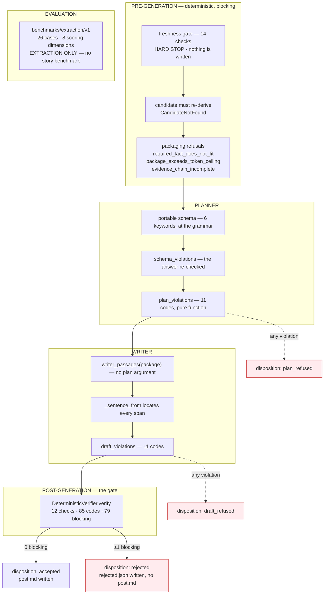
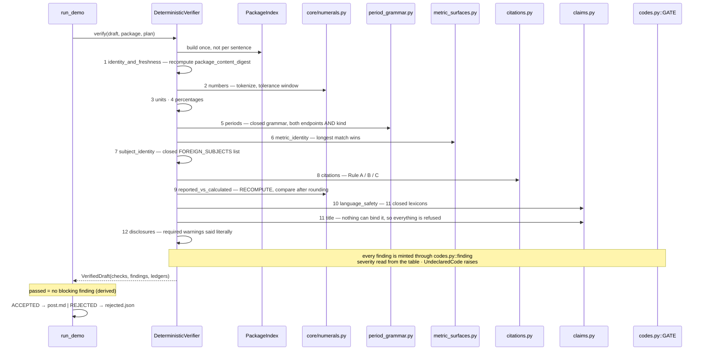

# 03 — Gates, Verification and Tests

**Audit date:** 2026-08-13. **Code baseline:** commit `33b0d7f`.

> **This document is the `33b0d7f` record and is preserved as one.** Two features landed after
> it — S12 (a second model provider) and S13 (deterministic fact tools) — and a subsection whose
> *contract* they changed carries a **Superseded** banner pointing into §15, which is dated
> separately. Measurements below were taken on 2026-08-13 and are not restated.

> ### Read this first — the working tree moved during the audit
>
> `git status` was clean at session start. By 14:00 a **concurrent session** on the same working
> tree was landing the table-cell-citation work (`story/core/models.py` +260 lines, `TableCellRef`
> and `evidence_handle`, `PACKAGE_VERSION` 1.2.0 → 1.3.0, plus new fixtures and a new test file).
> Three identical offline runs over half an hour returned **18 → 6 → 3** failures as that work
> landed.
>
> That work was committed at the end of the audit window as **`d317a3d`**, so the delta this
> document excludes is exactly `git diff 33b0d7f d317a3d`.
>
> Every code reference in this document is to **commit `33b0d7f`**, extracted with `git archive`
> into a scratch directory and read there. The test numbers in §12 are reported for both the clean
> commit and the moving working tree, labelled.

---

## 1. The answer first

> **Superseded at `ff3b08f`** — The gate table now holds **102** codes, **96** of them blocking, and a `calculated` sentence's number is computed by code rather than declared by the model. See §15.

| Question | Answer |
| --- | --- |
| How many gate codes? | **85**, in one table: **79 REFUSE, 4 ANNOTATE, 2 WARN** |
| How many checks run per draft? | **12** |
| Is a failing post rejected, retried, rewritten or flagged? | **Rejected. Never retried, never rewritten. Stored in full, with the manifest last.** |
| Does a model verifier exist? | **No — not advisory, absent entirely.** |
| Can a check weaken itself? | **No.** Severity is unreachable from any call site; every finding is built through one table lookup, and an undeclared code raises rather than defaulting. |
| Is the causal lexicon what you would expect? | `because`, `caused`, `drove`, `led to` are in it. **`suggests`, `may`, `could` are not.** |
| Is there a story-agent benchmark? | **No.** The only benchmark in the repository is `benchmarks/extraction/v1/`. |

---

## 2. The five phases

> **Superseded at `ff3b08f`** — There are **six** phases: a **DERIVATION** stage runs between PLANNER and WRITER (`story/pipeline.py:668`) and can end a run as `derivation_refused`. See §15.



**Nothing is retried at any arrow.** A schema violation is the model's answer, not a transport
fault, and re-asking at temperature 0 returns the same thing while charging for it twice.

---

## 3. Pre-generation gates

### 3.1 The freshness gate — 14 checks, hard stop

`story/stages/freshness/gate.py::check_freshness`. Returns a `FreshnessReport`; it **never raises
for staleness** — a broken query propagates, a stale graph is reported.

| # | Check | What it compares | Refusal code |
| --: | --- | --- | --- |
| 1 | `graph_manifest` | requested `graph_run_id` vs the manifest's | `graph_manifest_unreadable` |
| 2 | `extraction_run_directory` | the directory exists | `extraction_run_directory_missing` |
| 3 | `package_input_digest` | `sha256(run.complete)` vs the manifest's `run_complete_sha256` | `package_input_digest_mismatch` |
| 4 | `extraction_run_contents` | **every file `run.complete` lists, re-hashed** | `package_input_digest_mismatch` |
| 5 | `graph_reachable` | driver handshake | `graph_unreachable` |
| 6 | `load_marker_present` | exactly one `(:GraphLoad)` | `load_incomplete` |
| 7 | `load_status_complete` | the marker's `status == "complete"` | `load_incomplete` |
| 8 | `load_marker_graph_run_id` | the marker's run id | `graph_run_id_mismatch` |
| 9 | `node_graph_run_id` | distinct run id over all nodes | `graph_run_id_mismatch` |
| 10 | `edge_graph_run_id` | distinct run id over all edges | `graph_run_id_mismatch` |
| 11 | `observation_graph_run_id` | distinct run id over `:Observation` | `graph_run_id_mismatch` |
| 12 | `load_marker_counts` | the marker's counts vs the export | `count_mismatch` |
| 13 | `loaded_element_counts` | counted now vs the export | `count_mismatch` |
| 14 | `node_ontology_definition_hash` | loaded nodes' hash vs a **freshly loaded** ontology | `ontology_hash_mismatch` |

**Failure behaviour: hard stop.** `resolve_demo_inputs` raises `FreshnessRefused` before any
retrieval; `run_demo` **re-asserts it at its own door** — *"this function is separately callable —
and 'the gate ran before the model did' is the guarantee §7 exists for."* Nothing is written and no
directory is created: *"A refusal is not a result."*

Two design points worth surfacing:

* `FreshnessReport.passed` is **derived, and empty is not passing**: `bool(self.checks) and
  all(...)`. The comment names the failure mode — *"an empty `all()` is `True` — the one way a
  report of no checks could authorise a story run."*
* Check 4 exists because hashing the marker alone was measured insufficient: *"overwriting
  `claims.jsonl` leaves the marker byte-identical and the gate silent — measured, before the fix,
  as `passed=True codes=[]` against a `claims.jsonl` replaced with eight bytes."* Unlisted files
  are deliberately *not* a refusal, and that decision is documented.

Cost measured: 113–136 ms on `/mnt/c` (WSL drvfs), 9–22 ms on a native Linux filesystem, for 10
files / 33 MB.

### 3.2 Graph load verification — a separate mechanism

`graph/stages/load/verification.py` (1,294 lines) runs after a graph load, **not in the story
path**. 27 checks; see `01-GRAPH-CONSTRUCTION-AND-SCHEMA.md` §13.1.
`VerificationReport.passed` is likewise **derived, not stored** — *"a report cannot claim success
while carrying a failure — the state is not representable."*

### 3.3 Provenance and evidence-completeness warnings

`story/stages/packaging/warning_codes.py` — **30 codes**:

| Severity | Count | | Kind | Count |
| --- | ---: | --- | --- | ---: |
| WARN | 14 | | `claim_qualifying` | 16 |
| ANNOTATE | 8 | | `build_provenance` | 14 |
| REFUSE | 6 | | | |
| ADVISORY | 2 | | | |

The `KIND_OF` split is load-bearing and was added after a measured failure: the first end-to-end
run had *five of nine blocking findings* demanding that an investor post write sentences about
`token_budget_trimmed`, `section_truncated`, `subject_identity_not_read_from_graph`,
`evidence_sources_absent_in_v1` and `relationships_unavailable_in_v1`. `KIND_OF` is **derived**
from `CATEGORY_OF` rather than being a second independent table, *"because two independent tables
over one code set can disagree, and the disagreement would be silent."*

The six REFUSE codes are the packaging-stage gates: `entity_unresolved`,
`observation_load_incomplete`, `package_exceeds_token_ceiling`, `required_fact_does_not_fit`,
`evidence_chain_incomplete`, `comparison_refused`.

### 3.4 "Unsupported story" rejection — where it actually lives

There is **no single "is this story supported" gate**. The claim is decomposed:

* **The candidate must re-derive** — `pipeline.py::select_candidate` raises `CandidateNotFound`
  rather than falling back, because *"a candidate id digests its detector version, its policy
  version and its anchor observations, so an id that no longer reproduces means one of those
  moved."*
* **Absence claims are refused outright** — `story/stages/verification/claims.py::_absence_finding` →
  `absence_not_provable_from_bounded_package`, because the package caps `facts[]` at twelve and
  *"its coverage can never establish that a metric was not reported."*
* **An empty metric is refused** — `unpopulated_metric`. Motivated by the measured trap that
  `revenue` has 170 `CONCERNS_METRIC` edges, which *"are 170 places revenue was refused."*

---

## 4. Planner validation

Two layers:

1. **Schema, at the grammar** — `planner_schema(causal_language=…)`, validated *before* the request
   by `story/providers/portable_schema.py::validate_portable_schema`, and the answer re-checked by
   `schema_violations`.
2. **Rules, as code after the call** — `planner.py::plan_violations`, a pure function.

### 4.1 The portable-schema subset

Six keywords only: `type`, `required`, `properties`, `additionalProperties`, `enum`, `items`. The
recorded rationale: *"llama.cpp converts the JSON Schema to a GBNF grammar and **skips unsupported
keywords silently**"* — so `minimum`, `pattern`, `anyOf`, `$ref`, `prefixItems` and `minItems` are
refused at build time rather than silently ignored. `description` and `title` are **also** refused,
with the judgment recorded: *"permitting keywords one at a time because they seem harmless is
exactly how the list stops being a list."*

Three structural rules: every object declares `additionalProperties: false`; **every property is
`required`** (*"an optional property is one the model silently omits on the hard cases"*); `enum`
is a non-empty list. `null` is deliberately absent from `PORTABLE_TYPES`.

This subset is exactly why the eleven planner and eleven writer violation codes must exist as
code: `minItems` is unavailable, so "counterpoints must be non-empty" cannot be expressed to the
grammar at all.

### 4.2 Planner violation codes (11)

> **Superseded at `ff3b08f`** — **Twelve** codes — `derivation_not_offered` joined them at `story/stages/generation/planner.py:153`. See §15.

| Code | Meaning |
| --- | --- |
| `unresolvable_fact_id` | a `required_fact_id` not in the package |
| `unresolvable_passage_id` | a passage id not in the package |
| `counterpoint_missing` | the package has counter-evidence and the plan has no counterpoint |
| `counterpoint_ungrounded` | a counterpoint names no id drawn from `counter_evidence` |
| `counter_evidence_unaccounted` | a counter-evidence item neither used nor listed unusable |
| `unknown_warning_code` | `required_warnings` names a code the package does not carry |
| `unknown_unusable_id` | `unusable_evidence` names a non-item |
| `causal_language_not_computed` | the plan's `causal_language` ≠ what code computed |
| `thesis_empty` | no thesis |
| `no_key_points` | no key point |
| `plan_not_constructible` | the frozen types will not hold the answer |

### 4.3 What the model is not allowed to decide

`editorial_plan_from` sets **four fields from code, never from the model**: `candidate_id`,
`package_id`, `prompt_version`/`model_id`, and `causal_language`. The last is the important one:
`causal_language_for(package)` scans the package's *cited spans* for unnegated markers and pins the
schema enum to the result. **The model's own value is not read at all** — *"reading it back would
make the field the model's on the day the grammar is wrong."*

`claim_qualifying_warnings` narrows the model's `required_warnings` by dropping this package's
`BUILD_PROVENANCE` codes — **filtered, not refused**, and only for codes the package actually
declares as provenance, so an invented code still hits `unknown_warning_code`.

### 4.4 Retry behaviour — none

`EditorialPlanRejected` is *"deliberately not a `StoryProviderError`"* and deliberately not
retried: *"at temperature 0 the same request returns the same plan."* A schema violation raises
`StoryProviderSchemaError` and is likewise never retried.

### 4.5 One hole left open on purpose

Nothing refuses a plan that *both* uses a counter-evidence item *and* lists it in
`unusable_evidence` — observed live on 2026-08-04 with the model citing a passage in its
counterpoint while declaring it `immaterial_at_stated_precision`. Recorded rather than enforced.

---

## 5. Writer validation

### 5.1 The passage-slice rule

`writer_passages(package)` **takes no plan argument at all** — the writer's citable universe is
*every passage a packaged fact was read from*, derived by code, so *"one model cannot filter the
next model's universe."* `draft_violations` defaults `passages` to that same slice *"so a caller
cannot widen the citable set by passing a longer list than the writer was shown."*

### 5.2 Spans are located by code, not counted by the model

> **Superseded at `ff3b08f`** — The schema no longer asks for a citation `quote`; a citation is one `evidence_id` token and code resolves the span behind it. The `rendered` half of this rule is unchanged. See §15.

The schema asks for the **exact substring** (`rendered` for a binding, `quote` for a citation) and
`_sentence_from` locates it — *once, deterministically, refusing a substring that occurs twice
rather than choosing between the occurrences*. Stated consequence: a draft leaving this module
*can never* fail the verifier's `binding_span_does_not_match_text` or
`citation_span_not_in_passage`, because it is refused here first.

Sentence indexes are positional and set by code — *"a model that numbered its own sentences would
eventually skip one and make every §13 finding unaddressable."*

### 5.3 Writer violation codes (11)

> **Superseded at `ff3b08f`** — **Twelve** codes: `more_than_one_calculation` was retired and two evidence-handle codes were added. See §15.

| Code | Meaning |
| --- | --- |
| `unresolvable_fact_id` | a binding or calculation input not in the package |
| `unresolvable_passage_id` | a citation outside the writer's own slice |
| `binding_rendering_not_in_text` | `rendered` absent from its own sentence |
| `binding_rendering_ambiguous_in_sentence` | `rendered` occurs more than once — no ground for choosing |
| `citation_quote_not_in_passage` | the quote is absent from the passage |
| `citation_quote_ambiguous_in_passage` | the quote occurs more than once (**523 measured corpus quotes do**) |
| `more_than_one_calculation` | the schema array is how the portable subset spells "optional", not a licence for two |
| `thesis_abandoned` | the draft binds no fact the plan's key points named |
| `no_sentences` | empty draft |
| `plan_names_another_package` | refused **before the provider is touched** |
| `draft_not_constructible` | the frozen types will not hold it |

### 5.4 What the writer deliberately does not check

Percentage-point surfaces, causal language, superlatives, period grammar, metric ambiguity,
calculation recomputation, required warnings, counterpoint survival — all the verifier's.
`story.stages.verification` is **not importable here**
(`test_no_stage_imports_another_stage`). The reason is recorded: *"Re-implementing a weaker copy
of a §13 check here would create a second authority that could disagree with the first."*

---

## 6. The deterministic verification gate

`story/stages/verification/`, 8 modules, 3,767 lines.

| Module | Lines | Responsibility |
| --- | ---: | --- |
| `deterministic.py` | 1,806 | ten of twelve checks, plus assembly |
| `claims.py` | 697 | what a sentence may assert |
| `citations.py` | 490 | the three citation rules |
| `language.py` | 415 | the closed lexicons |
| `period_grammar.py` | 328 | the closed period grammar |
| `codes.py` | 306 | the gate table |
| `metric_surfaces.py` | 256 | the alias index |
| `package_index.py` | 183 | lookups over one package, derived once |

### 6.1 The architectural guarantee

`DeterministicVerifier` is constructible with **nothing** — no database, no model provider, no
filesystem, no clock. From `story/stages/verification/__init__.py`:

> *"That is not a convenience for testing; it is what lets §13.16's rule — 'the model may only
> tighten, never loosen' — be true by construction, **because there is no seam here for a model to
> reach through**."*

**Severity is never chosen at a call site.** Every finding is built through `codes.py::finding`,
which reads the gate table. The reason: *"A check that passed `Severity.WARN` at its own call site
could weaken itself to make a demo accept … here, weakening a code is a one-line diff to a table
with the plan section beside it."* `codes.py::UndeclaredCode` is raised rather than defaulting to
REFUSE, because *"a code with no declared severity is a check nobody put through §13.17, and
defaulting it would make the gate's closure unverifiable."* `GATE` is built from a tuple and
**raises `ValueError` on a duplicate code at import time**.

And from `deterministic.py` itself: *"**What makes the demo claim trustworthy is that this file
cannot be talked out of a refusal.**"*

### 6.2 The twelve checks

> **Superseded at `ff3b08f`** — Still twelve checks, but check 9's shape moved and checks 2, 8 and 9 mint codes this table does not count. See §15.

| # | Check | Purpose | Implementation | Pass condition | Failure behaviour |
| --: | --- | --- | --- | --- | --- |
| 1 | `identity_and_freshness` | draft/plan/package identity; recomputed package digest; graph-run pinning; every binding id resolves | `deterministic.py::DeterministicVerifier._check_identity` | ids equal, digest recomputes, every `fact_id` in `facts[]` | 8 REFUSE codes |
| 2 | `numbers` | every numeral covered; every bound numeral inside the tolerance window | `._check_numbers`, `._binding_number_findings` | `‖V_draft\|−\|V_fact‖ ≤ 0.5×10^(e−d+1)` | REFUSE ×5, WARN ×1 |
| 3 | `units` | surface unit vs fact unit; currency; change-surface on a level | `._check_units` | `SURFACE_UNITS[token.unit] == fact.unit` | REFUSE ×3 |
| 4 | `percentages` | change ambiguity, required surface, across-zero, reported-vs-calculated | `._check_percentages`, `._across_zero_findings`, `._reported_change_findings` | declared operation + required surface marker | REFUSE ×5 |
| 5 | `periods` | the declared surface resolves in the closed grammar and equals the fact on **both endpoints and kind**; prose period grounded | `._check_periods`, `._calculation_period_findings`, `._period_grounding_findings` | `_endpoints_agree` | REFUSE ×6 |
| 6 | `metric_identity` | the surface resolves to exactly the bound metric; prose names it | `._check_metric_identity`, `._metric_grounding_findings` | `fact.metric_id in resolution.metric_ids` | REFUSE ×6 |
| 7 | `subject_identity` | no foreign subject; an unresolved entity only as verbatim `entity_text` | `._check_subject_identity` | no `FOREIGN_SUBJECTS` hit | REFUSE ×2 |
| 8 | `citations` | Rule A reconstruction / Rule B containment / Rule C refusal; reuse; uncited claims | `._check_citations` → `citations.py::check_sentence_citations` | see §6.4 | REFUSE ×11, WARN ×1, ANNOTATE ×1 |
| 9 | `reported_vs_calculated` | kind/calculation coherence, input resolution, comparability, formula window, **recomputation** | `._check_reported_vs_calculated`, `._calculation_findings`, `._recompute_findings` | `matches_at_printed_precision(computed, token.value, decimals)` | REFUSE ×9 |
| 10 | `language_safety` | causation, superlative, comparative, absence, temporal, forward-looking, connective no-claim | `claims.py::check_language` | see §8 | REFUSE ×17 |
| 11 | `title` | the title carries no binding, so every construction is refused unconditionally | `claims.py::check_title` | no numeral outside a package period key; no lexicon hit | REFUSE ×6 |
| 12 | `disclosures` | required warnings said literally; counterpoints survived; warned observations; conflicts | `._check_disclosures`, `._conflict_findings` | the phrase is present in the joined draft text | REFUSE ×4, ANNOTATE ×3 |

`CheckResult.outcome` is **derived from `examined` and `findings`**, so a draft with no numeric
sentences reports `numbers: NOT_APPLICABLE`, never `numbers: PASS`.

### 6.3 The full code table — 85 codes

> **Superseded at `ff3b08f`** — **102 codes: 96 REFUSE, 4 ANNOTATE, 2 WARN.** Seventeen were added and none removed; the WARN pair and the ANNOTATE four are unchanged. See §15.

Measured by importing `story.stages.verification.codes.GATE`:

```text
total 85   Counter({'REFUSE': 79, 'ANNOTATE': 4, 'WARN': 2})   blocking: 79
```

| Section | Codes | Count |
| --- | --- | ---: |
| **§13.13 identity & run consistency** | `candidate_id_mismatch`, `package_id_mismatch`, `graph_run_id_mismatch`, `graph_input_digest_mismatch`, `package_content_digest_mismatch`, `plan_names_another_package`, `fact_not_in_package`, `citation_not_in_package`, **`warned_observation_used`** (ANNOTATE) | 9 |
| **§13.1 numbers** | `unbound_numeral`, `binding_span_does_not_match_text`, `binding_rendering_is_not_one_numeral`, `number_outside_tolerance`, `sign_disagreement`, **`over_precision`** (WARN) | 6 |
| **§13.2 units** | `unit_mismatch`, `currency_symbol_on_non_monetary_unit`, `monetary_unit_without_currency` | 3 |
| **§13.3 percentages** | `percent_change_ambiguous`, `percentage_point_surface_missing`, `percent_change_reported_not_calculated`, `relative_change_across_zero`, `calculation_result_surface_mismatch` | 5 |
| **§13.4 periods** | `period_unresolvable`, `period_mismatch`, `period_shape_conflated`, `incomparable_periods`, `period_surface_absent_from_text`, `period_named_in_text_contradicts_binding` | 6 |
| **§13.5 metric identity** | `metric_surface_unresolved`, `metric_surface_ambiguous`, `metric_binding_mismatch`, `mutually_distinct_group_ambiguity`, `metric_surface_absent_from_text`, `metric_named_in_text_contradicts_binding` | 6 |
| **§13.6 / §13.11 subject** | `foreign_subject_named`, `unresolved_entity_named` | 2 |
| **§13.7 citations** | `citation_span_not_in_passage`, `citation_quote_not_in_passage`, `table_quote_does_not_reconstruct`, `citation_does_not_support_fact`, `citation_reused_for_unrelated_claim`, `row_label_not_licensed_for_metric`, `column_label_ambiguous_in_passage`, **`column_label_ambiguity_classified`** (ANNOTATE), `narrative_span_missing_number`, **`paraphrase_distance`** (WARN), `counter_evidence_cited_as_support`, `evidence_kind_not_supported_in_v1`, `uncited_factual_sentence` | 13 |
| **§13.8 events** | `event_property_bound_as_fact`, `date_not_in_package`, **`event_review_flag`** (ANNOTATE) | 3 |
| **§13.9 reported vs calculated** | `calculated_sentence_cites_passage`, `calculated_sentence_without_calculation`, `reported_sentence_carries_calculation`, `calculation_inputs_unresolved`, `calculation_inputs_incomparable`, `calculation_does_not_recompute`, `calculation_operation_not_supported`, `operation_not_recomputable`, `formula_version_not_valid_for_period` | 9 |
| **§13.10 causation** | `causal_construction_forbidden`, `causal_attribution_frame_missing`, `causal_marker_not_in_cited_span`, `causal_marker_negated_in_span`, `causal_marker_ambiguous_in_span`, `causal_frame_document_mismatch` — **no WARN tier** | 6 |
| **§13.12 conflicts** | `conflict_not_disclosed`, **`conflict_immaterial_at_stated_precision`** (ANNOTATE) | 2 |
| **§13.14 numeral-free sentences** | `connective_sentence_carries_a_claim`, `unsupported_superlative`, `unsupported_comparative`, `unsupported_absence_claim`, `unsupported_temporal_ordering`, `extremum_recomputation_failed`, `extremum_expression_not_supported`, `comparative_recomputation_failed`, `comparative_not_supported_by_text`, `unpopulated_metric`, `absence_not_provable_from_bounded_package` | 11 |
| **§13.15 forward-looking** | `forward_looking_language` — unconditional | 1 |
| **§11 / §13.17 disclosures** | `required_warning_absent`, `required_warning_has_no_declared_qualifier`, `required_counterpoint_absent` | 3 |

The plan named **three** ANNOTATE codes; `column_label_ambiguity_classified` is the documented
deliberate fourth, added because the escape hatch it belongs to *"is worthless without it."*
`codes.py`'s docstring names all seven extensions to the plan's enum individually, each with its
reason — **the gate does not quietly exceed its specification**.

### 6.4 The citation rules

* **Rule A** (table facts, non-explanatory sentences) — five steps, four owned in `citations.py`:
  the quote must be verbatim in the passage; `reconstruct_table_quote(quote, scale, unit) == value`
  compared **after rounding to 6 dp, never by equality** (`15.9` is stored `15.899999999999999`);
  the row label licensed through the alias index; the column label resolving to one `period_key`
  *within this passage*.
* **Rule B** (narrative / explanatory) — the quote must be inside the *cited span* (not the whole
  passage), the span must carry the number at the numeric tolerance, and lexical grounding
  produces a WARN.
* **Rule C** — an `EvidenceSourceCitation` is refused outright: *"An unimplemented rule that
  silently passes is worse than one that refuses."*
* **Reuse** — fires on the **second** use of an identical span only when this sentence binds no
  fact that passage evidences. *"Reuse alone is not the offence."*
* `cited_span` rebases citation offsets against `PackagedPassage.char_start` and returns `None`
  when the span falls in the part the ±400-char budget cut.

Measured justifications carried in the code: 2,690 table observations with `quoted_text` of
**median 4 characters**; **179 of 485** `(passage_id, column_label)` pairs map to more than one
`period_key`, covering **61.3%** of observations; **523** `quoted_text` strings occur more than
once inside their own passage.

### 6.5 The decision

> **Superseded at `ff3b08f`** — **Six** dispositions, not four: `DERIVATION_REFUSED` and `PROVIDER_FAILED` joined them. The decision line itself is unchanged. See §15.

**Rejected, never retried, never rewritten — and stored anyway, in full.** One line,
`story/pipeline.py::run_demo:434`:

```python
disposition = ACCEPTED if verified.passed else REJECTED
```

`VerifiedDraft.passed` is derived from the findings, and a finding's `blocking` comes from the gate
table, not the call site. **One REFUSE refuses the draft.**

Four dispositions, not two: `ACCEPTED`, `REJECTED`, `PLAN_REFUSED`, `DRAFT_REFUSED` — *"§11 and
§12 can each refuse before §13 runs, and folding those into `rejected` would report 'the verifier
rejected this draft' about a draft the verifier never saw."*

**No rewrite loop exists.** `Remedy` values (`REBIND_TO_FACT`, `NARROW_METRIC_SURFACE`,
`DROP_SENTENCE`, …) are *reported* in the rejection artifact; **nothing consumes them.**

**Artifact behaviour.** A rejected run writes `candidate.json`, `evidence_package.json`,
`editorial_plan.json`, `draft.json`, `verification_report.json`, `rejected.json`,
`generations.jsonl`, then `demo_manifest.json` **last as the completion marker**. `post.md` is
written **only** on acceptance and `rejected.json` **only** on non-acceptance, so *"the two can
never both be present and a reader can tell the disposition from the file listing alone."*

`story/stages/verification/__init__.py::rejection_for` raises `DraftAccepted` if called on a passing
verification — *"a rejection with no blocking finding is an acceptance written into the wrong
directory."* It carries the checks **whole**, WARNs and ANNOTATEs included, because *"a rejection
that dropped its WARNs and ANNOTATEs would be a report of the draft's worst sentence instead of a
report of the draft."*

**Nothing is written to Neo4j or to any authoritative catalog** — *"no generated prose in
`data/extraction_runs/`, none in `data/graph_runs/`, none in the graph."*

### 6.6 The gate sequence as a diagram



---

## 7. Model verifier

**No model verifier exists in the running system.** Not advisory-only — **absent entirely**.
Every hit for "advisory verifier" is in `plans/` or in a docstring explaining the absence.

The authoritative statement is `story/pipeline.py:23`:

> *"Model-assisted factual authority: §13's deterministic layer is the only authority here and §8b
> dropped S10's advisory verifier entirely."*

Corroborated by `plans/llm-agent/IMPLEMENTATION_STEPS.md:900` (*"dropped entirely — S10 advisory
verifier"*) and `:923` (*"dropping S10 costs the demo claim nothing: S10 was always advisory and
explicitly could never override a deterministic verdict"*), and by
`story/contracts.py::DraftVerifier`'s docstring (*"The deterministic layer is the final authority;
the model may only tighten, which is a property of the implementation and not something a protocol
can state."*).

**So the earlier belief that the model verifier is advisory rather than authoritative is not merely
still true — it understates the current position.**

Two consequences are visible in code and carried honestly:

* `citations.py::_rule_b` — `paraphrase_distance` is a WARN that escalates to a stage *"this demo
  path does not build, so the WARN is carried into the accepted artifact and acknowledged there
  rather than adjudicated."*
* Causation has **no WARN tier and no model backstop** — recorded in the plan and in `codes.py`.

### 7.1 Why the two are separated — the code's own justification

1. `story/stages/verification/__init__.py` — the verifier is constructible with neither a database nor a model
   provider, and *"there is no seam here for a model to reach through."*
2. `codes.py` — severity is a table, not a call-site argument, so a check cannot weaken itself to
   make a demo accept.
3. `deterministic.py` — *"this file cannot be talked out of a refusal."*

### 7.2 The one advisory mechanism that does exist — and it is not a verifier

`story/demo_ui/prompt_presets.py` carries a scan over user-typed prompt-preset text:
`ADVISORY_PHRASES`, **14 phrases**, each mapping to the gate code that actually refuses the thing
being asked for. `Advisory.as_dict()` emits `"severity": "advisory", "blocks": False`, and
`ADVISORY_DISCLAIMER` is a **required field of the payload, not a tooltip**:

> *"This is a fourteen-phrase heuristic over your own text, and it is trivially evaded. It is not
> the safety boundary and it blocks nothing. The deterministic verifier is the boundary: it runs on
> the server after generation, over the finished draft, regardless of what any prompt asked for."*

The module records why it is deliberately small: *"An exhaustive jailbreak filter would be a claim
of authority this layer does not have."*

---

## 8. Causal language and claim classes

`language.py` **makes no decision** — it finds a construction and says where. `claims.py` decides.
*"Keeping the two apart is what lets `deterministic.py` read as the gate rather than as a regex
file."*

### 8.1 The actual word lists, measured by import

**`CAUSAL_MARKERS` (22)** — of the words the audit brief asked about: **`because`, `because of`,
`caused`, `caused by`, `drove`, `led to` ARE present; `suggests`, `may`, `could` are NOT.**

```text
because of · because · caused by · caused · due to · as a result of · attributable to ·
attributed to · drove · led to · resulted in · stemmed from · contributed to · owing to ·
was impacted by · is why · explains · reflects · reflecting · thanks to · the driver of ·
on the back of
```

| Lexicon | Size | Contents / note |
| --- | ---: | --- |
| `CAUSAL_MARKERS` | 22 | above |
| `ATTRIBUTION_FRAMES` | 12 | `the company said/stated/disclosed`, `management attributed/said/stated`, `the filing states/stated`, `according to the 10-k / 10-q / shareholder letter / earnings release` |
| `FRAME_DOCUMENT_TYPES` | 6 | maps a frame's noun to the `document_type` it commits to; a frame naming no document commits to none |
| `NEGATION_TOKENS` | 5 | `not`, `no`, `never`, `rather than`, `other than` |
| `SUPERLATIVE_TERMS` | 14 | `only, sole, first, last, never, always, unprecedented, worst, best, largest, smallest, record, peak, trough` |
| `COMPARATIVE_TERMS` | 52 | the plan's eleven plus **41 measured on** after `exceeded`, `surpassed`, `topped`, `beat`, `outperformed` each *"passed as an inverted comparison before it was listed"* |
| `COMPARATIVE_DIRECTION` | 52 | a polarity map that must be **total** over the terms. **Verified total in this audit: 52/52.** A term with no polarity resolves to `None` and *"a caller must refuse on it rather than assume a direction"* |
| `STATE_TERMS` | 58 | read only inside a `connective` sentence; deliberately includes the copulas — *"naming a metric and saying it **was** anything is a claim"* |
| `ABSENCE_TERMS` | 6 | `has not, have not, did not, no longer, has yet to, remains the only` |
| `TEMPORAL_TERMS` | 5 | `before, after, until, since, by the time` — exempt inside a declared period surface |
| `FORWARD_LOOKING_TERMS` | 15 | `expects, expect, guidance, outlook, forecasts, forecast, targets, anticipates, anticipate, projects, will be, on track to, guided to, plans to reach, full-year target` — **unconditional refusal today**, because all 2,704 observations are `assertion_type: reported` |
| `FOREIGN_SUBJECTS` | 16 | `zillow, offerpad, redfin, compass, anywhere real estate, realogy, rocket companies, the s&p 500, the s&p, the nasdaq, the dow, the index, the market, the industry, peers, competitors` — a closed list rather than a heuristic, because *"capitalisation would refuse 'Adjusted EBITDA' and a named-entity model would put a model inside a deterministic check"* |
| `CONNECTIVE_LEXICON` | 35 | stopwords, deliberately short: *"a long stop list is how paraphrase distance stops measuring anything"* |
| `OPERATION_INPUTS` | 11 | operations with arity bounds |
| `DECLARED_AMBIGUOUS` | 8 | metric surfaces that may never resolve uniquely |

A recorded oddity worth knowing: the bare noun `"drop"` is **deliberately absent** from
`STATE_TERMS` while `"dropped"` is present, because the read-only Cypher scan reads every string
constant in `story/` case-folded against the Cypher keyword list and `"drop"` is `DROP`.

### 8.2 How the classes are distinguished

There is **no observed / correlation / interpretation / hypothesis taxonomy as such.** The
distinction is structural — `SentenceKind` × the declared machinery:

| Class | How it is distinguished | The rule applied |
| --- | --- | --- |
| **Observed fact** | `kind=reported` + `fact_bindings` + a citation | number, unit, period and metric all checked against the package |
| **Derived quantity** | `kind=calculated` + a `Calculation` + **no** passage citation | recomputed from the inputs |
| **Interpretation / paraphrase** | `kind=explanatory` | Rule B lexical grounding; `paraphrase_distance` WARN |
| **Structure only** | `kind=connective` | **no claim at all** — a metric plus a state term is a refusal |
| **Causal claim** | any causal marker | permitted ONLY as `explanatory` + a passage citation + a frame + six conditions |
| **Hypothesis / forward-looking** | `FORWARD_LOOKING_TERMS` | refused unconditionally |
| **Correlation** | *not modelled as a class* | a comparison is `compare_levels`/`compare_deltas`, recomputed; anything else is refused |

**Causation — the six conditions:**

1. `kind` must be `explanatory` **and** carry a passage citation, else
   `causal_construction_forbidden` for *every* marker. *"LLM-originated causation is banned
   unconditionally."*
2. An attribution frame must be in **the sentence itself** — a frame in the passage is the filing's
   voice, not the post's → `causal_attribution_frame_missing`.
3. The marker must occur **inside the cited span**, not the whole passage →
   `causal_marker_not_in_cited_span`. *"Passages run to thousands of characters and whole-passage
   containment would let any marker license any claim."*
4. The frame's noun must match the cited document's type → `causal_frame_document_mismatch`.
5. The marker must not be negated **within its own clause** → `causal_marker_negated_in_span`.
   **37 passages measured** carry constructions like *"not as a result of any general
   solicitation"*, each satisfying conditions 1–4 while the filing asserts the opposite.
6. Two of the plan's conditions **could not be implemented as written** — `DraftSentence`,
   `FactBinding` and `Calculation` carry no cause-term, effect-term or marker-occurrence selector.
   The conservative closure: **a span with more than one causal marker is refused outright** →
   `causal_marker_ambiguous_in_span`. **367 passages carry two or more markers**, so this refuses
   real sentences and *"never accepts a false one, which is the direction §13.14 says the failure
   should point."*

**A clause-boundary subtlety worth flagging.** `language.py::_CLAUSE` is
`r"[,;:()—–]|\.(?!\d)|(?<!\d)\.|\band\b|\bbut\b"` — the `.` may not sit between two digits. The
measurement behind it: *"The GAAP Gross Margin was **not** 15.9 percentage points lower…"* — the
`.` inside `15.9` opened a new clause between `not` and `lower`, so `negated()` returned `False`
and the inversion **passed**.

### 8.3 Representative tests

| Test | File:line | What it proves |
| --- | --- | --- |
| `test_a_span_carrying_two_causal_markers_is_refused_because_the_binding_cannot_choose` | `tests/story/test_story_deterministic_verifier.py:1077` | the condition-6 closure |
| `test_a_negated_causal_construction_in_the_span_is_refused` | `:1101` | condition 5 |
| `test_malicious_unsupported_because_is_caught_by_the_causation_ban` | `:1252` | unconditional causation ban |
| `test_forward_looking_language_is_an_unconditional_refusal_today` | `:1119` | §13.15 |
| `test_malicious_invented_connective_sentence_is_caught_by_the_no_claim_rule` | `:1319` | connective no-claim |
| `test_a_comparative_outside_the_old_lexicon_no_longer_walks_around_the_check` | `:1536` (parametrized over `exceeded, surpassed, topped, beat, outperformed`) | the measured lexicon escape |
| `test_a_comparative_whose_sentence_reverses_its_own_calculation_is_refused` | `:974` | `comparative_not_supported_by_text` |
| `test_malicious_only_negative_margin_ever_is_caught_without_carrying_a_numeral` | `:1263` | a superlative carrying no numeral |
| `test_the_same_uniqueness_claim_dressed_as_an_extremum_dies_on_recomputation` | `:1280` | `extremum_recomputation_failed` |
| `test_a_superlative_smuggled_into_the_title_is_refused_because_nothing_can_bind_it` | `:1370` | the title hole |

---

## 9. Numbers, periods, citations

### 9.1 Numbers

**The corrected tolerance.** The plan's stated formula and its own worked case disagreed about
sign. The code implements the worked case: **magnitudes are compared**,
`‖V_draft| − |V_fact‖ ≤ 0.5 × 10^(e−d+1)`, and **sign agreement is a separate signal applied only
when the numeral itself carried a sign**. The measurement that forced it: written the naive way it
fails **all 825 negative-valued observations** in the corpus — *"a loss of $27.1 million"* puts the
sign in a word the tokeniser does not read.

**The rule the module exists to keep: never multiply by the fact's `scale`.** Corpus values are
already canonical. Two asymmetric directions:

| Direction | Function | Rule |
| --- | --- | --- |
| prose → value | `tokenize_numerals` | reconstruct from sign, separators and **the magnitude word the writer typed only** |
| table cell → value | `reconstruct_table_quote` | the magnitude is *not* in a 4-character surface, so `scale` **is** applied |

Verified on **all 2,690 table observations**. The counter-example recorded: 4 narrative USD
observations carry `scale: millions` next to a full-sentence quote *"Adjusted EBITDA was $218
million"* — applying `scale` too yields 2.18e14.

**Over-precision compares against `EVIDENCED_BY.quoted_text`, not `printed_form`** — no
`:Observation` carries a `printed_form` at all, and one fact can have *two* printings
(`adjusted_ebitda 2020Q4` is quoted `"(27,075)"` in a thousands table and `"(27)"` in a millions
one). `compare_to_fact` therefore **takes the printed form as an argument and never guesses.**

**Recomputation compares after rounding, never by equality**, with real residues from the corpus:
`9.9 − 7.3 = 2.6000000000000005`, `13.2 − 9.9 = 3.299999999999999`,
`3.3 − 13.2 = −9.899999999999999`, and `15.9` stored as `15.899999999999999`.

`extremum`, `absence` and `temporal_order` are **refused as `operation_not_recomputable`**, because
the covering-span logic licensed their `result_rendered` while nothing ever recomputed one.

### 9.2 Periods

**A closed grammar, never a date parser.** Thirteen rule sources: worded and coded YTD (9M, 1H/6M,
first half), fiscal years, three quarter forms, four instant forms. **A bare `"2022"` is
deliberately not in the grammar** — it is the shape measured ambiguous on 61.3% of table
observations. `dateutil` would read `"the quarter"` as today and `"2022"` as 1 January.

The catastrophe it prevents, quoted: **188 `(metric, period_end)` pairs carry more than one
`period_key`**, and `adjusted_ebitda` ending `2022-09-30` is **+$183M for the nine-month YTD and
−$211M for the quarter**. Hence `_endpoints_agree` requires **exact equality on both endpoints AND
on kind**, and a shared anchor with a different window gets its own code, `period_shape_conflated`.

`period_grammar.scan` reads the *sentence* in two tiers: the grammar itself unanchored, then
`_DEICTIC_PERIOD`, the closed family of period-shaped phrases the grammar refuses. Within tier one
**the longest match wins and rule order does not** — `"fiscal 2022"` sits inside `"the third
quarter of fiscal 2022"`, and scanning in rule order read a true Q3 sentence as naming FY2022.

**A prior claim corrected in code rather than smoothed over.** An earlier round asserted the period
surface was already protected because periods contain numerals. `period_grammar.py`'s docstring
records: *"That is false, and it was false when it was written."* Measured against the demo's own
accepted draft at the earlier commit:

| prose | verdict then |
| --- | --- |
| *"…for the fourth quarter."* | **passed, zero findings** |
| *"…for the full year."* | **passed** |
| *"…for the most recent quarter."* | **passed** |
| *"…last quarter."* | refused, but only as `unsupported_superlative` on `last` |
| *"…for the fourth quarter of 2022."* | refused `unbound_numeral` — on the year |

**A deliberate asymmetry:** a sentence naming *no* period is left alone (a `scan` returning nothing
means no assertion was made), while a sentence naming *no* metric is
`metric_surface_absent_from_text`. *"A period is routinely carried by the paragraph … a metric name
is what a factual sentence is about, so its absence is a sentence about nothing."*

### 9.3 Metric identity

**Longest match is mandatory, not an optimisation**: `"gross margin" ⊂ "adjusted gross margin"`,
`"adjusted ebitda" ⊂ "adjusted ebitda margin"`, `"revenue" ⊂ "cost of revenue"`. A first-match
scanner assigns *"adjusted gross margin was 13.2%"* to `gaap_gross_margin`.

The index is built **from the package's `metrics[]`, not the ontology**, so the verifier stays
constructible with nothing — with the cost stated up front: the cap of eight metrics means a
surface ambiguous across the ontology's 26 could resolve uniquely inside a small package.
`DECLARED_AMBIGUOUS` (**8 surfaces**) closes it: `margin`, `gross margin`, `gross profit`,
`contribution`, `homes`, `contracts`, `under contract`, `inventory`. Note that
`gaap_gross_margin`'s own **label** is `"Gross Margin"`, so the natural surface is the ambiguous
one.

### 9.4 Table-cell citations — the in-flight repair

> **Superseded at `ff3b08f`** — The repair **landed**: `story/stages/verification/citations.py:86` imports `resolve_cell`. See §15.

`story/core/table_cells.py` (240 lines) is **new at commit `33b0d7f`** and provides `resolve_cell`,
`resolve_header`, `split_cells`, `CellOutOfBounds`.

**It is not yet wired into the verifier.** Nothing in `story/stages/verification/` imports it; at
that commit the only non-test importer is a docstring reference in `story/core/models.py`.

The motivating measurement, verified against the live graph:

| Quantity | Count | Share |
| --- | ---: | ---: |
| `EVIDENCED_BY` edges from `:Observation` | 2,704 | |
| …table-backed | 2,690 | 99.5% |
| …narrative | 14 | 0.5% |
| `quoted_text` occurring **exactly once** in its passage | 2,181 | 80.7% |
| `quoted_text` occurring **more than once** | **523** | **19.3%** |
| worst case | 32 occurrences | |

**The contradiction this closes:** `writer.py`'s `if len(occurrences) != 1:` refuses a quote it
finds twice, while the writer prompt instructs the model to quote exactly that text. *"The
instruction and the gate contradict each other; no model output satisfies both."* Affected metrics
include both demo candidates (`adjusted_gross_margin` 34/180, `adjusted_gross_profit` 24/172,
`market_count` 137/176).

The constraint that makes coordinates necessary rather than inferable, over all 2,690:

| Lookup | Holds |
| --- | ---: |
| `cells(lines[row_index])[value_column_index] == quoted_text` | 2,690 / 2,690 |
| `cells(lines[row_index])[0] == row_label` | 2,690 / 2,690 |
| `cells(lines[period_header_row_index])[period_header_column_index] == column_label` | 2,690 / 2,690 |
| `cells(lines[period_header_row_index])[`**`value_column_index`**`] == column_label` | **565 / 2,690** |

Reading the header at the value's own column index is **wrong 79% of the time**, and fails
*silently* because a `$` or empty spacer cell is a perfectly well-formed cell.

### 9.5 Observation equivalence

> **Superseded at `ff3b08f`** — *"Nothing in the corpus carries `percentage_points`"* is still true of **observations** and no longer true of a run: a `DerivedFact` may carry it. See §15.

One predicate, `same_reading(left, right)`, serving both corroboration and contradiction —
*"'are these the same number?' answered one way for corroboration and another way for contradiction
is the divergence R2b found once already."* It **owns no tolerance table**; it reads `series.py`'s,
giving three callers one table.

`PERCENT_FAMILY_UNITS` refuses `15.9%` against `15.9 percentage points` **with a reason of its
own** rather than a generic unit mismatch, because *"that specific confusion is the most likely
factual error this package can make."* Nothing in the corpus carries `percentage_points` today
(1,163 percent rows, no other percentage unit), so the guard is for the day a lane emits one —
*"which is exactly when the mistake would be invisible."*

---

## 10. Test inventory

### 10.1 By group

All commands assume the repository root. None uses the LLM unless marked; `live`-marked tests are
the only ones that do.

| Group | Path | Tests | Fixture / data | Model? | Neo4j? | Deterministic? | Command |
| --- | --- | ---: | --- | --- | --- | --- | --- |
| **Acquisition** | `tests/acquisition/` | 402 | real SEC slices under `tests/fixtures/` | no | no | yes | `pytest tests/acquisition -m "not live"` |
| ↳ live SEC | `tests/acquisition/integration/test_live.py` | 5 | the real SEC API | no | no | **no** | `pytest tests/acquisition/integration -m live` |
| **Extraction** | `tests/extraction/` | 1,359 | real corpus + `benchmarks/.../answers/*.jsonl` | replay | no | yes | `pytest tests/extraction -m "not live"` |
| ↳ benchmark integrity | `tests/extraction/test_benchmark_integrity.py` | **502** | `benchmarks/extraction/v1/cases/*.yaml` | no | no | yes | `pytest tests/extraction/test_benchmark_integrity.py` |
| ↳ live lanes | `test_*_live.py` (4 files) | 55 | the llama.cpp server | **yes** | no | no | `pytest tests/extraction -m live` |
| **Graph projection** | `tests/graph/test_{nodes,edges,derivation,evidence_*,keys,inputs}.py` | ~270 | the real extraction run | no | no | yes | `pytest tests/graph -m "not neo4j"` |
| ↳ determinism | `tests/graph/test_export_determinism.py` | 56 | re-projects the real run | no | no | yes (byte-identity) | `pytest tests/graph/test_export_determinism.py` |
| **Graph validation** | `tests/graph/test_graph_verification.py` | 67 | the live database | no | **yes** | yes | `pytest tests/graph/test_graph_verification.py` |
| ↳ lifecycle | `tests/graph/test_lifecycle.py` | 38 | the live database (**wipes**) | no | **yes** | yes | `FKG_GRAPH_TESTS_MAY_WIPE=1 pytest tests/graph/test_lifecycle.py` |
| **Retrieval** | `tests/story/test_story_retrieval{,_cypher}.py` | 517 | Cypher text + stubs | no | partly | yes | `pytest tests/story/test_story_retrieval*.py` |
| ↳ Neo4j adapter | `tests/story/test_story_neo4j_adapter.py` | 35 | the live database | no | **yes** | yes | `pytest tests/story/test_story_neo4j_adapter.py` |
| **Candidate generation** | `tests/story/test_story_detector_*.py` (5 files) | 159 | committed series | no | no | yes | `pytest tests/story/test_story_detector_*.py` |
| ↳ ranking / series | `test_story_{ranking,series,comparability}.py` | 158 | idem | no | no | yes | `pytest tests/story/test_story_ranking.py` |
| **Evidence packaging** | `test_story_evidence_*.py`, `test_story_ontology_facts.py`, `test_story_warning_taxonomy.py` | 258 | `tests/story/fixtures/story_demo/evidence_package.json` | no | partly | yes | `pytest tests/story/test_story_evidence_*.py` |
| **Planner** | `tests/story/test_story_planner.py` | 47 | hand-built plans + the demo package | no | no | yes | `pytest tests/story/test_story_planner.py` |
| **Writer** | `tests/story/test_story_writer.py` | 66 | idem; runs the **real verifier** end to end | no | no | yes | `pytest tests/story/test_story_writer.py` |
| **Verification** | `tests/story/test_story_deterministic_verifier.py` | **118** | the demo package + hand-built malicious drafts | no | no | yes | `pytest tests/story/test_story_deterministic_verifier.py` |
| ↳ numerals | `test_story_numerals.py` | 79 | all 2,690 table observations | no | no | yes | `pytest tests/story/test_story_numerals.py` |
| ↳ table cells | `test_story_table_cells.py` | 56 | `tests/story/fixtures/table_cells_corpus.json` | no | partly | yes | `pytest tests/story/test_story_table_cells.py` |
| ↳ freshness | `test_story_freshness.py` | 57 | hand-built + live | no | partly | yes | `pytest tests/story/test_story_freshness.py` |
| **End-to-end demo** | `tests/story/test_story_demo.py` | 29 | `fixtures/story_demo/` — candidate, package, **4 generation stores** | **replay** | partly | yes | `pytest tests/story/test_story_demo.py` |
| **Provider** | `test_story_provider{,_live}.py` | 87 / 2 | stubs / the real server | no / **yes** | no | yes / no | `pytest tests/story/test_story_provider.py` |
| **Demo UI** | `tests/story/test_demo_ui_*.py` (14 files) | 744 | committed run directories | replay | partly | yes | `pytest tests/story/test_demo_ui_*.py` |
| **Architecture** | `test_story_package_structure.py` (492), `test_graph_package_structure.py` (173), `tests/acquisition/test_structure.py` (81), `tests/ontology/test_package_structure.py` (25), `tests/normalization/test_pipeline_structure.py` (65) | **836** | the source tree itself | no | no | yes | `pytest -k package_structure` |
| **Normalization** | `tests/normalization/` | 203 | real filings | no | no | yes | `pytest tests/normalization` |
| **Ontology** | `tests/ontology/` | 165 | the `ontology/` YAML | no | no | yes | `pytest tests/ontology` |

### 10.2 The architectural rules are executable, not documented

**836 structure tests** — the single largest group, and the repository convention *"Enforce
architectural rules with executable tests"* in practice. They assert by reading imports:
`test_no_stage_imports_another_stage`, `test_the_story_package_has_no_import_cycle`,
`test_no_driver_is_reachable_from_the_contract_the_core_or_any_stage`,
`test_story_reaches_only_shared_upstream_meaning`,
`test_the_planner_module_reaches_no_graph_no_retrieval_and_no_driver`,
`test_the_writer_module_reaches_no_graph_no_retrieval_and_no_verifier`.

This is why `deterministic.py` imports its siblings by **full dotted path** — a
`from story.stages.verification import …` would route through the package `__init__` and the cycle
test would read it as a cycle.

### 10.3 The four demo replay stores, and what each one proves

> **Superseded at `ff3b08f`** — **Three** stores in two provider directories, all re-recorded live on 2026-08-19; two files were deleted and there is no rejected *recording* under Qwen any more. See §15.

`tests/story/fixtures/story_demo/` carries four generation stores. Their provenance is documented
in `tests/story/test_story_demo.py`'s module docstring, and it matters:

> *"Across **six `--live` runs** of this one candidate the model wrote *identical prose* every time
> — same title, same three sentences — and moved exactly one field, `calculation.operation`.
> **Five declared `difference` and were accepted; one declared `compare_levels` and was refused.**
> Both outcomes are committed."*

| Store | Sentence 2 | `operation` | Outcome | Provenance |
| --- | --- | --- | --- | --- |
| `generations.jsonl` (the default) | "The difference between the two margins is 15.9 percentage points." | `difference` | **accepted** | **genuine recording — the majority outcome, not a shopped one** |
| `generations_rejected_recorded.jsonl` | same sentence | `compare_levels` | **rejected** — `comparative_not_supported_by_text` | **genuine recording — the one refusal of six** |
| `generations_accepted_synthetic.jsonl` | "The GAAP Gross Margin was 15.9 percentage points lower than the Adjusted Gross Margin." | `compare_levels` | **accepted** | synthetic: one edit to sentence 2's prose |
| `generations_rejected_synthetic.jsonl` | "The Adjusted Gross Margin was 15.9 percentage points lower than the GAAP Gross Margin." | `compare_levels` | **rejected** — the sides are reversed | synthetic |

Verified in this audit by md5-matching each store against the four recorded runs under
`data/story_demo/` and by diffing the writer answers:

| Recorded run | Store used | Disposition |
| --- | --- | --- |
| `story-v1-290a1a01e59c` | `generations.jsonl` (**genuine**) | **accepted** |
| `story-v1-69c91a1f6325` | `generations_accepted_synthetic.jsonl` | accepted |
| `story-v1-e101d5b08b3c` | `generations_rejected_synthetic.jsonl` | rejected |
| `story-v1-28033af11f4b` | a live run over a *different* candidate | draft_refused |

> **Correction to two claims in the repository.** `config/story.yaml`'s comment (dated 2026-08-04)
> states that at `length_target: 4` *"the recorded run's disposition is **rejected**"*. That is
> stale: `generations.jsonl` is a genuine recording, it is the store the config points at, and its
> disposition is **accepted**. The rejected recording is a *different* fixture — the one-of-six
> that mis-declared its operation.

The refusal fixture matters more than which store is default: *"it is the only fixture in this
directory where a real model made a real mistake and the verifier caught it. The synthetic pair
proves the check fires; this one proves it fires on something a model actually wrote."*

---

## 11. Gold and benchmark cases

`benchmarks/extraction/v1/` is the **only** benchmark in the repository. **There is no story-agent
or verification benchmark.** Gold data lives in `cases/*.yaml` (6 files).

### 11.1 Measured counts vs what the README advertises

| Quantity | README "Scope" table | **Measured from the YAML** | Match |
| --- | ---: | ---: | --- |
| documents | 15 | **15** | ✅ |
| cases | 26 | **26** | ✅ |
| gold claims | 69 | **68** | ❌ |
| gold events | 4 | **4** | ✅ |
| gold relationships | 2 | **2** | ✅ |
| expected abstentions | 23 | **25** | ❌ |

**This is a real, previously unflagged discrepancy.** The README's own narrative says a 2026-08-02
correction moved one case from abstention to gold claim: *"Gold claims 68 → 69, expected
abstentions 24 → 23."* The YAML today holds **68 claims and 25 abstentions** — matching neither the
before nor the after state described.

**The test suite cannot catch it.** `tests/extraction/test_benchmark_integrity.py:87
::test_scope_matches_what_the_readme_advertises` asserts **ranges**, not the README's numbers:

```python
assert 10 <= len(documents) <= 15
assert 25 <= len(CASES) <= 40
assert 60 <= claims <= 120
```

Despite its name it does not compare against the README at all. **Recorded, not changed.**

### 11.2 Case distribution — measured, and matching the README

`deterministic_kpi_table` 7 · `sparse_reconciliation_table` 4 · `population_wording` 4 ·
`negative_or_abstention` 4 · `shareholder_letter_prose` 3 · `event_or_relationship` 3 ·
`formula_drift` 1.

### 11.3 Schema and labels

Per-case keys, with measured occurrence over 26 cases: `case_id` 26, `category` 26, `lane` 26,
`reviewed` 26, `document_id` 26, `passage_id` 26, `notes` 26, `scale_declaration` 6, `gold_claims`
24, `abstentions` 20, `compare_against` 1, `expected_drift_signal` 1, `expected_events` 1,
`gold_events` 3, `gold_relationships` 2.

A gold claim carries `metric_id`, `value`, `unit`, `period_start`/`period_end` (or `instant_date`),
`subject_entity_id`, `subject_type`, `source_lane`, `assertion_type`, `column_label`. An abstention
carries `reason` (an upper-snake-case code, asserted by `test_every_abstention_states_a_reason`)
and optionally `capture_instead`.

### 11.4 Scoring — eight independent dimensions

`metric_identity`, `value`, `unit`, `scale`, `period`, `subject`, `evidence`, `ambiguity`. Scored
**separately**, because *"a claim can be right about the metric and wrong about the period, and a
scorer that collapses that into one number hides exactly the failures that matter."* `scale` gets
its own dimension because a lane reading `1,153` from an `(In millions…)` table and emitting `1153`
is *"right on every other dimension and wrong by six orders of magnitude."*

Three encoded rules: ambiguous aliases (7 declared) are **abstentions, not guesses**; population
wording must be carried **verbatim** or the claim scores wrong on `ambiguity`; out-of-scope metrics
(the 6 XBRL-first ones) are **gold abstentions** — *"A lane that reads `Revenue` off the table
anyway is wrong even though the number is right."*

### 11.5 Integrity gates on the benchmark itself

`test_case_ids_are_unique`, `test_every_case_is_marked_reviewed` (*"`reviewed: false` means the
values have not been checked against the passage, and scoring against them would measure the
benchmark's errors rather than the lane's"*), `test_required_categories_are_all_present`,
`test_negative_cases_exist_in_meaningful_number` (≥4 — *"A benchmark of positives only measures
recall and rewards a lane that emits everything"*), `test_passage_id_resolves_in_the_corpus`,
`test_passage_belongs_to_the_declared_document`.

### 11.6 The one known-disputed annotation — documented, not changed

`population-portfolio-mdna-fy2023-10k` is pinned by
`test_the_fy2023_mdna_paragraph_is_observational_not_merely_definitional:448`, whose docstring
records the reversal: the case *"used to expect a `DEFINITIONAL_NOT_OBSERVATIONAL` abstention on the
grounds that 'the value for the period is reported in the KPI table at open-20231231.htm#p105'"* —
and the annotation's stated grounds were **false about the passage it cited**. The passage does say
*"As of December 31, 2023, such homes represented 18% of our portfolio."*

A neighbouring test, `test_the_broader_market_figure_is_neither_gold_nor_a_scored_abstention:504`,
records a second figure in the same passage left **unscored** for V1, asserting
`case["abstentions"] == []` with the comment *"left unscored for V1, so it is not an expected
abstention either."* **That is the most likely source of the 68/69 and 23/25 drift above.**

### 11.7 Reports and commands

Six committed report pairs (`.json` + `.md`): `table_lane_v1`, `narrative_lane_v1`,
`event_relationship_v1`, `scoping_decision_v1`, `lexical_scope_v1`, `hybrid_scope_v1`. All six
carry the **same** `implementation_commit e3c4da07f446…` and
`ontology_definition_hash bb94f522…`. That commit is **not reachable from the current HEAD's recent
history**, so the reports were generated at an older tree state.

```bash
python -m benchmarks.extraction.v1 report            # regenerate both reports (WRITES)
python -m benchmarks.extraction.v1 evaluate          # print totals, write nothing
python -m benchmarks.extraction.v1 case <case_id>
python -m benchmarks.extraction.v1 claims <case_id>
```

---

## 12. Current test status

### 12.1 The clean baseline — commit `33b0d7f`

Extracted with `git archive 33b0d7f`, with `data/` and `.env` symlinked in, then:

```bash
python -m pytest -m "not live" -o addopts="" --tb=line -q -rs
```

```text
3 failed, 5750 passed, 22 skipped, 65 deselected in 265.39s (0:04:25)
```

**All three failures are artifacts of the out-of-tree extraction, not defects.** Each asserts a
repository-relative path, and the extracted copy reaches `data/` through a symlink:

| Failure | Why it is an artifact |
| --- | --- |
| `tests/graph/test_export_determinism.py::test_real_run_manifest_records_the_run_it_read` | asserts `not Path(inputs["extraction_run_directory"]).is_absolute()`; the symlinked `data/` yields an absolute path |
| `tests/story/test_demo_ui_api.py::test_no_response_carries_an_absolute_path` | same cause |
| `tests/story/test_demo_ui_api.py::test_the_trace_is_written_beside_the_artifacts_and_matches_the_stream` | same cause |

None of the three appears in any run against the real working tree. **The offline suite at commit
`33b0d7f` is green.**

**Gotcha worth recording:** `pyproject.toml` sets `addopts = "-q"`, so adding your own `-q` gives
`-qq`, which **suppresses the totals line entirely**. Use `-o addopts=""`.

### 12.2 The working tree during the audit — a moving target

Three identical runs of the same command over about half an hour, as the concurrent session landed
its work:

| Time (local) | Result |
| --- | --- |
| ~14:03 | **18 failed** |
| ~14:20 | 6 failed |
| ~14:33 | **3 failed, 5,799 passed, 22 skipped, 65 deselected** |

The remaining three at 14:33 are all `@pytest.mark.neo4j` package-digest / replay-store equality
tests, caused by the in-flight change to `package_content_digest`:

```text
FAILED tests/story/test_demo_ui_candidate_resolution.py::test_the_d4_package_is_byte_identical_to_the_one_the_accepted_path_builds
FAILED tests/story/test_story_demo.py::test_live_the_package_and_the_freshness_report_match_the_committed_fixture
FAILED tests/story/test_story_demo.py::test_live_the_demo_runs_end_to_end_from_the_graph_and_the_recorded_store
```

**These were not fixed as part of this audit**, per the brief.

### 12.3 Collection and markers

| Selector | Tests |
| --- | ---: |
| total collected | 5,840 |
| `live` | 65 |
| `neo4j` | 175 (disjoint from `live`) |
| `not live` | 5,775 |
| `not live and not neo4j` | 5,600 |

Per directory: acquisition 402 · extraction 1,359 · graph 691 · normalization 203 · ontology 165 ·
story 3,020.

Marker definitions (`pyproject.toml`):

* `live` — "touches something outside the repository — the real SEC API, or the local llama.cpp
  server"
* `neo4j` — "touches the local Neo4j instance". Kept **separate on purpose**: *"the Neo4j container
  is local, free and offline, so deselecting it is about 'no database running', not about 'no
  network and no cost'."*

### 12.4 Skips and environment

**22 skips, all one cause**: Neo4j-occupancy self-protection —

> *"the database holds a run this test did not write; post-load verification counts every node, so
> it cannot run beside another run's rows. Set `FKG_GRAPH_TESTS_MAY_WIPE=1` to wipe it and run them
> anyway."*

13 in `tests/graph/test_graph_verification.py`, 9 in `tests/graph/test_lifecycle.py`.

Environment at audit time: Neo4j **up** (container `fkg-neo4j`, healthy); the llama.cpp server
**up** (`:8080/health` returns 200, serving Qwen3.5-9B). Note that `-m "not live"` **still requires
Neo4j** — the `neo4j` marker is not deselected by it.

---

## 13. Gaps and honest weaknesses

> **Superseded at `ff3b08f`** — Gap 9 is **closed** and gap 4 is **narrowed, not closed**. The other ten stand. See §15.

Every item below is recorded **in the code**, not inferred by this audit.

| # | Gap | Where recorded |
| --: | --- | --- |
| 1 | **No `VERIFIER_VERSION` exists.** A digest over the gate table stands in and *"is not presented as"* a version; the manifest writes `"verifier_version": null` | `pipeline.py::verifier_gate_digest`, `_write_run` |
| 2 | **The "sharing metric" comparability clause is not implemented** — it would refuse the demo's own cross-metric candidate. Unit and period shape are required instead. Named as *"a plan defect, not a relaxation made for convenience"* | `deterministic.py::_comparability_findings` |
| 3 | **Two causation conditions cannot be expressed** by the draft contract; closed conservatively by refusing multi-marker spans (367 passages affected) | `claims.py` docstring |
| 4 | **Nothing refuses a `fact_binding` on a `calculated` sentence** — *"a separate hole, recorded rather than closed here"* | `deterministic.py::GROUNDED_SENTENCE_KINDS` |
| 5 | **The `Remedy` enum cannot express two remedies** the checks need; one is used and *"reads slightly wrong"* | `codes.py` docstring |
| 6 | **`unusable_evidence` may contradict a used counterpoint** — observed live, deliberately not refused | `planner.py` docstring |
| 7 | **`search_passages` top-k displacement is model-influenceable**: adding three innocuous terms to a two-term query **dropped 18 of the 25 passages** the original returned. The stronger claim *"the model cannot influence the evidence set"* is **false**, and the narrower true claim is stated instead | `planner.py` docstring |
| 8 | **`paraphrase_distance` WARN is never adjudicated** — it escalates to a stage that does not exist and is *"carried into the accepted artifact and acknowledged there"* | `citations.py::_rule_b` |
| 9 | **The table-cell citation contract is currently unsatisfiable for 19.3% of evidence** — writer instruction and gate contradict each other. Repair in flight, not yet wired into the verifier | `plans/llm-agent/TABLE_CELL_CITATIONS.md` |
| 10 | **§13.14 is deliberately over-strict** — *"where V1 is most likely to be over-strict rather than under-strict"*, and the connective prose test is *"deliberately blunt"* | `claims.py` docstring |
| 11 | **The plan's own worked example for §13.14 is arithmetically wrong** and the code says so: the contribution-profit row *"is true by $2M, not false"* | `claims.py` docstring |
| 12 | **Benchmark README counts disagree with the YAML** (68 vs 69 claims, 25 vs 23 abstentions) and the integrity test uses ranges, so it cannot catch it | §11.1 above |

---

## 14. Bottom line

> **Superseded at `ff3b08f`** — **102 codes, 96 blocking.** Every structural claim in this section still holds. See §15.

The deterministic gate is the real thing: **85 codes in one table, 79 of them blocking, severity
unreachable from any call site, `passed` derived rather than stored, and a verifier constructible
with no database and no model provider so there is structurally no seam for a model to reach
through.** The two WARN and four ANNOTATE codes are each individually justified in the table
itself. A failing draft is **rejected, never retried and never rewritten**, and its full artifact
set — the rejection with every WARN, every ANNOTATE and every `examined` denominator — is written
with the manifest last as the completion marker.

The most striking quality signal is that the code's docstrings repeatedly **record measurements
that falsify earlier claims in the same repository** — the period-protection argument, the
tolerance sign, the metric-sharing clause, the §13.14 worked example, the evidence-influence claim
— rather than quietly fixing them.

---

## 15. What changed since `33b0d7f`

**Measurement date: 2026-08-23. Code baseline: commit `ff3b08f`.** Everything above this line was
measured on 2026-08-13 and is left exactly as it was written. This section carries only the
corrections, and every count in it was taken by import, by `wc -l`, or by `pytest --collect-only`
against the working tree at `ff3b08f`.

Two packets landed in between: **S12** (`MULTI_PROVIDER_OPENAI`) added a second model provider,
and **S13** (`DETERMINISTIC_FACT_TOOLS`) moved arithmetic out of the writer and into a derivation
stage. Almost every correction below is downstream of one of the two.

### 15.1 The answer table, corrected

| Question | §1 said | Now |
| --- | --- | --- |
| How many gate codes? | **85** — 79 REFUSE, 4 ANNOTATE, 2 WARN | **102** — **96 REFUSE**, 4 ANNOTATE, 2 WARN |
| How many checks run per draft? | 12 | **12**, unchanged (`deterministic.py::DeterministicVerifier.verify`) |
| Is a failing post rejected, retried, rewritten or flagged? | rejected, never retried | **unchanged** |
| Does a model verifier exist? | no | **unchanged** |
| Can a check weaken itself? | no | **unchanged** |
| Is the causal lexicon what you would expect? | yes | **unchanged** |
| Is there a story-agent benchmark? | no | **unchanged** |

Measured by importing `story.stages.verification.codes.GATE`:

```text
total 102   Counter({'REFUSE': 96, 'ANNOTATE': 4, 'WARN': 2})   blocking: 96
```

The severity tiering did **not** move: the same two WARN codes (`over_precision`,
`paraphrase_distance`) and the same four ANNOTATE codes (`warned_observation_used`,
`column_label_ambiguity_classified`, `event_review_flag`,
`conflict_immaterial_at_stated_precision`). Every one of the seventeen new codes is REFUSE, which
is why §6.3's paragraph about the deliberate fourth ANNOTATE still reads correctly.

### 15.2 Seventeen codes added, none removed

Diffed by set against §6.3's table: 17 in the code and not in the document, **0** in the document
and not in the code.

| Family | Codes | Count | Declared at |
| --- | --- | ---: | --- |
| §13.7 evidence handles | `unresolvable_evidence_handle`, `evidence_handle_not_for_fact`, `evidence_cell_span_mismatch`, `evidence_handle_out_of_bounds`, `evidence_cell_value_mismatch`, `evidence_row_label_mismatch`, `evidence_column_label_mismatch` | **7** | `codes.py:230-236` |
| §6 derived facts | `derivation_not_offered`, `derived_fact_not_in_run`, `derived_fact_orientation_reversed`, `derived_result_mismatch`, `derived_inputs_incomparable`, `derived_operation_not_supported`, `derived_unit_mismatch`, `derived_direction_not_stated_in_text`, `derived_fact_polarity_contradicted` | **9** | `codes.py:284-290`, `:306`, `:317` |
| §7 evidence scope | `evidence_scope_binding_declares_a_surface` | **1** | `codes.py:318` |

§6.3's §13.7 row of 13 codes is now a citations family of **20** (17 at section `13.7`, 2 at
`13.7.1`, 1 at `13.7.2`); every other row in that table is unchanged in membership.

**A discrepancy worth naming.** `codes.py`'s own docstring at `:104-110` says *"S13's seven"* and
lists seven derived codes. There are **nine**: `derived_direction_not_stated_in_text` and
`derived_fact_polarity_contradicted` were added afterwards and are argued inline at `codes.py:298-317`
rather than in the docstring's numbered list. The table is right and the prose above it is two
entries behind.

### 15.3 The writer no longer does arithmetic — and this is §13's largest change

The writer's `calculation` field is **gone from the schema** (`prompts.py::writer_schema`,
`story/stages/generation/prompts.py:975-1049`), and `WRITER_OPERATIONS` with it. A derived value
is now an ordinary `fact_bindings` entry naming a `DerivedFact` id that a **derivation stage**
computed. The stage runs between the planner and the writer:

```text
plan_story        story/pipeline.py:650
execute_all       story/pipeline.py:668     ← new; can end the run as derivation_refused
write_story       story/pipeline.py:687
verify            story/pipeline.py:709
```

`story/stages/derivation/` is 5 modules / 1,711 lines (`execute.py` 417, `offers.py` 500,
`operations.py` 453, `public.py` 237, `__init__.py` 104).

`writer.py` records the retirement rather than deleting the name silently
(`story/stages/generation/writer.py:145-151`):

> *"`more_than_one_calculation` stood here and was **retired**, not renamed. It refused a
> `calculation` array holding two objects — the array being how §15.3 spelled an optional field —
> and DETERMINISTIC_FACT_TOOLS §5 removed the field from the writer's schema entirely. There is no
> answer this module can now receive that would raise it. `_quote_violation`'s rule is that
> deleting a *reachable* code is worse than keeping one that has not fired; the converse is what
> applies here, since a catalogue offering a refusal no stage can produce is a catalogue that
> describes a system this is not."*

### 15.4 Planner and writer violation codes: 11 and 11 → 12 and 12

| Stage | §4.2 / §5.3 said | Now | Delta |
| --- | ---: | ---: | --- |
| Planner (`planner.py:138-156`) | 11 | **12** | `+ derivation_not_offered` (`:153`) |
| Writer (`writer.py:125-155`) | 11 | **12** | `− more_than_one_calculation`; `+ unresolvable_evidence_handle` (`:134`), `+ evidence_handle_out_of_bounds` (`:142`) |

§4.1's sentence *"the eleven planner and eleven writer violation codes"* carries the same drift.
The argument it makes — that `minItems` is unavailable, so the rules must exist as code — is
untouched.

### 15.5 Three §13.9 checks changed shape

`deterministic.py::_check_reported_vs_calculated` (`story/stages/verification/deterministic.py:1993-2084`)
names all three at the check rather than leaving them to be discovered:

| Code | §6.3 behaviour | Behaviour at `ff3b08f` | Line |
| --- | --- | --- | --- |
| `reported_sentence_carries_calculation` | fired on a `reported` sentence carrying a `Calculation` | fires on **any** sentence kind carrying one — *"the number is code's now, and a writer-declared operation is the model doing arithmetic with code checking its homework"* | `:2061-2073` |
| `calculated_sentence_without_calculation` | demanded a `Calculation` | demands **at least one `fact_binding` to a derived fact** | `:2044-2058` |
| `calculated_sentence_cites_passage` | refused **any** passage citation | refuses *"no citation whose handle names an input of a bound derived fact"* — which for a sentence binding no derived fact is still **every** citation | `:2086-2129` |

The §13.9 machinery below them is untouched: a stored draft carrying a `Calculation` still runs
`calculation_does_not_recompute` and the rest, raised *beside* the new refusal rather than
instead of it.

### 15.6 A citation is a handle, not a quote

§5.2's *"the schema asks for the exact substring (`rendered` for a binding, `quote` for a
citation)"* is half stale. The `rendered` half is unchanged. A citation is now a **single string**,
`evidence_id`: the model copies back a `PackagedFact.evidence_handle` and code resolves the
coordinates behind it through `story.core.table_cells`. `writer_schema`'s docstring states the
reason, and it is the measurement §9.4 and C3 were built on:

> *"It was asked to until 1.3.0, and for 523 of 2,704 observations no answer satisfied both the
> instruction and the gate: `quoted_text` is a bare cell value occurring up to 32 times in its own
> passage, and rule 8's 'a quote that occurs in that passage exactly once' named a string that does
> not exist."*

### 15.7 Six dispositions, four refusing stages

| | §6.5 said | Now (`story/pipeline.py:190-202`) |
| --- | --- | --- |
| Dispositions | 4 — `ACCEPTED`, `REJECTED`, `PLAN_REFUSED`, `DRAFT_REFUSED` | **6** — plus `DERIVATION_REFUSED`, `PROVIDER_FAILED` |
| Refusing stages | 3 named | **4** — `REFUSING_STAGE` at `:215-220` maps `plan_refused → editorial_planner`, `derivation_refused → derivation_tool`, `draft_refused → post_writer`, `rejected → deterministic_verifier` |

`PROVIDER_FAILED` is deliberately absent from `REFUSING_STAGE`: *"no stage refused a provider
fault."* The decision line itself, `disposition = ACCEPTED if verified.passed else REJECTED`, is
unchanged.

### 15.8 The table-cell repair landed

§9.4's *"It is not yet wired into the verifier. Nothing in `story/stages/verification/` imports
it"* is **false at `ff3b08f`**. `story/stages/verification/citations.py:86`:

```python
from story.core.table_cells import CellOutOfBounds, resolve_cell, resolve_header
```

`table_cells.py` is unchanged at 240 lines. Every measurement in §9.4 — the 523/2,690/565 counts
and the 79%-wrong header lookup — was the argument for this import and still stands.

### 15.9 The verification package: 9 modules

| Module | §6 said | Now |
| --- | ---: | ---: |
| `deterministic.py` | 1,806 | 2,650 |
| `derived_facts.py` | — | **1,133** (new) |
| `citations.py` | 490 | 1,029 |
| `claims.py` | 697 | 833 |
| `language.py` | 415 | 586 |
| `codes.py` | 306 | 420 |
| `period_grammar.py` | 328 | 328 |
| `package_index.py` | 183 | 263 |
| `metric_surfaces.py` | 256 | 256 |
| **9 modules** | | **7,498** |

`__init__.py` adds 114 lines, for 7,612 over the directory. **§6's "8 modules, 3,767 lines" never
matched its own table**, which sums to 4,481 at `33b0d7f` — a pre-existing arithmetic error, left
uncorrected here because the rule for this document is that nothing above §15 moves.

### 15.10 `percentage_points` is now something a run can carry

§9.5's *"Nothing in the corpus carries `percentage_points` today"* is still true of
**observations** — `story/core/observation_equivalence.py:45-52` still says so, and the extraction
refused all 186 change rows it saw. It is no longer true of a run. A `DerivedFact` **may** be
`percentage_points` or `multiple`, so `CHANGE_SURFACES` stopped being a blanket refusal and became
a refusal *against a level* (`deterministic.py:115-125`, `:1017-1029`):

> *"These three surfaces are refused wherever they render an **observation**, exactly as before …
> What is new is that a `DerivedFact` *may* be `percentage_points` or `multiple` — those are
> precisely the quantities §4.1 exists to compute."*

`basis_points` is legal in neither map: *"the same quantity at a hundred times the number is not a
rendering, it is a different claim."*

### 15.11 Three replay stores in two provider directories

§10.3's four-store table describes a directory that no longer exists in that shape. All three
current stores were **re-recorded live on 2026-08-19**.

| Path | Provider / model | Disposition | Provenance |
| --- | --- | --- | --- |
| `local_openai_compatible/generations.jsonl` | `local_openai_compatible` / `Qwen3.5-9B-Q4_K_M.gguf` | **accepted, zero findings** | genuine recording; four consecutive `--live` runs byte-identical (`8645d1a95a533b29…`) |
| `local_openai_compatible/generations_rejected_synthetic.jsonl` | idem | **rejected** on one finding, `comparative_not_supported_by_text` | synthetic: the recording with one sentence's two sides swapped |
| `openai/generations.jsonl` | `openai` / `gpt-5.4` (API: `gpt-5.4-2026-03-05`) | **rejected**, 7 blocking findings | genuine recording |

Two files were **deleted**: `generations_accepted_synthetic.jsonl` and
`generations_rejected_recorded.jsonl`. The reason is recorded in
`tests/story/test_story_demo.py`'s module docstring and it inverts §10.3's own argument —
the shipped Qwen recording *is* the accepted branch now, so a hand-authored accepted store beside
a real one had nothing left to prove:

> *"So there is currently no rejected *recording* of this candidate under Qwen, and that is
> reported rather than manufactured. The model gets this candidate right."*

The OpenAI rejection is the one that carries real refusals: `unbound_numeral` ×2,
`citation_reused_for_unrelated_claim` ×4, `connective_sentence_carries_a_claim`. It requested
**no** derivation at all. *"No verifier rule and no evidence contract was changed to make either
recording pass or fail."*

§10.3's correction to `config/story.yaml`'s stale comment is superseded by the re-record rather
than contradicted: `generations.jsonl` is still a genuine recording and its disposition is still
`accepted`.

### 15.12 Test counts

Collected with `pytest --collect-only -q -o addopts=""` on 2026-08-23.

| Selector | §12.3 said | Now |
| --- | ---: | ---: |
| total collected | 5,840 | **6,425** |
| `live` | 65 | **73** |
| `neo4j` | 175 | **177** |
| `not live` | 5,775 | **6,352** |
| `not live and not neo4j` | 5,600 | **6,175** |

Per directory (raw collection, the same basis §12.3 used): acquisition 402 · extraction 1,359 ·
graph 691 · normalization 203 · ontology 165 · **story 3,605**. The offline subset of `tests/story`
— `-m "not live and not neo4j"` — is **3,452**.

| Group | §10.1 said | Now |
| --- | ---: | ---: |
| `test_story_deterministic_verifier.py` | 118 | **136** |
| Architecture (the five structure files) | 836 | **884** — `test_story_package_structure.py` 540 (was 492), the other four unchanged |

Note that `pytest -k package_structure` selects **738** of those 884: `tests/acquisition/test_structure.py`
and `tests/normalization/test_pipeline_structure.py` do not match the pattern. §10.1's command
column has always under-selected its own row.

**The offline suite is green at `ff3b08f`.** Run against the real working tree with Neo4j up
(`fkg-neo4j`, healthy) on 2026-08-23:

```bash
python -m pytest -m "not live" -o addopts="" --tb=line -q -rs
```

```text
6330 passed, 22 skipped, 73 deselected in 302.70s (0:05:02)
```

The 22 skips are the same single cause §12.4 records — Neo4j occupancy self-protection, 13 in
`tests/graph/test_graph_verification.py` and 9 in `tests/graph/test_lifecycle.py`. There are **no
failures**, so §12.2's three in-flight `package_content_digest` failures are resolved and the
`git archive` artifacts of §12.1 do not arise: this run was in the tree, not out of it.

### 15.13 Gaps and honest weaknesses, re-read

| # | §13's gap | Status at `ff3b08f` |
| --: | --- | --- |
| 4 | Nothing refuses a `fact_binding` on a `calculated` sentence | **Narrowed.** A `calculated` sentence with no derived binding is now `calculated_sentence_without_calculation`, and period *and* metric grounding run for every derived binding whatever the kind. What still passes is an **observed** binding on a `calculated` sentence: `GROUNDED_SENTENCE_KINDS` (`deterministic.py:290`) is still `{REPORTED, EXPLANATORY}` and governs the two observed rules |
| 9 | The table-cell citation contract is unsatisfiable for 19.3% of evidence | **Closed** — see §15.6 and §15.8 |
| 1, 2, 3, 5, 6, 7, 8, 10, 11, 12 | — | **Unchanged**, each still recorded at the same place |

Gap 4's own comment now argues the narrowing in full at `deterministic.py:256-289`, including a
measured finding of its own: bound to a derivation of `adjusted_gross_profit`, *"Adjusted gross
**margin** fell $446 million"* and *"**Revenue** fell $446 million"* were **both accepted with zero
findings** before the metric half was closed at H1.
