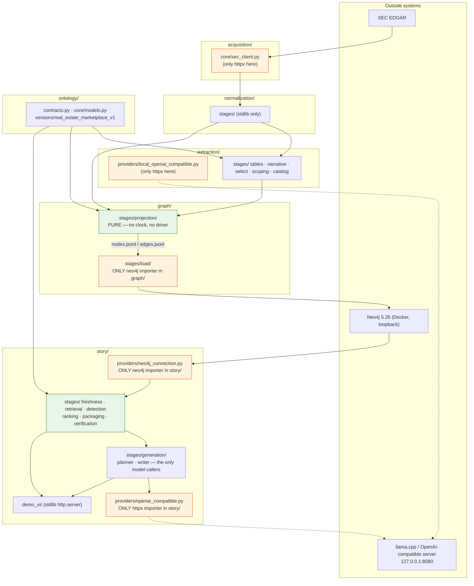

# 04 — Code Architecture

**Audit date:** 2026-08-13. **Code commit at audit:** `33b0d7f` (`Resolve a table cell from its
coordinates, and keep the span it occupies`).

> **This document is the `33b0d7f` record and is preserved as one.** Two features landed after
> it — S12 (a second model provider) and S13 (deterministic fact tools) — and a subsection whose
> *contract* they changed carries a **Superseded** banner pointing into §10, which is dated
> separately. Measurements below were taken on 2026-08-13 and are not restated.

Every claim below was read out of the code at that commit. Where a docstring or a plan
contradicts the code, the code is documented and the contradiction is named.

---

## 1. The answer first

**Six source packages**, layered strictly, five of which share the same internal shape (`ontology/` is a library and has no CLI or pipeline — see §3.3):

```text
<package>/
    __init__.py      layout version + package-level constants
    __main__.py      `python -m <package>`
    cli.py           parse, render, exit codes. No domain logic.
    context.py       composition root — the ONLY place a concrete implementation is named
    contracts.py     Protocols + the types that cross the boundary. typing + core models only
    core/            shared meaning: frozen models, id minting, manifests
    stages/<name>/   one independently runnable stage per directory
    providers/       the only modules allowed to open a socket (extraction, story only)
    pipeline.py      the orchestrator: owns ordering and nothing else
```

The shape is not aspirational — `tests/story/test_story_package_structure.py` and
`tests/graph/test_graph_package_structure.py` walk the import closure and fail the build when
it erodes (§6 below).

Package sizes, measured 2026-08-13 with `find <pkg> -name '*.py' | wc -l` and `cat | wc -l`:

| Package | .py files | Lines | Role |
| --- | ---: | ---: | --- |
| `acquisition/` | 38 | 4,375 | SEC filing discovery, resolution, download, corpus catalog |
| `normalization/` | 45 | 5,191 | Raw artifact → canonical documents and passages |
| `ontology/` | 17 | 3,175 | The executable ontology: metrics, entities, events, formulas |
| `extraction/` | 66 | 13,547 | Passages → validated ontology claims (three lanes) |
| `graph/` | 27 | 9,634 | Extraction catalogs → JSONL export → Neo4j |
| `story/` | 79 | 37,927 | Detection, retrieval, packaging, generation, verification, demo UI |
| `tests/` | 112 | 58,958 | The offline suite |
| `benchmarks/` | 12 | 9,760 | Reviewed extraction cases and scoring |

The story layer is the largest single package and the demo UI (`story/demo_ui/`, 9,299 Python
lines plus 5,480 lines of hand-written HTML/CSS/JS) is roughly a quarter of it.

---

## 2. Directory tree (relevant files only)

```text
config/
    companies.yaml            anchor company (CIK 0001801169, Opendoor)
    fetch.yaml                acquisition policy
    normalization.yaml        normalization policy
    selection_policy.yaml     which artifacts get normalized
    extraction.yaml           lanes, scoping, bounds, provider
    graph.yaml                projection + Neo4j connection block
    story.yaml                provider, generation budgets, demo pinning

acquisition/
    cli.py  context.py  pipeline.py  contracts.py
    core/                     sec_client.py, identifiers, manifests
    stages/                   discover / resolve / download / catalog / verify / report

normalization/
    cli.py  context.py  pipeline.py  contracts.py
    core/  stages/  utils/

ontology/
    contracts.py              ConceptRegistry, OntologyDefinitions
    core/                     models.py, values.py, constraints.py, identifiers.py
    registry.py  validation.py  serialization.py
    versions/real_estate_marketplace_v1/
        definitions/          metrics / entities / events / relationships / formulas /
                              aliases / claims / constraints / roles / instruments / …
        examples/valid/       16 fixtures that must validate
        examples/invalid/     17 fixtures that must be refused

extraction/
    cli.py  context.py  pipeline.py  contracts.py
    core/                     assembly, identifiers, numbers, periods, units, validation,
                              corpus, concept_resolution, run_directory, text_spans
    providers/                local_openai_compatible{,_embeddings}.py, public.py
    stages/
        scoping/              lexical.py, hybrid.py, vector_cache.py
        select/               typed_selector.py, alias_evidence.py, evaluation.py
        tables/               deterministic_lane.py, table_grid.py, header_analysis.py
        narrative/            narrative_lane.py, event_lane.py, prompt.py, event_prompt.py,
                              response_mapping.py, event_mapping.py, answer_store.py
        extract/              lane_execution.py, lane_outputs.py
        catalog/              jsonl_catalog.py
        verify/               run_verification.py
        report/               run_report.py, markdown_report.py

graph/
    cli.py  context.py  pipeline.py  contracts.py
    core/                     inputs.py, keys.py, derivation.py, citations.py, models.py,
                              manifest.py, verification_report.py
    stages/
        projection/           nodes.py, edges.py, evidence_sources.py, export.py
        load/                 connection.py, schema.py, loader.py, lifecycle.py,
                              reader.py, verification.py     ← the only neo4j importers in graph/

story/
    cli.py  context.py  pipeline.py  contracts.py
    core/                     models.py (2,010 lines), keys.py, manifest.py, series.py,
                              numerals.py, periods.py, observation_equivalence.py,
                              table_cells.py, graph_identity.py
    providers/                neo4j_connection.py   ← the only neo4j importer in story/
                              openai_compatible.py  ← the only httpx importer in story/
                              generation_store.py, portable_schema.py, public.py
    stages/
        freshness/            gate.py, loaded_graph.py, freshness_report.py
        retrieval/            cypher.py, graph_tools.py, results.py, metric_metadata.py,
                              lucene_escaping.py
        detection/            canonicalization.py, metric_move.py, trend_reversal.py,
                              acceleration.py, cross_metric_divergence.py, detector_config.py
        ranking/              candidate_ranking.py, scoring.py, deduplication.py,
                              metric_history.py
        packaging/            evidence_package.py, package_assembly.py, section_bounds.py,
                              passage_excerpts.py, passage_quality.py, query_terms.py,
                              counter_evidence.py, ontology_facts.py, warning_codes.py
        generation/           planner.py, writer.py, prompts.py
        verification/         deterministic.py, claims.py, citations.py, language.py,
                              period_grammar.py, metric_surfaces.py, package_index.py,
                              codes.py
    demo_ui/
        server.py  api.py  discovery.py  candidate_resolution.py  projection.py
        package_view.py  runs.py  trace.py  prompt_presets.py  code_catalogue.py
        static/               index.html, app.js, graph.js, style.css

data/            (gitignored)
    raw/                      downloaded SEC artifacts, bytes preserved
    catalog/                  filings.jsonl, artifacts.jsonl
    normalized/               canonical documents + passages
    normalization_catalog/    documents.jsonl, passages.jsonl, selection.jsonl, issues.jsonl
    extraction_runs/          extract-v1-lexical-833f7bcfbce9/
    graph_runs/               graph-v1-0483dc6b4b10/  (nodes.jsonl, edges.jsonl, manifest.json)
    story_demo/               story-v1-*/  (four recorded runs)

tests/           acquisition/ normalization/ ontology/ extraction/ graph/ story/ fixtures/
benchmarks/      extraction/v1/  (reviewed cases, answers, scoring)
```

---

## 3. Module reference

The pattern below is `responsibility / public interface / dependencies / consumers / data in /
data out`.

### 3.1 `acquisition/` — source corpus

* **Responsibility.** Fetch SEC filings for the anchor company and preserve them byte-exact.
* **Public interface.** `acquisition/contracts.py`; CLI `python -m acquisition
  {discover,resolve,download,build-catalog,verify,report,acquire}`.
* **Dependencies.** `httpx` (only in `acquisition/core/sec_client.py:23`), stdlib, PyYAML.
* **Consumers.** `normalization/`.
* **Data in.** `config/fetch.yaml`, `config/companies.yaml`, the SEC EDGAR API.
* **Data out.** `manifests/filings/<run_id>.json` and `manifests/artifacts/<run_id>.json`
  (immutable), `data/raw/…` plus `_filing.json` (atomically finalized),
  `data/catalog/{filings,artifacts}.jsonl` (derived, rebuilt whole).

### 3.2 `normalization/` — canonical documents and passages

* **Responsibility.** Turn a raw artifact into a canonical document with ordered, addressable
  passages (narrative and table).
* **Public interface.** `normalization/contracts.py`; CLI `python -m normalization
  {select,normalize,spike,run,build-catalog,verify,report}`.
* **Dependencies.** stdlib + PyYAML. No model, no database.
* **Consumers.** `extraction/` (via `extraction/core/corpus.py`), and `graph/` (which cites
  corpus rows through `graph/core/inputs.py`).
* **Data out.** `data/normalized/…`, `data/normalization_catalog/{documents,passages,
  selection,issues}.jsonl`.

### 3.3 `ontology/` — the executable ontology

* **Responsibility.** Declare what a metric, entity, event, relationship and formula *are*,
  and refuse claims that violate the declarations.
* **Public interface.** `ontology/contracts.py::ConceptRegistry`,
  `ontology/contracts.py::OntologyDefinitions`, `ontology.load_ontology`.
* **Dependencies.** PyYAML, Pydantic. Nothing downstream.
* **Consumers.** `extraction/`, `graph/`, **and `story/`** — the story layer imports
  `ontology.contracts` and `ontology.core.models` in eight modules (§6.3).
* **Data.** `ontology/versions/real_estate_marketplace_v1/definitions/*.yaml`, identified by
  `ontology_definition_hash bb94f522…` at semantic version `2.0.0`.
* **Note.** The README states version `e8d4af709be2…` with 26 metrics; the definition hash on
  every current run manifest is `bb94f522ba1224702289d8e0646f5fdd8fc6d31cd341f604a7f879ee87e1af34`
  at ontology semantic version `2.0.0`. The README is stale (§7).

### 3.4 `extraction/` — passages to validated claims

* **Responsibility.** Select candidate passages, read claims out of them in three lanes,
  validate against the ontology, and write immutable per-run catalogs.
* **Public interface.** `extraction/contracts.py::ClaimLane`,
  `::PipelineStage`, `::PassageSource`, `::GenerationProvider`, `::EmbeddingProvider`,
  `::OntologyCandidateScope`; CLI `python -m extraction {run,runs,inspect,claim,filter,issues,
  rejected,report,rebuild}`.
* **Dependencies.** `ontology/`, normalization catalogs (read through a port, never imported),
  `httpx` confined to `extraction/providers/`.
* **Consumers.** `graph/` (reads run catalogs), and `story/` for two narrow imports (§6.3).
* **Data out.** `data/extraction_runs/<run_id>/` — seven derived catalogs plus lane outputs, a
  manifest written last as the completion marker (`extraction/core/run_directory.py`,
  `COMPLETION_MARKER`).
* **Lane structure.** `ClaimLane` makes a deterministic table reader and a model-backed
  narrative reader interchangeable downstream. `extraction/contracts.py:17-25` states the rule:
  the narrative lane's provider dies at its own adapter boundary and nothing downstream —
  `assemble`, `verify`, the catalog — knows a model was involved beyond an opaque
  `extractor_metadata` dict.

### 3.5 `graph/` — projection and load

Two stages with very different rules.

**`graph/stages/projection/`** — pure. `graph/contracts.py::GraphProjection.project` is
declared as *a pure function of (extraction run catalogs, ontology definitions, normalization
catalogs, projection version)* — "no timestamp, no random value, no clock". Two projections of
one run must produce byte-identical exports, checkable because `project` returns a value rather
than writing a file. Enforced by `tests/graph/test_export_determinism.py`, and
`tests/graph/test_edges.py:768` scans for `import datetime` / `import neo4j` / `datetime.now` /
`time.time` in the projection modules.

* Data in: `data/extraction_runs/<run>/` catalogs (via `graph/core/inputs.py`), ontology
  definitions, normalization catalog rows for citation.
* Data out: `data/graph_runs/<graph_run_id>/{nodes.jsonl,edges.jsonl,manifest.json}`.

**`graph/stages/load/`** — the only stage in the package permitted a database connection
(`graph/stages/load/__init__.py:1`). Five of its six modules import `neo4j`:
`connection.py:46`, `schema.py:48`, `loader.py:61`, `lifecycle.py:113`, `verification.py:131`.

* `schema.py` — the constraints and indexes a loaded graph stands on.
* `loader.py` — batched writes that count rows back, because Cypher `MATCH` on an endpoint
  *filters* rather than raising, so a dangling edge is silently skipped unless the caller counts
  (`graph/contracts.py:56-60`, recorded as a correction against the plan's own first draft).
* `lifecycle.py` — which run the database holds and whether the load that put it there finished.
* `verification.py` (1,294 lines) — reconciles the loaded database against the export.

### 3.6 `story/` — detection through verification

> **Superseded at `ff3b08f`** — S13 added an eighth stage directory, `story/stages/derivation/`,
> between packaging and generation, so the stage table and the "six of seven" count below are
> both one short. See §10.

Seven stage directories, run in this order by `story/pipeline.py::run_demo` and
`::resolve_demo_inputs`:

| Stage dir | Module docstring's own summary | Model? |
| --- | --- | ---: |
| `freshness/` | "§7's staleness gate: refuse to proceed when the loaded graph no longer matches its inputs" | no |
| `retrieval/` | "S1 — the safe retrieval layer. §9's tools, §16's limits, and no driver anywhere in it" | no |
| `detection/` | "S2 and S3 — the canonical layer every detector stands on, and the four detectors on it" | no |
| `ranking/` | "S4 — §6.10's ranking and deduplication. Deterministic, decomposable, and with no model in it" | no |
| `packaging/` | "S5 — the bounded evidence package. §10, and the wall the model cannot see past" | no |
| `generation/` | "S7 and S8 — the only two modules in this package that call a model, and neither has a tool" | **yes** |
| `verification/` | "S9 — the deterministic verifier. The stage the demo claim rests on" | no |

Six of seven stages contain no model call. `story/stages/generation/__init__.py:1` states the
boundary in its own words: the two modules that call a model, *and neither has a tool*.

### 3.7 `story/providers/` — the outside world

> **Superseded at `ff3b08f`** — S12 added a second HTTP adapter, so `openai_compatible.py` is no
> longer the only `httpx` importer in `story/`, and the enforced rule was always the `providers/`
> package rather than that one file. See §10.

* `neo4j_connection.py` — the **only** module in `story/` importing `neo4j` (line 53). It
  converts driver types (`neo4j.graph.Entity`, `neo4j.time.DateTime`, `neo4j.spatial.Point`, …)
  into plain Python before anything else sees them, satisfying
  `story/contracts.py::ReadQueryExecutor`, whose docstring states: *"No `neo4j.Record`, no
  `neo4j.Node`, no `neo4j.time.DateTime` ever reaches a story stage."*
* `openai_compatible.py` — the only module in `story/` importing `httpx` (line 44), satisfying
  `story/contracts.py::StoryGenerationProvider`.
* `generation_store.py` — replay of recorded model answers keyed by request identity, so the
  full pipeline runs with no GPU and no server.
* `portable_schema.py` — the JSON-Schema subset a structured request may use.
* `public.py` — configuration, error taxonomy, and `PINNED_TEMPERATURE`.

### 3.8 `story/demo_ui/` — the interface

* **Responsibility.** Serve a single-page local interface over the accepted pipeline.
* **Public interface.** `python -m story ui [--host H] [--port P]`.
* **Composition.** `story/cli.py` is *also* the composition root for the interface: the story
  context and the demo config are passed in as zero-argument factories, so `story/demo_ui/`
  never imports `story.context` and the driver stays out of its import closure
  (`story/cli.py` docstring; enforced by `tests/story/test_story_package_structure.py`).
  Nothing is constructed until an endpoint asks for it, which is why the server starts with no
  database running.
* Full treatment in `05-GRAPH-UI-AND-INTERACTION.md`.

---

## 4. Architectural boundaries — with import evidence

Answers to the questions posed, each backed by a grep over the tree (2026-08-13, excluding
`__pycache__` and `tests/`):

| Question | Answer | Evidence |
| --- | --- | --- |
| Does extraction depend on Neo4j? | **No.** | `grep -rn "import neo4j"` over `extraction/` returns nothing. |
| Does the projection depend on Neo4j? | **No.** | Only `graph/stages/load/{connection,schema,loader,lifecycle,verification}.py` import it. |
| Does the writer depend directly on Neo4j? | **No.** | No `story/stages/**` module imports `neo4j`; only `story/providers/neo4j_connection.py:53`. |
| Can UI code query Neo4j directly? | **No** — it holds no driver. It calls the same story-layer code, through the executor injected by `story/cli.py`. | `story/demo_ui/` contains no `neo4j` import; see 05 for the endpoint-level detail. |
| Can planner code fetch arbitrary source files? | **No.** | `story/stages/generation/planner.py` takes a `StoryEvidencePackage` and a provider; no filesystem, no corpus, no executor. |
| Can graph projection modify authoritative artifacts? | **No.** | Projection returns a `GraphExport` value; only `graph/stages/projection/export.py` writes, and only into a new `data/graph_runs/<id>/`. |
| Does anything upstream import `story`? | **No.** | `tests/story/test_story_package_structure.py::test_upstream_packages_never_import_story`. |
| Does one stage import another stage? | **No.** | `…::test_no_stage_imports_another_stage`. |
| Does `core/` import a stage, a provider or the CLI? | **No.** | `…::test_core_never_imports_a_stage_a_provider_or_the_cli`. |
| Are there import cycles? | **No.** | `…::test_the_story_package_has_no_import_cycle`. |

### 4.1 Where the boundaries are enforced

`tests/story/test_story_package_structure.py` contains 20 executable architecture tests. The
ones that matter most:

| Test | What it forbids |
| --- | --- |
| `test_no_forbidden_dependency_is_reachable_from_any_story_module` | any forbidden package anywhere in the closure |
| `test_the_driver_is_named_only_in_the_story_owned_connection_module` | `neo4j` outside `story/providers/neo4j_connection.py` |
| `test_no_driver_is_reachable_from_the_contract_the_core_or_any_stage` | a driver reachable transitively from a stage |
| `test_the_composition_root_is_the_only_module_outside_providers_that_reaches_the_adapter` | any second place that builds an executor |
| `test_no_story_module_opens_an_http_connection` | `httpx` outside `story/providers/openai_compatible.py` |
| `test_contracts_imports_only_typing_and_this_packages_models` | contract-file dependency creep, asserted as an exact import set |
| `test_story_reaches_only_shared_upstream_meaning` | story reaching upstream beyond shared meaning |
| `test_story_never_reaches_into_an_upstream_stage_or_private_contract` | `story` importing `graph.stages` or `extraction.stages` |
| `test_no_catch_all_module` | `utils.py` / `helpers.py` / `service.py` appearing |
| `test_no_directory_exists_as_an_empty_placeholder` | packages of near-empty `__init__.py` |
| `test_no_story_module_names_a_framework` | a web framework entering the package |

`tests/graph/test_graph_package_structure.py` does the equivalent for `graph/`.

### 4.2 The cross-package imports that DO exist

`story/` reaches upstream in exactly three ways, all of them "shared upstream meaning" rather
than stage internals (measured by grep over `story/**/*.py`):

| Import | Count | Why |
| --- | ---: | --- |
| `ontology.contracts` / `ontology.core.*` / `ontology.load_ontology` | 15 sites | the ontology is the authority for metric definitions, formulas and concept identity |
| `extraction.core.models.PeriodRef`, `extraction.core.identifiers.{digest,DIGEST_CHARS,EmptyIdentityError}`, `extraction.core.run_directory.{COMPLETION_MARKER,file_digest}` | 3 sites | one shared period type, one shared digest function, one shared completion-marker constant |
| `graph.core.verification_report.render` | 1 site | reuse of the report renderer; `graph.stages` is never imported |

There is **no import from `graph.stages` or `extraction.stages` anywhere in `story/`.**

---

## 5. Types and contracts — the chain that connects the stages

> **Superseded at `ff3b08f`** — the type chain gains `DerivationRequest`, `DerivedFact` and
> `EvidenceScopeFact` between the plan and the draft, `Calculation` becomes read-back only, and
> two of the six story protocols changed signature (`StoryGenerationProvider.provider_id`,
> `DraftVerifier.verify(..., derived_facts=())`). See §10.

Actual class names, all in `story/core/models.py` unless noted. `story/core/models.py` is 2,010
lines and defines 64 classes, 48 of them frozen Pydantic models on the `StoryModel` base (line 79); the rest are the enums listed below.

```text
                  ontology definitions          normalization passages
                            │                             │
       extraction lanes ────┴─────────────┐               │
                                          ▼               │
                       extraction/core/models.py           │
                       LaneResult · LaneClaim              │
                                          │                │
                                          ▼                ▼
                        graph/core/models.py: GraphNode · GraphEdge · GraphExport
                                          │
                                          ▼  (Neo4j)
                        story/stages/retrieval/results.py: RetrievalResult
                                          │
                        story/core/series.py: CanonicalSeries
                                          │
                                          ▼
                        StoryCandidate  ·  CandidateScore  ·  EvidenceRequest
                                          │
                                          ▼
                        StoryEvidencePackage
                          ├─ PackagedFact · PackagedPassage · PackagedEvent
                          ├─ PackagedRelationship · PackagedMetric · PackagedDocument
                          ├─ SemanticFact · IdentityFact · ComparabilityFact
                          ├─ PackagedWarning · Conflict · ConflictCluster
                          ├─ PackageBudget · BudgetParameters · SectionLedgerEntry
                          ├─ PackageIdentity · RetrievalTraceEntry
                          └─ TableCellRef · PassageCitation · EvidenceSourceCitation
                                          │
                                          ▼  ← model call 1
                        EditorialPlan  (KeyPoint · Counterpoint · UnusableEvidence)
                                          │
                                          ▼  ← model call 2
                        Draft  (DraftSentence · FactBinding · Calculation)
                                          │
                                          ▼
                        VerifiedDraft  (CheckResult · VerificationFinding ·
                                        FactLedgerEntry · CalculationLedgerEntry)
                                          │
                        pass ─────────────┴───────────── fail
                          ▼                                ▼
                   post.md + manifest                RejectedDraft
```

Supporting enums that carry the safety semantics, all in `story/core/models.py`:

| Enum | Line | What it classifies |
| --- | ---: | --- |
| `Audience` | 98 | who the post is for |
| `StatementClass` | 107 | observed fact / correlation / interpretation / hypothesis (see 03) |
| `SentenceKind` | 115 | what kind of sentence this is |
| `CausalLanguage` | 124 | the causal register a sentence is allowed |
| `UnusableReason` | 132 | why a piece of evidence cannot be used |
| `PassageUnusableReason` | 146 | why a passage specifically cannot |
| `PassageQuality` | 171 | whether a passage's content can carry evidence at all |
| `EvidenceRole` | 185 | the one role each evidence row plays |
| `FactKind` | 212 | observation / semantic / identity / comparability |
| `Severity` | 229 | REFUSE / WARN / … |
| `WarningKind`, `WarningCategory` | 240, 265 | the package warning taxonomy |
| `Remedy` | 312 | what the verifier suggests (e.g. `DROP_SENTENCE`) |
| `CheckOutcome` | 334 | per-check result |
| `RetrievalOutcome` | 344 | the five answers a retrieval tool may give |

The two provider-boundary types are distinct per layer and deliberately not shared:
`extraction/contracts.py::GenerationResult` (dataclass, line 91) and
`story/core/models.py::GenerationResult` (Pydantic, line 1889).

The six story protocols, all in `story/contracts.py`:

| Protocol | Stage | Constraint the protocol exists to impose |
| --- | --- | --- |
| `StoryDetector` | S3 | series in, candidates out. "**No model, ever**" |
| `GraphRetriever` | S1 | `tool` names a code-owned statement; parameters are bound, never interpolated |
| `ReadQueryExecutor` | S0c | the one surface a driver may sit behind; `timeout_seconds` keyword-only with **no default** |
| `EvidenceBuilder` | S5 | "the model's entire universe out"; deterministic — rebuilding must reproduce `package_content_digest` |
| `StoryGenerationProvider` | S6 | schema-constrained generation; a schema violation is **never retried** |
| `DraftVerifier` | S9 | returns a `VerifiedDraft` whether or not the draft survived, so a refusal cannot be lost by raising |

Graph has two (`graph/contracts.py`): `GraphProjection` (implemented, pure) and `GraphStore`
(wipe-and-replace, not incremental).

Extraction has six (`extraction/contracts.py`): `StageResult`, `PipelineStage`, `ClaimLane`,
`PassageSource`, `GenerationProvider`, `EmbeddingProvider`, `OntologyCandidateScope`.

---

## 6. Entrypoints — exact commands

Verified 2026-08-13 by running each `--help`.

### Corpus acquisition

```bash
python -m acquisition discover        # -> manifests/filings/<run_id>.json    (immutable)
python -m acquisition resolve         # -> manifests/artifacts/<run_id>.json  (immutable)
python -m acquisition download        # -> data/raw/... + _filing.json        (atomic)
python -m acquisition build-catalog   # -> data/catalog/*.jsonl               (derived)
python -m acquisition verify
python -m acquisition report
python -m acquisition acquire         # every stage in order
```
Top-level options `--root ROOT` and `--cik CIK` precede the subcommand.

### Normalization

```bash
python -m normalization select        # apply the selection policy, write its manifest
python -m normalization normalize     # pipeline over selected artifacts
python -m normalization run           # whole selected corpus
python -m normalization spike         # the spike fixture set only
python -m normalization build-catalog
python -m normalization verify
python -m normalization report
```

### Extraction

```bash
python -m extraction run              # extract, catalog, verify, report
python -m extraction runs             # list finished runs
python -m extraction inspect          # a run's manifest and file digests
python -m extraction claim  <id>      # one claim, its payload and its evidence
python -m extraction filter           # payloads by metric, event, edge, document
python -m extraction issues           # recorded refusals and diagnostics
python -m extraction rejected         # payloads a lane or policy refused
python -m extraction report           # regenerate report.md and compare bytes
python -m extraction rebuild          # rebuild catalogs and compare bytes
```

`report` and `rebuild` regenerate and **compare bytes** — the determinism proof is a CLI verb,
not a test-only affordance.

### Graph projection, load, verification

`--root` and `--runs-root` are top-level and must precede the subcommand.

```bash
python -m graph project extract-v1-lexical-833f7bcfbce9   # -> data/graph_runs/<graph_run_id>/
python -m graph runs                                       # list finished projections
python -m graph inspect [GRAPH_RUN_ID]                     # one projection's manifest
python -m graph load  graph-v1-0483dc6b4b10 [--replace]    # into Neo4j (§6.2, §6.3)
python -m graph verify graph-v1-0483dc6b4b10               # reconcile loaded graph vs export
```

`load` and `verify` read the connection from `config/graph.yaml` plus `.env`, which is why they
take neither `--root` nor `--runs-root`. A projection that rejected a row exits non-zero and
leaves the rows in `<graph_run_id>.rejected/rejected.jsonl` — beside the run id, never on top of
a complete projection, and with no `manifest.json`, so nothing downstream can mistake it for a
finished projection. `verify` prints **every** failing check rather than the first.

### Story generation

> **Superseded at `ff3b08f`** — `demo` gained `--provider` and `--model`, and `--live`'s replay
> store moved to a per-provider path selected by `config/story.yaml`. See §10.

```bash
python -m story demo --candidate-id <CANDIDATE_ID> [--out DIR] [--live]
python -m story ui [--host H] [--port P]
```

**Two verbs, and that is the whole CLI.** `story/cli.py`'s own docstring names what was traded
away by §8b: `discover`, `package`, `plan`, `draft`, `verify`, `runs`, `report`, `rebuild`,
`doctor`, `ask`, `issues`, `rejected`, `inspect`, `candidate`, `recheck` — *"A subcommand that
parsed and then said 'not implemented' would be a promise; there is nothing here that a reader
could mistake for one."*

Consequences worth stating plainly:

* `--candidate-id` is **required with no default**: the demo does not route through ranking's
  selection. The id is re-derived from the detectors and the run refuses if it does not
  reproduce.
* `--live` calls the model server; without it the run replays the committed answer store at
  `tests/story/fixtures/story_demo/generations.jsonl`.
* **Nothing is retried.** A schema violation is the model's answer, not a transport fault
  (`story/pipeline.py::run_demo`, lines 385-388).
* The command **exits non-zero when the run produced no accepted post** — a rejection is still a
  complete run and still writes its artifacts; the exit code says the demo has no post, not that
  nothing happened.
* There is no CLI verb for evaluation of the story layer. Extraction benchmarking lives under
  `benchmarks/` (see 03).

### Tests

```bash
pytest -m "not live"                    # offline suite
pytest -m "not live and not neo4j"      # offline and no database
```
Markers are declared in `pyproject.toml`: `live` (real SEC API or the local llama.cpp server)
and `neo4j` (the local container — deliberately separate, because it is "local, free and
offline, so deselecting it is about 'no database running', not about 'no network and no cost'").

### The one entrypoint that does not exist

`python -m ontology` fails — `ontology` has no `__main__.py`. The ontology is a library
consumed by the other layers and validated through `tests/ontology/`.

---

## 7. Where the code contradicts documents in the repository

Recorded rather than reconciled, per the project's own rule.

| Claim in a repository document | What the code and artifacts show |
| --- | --- |
| `README.md`: "Claim extraction is planned and not yet built"; "extraction — **planned only**" | `extraction/` is 66 files / 13,547 lines with a finished run at `data/extraction_runs/extract-v1-lexical-833f7bcfbce9`. Graph, story and UI layers exist on top of it. |
| `README.md`: `pytest -m "not live"` runs 717 tests | Measured today — see `03-GATES-VERIFICATION-AND-TESTS.md`. |
| `README.md`: ontology `definition_hash e8d4af709be2…`, 26 metrics | Every current manifest carries `bb94f522ba1224…` at ontology semantic version `2.0.0`. Metric node count in the live graph is 26 (unchanged). |
| `README.md` "core idea" picture ends at "visual exploration (later: Q&A and investor posts)" | Investor posts are implemented as the `story/` layer; the UI is implemented as `story/demo_ui/`. |
| `story/context.py:15,46`, `story/providers/public.py:29`, `story/providers/neo4j_connection.py:73`: "there is **no** `config/story.yaml` yet — S11 owns it" | `config/story.yaml` exists and is read by `story/pipeline.py::DemoConfig.load` (`CONFIG_FILENAME = "story.yaml"`, line 140) and by `story/providers/public.py:load_provider_config`. These three docstrings are stale. |
| `story/context.py:49`: `STORY_RUNS_DIRNAME = "data/story_runs"`; `story/core/{keys,manifest,models}.py` describe run artifacts as living in `data/story_runs/<id>/` | No `data/story_runs/` directory exists. Every recorded run is under `data/story_demo/<id>/`, which is where `config/story.yaml`'s `demo.out_root` points and what `story/demo_ui/runs.py:11` reads. |
| `graph/contracts.py::GraphStore`: "**Declared for G2, implemented nowhere at G1**" | The loader exists (`graph/stages/load/loader.py`) and `python -m graph load` works. The docstring's staleness is already partly self-corrected in `graph/cli.py`, which records the 2026-08-03 addition of `load` and `verify` and names the previous docstring as wrong. |
| `config/story.yaml` (comment, dated 2026-08-04): at `length_target: 4` "the recorded run's disposition is **rejected**" | The store that comment points at, `tests/story/fixtures/story_demo/generations.jsonl`, is a **genuine recording whose disposition is `accepted`** — it is the majority of six live runs. The rejected recording is a different fixture. See `03-GATES-VERIFICATION-AND-TESTS.md` §10.3 for the four-store breakdown. |

`graph/cli.py` is the model to imitate here: it names its own previous docstring as wrong, dates
the correction, and says what the wrong version caused.

---

## 8. Module dependency boundaries — diagram



Green = provably pure (no clock, no socket, no driver, enforced by test). Orange = the only
modules in their package permitted to open a socket or hold a driver.

---

## 9. What this architecture buys, and what it costs

**Buys.** Every stage is runnable and testable with nothing else running. The offline suite
drives the whole story pipeline with no database and no model, because `ReadQueryExecutor` and
`StoryGenerationProvider` are protocols and the composition root is one file. Determinism is
checkable rather than asserted: the projection returns a value, `report`/`rebuild` compare
bytes, and `package_content_digest` must reproduce.

**Costs.** Some duplication is accepted deliberately and named where it happens — the story
layer owns its own Neo4j adapter rather than importing `graph/stages/load/connection.py`,
because `graph.stages` is not a surface `story` may import
(`story/contracts.py::ReadQueryExecutor` docstring). The same trade is made for the provider
transport. Both are a handful of lines.

The story layer's 37,927 lines against the graph layer's 9,634 is the clearest structural signal
in the repository: the machinery that keeps a model honest is roughly four times the machinery
that builds the graph it reads.


---

## 10. What changed since `33b0d7f`

**Measured 2026-08-23 at commit `ff3b08f`.** Everything above this line is the 2026-08-13 record
and is not restated. Two changes account for all of it: **S12** (`MULTI_PROVIDER_OPENAI`) added a
second model provider, and **S13** (`DETERMINISTIC_FACT_TOOLS`) added a derivation stage that
computes every derived quantity in code. `acquisition/`, `normalization/`, `ontology/`,
`extraction/` and `graph/` are **byte-identical** to the baseline (`git diff --stat 33b0d7f
ff3b08f` over those five trees is empty), so §3.1–§3.5, §4's boundary answers, §6's four upstream
command blocks and §9's argument stand unedited.

### 10.1 The httpx claim was wrong in one word, and is now wrong in fact

§2's tree annotation, §3.7's bullet and §4.1's table row all name
`story/providers/openai_compatible.py` as *the* module importing `httpx`. Two things:

| | Baseline text | Today |
| --- | --- | --- |
| How many | one module | **two** — `story/providers/openai_compatible.py:44` and `story/providers/openai_responses.py:56` (the OpenAI Responses adapter, added by S12) |
| What is enforced | "`httpx` outside `story/providers/openai_compatible.py`" | the **package**. `tests/story/test_story_package_structure.py:314-331` computes `provider_package = PACKAGE / "providers"` and refuses `httpx`/`requests`/`urllib3`/`aiohttp` in any module not under it |

The second row is not a change — the test never named a file. Its own docstring says why:
*"Written as a path so a module moved out of `providers/` loses the exemption automatically."*
The baseline document tightened a package rule into a file rule when it transcribed it, and the
second adapter is what made the difference visible.

`neo4j_connection.py:53` **is** still the only `neo4j` importer in `story/`, unchanged.

### 10.2 Two of the six story protocols changed signature

Both changes carry their reasoning in `story/contracts.py`, and both are worth having rather than
summarising away.

**`StoryGenerationProvider` gained a required `provider_id` property** (`story/contracts.py:169-181`).
S12 made the provider a digest input to `request_identity` and to `story_run_id`, so *"two providers
answering to one model string are two different requests"* — every implementation, including the
replaying store and the demo's decorators, must be able to say which one it is, *"and a decorator
that forgot to forward it would silently key a run under the provider it wraps."* `model_id` was
deliberately **not** added: a replaying provider can be built without one and infers it from the
rows it holds, and *"widening the protocol to demand it would make that legitimate state
unrepresentable."*

**`DraftVerifier.verify` gained `derived_facts: Sequence[DerivedFact | EvidenceScopeFact] = ()`**
(`story/contracts.py:211-225`) — `verify(draft, package, plan)` is now
`verify(draft, package, plan, derived_facts=())`. The default is argued as truth rather than
convenience: *"A run that requested no derivation produces none, and every call site written before
S13 means exactly that — so the default is the truthful value."* It is not an escape hatch: *"a
draft binding a `fact:derived:` id against an empty sequence is `derived_fact_not_in_run`, a
REFUSE, so a caller that forgot to pass what it computed fails closed rather than verifying a
number against nothing."*

### 10.3 Eight stage directories, and seven of eight have no model

`story/stages/derivation/` is new and sits between the plan and the draft
(`story/pipeline.py:33`, `:631`, `:668-678`). It has **no provider and no socket** — its own
`__init__.py:1-19` states the property the stage exists for: *"every numeral in an accepted post is
either a packaged observation or a derived fact code computed — no numeral is ever the model's own
arithmetic."*

| Stage dir | Module docstring's own summary | Model? |
| --- | --- | ---: |
| `derivation/` | "S13 — the derivation stage: code computes every quantity, the model only words it" | no |

Four modules plus its `__init__.py`, 1,711 lines in all: `public.py` (the refusal taxonomy and tool version), `offers.py`
(§4.2's validation and §4.3's offer set), `operations.py` (seven operations, each pure over
already-validated inputs), `execute.py` (request → validate → execute → `DerivedFact`, or a typed
refusal). Three things it deliberately does not have, each recorded in the docstring: no generic
calculator and no expression string (*"arbitrary Python by another name"*), no native provider
tool-calling (*"two providers mean two tool protocols and `request_identity` already digests the
schema"*), and no arithmetic of its own (`story/core/numerals.py` owns it).

So §3.6's closing sentence — "Six of seven stages contain no model call" — is now **seven of
eight**. `story/stages/generation/` is still the only stage that calls a model, and still has no
tool.

### 10.4 The type chain gains three types, and `Calculation` becomes read-back only

Inserted between the two model calls in §5's diagram:

```text
                        EditorialPlan  (KeyPoint · Counterpoint · UnusableEvidence
                                        · DerivationRequest)
                                          │
                                          ▼  ← NO model: story/stages/derivation/
                        DerivedFact  ·  EvidenceScopeFact      → derived_facts.json
                                          │
                                          ▼  ← model call 2
                        Draft  (DraftSentence · FactBinding)
```

`DerivationRequest` (`story/core/models.py:1719`), `DerivedFact` (`:1738`) and
`EvidenceScopeFact` (`:1824`) are new; the planner *requests* a derivation by naming an operation
and two package fact ids, the derivation stage validates and executes it, and the writer binds the
result exactly as it binds an observed fact.

`Calculation` (`:1968`) is **still on `DraftSentence`, and no draft written today can carry one** —
the writer's schema no longer has the field (`story/stages/generation/prompts.py:85-89`). It stays
on the type for artifact back-compatibility, and §13 now **refuses** a draft that carries one.
`story/stages/generation/writer.py:674-681` states the consequence for rendering: *"The Derivations
panel is kept and no draft this module builds can now fill it… What still reaches this branch is a
`Draft` read back from an artifact written under prompt version 1.4.0, which is the reason
`Calculation` stays on the type at all."*

`planner_prompt` and `writer_prompt` changed signature to match:
`planner_prompt(package, *, offered=())` and
`writer_prompt(package, plan, passages, *, derived_facts=(), length_target=5)`.

### 10.5 The CLI gained two flags, and its own docstring did not

`story/cli.py:301-305` adds `--provider` (which adapter to run) and `--model` (which model to ask),
both defaulting to what `config/story.yaml` selects. **Two verbs is still the whole CLI.**

**Code-side defect, reported and not fixed here:** `story/cli.py`'s own usage docstring at lines
3-4 still reads

```text
    python -m story [--root REPO] [--runs-root R] demo --candidate-id ID [--out DIR] [--live]
```

with no `--provider` and no `--model`. It is stale in exactly the way §7's table catalogues, and it
belongs on that table rather than in a documentation repair.

### 10.6 `--live` replays a path that no longer exists

§6 says a non-`--live` run *"replays the committed answer store at
`tests/story/fixtures/story_demo/generations.jsonl`"*. **That file is gone.** Stores are
per-provider:

| Provider | Store |
| --- | --- |
| `local_openai_compatible` | `tests/story/fixtures/story_demo/local_openai_compatible/generations.jsonl` |
| `openai` | `tests/story/fixtures/story_demo/openai/generations.jsonl` — committed, and **deliberately not** in the shipped mapping |

`config/story.yaml:220-221` holds the authoritative `demo.generation_stores` mapping and
`DemoConfig.generation_store_for` is the accessor. The scalar `demo.generation_store`
(`config/story.yaml:231`) survives as the local provider's fallback for one release and is marked
*"**not** authoritative"* in place.

The missing `openai:` row is a decision, not an omission (`config/story.yaml:209-219`): *"the
shipped configuration having no OpenAI store is what makes the demo UI answer
`provider_requires_live` for OpenAI honestly… A shipped demo that replayed a recorded OpenAI run
without a key would be claiming to have called an API it never called."*

This also makes §7's last table row point at a path that does not exist. The row's *finding* —
that the `config/story.yaml` comment describing the store as `rejected` was wrong — still holds;
only the filename in it is stale.

### 10.7 Counts

Re-measured 2026-08-23 with the same commands §1 names. Only the rows that moved:

| Measurement | 2026-08-13 | 2026-08-23 |
| --- | ---: | ---: |
| `story/` .py files / lines | 79 / 37,927 | **87 / 47,965** |
| `tests/` .py files / lines | 112 / 58,958 | **119 / 69,969** |
| `story/core/models.py` lines | 2,010 | **2,401** |
| …classes / …enums | 64 / 15 | **70 / 18** |
| `story/demo_ui/` Python lines | 9,299 | **10,825** |
| `story/demo_ui/static/` lines | 5,480 | **6,296** |
| `story/` → `ontology` import statements (§4.2) | 15 | **18** |
| `story/` → `ontology` importing modules (§3.3) | 8 | 8 (unchanged) |
| architecture tests in `test_story_package_structure.py` (§4.1) | 20 | 20 (unchanged) |

The three new enums are `DerivedFactKind` (`models.py:1622`), `DerivationOperation` (`:1640`) and
`DisplaySemantics` (`:1667`).

**One count in the checklist did not reproduce.** §2's tree names **ten** `demo_ui` modules; today
it is **eleven**, not twelve — `table_grid.py` (373 lines) is the only addition. The twelve-file
figure counts `__init__.py`, which §2's tree does not list. `05-GRAPH-UI-AND-INTERACTION.md` §2.2
does list it, and there the tree goes from eleven entries to twelve.

`acquisition/`, `normalization/`, `ontology/`, `extraction/`, `graph/` and `benchmarks/` are
unchanged in both files and lines.

### 10.8 What did not change, checked rather than assumed

* The six-package layering, the per-package shape, and every §4 boundary answer.
* `story/providers/neo4j_connection.py` is still the only `neo4j` importer in `story/`.
* The 20 architecture tests in `tests/story/test_story_package_structure.py`, including
  `test_contracts_imports_only_typing_and_this_packages_models`, whose asserted import set is
  still exactly `{"__future__", "typing", "story.core.models"}`.
* The four upstream CLI command blocks in §6, verbatim.
* §9's closing ratio moved but not its argument: the story layer is now 47,965 lines against
  `graph/`'s 9,634 — five times, not four.
