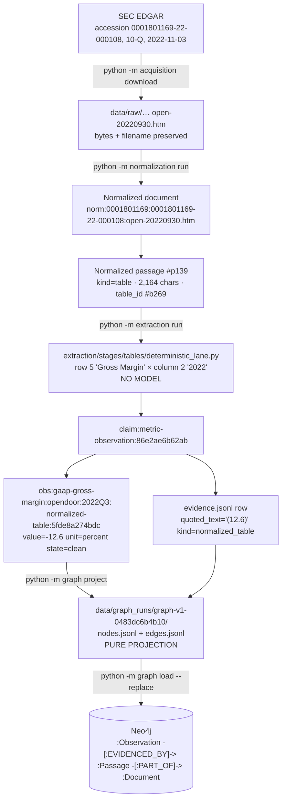
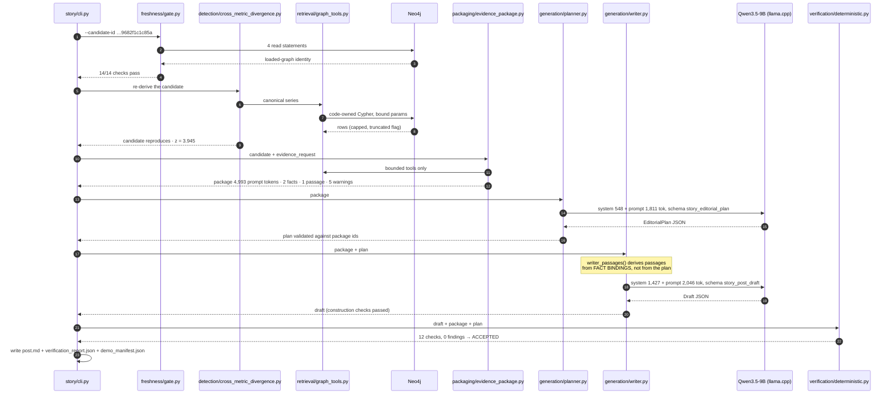
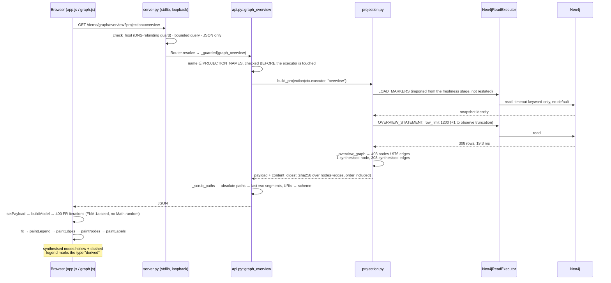

# 06 — End-to-End Data Flows

**Audit date:** 2026-08-13. Every id, value and byte below was read from the live Neo4j
instance, from `data/`, or from a re-run of the code at commit `33b0d7f`. Nothing is
illustrative.

> **This document is the `33b0d7f` record and is preserved as one.** Two features landed after
> it — S12 (a second model provider) and S13 (deterministic fact tools) — and a subsection whose
> *contract* they changed carries a **Superseded** banner pointing into §D, which is dated
> separately. Measurements below were taken on 2026-08-13 and are not restated.

Three walkthroughs:

* **Flow A** — a source filing becomes a numeric observation in the graph.
* **Flow B** — the graph becomes an accepted post.
* **Flow C** — the graph becomes a rendered screen.

Flow A and Flow B meet at exactly one object: the observation
`obs:gaap-gross-margin:opendoor:2022Q3:normalized-table:5fde8a274bdc`, which Flow A puts into
the graph and Flow B writes a sentence about. That is deliberate — it is the same fact end to
end.

---

## Flow A — source document → graph observation

**Subject.** Opendoor's GAAP gross margin for 2022 Q3: **-12.6 percent**.

### A.1 The chain, with real identifiers

| # | Stage | Identifier / value | Where it lives |
| --: | --- | --- | --- |
| 1 | SEC filing | accession `0001801169-22-000108`, form **10-Q**, filed **2022-11-03** | `manifests/filings/<run_id>.json` |
| 2 | Artifact | `open-20220930.htm`, `https://www.sec.gov/Archives/edgar/data/1801169/000180116922000108/open-20220930.htm` | `data/raw/…` + `data/catalog/artifacts.jsonl` |
| 3 | Normalized document | `norm:0001801169:0001801169-22-000108:open-20220930.htm` | `data/normalization_catalog/documents.jsonl` |
| 4 | Normalized passage | `norm:…open-20220930.htm#p139`, `passage_kind = table`, `char_count = 2164`, `table_id = …#b269`, `section_id = …#s107` | `data/normalization_catalog/passages.jsonl` |
| 5 | Extraction claim | `claim:metric-observation:86e2ae6b62ab`, `lane = tables` | `data/extraction_runs/extract-v1-lexical-833f7bcfbce9/claims.jsonl` |
| 6 | Observation payload | `obs:gaap-gross-margin:opendoor:2022Q3:normalized-table:5fde8a274bdc` | `…/observations.jsonl` |
| 7 | Evidence row | `evidence_kind = normalized_table`, `quoted_text = "(12.6)"` | `…/evidence.jsonl` |
| 8 | Graph export | one `Observation` node + `EVIDENCED_BY`, `OBSERVATION_OF_SUBJECT`, `HAS_OBSERVATION` edges | `data/graph_runs/graph-v1-0483dc6b4b10/{nodes,edges}.jsonl` |
| 9 | Neo4j | `(:Observation {observation_id: "obs:gaap-gross-margin:opendoor:2022Q3:normalized-table:5fde8a274bdc"})` | the running database |

### A.2 The identifier grammar

Each id is derived, readable, and says where it came from — the project's determinism rule
applied to identity (`extraction/core/identifiers.py`, `graph/core/keys.py`,
`story/core/keys.py`).

```text
norm : 0001801169 : 0001801169-22-000108 : open-20220930.htm    # document
 │        │              │                   └ original filename, preserved exactly
 │        │              └ SEC accession number
 │        └ zero-padded CIK
 └ namespace

norm:…:open-20220930.htm#p139        # passage: document id + "#p" + ordinal
norm:…:open-20220930.htm#b269        # the table block the passage came from
norm:…:open-20220930.htm#s107        # the section

obs : gaap-gross-margin : opendoor : 2022Q3 : normalized-table : 5fde8a274bdc
 │      │                  │          │        │                 └ content digest
 │      │                  │          │        └ source lane
 │      │                  │          └ period key
 │      │                  └ subject entity
 │      └ metric id, kebab-cased
 └ namespace
```

The `#p` separator is the one place the passage-id grammar is written in Python
(`story/stages/retrieval/graph_tools.py:102`, `PASSAGE_ORDINAL_SEPARATOR`). Its docstring
records a verification: over all 8,776 passages on 2026-08-03, every id split into exactly two
parts, reconstructed exactly from `document_id`, and its ordinal round-tripped through
`toInteger` unchanged.

### A.3 The extraction step, verbatim

Run today:

```bash
python -m extraction claim claim:metric-observation:86e2ae6b62ab
```

The claim record carries the lane and the coordinates the deterministic table reader used:

```json
{ "claim_id": "claim:metric-observation:86e2ae6b62ab",
  "claim_kind": "metric_observation",
  "lane": "tables",
  "assertion_type": "reported",
  "passage_id": "norm:0001801169:0001801169-22-000108:open-20220930.htm#p139",
  "payload_id": "obs:gaap-gross-margin:opendoor:2022Q3:normalized-table:5fde8a274bdc",
  "extractor_metadata": {
    "lane": "normalized_table", "lane_version": "1.0.0",
    "table_id": "norm:…#b269",
    "row_label": "Gross Margin", "row_index": 5, "metric_label_row_index": 5,
    "column_label": "2022", "value_column_index": 2,
    "period_header_row_index": 3, "period_header_column_index": 2,
    "scale": "units", "scale_source": "table_header", "scale_location": "table_header",
    "subject_basis": "registrant_metadata" } }
```

**This observation is fully deterministic.** `lane = tables` is
`extraction/stages/tables/deterministic_lane.py`, which uses no model at all
(`extraction/stages/tables/__init__.py:1` — "No provider, fully offline"). The row and column
indices are the audit trail: `extraction/stages/tables/table_grid.py` addresses the Markdown
pipe table as a grid with original positions preserved, and
`extraction/stages/tables/header_analysis.py` decides which original column carries which
period. The `-12.6` value comes from `extraction/core/numbers.py`, which resolves scale, sign
and currency — here the parenthesised `(12.6)` becomes a negative.

The observation as written to `observations.jsonl` is then normalized and validated:

* period: `period_start = 2022-07-01`, `period_end = 2022-09-30`, `period_key = 2022Q3`
  (`extraction/core/periods.py`)
* unit: `unit = percent`, `scale = units` (`extraction/core/units.py`)
* ontology validation: `validation_state = clean`, `ambiguity_codes = []`,
  `warning_codes = []` (`extraction/core/validation.py` plus the ontology's own constraints)

### A.4 The projection step

`graph/stages/projection/nodes.py` and `edges.py` read the extraction catalogs through
`graph/core/inputs.py` and emit nodes and edges as **values**; `graph/stages/projection/
export.py` writes them. The projection is a pure function — no clock, no random value, no
driver (`graph/contracts.py::GraphProjection`, checked by
`tests/graph/test_export_determinism.py` and the scan in `tests/graph/test_edges.py:768`).

```bash
python -m graph project extract-v1-lexical-833f7bcfbce9
python -m graph load  graph-v1-0483dc6b4b10 --replace
python -m graph verify graph-v1-0483dc6b4b10
```

### A.5 The graph object, as it stands right now

Read from the live database on 2026-08-13:

```cypher
MATCH (o:Observation {observation_id:
  "obs:gaap-gross-margin:opendoor:2022Q3:normalized-table:5fde8a274bdc"})
RETURN properties(o)
```

38 properties. The ones that carry meaning:

| Property | Value |
| --- | --- |
| `value` | `-12.6` |
| `unit` | `percent` |
| `metric_id` | `gaap_gross_margin` |
| `subject_entity_id` | `opendoor` |
| `subject_type` | `public_company` |
| `period_key` / `period_start` / `period_end` | `2022Q3` / `2022-07-01` / `2022-09-30` |
| `assertion_type` | `reported` |
| `validation_state` | `clean` |
| `source_lane` | `normalized_table` |
| `lane` | `tables` |
| `row_label` / `row_index` / `column_label` / `value_column_index` | `Gross Margin` / `5` / `2022` / `2` |
| `passage_id` / `document_id` | `norm:…#p139` / `norm:…open-20220930.htm` |
| `claim_id` | `claim:metric-observation:86e2ae6b62ab` |

and eight provenance stamps carried on **every** node and edge in the graph:
`graph_run_id`, `graph_projection_version`, `graph_code_commit`, `extraction_run_id`,
`extraction_code_commit`, `ontology_id`, `ontology_version`, `ontology_definition_hash`.

Its three edges:

```text
(:Metric {metric_id:"gaap_gross_margin"})
        -[:HAS_OBSERVATION]->            (:Observation …5fde8a274bdc)
(:Observation …5fde8a274bdc)
        -[:OBSERVATION_OF_SUBJECT]->     (:Entity:Company:PublicCompany {entity_id:"opendoor"})
(:Observation …5fde8a274bdc)
        -[:EVIDENCED_BY]->               (:Passage {passage_id:"norm:…#p139"})
(:Passage {passage_id:"norm:…#p139"})
        -[:PART_OF]->                    (:Document {document_id:"norm:…open-20220930.htm"})
```

**The `EVIDENCED_BY` edge is where provenance actually lives.** Its properties, read today:

| Edge property | Value |
| --- | --- |
| `quoted_text` | `(12.6)` |
| `evidence_kind` | `normalized_table` |
| `table_id` | `norm:…open-20220930.htm#b269` |
| `block_ids` | `['norm:…open-20220930.htm#b269']` |
| `source_url` | `https://www.sec.gov/Archives/edgar/data/1801169/000180116922000108/open-20220930.htm` |
| `claim_id` | `claim:metric-observation:86e2ae6b62ab` |
| `edge_key` | `EVIDENCED_BY:obs:gaap-gross-margin:opendoor:2022Q3:normalize…` |

`quoted_text = "(12.6)"` is the printed form as it appeared in the filing, kept beside the
canonical `-12.6`. That is what makes a scale or sign error recoverable rather than invisible —
the same rule `extraction/contracts.py::GenerationResult` states for `raw_content`.

The `Document` node closes the loop back to the source:

| Property | Value |
| --- | --- |
| `form` | `10-Q` |
| `accession` | `0001801169-22-000108` |
| `cik10` | `0001801169` |
| `company_name` | `Opendoor Technologies Inc.` |
| `filing_date` / `report_date` | `2022-11-03` / `2022-09-30` |
| `source_url` | `https://www.sec.gov/Archives/edgar/data/1801169/000180116922000108/open-20220930.htm` |

### A.6 Flow A as a diagram



---

## Flow B — graph → generated post

**Subject.** The recorded run `story-v1-290a1a01e59c`, disposition **accepted**, written
2026-08-13 10:58:47 UTC. This is one of only two accepted posts the repository holds.

### B.1 The chain

> **Superseded at `ff3b08f`** — a deterministic derivation stage now sits between the plan and the
> draft, the prompt versions are `1.2.0`/`2.2.0`, and the package identity and digest moved when
> `max_derivations` joined `BudgetParameters`. See §D.

```text
graph-v1-0483dc6b4b10  (loaded, freshness 14/14 checks pass)
    │
    ├─ S2 canonicalization      canon-policy:1.0.0 → 537 fact-slots over 2,704 observations
    ├─ S3 detection             4 detectors → 262 candidates
    ├─ S4 ranking               → 112 clusters / 112 representatives, top 50 returned
    │      (the demo BYPASSES this — --candidate-id is manual)
    ▼
cand:cross-metric-divergence:adjusted-gross-margin-gaap-gross-margin:opendoor:2022Q3:9682f1c1c85a
    │
    ├─ S1 retrieval             bounded, code-owned tools
    ▼
pkg:cross-metric-divergence-adjusted-gross-margin-gaap-gross-margin-opendoor-2022q3:6a858ae5c031
    package_content_digest 5c420f8c50717b731656e1bec1c744b26f378669a9c00d25395f0ac4c51e6ad3
    prompt_token_estimate 4,993 · artifact_token_estimate 6,539
    │
    ├─ S7 planner   ← MODEL CALL 1   prompt story_editorial_plan v1.1.0
    ▼
EditorialPlan  (3 key points, 0 counterpoints, causal_language = forbidden)
    │
    ├─ S8 writer    ← MODEL CALL 2   prompt story_post_draft v1.3.0
    ▼
Draft  (title + 3 sentences, each carrying its own bindings)
    │
    ├─ S9 DeterministicVerifier      12 checks, 0 findings
    ▼
ACCEPTED → post.md + verification_report.json + demo_manifest.json
```

Command:

```bash
python -m story demo \
  --candidate-id cand:cross-metric-divergence:adjusted-gross-margin-gaap-gross-margin:opendoor:2022Q3:9682f1c1c85a
```

### B.2 The candidate — what deterministic code found, with no model

`data/story_demo/story-v1-290a1a01e59c/candidate.json`, minted by
`story/stages/detection/cross_metric_divergence.py` at detector version `1.0.0`.

The candidate carries 11 anchor observation ids (7 `gaap_gross_margin`, 4
`adjusted_gross_margin` — the same reading found in several filings), and a `signals` block
that is the detector's entire reasoning, in numbers:

| Signal | Value | Meaning |
| --- | --- | --- |
| `left_metric_id` / `left_value` | `adjusted_gross_margin` / `3.3` | one side |
| `right_metric_id` / `right_value` | `gaap_gross_margin` / `-12.6` | the other |
| `gap` | `15.899999999999999` | the divergence |
| `gap_mean` / `gap_pstdev` | `-0.348` / `4.1181665823519085` | the historical distribution |
| `gap_pstdev_excluding_anchor` | `2.491527309369362` | the same, with this point removed |
| **`z`** | **`3.945445060340583`** | **why this is a story** |
| `population_size` / `_first_period` / `_last_period` | `25` / `2020Q1` / `2026Q1` | what the z-score is against |
| `comparable_overlap` | `25` | periods where both metrics are comparable |
| `relation` / `relation_group_ids` | `shared_components` / `margin_measures` | the ontology's declared reason these two may be compared |
| `shared_component_metrics` | `revenue` | the shared denominator |
| `left_formula_expression` | `adjusted_gross_profit / revenue` | from the ontology |
| `right_formula_expression` | `gaap_gross_profit / revenue` | from the ontology |
| `variance_floor` | `0.2` | the detector's threshold floor |
| `periods_excluded` / `periods_unresolved` | `0` / `0` | nothing silently dropped |

The candidate also carries the `evidence_request` — what the *detector* thinks is relevant
(2 metric ids, 11 observation ids, 1 period key, `want_counter_evidence: true`,
`want_explanatory_search: false`). Per `story/contracts.py::EvidenceBuilder`, the request and
the package are deliberately separate arguments: *"the request states what the detector
anchored on, and the builder decides how much of it fits… Keeping them apart is what stops a
detector widening its own evidence."*

**No model was involved to this point.** `story/contracts.py::StoryDetector` says so in three
words: "**No model, ever**".

### B.3 The evidence package — the model's entire universe

Built by `story/stages/packaging/evidence_package.py` and
`story/stages/packaging/package_assembly.py`. Recorded at 33,349 bytes.

| Budget field | Value |
| --- | ---: |
| `parameters.max_total_tokens` | 5,000 |
| `prompt_token_estimate` | **4,993** |
| `artifact_token_estimate` | 6,539 |
| `max_facts` / `max_primary_passages` / `max_context_neighbours` | 12 / 4 / 1 |
| `max_metrics` / `max_events` / `max_relationships` | 8 / 5 / 4 |
| `max_counter_evidence` / `max_conflicts` / `max_compatibility` | 3 / 8 / 12 |
| `excerpt_radius_chars` | 400 |
| `max_graph_hops` | 2 |

The section ledger records what was dropped and why — the package cannot silently truncate:

| Section | Available | Carried | Dropped | Reasons | Protected |
| --- | ---: | ---: | ---: | --- | --- |
| `facts` | 11 | 2 | 9 | `concordant_readings_collapsed` | yes |
| `context_passages` | 2 | 0 | 2 | `token_budget_trimmed` | no |

The eleven anchor observations collapsed to **two facts** because
`story/core/observation_equivalence.py` decides *"when two observations are two sources for
**one** reading, and when they are two readings"* — seven copies of the same GAAP gross margin
are one fact with seven sources, not seven facts.

The package's five warnings, all carried into the model's view:

| Warning code | What it discloses |
| --- | --- |
| `token_budget_trimmed` | the budget bound and something left |
| `concordant_readings_collapsed` | 9 of 11 anchors collapsed into 2 |
| `subject_identity_not_read_from_graph` | the subject was not resolved from a graph read |
| `evidence_sources_absent_in_v1` | no non-passage evidence sources exist |
| `relationships_unavailable_in_v1` | the graph holds effectively no relationship claims |

### B.4 Model call 1 — the planner

> **Superseded at `ff3b08f`** — the replay store moved to a per-provider path, the provider is now
> selectable, the prompt is version `1.2.0`, and `planner_prompt` takes the derivation offer set.
> The `causal_language` argument and the plan's own shape are unchanged. See §D.

* Provider: `story/providers/openai_compatible.py` (replayed here from
  `tests/story/fixtures/story_demo/generations.jsonl`; `--live` would call the server).
* Model: `Qwen3.5-9B-Q4_K_M.gguf` at
  `/home/thele/models/qwen3.5-9b/Qwen3.5-9B-Q4_K_M.gguf`, `temperature = 0.0` (pinned in code,
  not configurable), `max_tokens = 2048`.
* Prompt: `story/stages/generation/prompts.py::planner_prompt` + `PLANNER_SYSTEM`, version
  `1.1.0`, schema `story_editorial_plan`, schema digest `20d0af1daf4e…`.

Measured today by rebuilding the prompt at commit `33b0d7f` from the committed package fixture
(`tests/story/fixtures/story_demo/evidence_package.json`, digest `5c420f8c…` — the same package the
run recorded):

| | chars | ≈ tokens (÷4) |
| --- | ---: | ---: |
| `PLANNER_SYSTEM` | 2,190 | 548 |
| `planner_prompt(package)` | 7,241 | 1,811 |
| `planner_schema(...)` sent as `response_format` | 1,804 | 451 |
| **total request** | 11,235 | **2,809** |
| + `max_tokens` 2,048 | | **4,857 of 8,192** |

The planner is shown a **slice, not the package** (`prompts.py` module docstring): facts,
metrics, events, warnings, conflicts and excerpts. Relationships, documents, compatibility
decisions, evidence sources, formula windows and the retrieval trace are **not rendered**.

What it produced (`editorial_plan.json`):

```json
{ "thesis": "Opendoor reported a divergence between its GAAP Gross Margin and
             Adjusted Gross Margin for 2022Q3.",
  "why_it_matters": "The company reported a negative GAAP Gross Margin while reporting a
             positive Adjusted Gross Margin for the same period.",
  "structure": ["introduction", "key_points", "conclusion"],
  "causal_language": "forbidden",
  "uncertainty": "none",
  "key_points": [ …3 items, each with statement_class, required_fact_ids,
                  required_citation_passage_ids… ],
  "counterpoints": [], "unusable_evidence": [], "required_warnings": [],
  "prohibited_claims": ["The company's business model is flawed.",
                        "The company is losing money overall.",
                        "The company's management is incompetent."] }
```

**`causal_language: "forbidden"` was not the model's choice.** It is computed by
`story/stages/generation/planner.py::causal_language_for` before the call and pinned as a
single-value `enum` in the schema, so the constrained grammar cannot emit the other value
(`prompts.py:18-21`).

The three key points name only ids that exist in the package. Point 3 is
`statement_class: "calculated"` and carries **no** citation passage id — a computed figure is
not something a filing said.

### B.5 Model call 2 — the writer

> **Superseded at `ff3b08f` — this walkthrough describes a draft schema that is now refused.**
> Sentence 2's `operation` / `expression` / "no citation, no fact binding" row cannot be produced
> by any writer today: `Calculation` left the schema at S13, and §13 refuses a draft that carries
> one. The same sentence now **binds** `fact:derived:compare-levels:…` and carries two citations.
> `writer_passages` and the three code-computed inputs are unchanged. See §D.

* Prompt: `prompts.py::writer_prompt` + `writer_system(PLAIN_INVESTOR_STYLE)`, version
  `1.3.0`, schema `story_post_draft`, digest `b1fc050e1d5b…`, `max_tokens = 2048`,
  `length_target = 4` (from `config/story.yaml`).

Measured today, same method:

| | chars | ≈ tokens |
| --- | ---: | ---: |
| `writer_system(style)` | 5,706 | 1,427 |
| `writer_prompt(...)` | 8,183 | 2,046 |
| `writer_schema()` sent as `response_format` | 1,543 | 386 |
| **total request** | 15,432 | **3,858** |
| + `max_tokens` 2,048 | | **5,906 of 8,192** |

The writer sees a **different slice**: the *whole* text of every passage a packaged fact was
read from (here 1 passage, 2,164 characters), the accepted plan, and the metric and period
surfaces each fact may be named by. Critically, that passage set is computed by
`story/stages/generation/writer.py::writer_passages` **from the fact bindings, never from the
plan's `required_citation_passage_ids`** — so the planner cannot filter what the writer later
sees (`prompts.py:31-33`).

Three things the writer is handed because code computed them, not the model:

* `metric_surfaces_for` — which surfaces name this metric *and only this metric* in this
  package. This is why the draft says "GAAP Gross Margin" and never "gross margin": the shorter
  surface is a sub-phrase of "adjusted gross margin" and would be refused by §13.5.
* `period_surface_for` — one surface per fact in the verifier's closed period grammar. Here:
  `"the third quarter of 2022"`.
* `WARNING_QUALIFIER_PHRASES` — the phrases that count as having stated a required warning.

What it produced (`draft.json`): a title and three sentences.

| # | kind | text | bindings / calculation |
| --: | --- | --- | --- |
| 0 | `reported` | "Opendoor reported a GAAP Gross Margin of -12.6 percent for the third quarter of 2022." | binds `obs:gaap-gross-margin:…5fde8a274bdc` at chars 41–54 (`-12.6 percent`); cites `#p139` chars 492–498 |
| 1 | `reported` | "Opendoor reported an Adjusted Gross Margin of 3.3 percent for the third quarter of 2022." | binds `obs:adjusted-gross-margin:…3eabe78a6d25` at chars 46–57 (`3.3 percent`); cites `#p139` chars 1027–1030 |
| 2 | `calculated` | "The difference between the two margins is 15.9 percentage points." | `operation: difference`, `expression: left < right`, inputs `[gaap…5fde…, adjusted…3eab…]`, `result_rendered: "15.9 percentage points"`, **no citation, no fact binding** |

Title: `"Opendoor 2022Q3"` — no figure, no comparison, no cause, per writer rule 17.

Every numeral in the prose is declared with the exact character span it occupies in the
sentence. The model chose the words; it did not choose which fact each numeral is.

### B.6 The verification gate

> **Superseded at `ff3b08f`** — the signature is now
> `verify(draft, package, plan, derived_facts=())`, and the twelve checks examine different item
> counts because sentence 2 binds a fact. Still twelve checks and still zero findings. See §D.

`story/stages/verification/deterministic.py::DeterministicVerifier.verify(draft, package,
plan)`. Twelve checks ran; every one returned zero findings:

| Check | Items examined |
| --- | ---: |
| `identity_and_freshness` | 9 |
| `numbers` | 5 |
| `units` | 2 |
| `percentages` | 3 |
| `periods` | 3 |
| `metric_identity` | 4 |
| `subject_identity` | 3 |
| `citations` | 2 |
| `reported_vs_calculated` | 3 |
| `language_safety` | 3 |
| `title` | 1 |
| `disclosures` | 2 |

The report also carries two ledgers, which are the machine-checkable version of "every number
came from somewhere":

* **`fact_ledger`** — one row per bound figure, resolving to `value`, `unit`, `period_key`,
  `metric_id`, `passage_id`, `document_id` and `source_url`.
* **`calculation_ledger`** — sentence 2's `left < right` recomputed to `15.899999999999999`
  against `rendered: "15.9 percentage points"`.

The verifier recomputed the arithmetic; it did not take the model's word for it.

### B.7 The three other recorded runs — what refusal looks like

> **Superseded at `ff3b08f` — treat this as a historical capture.** All four runs were produced by
> pre-S12/S13 code. The `e101d5b08b3c` refusal quoted below is about a `calculation` field that no
> longer exists on any draft a writer can emit, so it **cannot be reproduced** by running the code
> today. The argument it illustrates survives; the run does not. The "nothing is retried" paragraph
> is unchanged. See §D.

The same candidate and the same code produce three other outcomes, which is the clearest
statement of what the gates actually do:

| Run | Disposition | Stage | Why |
| --- | --- | --- | --- |
| `story-v1-290a1a01e59c` | **accepted** | — | 12/12 checks clean |
| `story-v1-69c91a1f6325` | **accepted** | — | 12/12 checks clean |
| `story-v1-e101d5b08b3c` | **rejected** | S9 verification | `comparative_not_supported_by_text` — the calculation declared GAAP-then-adjusted, the prose named them in the other order. Same number, opposite claim. Severity `REFUSE`, remedy `DROP_SENTENCE` |
| `story-v1-28033af11f4b` | **draft_refused** | S8, before verification | `citation_quote_not_in_passage` ×2 — the writer quoted `"Adjusted Gross Profit \| $ \| 556"` from `#p133`, which does not contain it |

The `e101d5b08b3c` finding is worth quoting because it is the whole argument for a deterministic
gate:

> "§13.14: a calculation names its two sides by position and the sentence names them in words.
> Recomputing the declaration alone would accept the sentence that reverses it, which is the same
> number and the opposite claim."

**Nothing is retried.** `story/pipeline.py::run_demo` records a refusal as a disposition and
writes the run directory anyway; the CLI exits non-zero. A schema violation is the model's
answer, not a transport fault.

### B.8 Flow B as a diagram

> **Superseded at `ff3b08f`** — the diagram names Qwen as the only model participant. The provider
> is now selectable and `provider_id` is a `story_run_id` digest input, and the derivation stage is
> missing from the sequence. See §D.



---

## Flow C — graph → UI

**Subject.** The `:Metric` node `gaap_gross_margin` as it appears on the overview canvas, and the
`:Observation` node the Facts panel highlights when a packaged fact row is clicked.

All figures in this section were captured live on 2026-08-13 from a demo server started on
`127.0.0.1:8799` and killed afterwards.

### C.1 The chain

```text
Neo4j graph-v1-0483dc6b4b10
   ↓  story/demo_ui/projection.py::OVERVIEW_STATEMENT   (row_limit 1200, +1 to detect truncation)
308 rows                                                 19.3 ms
   ↓  projection.py::_overview_graph → _Accumulator
403 nodes · 976 edges  (1 synthesised node, 308 synthesised edges)
   ↓  projection.py::_payload
+ disclosure · snapshot · bounds · counts · legend · content_digest · timing
   ↓  api.py::graph_overview  (+ available_projections, available_views, honest_labels)
   ↓  server.py — stdlib ThreadingHTTPServer, JSON, loopback only
GET /demo/graph/overview?projection=overview
   ↓  app.js::loadOverview (939)
   ↓  graph.js::buildModel → runLayout (400 Fruchterman-Reingold iterations, FNV-1a seeded)
   ↓  fit() → paintLegend → paintBreadcrumb → schedule() → draw()
canvas: filled arcs, straight edges, hollow-and-dashed for anything synthesised
```

### C.2 The query, and what it does not read

`OVERVIEW_STATEMENT` (`projection.py:195`) matches
`(metric:Metric)-[:HAS_OBSERVATION]->(observation:Observation)` and aggregates. Two facts about it
are load-bearing:

* The `MATCH` is **not optional**, so the **nine metrics with no observations are dropped** — the
  overview shows **17 of 26 metric nodes**, `revenue` among the missing. The `coverage` projection
  uses `OPTIONAL MATCH` specifically to keep them, and shows all 26.
* `:Entity` is **not an allowlisted label** and `OBSERVATION_OF_SUBJECT` is banned outright, so the
  **company node is not read from the graph at all**. It is synthesised in Python from
  `observation.subject_entity_id`, and flagged `synthesised: true`, `read_from_graph: false`, with
  a `derived_from` string. The renderer draws it hollow and dashed; the legend marks its type
  `derived`.

Determinism is checkable rather than asserted: a `WITH … ORDER BY coalesce(period_end,
instant_date) DESC, observation_id` precedes `collect(...)[..$observations_per_metric]`, because
`collect()` consumes rows in receipt order, and `content_digest` is a sha256 over the nodes and
edges **as serialised, order included**. Measured live: the same digest on repeated calls.

### C.3 Clicking a node

```text
pointerup on the canvas
  → graph.js onPointerUp → view.select(id) → options.onSelect
  → app.js::showNodeDetail (904)
      view.node(id) returns the payload's OWN record, not a copy   [graph.js:1269-1274]
      the card prints every key sorted alphabetically, plus a `connections` row
      including derived_from · synthesised · read_from_graph
      and, for an observation, passage_id/document_id marked foreign_keys_derived_from
```

**No HTTP request is made.** The detail card is rendered from the payload already in memory. There
is also **no node-expansion interaction** — the only ways into more graph are the candidate-scoped
subgraph and clicking a cluster disc, which zooms to its members.

### C.4 Clicking a packaged fact — highlight resolution

```text
click a fact row in the Facts tab → app.js::renderFacts click handler (1684)
  ids = [observation_id, passage_id, document_id]
  → highlightIds(ids, {focus:true})                      [app.js:884]
      resolveNodeIds(ids) → state.view.node(id) !== null ? resolved : missing
      view.highlight({nodes, edges, includeIncidentEdges:true, pulse, focus})
      prints "N of M ids are in the drawn view; K are not."
```

**Rule 1 (`app.js:30-33`): a highlight is resolved, never invented.** Ids absent from the drawn
projection are counted and reported, not silently dropped and not drawn at a guess.

Two measured integration facts: generation trace events carry **no**
`graph_highlights.node_ids` — all fifteen on a real accepted run were empty — so they point at the
graph through `related_fact_ids`, which are observation ids, and an observation id **is** a node id
in the story and evidence projections. And `period_keys` are counted but **never** sent to
`view.highlight`, because the projections carry no node for a period except in `coverage`, where
the period node is explicitly synthesised.

### C.5 Opening provenance from a sentence

```text
click a citation chip on a draft sentence → app.js::revealPassage(passageId) (2981)
  opens EVERY block drawn for that id — one passage can be carried in two package
  sections at once (measured live: a shareholder-letter passage that is primary_support
  in primary_passages and counter_evidence in counter_evidence[])
  marks the first, and highlights it in the graph
Sources tab → per-document <li> → per-passage <details>
  role · role description · section · also_in · match basis · issue codes
  · citations with quoted spans · a "· span did not resolve" marker · facts · full text
  · an "open the filing" link ONLY if source_url starts with https:
```

`api.py::_sources_payload` (1645-1810) resolves sentence → fact → citation → passage → document and
**reports where the chain breaks**: a citation whose passage is not in the package goes into
`unresolved[]` rather than being dropped, because an empty `unresolved` must be a property of the
run rather than something the serialiser arranged.

### C.6 Flow C as a diagram



### C.7 What the browser is never allowed to send

Enforced structurally rather than by sanitisation:

1. The client names a **projection** (`overview|coverage|evidence_backbone`) or a **view**
   (`story|evidence`); both are checked against a tuple *before* the executor is touched.
2. Bound parameters come from a `StoryCandidate` the detectors produced, never from the request.
3. The only client string that travels is `candidate_id`, pattern-checked and used only as a
   dictionary key.
4. `PROJECTION_BUILDERS` maps names to **functions**, not to statements — *"a dict literal holding
   Cypher would be a statement whose text is not one `ast.Constant`, and the package-wide scan is
   right to refuse it."*

---

## What the three flows share

One object appears in all three: the observation
`obs:gaap-gross-margin:opendoor:2022Q3:normalized-table:5fde8a274bdc`.

* Flow A **created** it, deterministically, from row 5 × column 2 of table `#b269`.
* Flow B **cited** it, in a sentence a model wrote and a verifier recomputed.
* Flow C **displays** it, with the same provenance chain the verifier used.

At no point does the model create, alter or select the number. The only thing that changes
between the three flows is who is reading it.

---

## D. What changed since `33b0d7f`

**Measured 2026-08-23 at commit `ff3b08f`, by re-running the demo.** Everything above this line is
the 2026-08-13 record and is not restated. Two changes account for all of it: **S12**
(`MULTI_PROVIDER_OPENAI`) made the model provider selectable and a digest input; **S13**
(`DETERMINISTIC_FACT_TOOLS`) moved every derived quantity out of the model's output into a
deterministic stage.

**Flow A and Flow C are unchanged in every particular.** `acquisition/`, `normalization/`,
`ontology/`, `extraction/` and `graph/` are byte-identical to the baseline, and so are
`story/demo_ui/projection.py`, `story/demo_ui/static/graph.js` and `story/demo_ui/server.py`
(`git diff --stat 33b0d7f ff3b08f` over each returns nothing). Everything in Flow B before the
planner is unchanged too: §B.2's candidate signals, §B.3's section ledger and five package
warnings, §B.4's `causal_language` argument, §B.5's `writer_passages` rule, and the "nothing is
retried" paragraph all still hold.

### D.1 The run, re-executed

```bash
python -m story demo --candidate-id \
  cand:cross-metric-divergence:adjusted-gross-margin-gaap-gross-margin:opendoor:2022Q3:9682f1c1c85a
```

Replayed offline against the committed store, 2026-08-23. Disposition **accepted**, 12 checks,
0 findings — the same verdict §B.6 records, reached through a different mechanism.

### D.2 The package identity moved, and why

`max_derivations: 12` joined `BudgetParameters` (`story/core/models.py:1370`). Every field of
`BudgetParameters` is a digest input to both `package_id` and `story_run_id` through
`digest_parts()`, so adding one field moved both:

| | 2026-08-13 | 2026-08-23 |
| --- | --- | --- |
| `package_id` | `pkg:…-opendoor-2022q3:6a858ae5c031` | **`pkg:…-opendoor-2022q3:6943b6e1436a`** |
| `package_content_digest` | `5c420f8c50717b73…` | **`0c2bc8491abe9e836334853bbd63c6a0454856058142cfcfc1ff715318760809`** |
| `prompt_token_estimate` | 4,993 | **5,090** |
| `artifact_token_estimate` | 6,539 | **6,642** |

The package's *contents* did not change shape — still 2 facts, 1 primary passage, 5 warnings, the
same section ledger. §B.3's budget table gains one row, `max_derivations` / 12.

### D.3 The chain has a stage between the plan and the draft

§B.1's ladder is now:

```text
    ├─ S7 planner   ← MODEL CALL 1   prompt story_editorial_plan v1.2.0
    ▼
EditorialPlan  (3 key points, 0 counterpoints, causal_language = forbidden,
                requested_derivations)
    │
    ├─ S13 derivation   ← NO MODEL   story/stages/derivation/
    ▼
DerivedFact · EvidenceScopeFact                     → derived_facts.json
    │
    ├─ S8 writer    ← MODEL CALL 2   prompt story_post_draft v2.2.0
    ▼
Draft  (title + 3 sentences, each carrying its own bindings)
```

`story/pipeline.py:631` computes the offer set before the planner runs; `:668-678` executes what
the plan asked for; `:1166` writes `derived_facts.json` into the run directory. The run now writes
**eight** artifacts plus the manifest, `derived_facts.json` being the new one — *"Written whenever
the derivation stage ran at all, refusals included"* (`story/pipeline.py:165`).

`derived_facts.json` is **not** folded into `evidence_package.json`, and `story/pipeline.py:160-166`
says why in the same terms `05`'s §12.5 records: the planner selects the derivations, and the
package digest is a `story_run_id` input.

Prompt versions: planner **`1.2.0`** (`prompts.py:138`), writer **`2.2.0`** (`:746`).

### D.4 The fixture path moved

§B.4 names the replay store as `tests/story/fixtures/story_demo/generations.jsonl`. **That file no
longer exists.** Stores are per-provider, and `config/story.yaml:220-221` is authoritative:

| Provider | Store |
| --- | --- |
| `local_openai_compatible` | `tests/story/fixtures/story_demo/local_openai_compatible/generations.jsonl` |
| `openai` | `tests/story/fixtures/story_demo/openai/generations.jsonl` — committed, and deliberately absent from the shipped mapping |

`store` selection is keyed on the provider because *"`request_identity` digests the adapter, so one
provider's rows are a guaranteed miss for another and there is no store that serves both."*

### D.5 The prompts are larger, and the writer's schema is smaller

Re-measured 2026-08-23 by rebuilding both requests from the run's own package, plan and derived
facts — the same method §B.4 and §B.5 used, against the new prompt versions:

| | chars 2026-08-13 | chars 2026-08-23 |
| --- | ---: | ---: |
| `PLANNER_SYSTEM` | 2,190 | **3,011** |
| `planner_prompt(package, offered=…)` | 7,241 | **8,508** |
| `planner_schema(...)` | 1,804 | **2,248** |
| **planner request total** | 11,235 | **13,767** (≈3,442 tokens) |
| `writer_system(style)` | 5,706 | **6,095** |
| `writer_prompt(…, derived_facts=…)` | 8,183 | **9,432** |
| `writer_schema()` | 1,543 | **915** |
| **writer request total** | 15,432 | **16,442** (≈4,111 tokens) |

The writer schema is the one thing that got *smaller*: the `calculation` object, its operation
enum and the FORMULA WINDOWS section are gone. `prompts.py:85-89` states the trade — *"nothing in
the writer's grammar names an operation, an input order, an expression or a formula version any
more, so none of them can be got wrong."*

Both prompt functions changed signature: `planner_prompt(package, *, offered=())` and
`writer_prompt(package, plan, passages, *, derived_facts=(), length_target=5)`. `writer_passages`
still takes the package alone, so §B.5's central claim — the writer's passage set comes from the
fact bindings, never from the plan — is unchanged.

The offer set for this run holds **4** derivations; the plan requested one.

### D.6 Sentence 2 is now a fact binding, and this is the substantive change

§B.5's table row 2 describes a draft no writer can produce today. Measured from the re-run's
`draft.json`:

| # | kind | text | bindings / citations |
| --: | --- | --- | --- |
| 2 | `calculated` | "The GAAP gross margin was 15.9 percentage points lower than the Adjusted Gross Margin for the third quarter of 2022." | binds **`fact:derived:compare-levels:opendoor:adjusted-gross-margin-gaap-gross-margin:2022Q3:5f8f78fad963`** at chars 26–48 (`15.9 percentage points`), `metric_surface: "gaap gross margin"`, `period_surface: "the third quarter of 2022"`; cites `#p139` chars 492–498 **and** chars 1027–1030 |
| | | | `calculation: null` |

The baseline row read `operation: difference`, `expression: left < right`, **no citation and no
fact binding**. All three are gone. The sentence now carries **two** citations — one per side of
the comparison — and the derived value is an ordinary `FactBinding`, indistinguishable in shape
from sentences 0 and 1.

Sentences 0 and 1 are unchanged in substance; their citations now also carry an `evidence_handle`
(`ev:norm:…#p139:r5c2`), the table-cell address the citation resolves to.

The quantity itself is computed in `story/stages/derivation/`, from `derived_facts.json`:

```json
{ "fact_id": "fact:derived:compare-levels:opendoor:adjusted-gross-margin-gaap-gross-margin:2022Q3:5f8f78fad963",
  "operation": "compare_levels",
  "from_fact_id": "obs:adjusted-gross-margin:…3eabe78a6d25", "from_value": 3.3,
  "to_fact_id":   "obs:gaap-gross-margin:…5fde8a274bdc",
  "result": -15.9, "display_semantics": "lower than",
  "source": "derivation_tool", "tool_version": "1.0.0" }
```

The same file also carries one `EvidenceScopeFact`,
`fact:evidence-scope:no-supported-causal-explanation-in-package:a9aa22d70938` — a statement handed
to the writer telling it the package supplies no explanation for what it describes, so it may state
what the figures are and not why they moved. That is new machinery with no baseline counterpart.

### D.7 The verifier's signature and its examined counts

`DeterministicVerifier.verify(draft, package, plan)` is now
**`verify(draft, package, plan, derived_facts=())`** (`story/contracts.py:225`). Twelve checks,
zero findings, as before. The item counts moved because sentence 2 now has a fact to check:

| Check | 2026-08-13 | 2026-08-23 |
| --- | ---: | ---: |
| `identity_and_freshness` | 9 | **10** |
| `numbers` | 5 | **6** |
| `units` | 2 | **3** |
| `percentages` | 3 | **2** |
| `metric_identity` | 4 | **6** |
| `citations` | 2 | **4** |

`periods` (3), `subject_identity` (3), `reported_vs_calculated` (3), `language_safety` (3),
`title` (1) and `disclosures` (2) are unchanged.

The **`fact_ledger` now has three rows, not two** — the derived fact is ledgered exactly like the
two observations, resolving to `-15.9 percentage_points`. The **`calculation_ledger` still has one
row**, and it now reads
`compare_levels(obs:adjusted-gross-margin:…3eabe78a6d25, obs:gaap-gross-margin:…5fde8a274bdc)`
recomputed to `-15.9` against `rendered: "15.9 percentage points"`. §B.6's closing sentence — *"The
verifier recomputed the arithmetic; it did not take the model's word for it"* — is now true twice
over: code computed the number before the writer saw it, and the verifier recomputed it after.

### D.8 §B.7's four runs are a historical capture

All four were produced by pre-S12/S13 code. `data/story_demo/story-v1-e101d5b08b3c/demo_manifest.json`
records `prompt_versions: {story_editorial_plan: 1.1.0, story_post_draft: 1.3.0}` and carries no
`provider_id` field at all.

The `comparative_not_supported_by_text` code still exists (`story/stages/verification/codes.py:342`)
and its argument is still in the gate's docstring (`:32-36`). **The run cannot be reproduced.** The
refusal was about a `Calculation` the writer declared; the writer's schema has no such field, and
`reported_sentence_carries_calculation` *"now fires on a `Calculation` under any sentence kind"*
(`codes.py:114-117`), so feeding that draft to today's verifier would refuse it under a different
code before the comparative check could be the story. `calculated_sentence_without_calculation`
likewise *"now asks for a derived-fact binding."*

Read §B.7 as a record of what the gates caught in August 2026, not as a runnable demonstration.

### D.9 The provider is selectable, and it is part of the run id

§B.8's sequence diagram names one model participant, `Qwen3.5-9B (llama.cpp)`. It is now whichever
provider `config/story.yaml` selects or `--provider` names, and the choice is **identity**, not
configuration: `provider_id` is a digest input to `story_run_id` (`story/core/keys.py:325`,
argued at `:355-365`).

The reason is a measured near-miss rather than a design preference:

> "The digest already covered both model identifiers and nothing about *which adapter* produced
> them, so a Qwen run and an OpenAI run over one graph, one config and one candidate minted one
> `story-v1-…` and §1.6's finalisation would have replaced one with the other. It is not implied by
> `model_id`: a local llama.cpp server answers to any model string, so two providers can be
> configured with one name and the run id would not notice."

`StoryRunManifest.provider_id` (`story/core/manifest.py:100`) records the same value beside
`model_id` and `provider_model_id`, *"so a reader holding two directories can see why they are
two."*

### D.10 What the three flows share is unchanged

The observation `obs:gaap-gross-margin:opendoor:2022Q3:normalized-table:5fde8a274bdc` still appears
in all three flows, still with the value `-12.6`, still cited by sentence 0 of the accepted post.
The closing claim holds and is now stronger: at no point does the model create, alter or select the
number, and since S13 it does not compute one either.
