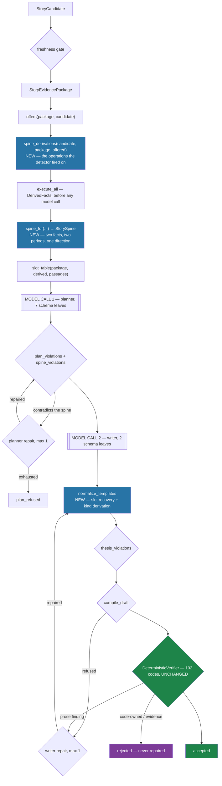

# 00 — Implemented architecture

*What actually landed, on branch `feat/story-pipeline-stabilization`. Every number here was
measured on 2026-08-26; nothing is carried over from the plan unverified.*

---

## 1. The shape that shipped

## 2. The three changes, and what each is worth

| Change | Measured effect |
| --- | --- |
| **Deterministic slot recovery** (`story/stages/composition/recovery.py`) | `story-v1-1daff167348f` — refused `thesis_abandoned` for three factually correct sentences with no slot in them — now compiles to **byte-identical prose** and verifies with **zero findings at any severity** |
| **Writer contract narrowed to 2 leaves** | Prompt for the demo candidate: **11,179 → 5,246 characters**. The `PASSAGES` section was 5,924 of them and printed **182 numerals, none** of which the model was allowed to write |
| **Truth boundary before the planner** | `story-v1-76da8465cd95`'s recorded plan — *"rose"* over 556 → 110 — is refused `direction_contradicts_spine` **before a writer is asked to carry it into prose** |

## 3. Ownership after the change

| Concern | Owner |
| --- | --- |
| truth, provenance, period identity, metric identity, comparability | graph → package, **unchanged** |
| arithmetic, direction | derivation stage + `detector_config.quantity_direction`, **moved earlier** |
| numeric rendering | `story/core/renderings.py`, **plus a presentation-precision policy** |
| bindings, citations, offsets | `story/stages/composition/compile.py`, **unchanged** |
| **sentence classification** | **code** (`derive_kind`) — was the model's |
| **which derivations run** | **code** (`spine_derivations`) — was the planner's |
| **the direction of the move** | **code** (`StorySpine`) — was nobody's |
| editorial reasoning, prose, which side of a comparing word | model |
| verification | `DeterministicVerifier`, **102 codes, unchanged** |
| repair routing | code (`story/stages/generation/repair.py`) |

## 4. What was NOT weakened

* `verifier_gate_digest()` and `len(GATE) == 102` are pinned by test and unchanged.
* No check removed, no severity lowered.
* **Two checks strengthened**: `forward_looking_language` now catches `will <verb>` (`"it will
  recover next year"` passed with zero findings before); deriving `kind` closes a live gap where
  a derived-fact-bearing sentence labelled `reported` verified clean, because
  `reported_sentence_carries_calculation` fires on a `Calculation` the compiler never builds.
* No model verifier. No model Cypher. `GraphRetriever` and the nine typed tools untouched.
* Every accepted run still passes `DeterministicVerifier.verify`.

## 5. New modules

| Module | Lines | Responsibility |
| --- | --- | --- |
| `story/core/spine.py` | 209 | `StorySpine` + `spine_for` — one detector-defined story's factual core, before any model has spoken |
| `story/core/lexicon.py` | 391 | the three closed direction lexicons, moved out of the verification stage so the generation stage can reach them without importing a sibling |
| `story/stages/composition/recovery.py` | — | `normalize_templates`, `recover_sentence`, `derive_kind` |
| `story/stages/generation/repair.py` | — | `FailureOwner`, `ROUTING`, the three feedback builders |

## 6. Prompt and schema versions

| | before | after |
| --- | --- | --- |
| `PLANNER_PROMPT_VERSION` | 1.2.0 | **2.0.0** |
| planner schema leaves | 19 | **7** |
| planner rules | 9 | **7** |
| `WRITER_PROMPT_VERSION` | 3.0.0 | **4.0.0** |
| writer schema leaves | 4 | **2** |
| writer rules | 14 | **13** |
| writer prompt (demo candidate) | 11,179 chars | **5,246** |

Both replay stores were re-recorded; `EditorialPlan` and `Draft` are unchanged as types, so
every stored artifact still loads and the demo UI's panels are untouched.
