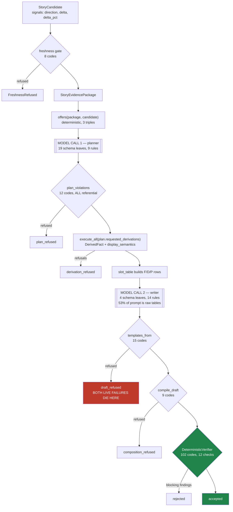
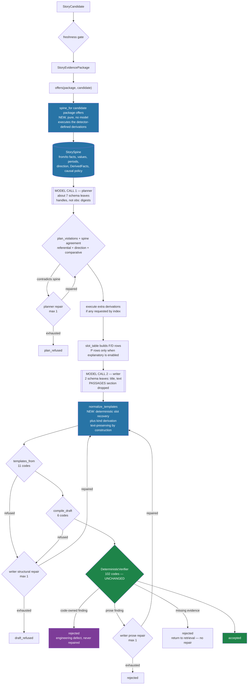
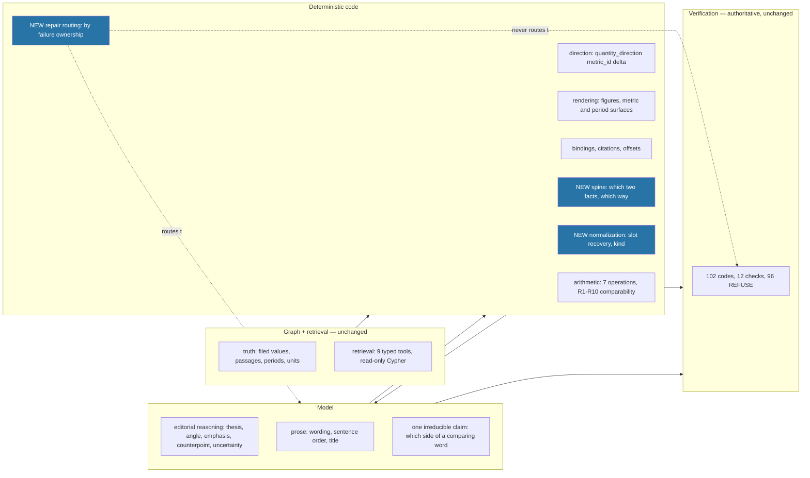

# 01 — Target architecture

*What owns what after stabilization, and why the boundary sits there. Verified 2026-08-26.*

---

## 1. The current pipeline, with its real gates



The candidate's `direction` never reaches the planner. The verifier never sees a draft that
failed the writer gate.

---

## 2. The proposed stabilized pipeline



Every repair path re-enters the **same** deterministic gates. Nothing is accepted except through
`DeterministicVerifier`.

---

## 3. Responsibility map



| Concern | Owner before | Owner after |
| --- | --- | --- |
| truth | graph to package | **unchanged** |
| arithmetic | derivation stage | **unchanged**, moved *earlier* for detector-defined stories |
| retrieval | 9 typed tools | **unchanged** |
| direction of the move | computed by detector, **shown to nobody** | **spine**, printed to the planner and checked against the plan |
| editorial reasoning | planner (19 fields, 6 of them mechanical) | planner (~7 fields, all editorial) |
| prose | writer (4 fields) | writer (**2** fields) |
| rendering | `core/renderings.py` | unchanged, plus a presentation-precision policy |
| bindings, citations, offsets | compiler | **unchanged** |
| sentence classification | model | **code**, derived from slot rows |
| verification | `DeterministicVerifier` | **unchanged**, two checks strengthened |
| repair routing | none | **code**, by failure ownership; never routes a code-owned defect to a model |

---

## 4. The `StorySpine` — what it is, and why it is thin

### Does it need to be a new object?

Investigated. **Most of it already exists, in three places that no single consumer holds
together** (verified):

| Datum | Where it lives today | Reaches the planner? |
| --- | --- | --- |
| the two observation ids | `candidate.anchor_observation_ids` — 8 ids, 4 per period, the *supporting* set rather than the pair | as FACTS rows, yes |
| the two values | `PackagedFact.value` | yes, as raw floats |
| the two periods | `PackagedFact.period_key` | yes, as `2022Q2` / `2022Q3` |
| `delta`, `delta_pct` | `candidate.signals` | **no** |
| **`direction`** | `candidate.signals["direction"]`, from `detector_config.quantity_direction(metric_id, delta)` | **no** |
| the legal derivations | `offers(package, candidate)` | yes |
| the executed derivations | `DerivedFact` — but only **after** the plan | **no** |
| `display_semantics` | `DerivedFact` | no |
| causal policy | `causal_language_for(package)` | yes, as an instruction |

A new type is warranted, and it should be **thin and derived** — a view binding these together
and stating the story's central claim once, not a fourth copy of the data.

### Proposed shape

`story/core/spine.py`, importing `story.core.models` and the standard library. **No stage
import**, which `test_no_stage_imports_another_stage` and
`test_core_never_imports_a_stage_a_provider_or_the_cli` both require.

```python
@dataclass(frozen=True, slots=True)
class StorySpine:
    """The factual claim of one detector-defined story, before any model has spoken."""
    candidate_id: str
    package_id: str
    story_type: str                       # "metric_move"
    subject_entity_id: str
    metric_id: str
    from_fact_id: str
    to_fact_id: str
    from_period: str                      # "2022Q2"
    to_period: str                        # "2022Q3"
    from_value: float
    to_value: float
    unit: str
    #: "increase" | "decrease" | "unchanged" — the detector's word, never the sign of the delta.
    direction: str
    #: False when quantity_direction returned None (ValueSign.UNVERIFIED). A spine that cannot
    #: state a direction says so rather than guessing, exactly as the detector does.
    direction_verified: bool
    #: The same fact as a `language.CHANGE_DIRECTION` polarity, so a plan check is a comparison
    #: and not a translation. None when direction_verified is False or direction is "unchanged".
    direction_polarity: bool | None
    #: The derivations code chose to execute for this story type, in offer order.
    derived_fact_ids: tuple[str, ...]
    causal_language: CausalLanguage
```

`spine_for(candidate, package, derived) -> StorySpine | None` is pure and returns `None` for a
story type with no spine shape, so nothing is forced on `cross_metric_divergence` in this phase.

### Which derivations execute before planning

**For a detector-defined story, code chooses them; the planner stops asking.**

`metric_move`'s candidate already declares which arithmetic it fired on —
`signals["fired_on"] = "pct,abs"` (verified) — and `execute.py:78`'s `DETECTOR_SIGNALS` already
maps `absolute_change → delta` and `percentage_change → delta_pct` for its cross-check. So the
rule needs no new table: **execute the offered two-period operations whose detector signal the
candidate published.**

For this candidate that is `absolute_change` and `percentage_change` — exactly what the Qwen
planner asked for, and exactly what a correct planner *must* ask for. The request was never a
choice.

### Are planner-requested derivations still useful?

**Yes, but not for `metric_move`, and not as triples.** Keep the capability, change the
spelling: a plan may request an *additional* derivation by **offer index**
(`"extra_derivations": [2]`), never by retyping a triple. That preserves the
`cross_metric_divergence` path — whose `compare_levels` request genuinely is an editorial
choice — while removing the two 70-character digests the planner currently retypes and the
`derivation_not_offered` code that guards them.

For the `metric_move` slice the field is pinned empty and the spine's derivations are the whole
set.

---

## 5. Invariants

Numbered so tests can name them.

| # | Invariant | Enforced by |
| --- | --- | --- |
| **S1** | A spine's `direction` is `quantity_direction`'s word, never the sign of a delta | `spine_for` reads `candidate.signals["direction"]`; a test asserts it equals `quantity_direction(metric_id, delta)` |
| **S2** | Every `DerivedFact` in a spine agrees with the spine's direction | test: `SEMANTIC_DIRECTION[df.display_semantics] is spine.direction_polarity` for every directional member |
| **S3** | A plan stating a direction that contradicts the spine never reaches the writer | new plan check, `direction_contradicts_spine` |
| **S4** | Recovery is **text-preserving**: `compile(recover(t)).text == t` for every sentence it accepts | property test over the corpus and the fixture sentences |
| **S5** | Recovery never guesses. Two rows offering one literal, or one row's literal twice in a sentence, refuses | unit tests; the refusal is a template violation, never a silent binding |
| **S6** | Recovery substitutes only strings a row **already offers**, never another legal rendering | by construction; a test asserts the substituted set is a subset of `SlotRow.offers.values()` |
| **S7** | A sentence's `kind` is a function of the slot rows its value slots name | `kind_of(template, rows)`; table test over all four kinds |
| **S8** | No repair is accepted without `DeterministicVerifier.verify` passing | `run_demo` structure; test asserts the verifier ran on every `accepted` |
| **S9** | A code-owned finding is never sent to a model | routing-table test: every code maps to exactly one owner, and `CODE_OWNED` routes to `rejected` |
| **S10** | The verifier's gate table is unchanged | `verifier_gate_digest()` pinned in a test, plus `len(GATE) == 102` |

---

## 6. Dependency rules — unchanged, and why they already permit all of this

`tests/story/test_story_package_structure.py` (20 tests) enforces: no stage imports another
stage; `core/` imports no stage, provider or CLI; no import cycle; one composition root.

The plan respects all four:

* `core/spine.py` imports `core.models` only. **The direction word already lives on the
  candidate**, so no `detector_config` import is needed — which is what makes the spine a `core/`
  type rather than a stage.
* Slot recovery goes in `story/stages/composition/` beside `slot_table` and `compile`, because it
  consumes `SlotRow`. `story/stages/generation/` may not import it, so — exactly as with the slot
  table today — **`run_demo` calls it and passes the result**. That is an existing pattern, not a
  new one (`pipeline.py:718-727`).
* Plan validation stays in `story/stages/generation/planner.py` and takes the spine as an
  argument, the way `plan_violations` already takes `offered`.

### The one dependency problem the audit did not notice

`language.CHANGE_DIRECTION` and `language.change_direction()` — the 100+-word lexicon that maps
`"rose" → True` and `"fell" → False` — live in **`story/stages/verification/language.py`**, a
stage the generation stage **may not import**. A plan-direction check written naively would
violate `test_no_stage_imports_another_stage`.

Three ways out, evaluated in `02` §5. The recommendation there is to **move the three lexicons
and their three lookup functions to `story/core/lexicon.py`** and re-export them from
`verification/language.py`, because a closed word list carrying application meaning is exactly
what `core/` is for, and `story/core/numerals.py` already holds a `CHANGE_VERBS` list that
`language.CHANGE_DIRECTION` is asserted total over
(`tests/story/test_story_verification_derived.py:445`). Two copies of that vocabulary already
exist in two layers; the move reduces it to one.

---

## 7. What the writer's contract becomes

| | Today (3.0.0) | Proposed (4.0.0, `metric_move`) |
| --- | --- | --- |
| Schema leaves | 4 | **2** |
| Fields | `title`, `sentences[].text`, `.kind`, `.rests_on[]` | `title`, `sentences[].text` |
| Prompt sections | 12 | **11** (`PASSAGES` dropped) |
| Prompt size, this candidate | 11,179 chars | **~5,254 chars** |
| Numerals shown that may not be written | 182 | **0** |
| System-prompt rules | 14 | **~10** |
| Slot grammar | mandatory | **optional** — recovery accepts plain prose |
| Reachable writer-gate codes | 15 | 11 |
| Reachable compiler codes | 9 | 6 |

The model may still write slots, and a slot-using draft compiles exactly as it does today —
recovery skips any sentence already carrying `{{`. The change is that **not** using them stops
being fatal.
