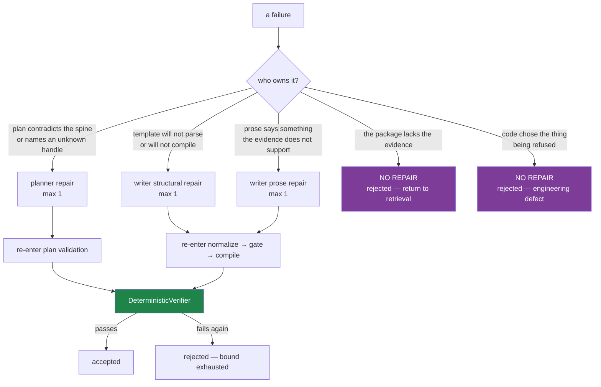

# 04 — Repair routing

*Bounded, ownership-routed repair. Designed, not implemented. Verified 2026-08-26.*

---

## 1. The premise, and the honest caveat

**Repair is Phase 5, not Phase 1, and it may turn out to be mostly unnecessary for
`metric_move`.** Both recent live failures are eliminated by Phases 1–3 without any repair
mechanism: recovery converts the Qwen run into an accepted post, and dropping `rests_on`
eliminates the gpt-5-nano failure outright. Building repair first would have been building a
mechanism for failures the contract change removes.

It is still worth building, for the residual: near-miss figure spellings, a metric the sentence
forgot to name, a superlative that slipped in, and a plan that contradicts the spine.

**Blind retry is not on the table.** Measured across the corpus, restricted to live-to-live
repeats of an identical `request_sha256`: the local llama.cpp server returned **identical**
answers 4 of 4 times; OpenAI returned **different** answers 2 of 2 times, because the adapter
records `temperature: 0.0` and `temperature_sent: false` — the field is never transmitted for
those models. So a retry with an unchanged prompt has no mechanism of action locally and is an
unmeasured lottery remotely.

---

## 2. Routing by ownership

Five owners, and the routing table is the design.



### The routing table

Every code the pipeline can emit maps to exactly one owner. Invariant **S9** is that this is
total and that `CODE_OWNED` and `EVIDENCE` never reach a model.

| Owner | Codes (representative; full table lives in code) | Route |
| --- | --- | --- |
| `PLANNER` | `direction_contradicts_spine`, `comparative_contradicts_spine`, `value_not_in_package`, `unresolvable_fact_handle`, `thesis_empty`, `no_key_points`, `unsupported_comparative`, `comparative_not_supported_by_text` | planner repair |
| `WRITER_STRUCTURAL` | `malformed_slot`, `template_not_compilable`, `unknown_slot_handle`, `unknown_slot_field`, `field_not_offered_by_row`, `slot_without_binding`, `no_legal_rendering`, `no_sentences`, `thesis_abandoned`, **recovery refusals** | writer structural repair |
| `WRITER_PROSE` | `unbound_numeral`, `metric_surface_absent_from_text`, `metric_named_in_text_contradicts_binding`, `period_surface_absent_from_text`, `period_named_in_text_contradicts_binding`, `unsupported_superlative`, `unsupported_absence_claim`, `unsupported_temporal_ordering`, `forward_looking_language`, `foreign_subject_named`, `causal_construction_forbidden`, `connective_sentence_carries_a_claim`, `required_warning_absent`, `required_counterpoint_absent`, `derived_direction_not_stated_in_text`, `derived_fact_orientation_reversed` | writer prose repair |
| `EVIDENCE` | `fact_not_in_package`, `citation_not_in_package`, `date_not_in_package`, `unpopulated_metric`, `absence_not_provable_from_bounded_package`, `no_evidence_handle_for_bound_fact`, every digest mismatch, every freshness code | **no repair** — rejected, `REBUILD_PACKAGE` |
| `CODE_OWNED` | `citation_reused_for_unrelated_claim`, `binding_rendering_is_not_one_numeral`, `binding_span_does_not_match_text`, `derived_result_mismatch`, `derived_unit_mismatch`, `calculation_result_surface_mismatch`, `evidence_cell_*`, `evidence_handle_*`, `over_precision` on a derived row | **no repair** — rejected, and it is a bug report |

**`derived_fact_orientation_reversed` is `WRITER_PROSE`, not `PLANNER`, and the distinction
matters.** It fires when the *sentence* names a direction the derived fact contradicts. If the
plan is right and the sentence is wrong, a writer repair fixes it. If the plan is *also* wrong,
`direction_contradicts_spine` fires first, at plan validation, and the planner is repaired
before a writer ever runs. Ordering the gates does the routing.

---

## 3. Bounds

| Bound | Value | Justification |
| --- | --- | --- |
| planner repairs | **1** | The failure it addresses is a single wrong claim with an exact correction. A second attempt at the same correction is the blind retry the evidence rules out |
| writer structural repairs | **1** | Same |
| writer prose repairs | **1** | Same |
| total model calls per run | **≤ 5** (2 + 3) | An upper bound worth stating because the manifest and the cost panel must be able to express it |
| repairs on a `provider_failed` run | **0** | The adapter already exhausted its own `max_retries: 2`; `contracts.py:165` — a timeout is never retried |
| repairs on a `CODE_OWNED` or `EVIDENCE` finding | **0** | S9 |

**Oscillation is structurally impossible with a bound of 1** — there is no loop, only a second
attempt. That is the main reason to start at 1 rather than 2: it makes the mechanism a
*straight-line branch*, which is far easier to reason about, to test, and to record.

**The bound belongs in `config/story.yaml`, not in code.** `story_run_id` is derived from 17
inputs and **neither the number of generations nor their content is among them** (verified —
`_run_id_input_names()`). So two runs of the same inputs, one that repaired and one that did
not, would mint the same `story-v1-…` and therefore the same directory — and finalisation is
`os.replace`, so one would overwrite the other. `config_hash` **is** a run-id input, so putting
the bound in the config file is what makes a repaired run distinguishable. This is the same
argument `_mint_run_id`'s own docstring makes for `length_target`.

---

## 4. Feedback payloads

Compact and structured. No traces, no whole drafts.

### Planner repair

```text
Your plan contradicts a fact code has already verified. Keep your angle; fix the claim.

VERIFIED (not yours to change)
  Adjusted Gross Profit    2022Q2  $556 million  ->  2022Q3  $110 million
  direction: decrease

YOUR PLAN SAID
  thesis: "Opendoor's adjusted gross profit rose from 2022Q2 to 2022Q3, ..."
  the word "rose" states an increase

Rewrite the thesis and any key point that states the direction. Use the same facts.
```

Every field is already available: the spine supplies the pair and the direction;
`language.change_verbs` supplies the offending word and its span; `renderings.observed_figure`
and `direction_phrase` supply the surfaces.

### Writer structural repair

`DraftViolation` and `CompositionViolation` are `(code, detail)` — two fields, with everything
else embedded in an English sentence. `story-v1-76da8465cd95`'s `rejected.json` detail is a
**1,100-character single string** of six concatenated violations (verified). Dispatchable by
code; the sentence index and the offending handle are recoverable only by parsing prose.

**Both types need three additive fields.** They are additive so no stored artifact changes shape:

```python
@dataclass(frozen=True, slots=True)
class DraftViolation:
    code: str
    detail: str
    sentence_index: int | None = None    # NEW
    handle: str = ""                     # NEW
    offered: tuple[str, ...] = ()        # NEW — what this row DOES offer
```

which makes the feedback a rendering rather than a re-parse:

```text
sentence 2 could not be built.
  you wrote:  "Adjusted Gross Profit fell by $445 million ..."
  the problem: no figure in that sentence matches a row.
  D1 offers:   {{D1}} -> "$446 million"   {{D1.direction}} -> "decreased by"
               {{D1.metric}} -> "Adjusted Gross Profit"
               {{D1.from_period}} -> "the second quarter of 2022"
               {{D1.to_period}} -> "the third quarter of 2022"
  Write the figure exactly as the row prints it, or write {{D1}}.
```

### Writer prose repair

Reuse `VerificationFinding` as-is — it already carries `code`, `severity`, `blocking`,
`sentence_index`, `char_start`/`char_end`, `fact_ids`, `citation_ids`, `expected`, `observed`,
`explanation`, `remedy` (11 members) and `suggested_fact_ids`. **Nothing needs deriving**
(verified against a real report).

The payload is: for each blocking finding routed to `WRITER_PROSE`, one block of
`{sentence text, char span, expected, observed, remedy}`. Cap it at the first N (5) so a draft
with many findings does not produce a prompt longer than the original.

---

## 5. Provenance — every attempt recorded

Non-negotiable, and it is where the plumbing cost is.

| What | Where today | Change needed |
| --- | --- | --- |
| The repair call's request/answer | `generations.jsonl` | **none** — the store is a digest-keyed dict with no ordering or cardinality assumption; `prompt` is a `request_identity` input, so a repair prompt keys its own row automatically |
| Call-site provenance | `manifest.planner_provider_model` / `.writer_provider_model` — **exactly two fields**, both required by `build_manifest`, and `as_dict` is `dataclasses.asdict` with no passthrough | **Replace the two scalars with `call_sites: list[dict]`.** This is the decision everything else keys off |
| Path redaction | `api.py:1758` `PROVIDER_MODEL_BLOCKS` is a literal 2-tuple whose loop guards on `isinstance(block, dict)` | Rewrite the loop for the list shape. **If this is missed, the operator's absolute `.gguf` path reaches the browser** — a defect that already shipped once and is documented at that call site |
| Trace | `trace.py:STAGES_BY_PHASE` is a closed set that raises on an unknown stage; `_GenerationTrace` dispatches on schema name and would emit a second `drafting · running` with no close | Add a `repairing` stage to `STAGES_BY_PHASE` **and** `STAGE_LABELS`, and give `_GenerationTrace` an attempt counter |
| Run id | not affected by call count | Put the bound in `config/story.yaml` (§3); if the repair prompt gets its own version constant, join it into `prompt_version=` at `pipeline.py:958-959` |
| Cost panel | `token_totals.generation_calls` is already `len(results)` | none — it reports 3 or 4 correctly with no change |
| Browser | `static/app.js:2335` iterates the literal `['planner', 'writer']` | extend, or a repair is invisible in the prompt-diff panel |

---

## 6. The blocker that decides the phasing

**`MissingGenerationError` is a `LookupError`, not a `StoryProviderError`, and `run_demo` does
not catch it** (verified). Every committed store holds exactly two rows. So the first repair call
on any replayed run raises straight out of `run_demo`, **writing no directory at all** — which
presents as an unrelated crash, not as a refusal.

Consequences:

* `ARTIFACTS_OF_THE_SYNTHETIC_STORES` (`tests/story/test_story_demo.py:975-987`) pins six
  artifact digests for a `REJECTED` branch. A repair firing there raises before any artifact is
  written. **This is a hard test failure, not a digest drift.**
* `ARTIFACTS_OF_THE_LIVE_RECORDING` survives — that branch is `accepted` with zero findings, so
  no repair triggers.

**Therefore: repair must be gated off by default in config, and turned on only after the
fixtures carry repair rows.** Phase 5 in `05` sequences it that way.

---

## 7. Should repair fire on `rejected` as well as `draft_refused` / `composition_refused`?

The code anticipates the first two: `COMPOSITION_REFUSED` was added with the comment *"A repair
loop that could not tell them apart would send the writer back to fix a sentence that is already
right"* (`pipeline.py:208-214`). It says nothing about the verifier.

**Recommendation: yes, but last.** Order the phases so that structural repair (which addresses
where runs actually die today) lands before prose repair (which addresses the verifier). The
prose route is the one that invalidates `ARTIFACTS_OF_THE_SYNTHETIC_STORES` and the three-way
parametrized test at `test_story_demo.py:1514-1566`, so it should be enabled last, with fixtures
re-recorded in the same change.

---

## 8. Tests

| # | Test |
| --- | --- |
| 1 | **No blind retry**: a repair request's `request_sha256` differs from the original's. Assert inequality directly |
| 2 | Repair changes request identity **because the prompt changed** — assert the system message and schema are unchanged |
| 3 | Max attempts respected: a double that always returns the same bad answer produces exactly 2 writer calls, then `draft_refused` |
| 4 | A repair may not add evidence: the package, the plan's facts and the slot table are identical across attempts (assert by digest) |
| 5 | A planner failure never routes to writer repair, and vice versa — table test over the full routing map |
| 6 | A `CODE_OWNED` finding never produces a model call. Drive `citation_reused_for_unrelated_claim` and assert `provider.calls == [planner, writer]` |
| 7 | An `EVIDENCE` finding never produces a model call |
| 8 | **S8**: every `accepted` outcome has `verified is not None` and `verified.passed` |
| 9 | Every repair attempt appears in `generations.jsonl` and in `manifest.call_sites` |
| 10 | The routing table is **total** over `GATE` ∪ writer codes ∪ composition codes ∪ planner codes — no code is unrouted, none routed twice |
| 11 | Repair disabled in config produces byte-identical artifacts to today (the rollback test) |
| 12 | `MissingGenerationError` on a repair call in replay mode is caught and becomes a disposition, never an escaped `LookupError` |

Test 12 is the one that must exist **before** repair is enabled anywhere.

---

## 9. Existing test doubles that need widening

`BadWriterProvider` and `UnfillableSlotProvider` dispatch purely on
`schema_name != "story_post_draft"` and return the **same** bad answer to every writer call
(`test_story_demo.py:425-428`, `:470-473`). `RefusedPlannerProvider.generate` raises
`AssertionError` if called with anything but the planner schema (`:523-527`).

A repair loop driven by these burns its bound and fails — which is a legitimate test (test 3),
but the suite also needs doubles that **answer differently on the second attempt**, to prove the
success path. That is a fixture change, not a design change, and it belongs in Phase 5.
