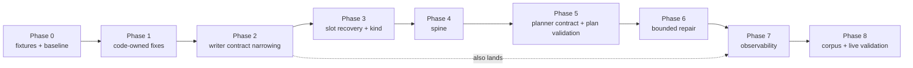

# 05 — Implementation plan

*Eight phases. Every phase ends with a green suite and is independently revertible.
Verified 2026-08-26.*

---

## 1. Dependency order, and why it differs from the brief's sketch

The brief proposed `spine → planner → writer → code fixes → repair → observability → validation`.
**The code argues for moving the writer ahead of the planner, and the code-owned fixes ahead of
both.**

Three reasons for the reordering:

1. **Phases 2–3 fix both observed live failures; Phases 4–5 fix a failure that has never
   reached the verifier.** Shipping the measurable fix first means Phase 8's live measurement
   has a real baseline to move.
2. **Phase 1 first because Phase 8 cannot measure anything while a code-owned defect is in the
   corpus.** `citation_reused_for_unrelated_claim` and `80.215827338%` are both code's; leaving
   them in makes every reliability number a mixture of model behaviour and known bugs.
3. **The planner change re-keys the replay store**, so it should land *after* the writer change
   that also re-keys it — one re-recording, not two.

---

## Phase 0 — regression fixtures and baseline metrics

**Goal.** A harness that reports the seven reliability rates, and a fixture set that can
reproduce every claim in `03`.

| | |
| --- | --- |
| Files | `tests/story/fixtures/metric_move_corpus/` (new); `tests/story/test_story_stabilization_metrics.py` (new) |
| New types | none |
| Control flow | none |
| Migration | none — additive |
| Acceptance | The harness reproduces today's numbers exactly: 17 accepted / 23 rejected / 6 draft_refused / 4 plan_refused / 8 provider_failed across 58 runs; 85 findings; 75 blocking |
| Rollback | delete the files |

Fixtures to commit: the two failed live runs' answers, the three adversarial families from
`03` §3, and the recovery-input/expected-template pairs.

---

## Phase 1 — code-owned refusal fixes

**Goal.** Remove defects code owns, so later measurement is about the model.

| | |
| --- | --- |
| Files | `story/core/renderings.py` (presentation precision); `story/stages/verification/language.py` (forward-looking pattern) |
| New types | `DERIVED_PRESENTATION_DECIMALS: Mapping[str, int]` |
| Control flow | none |
| Tests | `03` §8's tolerance table asserted through `compare_token_to_fact`; the five forward-looking probes; a test that `DerivedFact.result` keeps full precision while the *rendering* rounds |
| Migration | **`{{D2}}` changes from `80.215827338%` to `80.2%`.** No stored draft carries that string (the corpus's accepted drafts use `absolute_change` and `compare_levels`), so no artifact digest moves. **Verify this before landing** by re-rendering all 40 stored packages |
| Acceptance | `verifier_gate_digest()` unchanged; `len(GATE) == 102` unchanged; the forward-looking sentence in `03` §9 now refuses |
| Rollback | two isolated commits, revertible independently |

`citation_reused_for_unrelated_claim` is **not** fixed here — Phase 2 makes it unreachable, and
the correct fix needs a live explanatory candidate that does not exist (`03` §7).

---

## Phase 2 — narrow the writer contract

**Goal.** Drop `explanatory` / `rests_on` / `PASSAGES` for `metric_move`.

| | |
| --- | --- |
| Files | `story/stages/generation/prompts.py` (`writer_schema`, `WRITER_SYSTEM`, `writer_prompt`); `story/stages/generation/writer.py`; `story/pipeline.py` (stop passing `P` rows) |
| New types | none. `SentenceKind.EXPLANATORY`, the `P` row kind and the four `rests_on` codes all **stay**, unreachable from this contract |
| Control flow | `slot_table(package, derived, passages)` called with `passages=()` for a story type with no explanatory route; `writer_prompt` omits the `PASSAGES` section when there are no `P` rows |
| Tests | writer prompt for the demo candidate contains **0** numerals outside FACTS / DERIVED FACTS; the four `rests_on` codes are unreachable from `templates_from` under the new schema; `citation_reused_for_unrelated_claim` is not constructible from any `reported`/`calculated` draft |
| Migration | **`WRITER_PROMPT_VERSION` 4.0.0.** The prompt text changes, and `prompt` is a `request_identity` input, so **every committed writer row misses.** The stores must be re-recorded. This is the same operation the 3.0.0 change performed and the procedure is known |
| Acceptance | prompt ≤ 5,500 chars for the demo candidate (from 11,179); the accepted regression still renders a byte-identical `post.md` |
| Rollback | one commit; the old schema and prompt are recoverable from git and the old stores still parse via the retained readers |

---

## Phase 3 — slot recovery and derived `kind`

**Goal.** Make the slot grammar optional. This is the phase that fixes the Qwen failure.

| | |
| --- | --- |
| Files | `story/stages/composition/recovery.py` (new, ~150 lines); `story/stages/composition/public.py` (recovery refusal codes); `story/stages/composition/__init__.py`; `story/pipeline.py` (call it); `story/stages/generation/writer.py` (accept templates whose `kind` is derived) |
| New types | `RecoveredTemplate`, `RecoveryRefused`; refusal codes `AMBIGUOUS_LITERAL`, `LITERAL_OCCURS_TWICE`, `NO_RECOVERABLE_VALUE` |
| Control flow | `run_demo`: `normalized = normalize_templates(written.templates, slots)` between `write_story` and `templates_from`. Sentences already carrying `{{` pass through untouched |
| Tests | The full `03` §3 proof and adversarial suite; **S4** (text-preserving) as a property test; **S5**, **S6**, **S7**; the `kind` edge-case table |
| Migration | `WRITER_PROMPT_VERSION` 4.0.0 already bumped in Phase 2 — land Phase 3 in the same version so the stores are re-recorded **once** |
| Acceptance | `story-v1-1daff167348f`'s recorded answer, replayed, produces `accepted` with 0 findings. This is the phase's single acceptance test |
| Rollback | recovery is a pass-through when disabled; a config flag makes the rollback a one-line change rather than a revert |

---

## Phase 4 — the story spine

**Goal.** Compute the factual core before the planner. No model-visible change yet.

| | |
| --- | --- |
| Files | `story/core/spine.py` (new); `story/pipeline.py` (build it, execute the detector-defined derivations before `plan_story`) |
| New types | `StorySpine`; `spine_for(candidate, package, derived) -> StorySpine \| None` |
| Control flow | `execute_all` moves **above** `plan_story` for a story type with a spine. `plan.requested_derivations` still executes afterwards for anything the plan adds |
| Tests | **S1**, **S2**; `spine_for` returns `None` for `cross_metric_divergence` in this phase; the spine's derived facts equal what the Qwen plan requested for the demo candidate |
| Migration | `spine.json` is a new artifact → `demo_manifest.artifacts` gains a key → **the artifact digest tables move.** Additive; `ALWAYS_WRITTEN` gains one entry |
| Acceptance | For all 14 stored `metric_move` runs, `spine.direction` equals `quantity_direction(metric_id, delta)` and equals `candidate.signals["direction"]` |
| Rollback | one commit; nothing consumes the spine until Phase 5 |

**The `core/lexicon.py` move lands here too** (`02` §5): the three lexicons and their three
lookup functions move from `story/stages/verification/language.py` to `story/core/lexicon.py`,
re-exported from their old home. Pure relocation, no behaviour change, and it is what lets
Phase 5's check exist without violating `test_no_stage_imports_another_stage`.

---

## Phase 5 — planner contract reduction and plan validation

| | |
| --- | --- |
| Files | `story/stages/generation/prompts.py` (`planner_schema`, `PLANNER_SYSTEM`, `planner_prompt` + the VERIFIED CHANGE section); `story/stages/generation/planner.py` (`editorial_plan_from` fills the removed fields; `plan_violations(..., spine=)`); `story/pipeline.py` |
| New types | plan codes `direction_contradicts_spine`, `comparative_contradicts_spine`, `value_not_in_package`, `unresolvable_fact_handle` |
| Control flow | `plan_violations` gains a `spine` argument; handle→id resolution happens in `editorial_plan_from` |
| Tests | All 11 in `02` §8 |
| Migration | **`PLANNER_PROMPT_VERSION` 2.0.0** — planner rows re-key, stores re-recorded again. `EditorialPlan` the **type** is unchanged, so every stored `editorial_plan.json` still loads and the demo UI's plan panel is untouched |
| Acceptance | `story-v1-76da8465cd95`'s **recorded plan**, replayed, is refused `direction_contradicts_spine`. The 17 accepted runs' plans are all still accepted |
| Rollback | one commit; the type is unchanged so no artifact is orphaned |

---

## Phase 6 — bounded repair

**Gated off by default.** Enable only after Phase 8's baseline exists.

| | |
| --- | --- |
| Files | `story/pipeline.py` (routing + the three branches); `story/core/manifest.py` (`call_sites: list[dict]`); `story/stages/generation/prompts.py` (three repair prompt builders); `story/stages/generation/writer.py` + `story/stages/composition/public.py` (three additive fields on the violation types); `config/story.yaml` (the bounds); `story/demo_ui/api.py` (`PROVIDER_MODEL_BLOCKS` → the list shape) |
| New types | `FailureOwner` enum; `ROUTING: Mapping[str, FailureOwner]` |
| Control flow | the three branches in `04` §2 |
| Tests | All 12 in `04` §8, and **test 12 lands first** |
| Migration | **`call_sites` replaces two manifest scalars** — three whole-block test assertions change (`test_story_demo.py:1823-1858`), and `PROVIDER_MODEL_BLOCKS` must be rewritten or the operator's absolute `.gguf` path reaches the browser. `generation_calls == 2` assertions at `:1951`, `:2051-2053` become bound-aware. Fixture stores gain repair rows, and the doubles need to answer differently on attempt 2 |
| Acceptance | With repair off, artifacts are **byte-identical** to Phase 5's. With it on, `MissingGenerationError` on a replayed repair is a disposition, never an escaped `LookupError` |
| Rollback | the config flag. This is why the flag exists |

---

## Phase 7 — observability

| | |
| --- | --- |
| Files | `story/demo_ui/code_catalogue.py` (`FAMILY_COMPOSITION` + descriptions); `story/demo_ui/api.py` (family dispatch, repair panel); `story/demo_ui/trace.py` (`compiling_draft` and `repairing` in **both** `STAGES_BY_PHASE` and `STAGE_LABELS`); `story/demo_ui/static/app.js`; `tests/story/test_demo_ui_code_catalogue.py` (AST walk extended to `CompositionViolation`) |
| Acceptance | A `composition_refused` run renders every code with a real description and `blocking: true`; the trace shows `compiling_draft`; a repaired run shows its attempts |
| Rollback | one commit; observability only |

Phase 2 and Phase 3 change composition behaviour, so the **catalogue and trace parts of this
phase should land with Phase 3**, not be deferred. The repair-panel part waits for Phase 6.

---

## Phase 8 — corpus and live validation

Covered in `06`.

---

## 2. Migration and compatibility

### The rule

**Backward compatibility lives in the artifact readers, never in the generation code.**

Stated explicitly because the brief asked. The repository already works this way and it works
well: `writer.draft_from` and `draft_violations` parse the 2.2.0 schema, are called by nothing on
the pipeline path, and exist so the 50 recorded `draft.json` files and the pre-3.0.0 replay
stores still load. Their eight violation codes stay registered for the same reason. That is the
pattern; extend it, do not invent a second one.

### What each change touches

| Change | Replay stores | Stored artifacts | Run ids | Schema digests | UI |
| --- | --- | --- | --- | --- | --- |
| Phase 1 rendering | no | **verify** — no stored draft should contain `80.215827338%` | no | no | no |
| Phase 1 language | no | no | no | **no** — extend the existing code rather than adding one, so `verifier_gate_digest()` is untouched | no |
| Phase 2+3 writer 4.0.0 | **re-record** — `prompt` is a `request_identity` input | old drafts still load via the retained readers | **move** — `prompt_version` and `schema_digests` are run-id inputs | writer schema digest moves | no |
| Phase 4 spine | no | **+1 artifact** (`spine.json`); `ALWAYS_WRITTEN` grows | move (new artifact ⇒ new digest set) | no | package panel may show it |
| Phase 5 planner 2.0.0 | **re-record** | `EditorialPlan` type unchanged ⇒ every stored plan still loads | move | planner schema digest moves | plan panel unchanged |
| Phase 6 repair | fixtures gain rows | manifest shape changes | `config_hash` moves (the bound is a config key) | no | redaction + trace + panel |

### Do not casually invalidate previous demo runs

The 58 stored run directories are **read-only evidence**. Nothing in this plan rewrites one.
Re-recording means adding new store rows under new digests for the *fixtures* the test suite
replays; the historical run directories keep their artifacts, their manifests and their digests,
and remain loadable by the retained readers.

**One risk to watch, named because it is easy to miss.** `_composition_payload(written, compiled)`
pairs `written.templates` with `compiled.slots`. Under recovery, `written.templates` is the
model's raw sentences and the compiled fills come from the *normalized* templates. The artifact
must record **both** — raw and normalized — or a reader cannot tell what the model wrote from
what code recovered. That is the whole audit value of the artifact, and it is a one-field
addition to `composition.json`.

---

## 3. Rollback boundaries

| Phase | Rollback | Leaves behind |
| --- | --- | --- |
| 0 | delete files | nothing |
| 1 | revert two commits | nothing |
| 2 | revert; old stores still parse | nothing |
| 3 | **config flag** — recovery off is a pass-through | nothing |
| 4 | revert; nothing consumes the spine | `spine.json` in newer run dirs |
| 5 | revert; `EditorialPlan` type unchanged | nothing |
| 6 | **config flag** — bounds at 0 | `call_sites` in the manifest shape |
| 7 | revert | nothing |

Phases 3 and 6 — the two behavioural changes with the widest blast radius — are the two behind
config flags. That is deliberate.

---

## 4. What is explicitly out of scope

* The Research Agent, and any tool-calling loop.
* New detectors or post types.
* Any change to extraction, normalization or the graph projection.
* Enabling `want_explanatory_search` for any detector.
* The permanent fix for `citation_reused_for_unrelated_claim` (`03` §7) — recorded, deferred
  until there is a live explanatory candidate to test against.
* Widening recovery to the full `legal_renderings` set (`03` §3) — deferred until Phase 8 says
  whether near-miss spellings matter.
